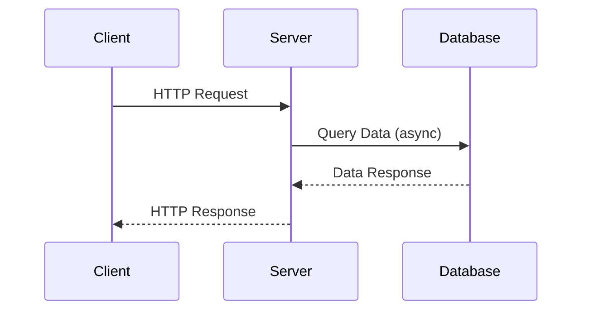

## 13.3. Asynchronous Web Applications

Asynchronous programming has become a cornerstone of modern web development, enabling applications to handle numerous tasks concurrently without blocking the execution of other operations. In the realm of Rust, asynchronous programming is facilitated by the powerful `async`/`await` syntax, which simplifies writing non-blocking code. This section delves into the intricacies of building asynchronous web applications in Rust, utilizing frameworks like Actix-web and Warp, and integrating with async runtimes such as Tokio.

### The Importance of Asynchronous Programming in Web Development

In web development, applications often need to handle multiple requests simultaneously, perform I/O operations like database queries or network requests, and manage user interactions. Asynchronous programming allows these tasks to be executed concurrently, improving the application's responsiveness and throughput. By not blocking the main execution thread, asynchronous applications can efficiently utilize system resources, leading to better performance and scalability.

### Rust's `async`/`await` Syntax

Rust's `async`/`await` syntax provides a straightforward way to write asynchronous code. It allows developers to define asynchronous functions using the `async fn` keyword and to await the completion of asynchronous operations using the `await` keyword. This syntax is both expressive and easy to understand, making it accessible to developers familiar with synchronous programming.

#### Example: Basic Asynchronous Function

```rust
async fn fetch_data(url: &str) -> Result<String, reqwest::Error> {
    let response = reqwest::get(url).await?;
    let body = response.text().await?;
    Ok(body)
}
```

In the example above, the `fetch_data` function is asynchronous, allowing it to perform network requests without blocking the execution of other tasks. The `await` keyword is used to pause the function's execution until the network request completes.

### Building Async Web Applications with Actix-web and Warp

Rust offers several frameworks for building web applications, with Actix-web and Warp being two of the most popular choices. Both frameworks provide robust support for asynchronous programming, allowing developers to build high-performance web applications.

#### Actix-web

Actix-web is a powerful, actor-based web framework that leverages Rust's asynchronous capabilities. It is known for its speed and flexibility, making it suitable for building complex web applications.

##### Example: Simple Actix-web Application

```rust
use actix_web::{web, App, HttpServer, Responder};

async fn greet() -> impl Responder {
    "Hello, world!"
}

#[actix_web::main]
async fn main() -> std::io::Result<()> {
    HttpServer::new(|| {
        App::new()
            .route("/", web::get().to(greet))
    })
    .bind("127.0.0.1:8080")?
    .run()
    .await
}
```

In this example, we define a simple Actix-web application that responds with "Hello, world!" to HTTP GET requests. The `#[actix_web::main]` attribute is used to run the async main function, which starts the HTTP server.

#### Warp

Warp is a lightweight, composable web framework built on top of the Hyper library. It emphasizes ease of use and flexibility, allowing developers to define routes and middleware using a declarative syntax.

##### Example: Simple Warp Application

```rust
use warp::Filter;

#[tokio::main]
async fn main() {
    let hello = warp::path::end()
        .map(|| warp::reply::html("Hello, world!"));

    warp::serve(hello)
        .run(([127, 0, 0, 1], 3030))
        .await;
}
```

In this Warp example, we define a route that responds with "Hello, world!" using the `warp::reply::html` function. The `warp::serve` function is used to start the server, listening on port 3030.

### Async Runtimes: Tokio and Async-std

Asynchronous runtimes are essential for executing async code in Rust. They provide the necessary infrastructure for managing tasks, scheduling them, and handling I/O operations.

#### Tokio

Tokio is a popular asynchronous runtime for Rust, known for its performance and ecosystem support. It provides a multi-threaded, work-stealing scheduler that efficiently manages tasks across multiple cores.

#### Async-std

Async-std is another asynchronous runtime that aims to provide a familiar API similar to Rust's standard library. It is designed to be easy to use and integrates well with existing Rust code.

### Best Practices for Asynchronous Web Applications

When building asynchronous web applications, it's essential to follow best practices to ensure optimal performance and maintainability.

#### Handling I/O-bound and CPU-bound Tasks

- **I/O-bound tasks**: Use async functions and await I/O operations to prevent blocking the execution thread. This is crucial for tasks like network requests, file I/O, and database queries.
  
- **CPU-bound tasks**: Offload CPU-intensive tasks to separate threads or use a thread pool to avoid blocking the async runtime. Libraries like `rayon` can be used for parallel processing.

#### Performance Considerations

- **Minimize blocking operations**: Avoid using blocking functions within async code, as they can hinder the performance of the async runtime.
  
- **Optimize task scheduling**: Use appropriate task scheduling strategies to balance the load across available resources.

- **Monitor and profile**: Regularly monitor and profile your application to identify bottlenecks and optimize performance.

### Visualizing Asynchronous Web Application Architecture

To better understand the architecture of an asynchronous web application, let's visualize the flow of requests and responses using a sequence diagram.



This diagram illustrates the asynchronous flow of a web application, where the server handles an HTTP request, performs an asynchronous database query, and responds to the client without blocking other operations.

### Try It Yourself

Experiment with the provided code examples by modifying the routes, responses, and server configurations. Try integrating additional features like middleware, error handling, and logging to enhance the functionality of your web application.

### References and Further Reading

- [Tokio](https://tokio.rs/)
- [Async-std](https://async.rs/)
- [Hyper](https://hyper.rs/)
- [Warp](https://github.com/seanmonstar/warp)

### Knowledge Check

- What are the benefits of asynchronous programming in web development?
- How does Rust's `async`/`await` syntax simplify writing asynchronous code?
- What are the differences between Actix-web and Warp?
- How do async runtimes like Tokio and Async-std integrate with web frameworks?
- What are some best practices for handling I/O-bound and CPU-bound tasks asynchronously?

### Embrace the Journey

As you continue to explore asynchronous web applications in Rust, remember that this is just the beginning. The world of asynchronous programming offers endless possibilities for building high-performance, scalable web applications. Keep experimenting, stay curious, and enjoy the journey!

## Quiz Time!



### What is the primary benefit of asynchronous programming in web development?

- [x] Improved responsiveness and throughput
- [ ] Simplified code structure
- [ ] Reduced memory usage
- [ ] Enhanced security

> **Explanation:** Asynchronous programming allows applications to handle multiple tasks concurrently, improving responsiveness and throughput.

### How does Rust's `async`/`await` syntax help developers?

- [x] Simplifies writing non-blocking code
- [ ] Automatically optimizes performance
- [ ] Provides built-in error handling
- [ ] Reduces code size

> **Explanation:** The `async`/`await` syntax simplifies writing non-blocking code by allowing developers to define and await asynchronous operations.

### Which framework is known for its actor-based architecture?

- [x] Actix-web
- [ ] Warp
- [ ] Hyper
- [ ] Async-std

> **Explanation:** Actix-web is known for its actor-based architecture, which provides flexibility and speed for building web applications.

### What is the role of async runtimes like Tokio?

- [x] Manage tasks and handle I/O operations
- [ ] Provide a graphical user interface
- [ ] Simplify database interactions
- [ ] Enhance security features

> **Explanation:** Async runtimes like Tokio manage tasks, schedule them, and handle I/O operations in asynchronous applications.

### Which of the following is a best practice for handling CPU-bound tasks in async applications?

- [x] Offload to separate threads or use a thread pool
- [ ] Use blocking functions within async code
- [ ] Avoid using async functions
- [ ] Minimize task scheduling

> **Explanation:** Offloading CPU-bound tasks to separate threads or using a thread pool prevents blocking the async runtime.

### What is a key feature of Warp?

- [x] Declarative syntax for defining routes
- [ ] Built-in database support
- [ ] Automatic code generation
- [ ] Integrated machine learning capabilities

> **Explanation:** Warp provides a declarative syntax for defining routes, making it easy to use and flexible.

### How can developers optimize task scheduling in async applications?

- [x] Use appropriate strategies to balance the load
- [ ] Minimize the number of tasks
- [ ] Avoid using async runtimes
- [ ] Focus on CPU-bound tasks only

> **Explanation:** Using appropriate task scheduling strategies helps balance the load across available resources.

### What should be avoided within async code to maintain performance?

- [x] Blocking functions
- [ ] Non-blocking I/O operations
- [ ] Task scheduling
- [ ] Using async runtimes

> **Explanation:** Blocking functions should be avoided within async code as they can hinder the performance of the async runtime.

### True or False: Async-std provides an API similar to Rust's standard library.

- [x] True
- [ ] False

> **Explanation:** Async-std is designed to provide a familiar API similar to Rust's standard library, making it easy to integrate with existing code.

### What is the purpose of the `#[actix_web::main]` attribute in Actix-web?

- [x] To run the async main function
- [ ] To define a new route
- [ ] To handle HTTP requests
- [ ] To manage database connections

> **Explanation:** The `#[actix_web::main]` attribute is used to run the async main function, which starts the HTTP server.




