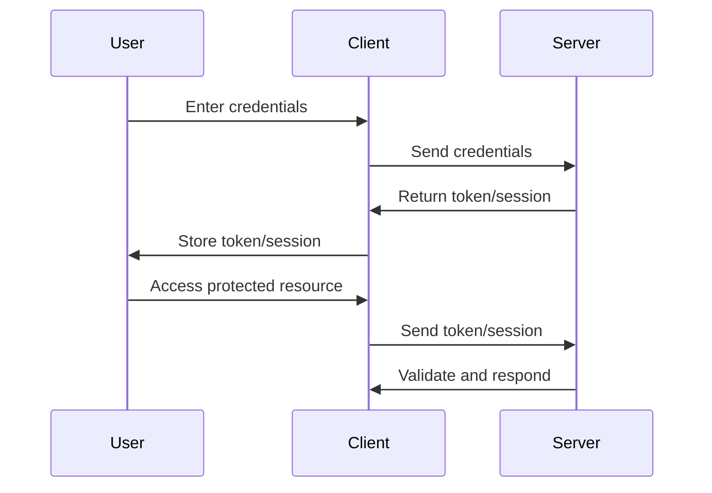

## 13.5. Authentication and Authorization

In the realm of web development, securing your applications is paramount. Authentication and authorization are two critical components that ensure only legitimate users can access your services and that they have the appropriate permissions to perform actions. In this section, we'll delve into implementing these mechanisms in Rust web applications, focusing on popular frameworks like Actix-web and Rocket.

### Understanding Authentication and Authorization

Before diving into implementation, let's clarify the distinction between authentication and authorization:

- **Authentication** is the process of verifying the identity of a user or system. Common methods include passwords, tokens, and biometric verification.
- **Authorization** determines what an authenticated user is allowed to do. This involves checking permissions and roles to ensure users can only access resources they're permitted to.

### Common Authentication Methods

#### JSON Web Tokens (JWT)

JWT is a compact, URL-safe means of representing claims to be transferred between two parties. It consists of three parts: Header, Payload, and Signature. JWTs are often used for stateless authentication in web applications.

#### OAuth2

OAuth2 is an authorization framework that enables applications to obtain limited access to user accounts on an HTTP service. It works by delegating user authentication to the service that hosts the user account.

#### Session-Based Authentication

Session-based authentication involves storing user session data on the server. When a user logs in, a session is created and stored, often in a database or in-memory store, and a session ID is sent to the client.

### Implementing Authentication in Rust

#### Using Actix-web

Actix-web is a powerful, pragmatic, and extremely fast web framework for Rust. Let's explore how to implement JWT authentication in an Actix-web application.

```rust
use actix_web::{web, App, HttpServer, HttpResponse, Error};
use jsonwebtoken::{encode, decode, Header, Validation, EncodingKey, DecodingKey};
use serde::{Serialize, Deserialize};

#[derive(Debug, Serialize, Deserialize)]
struct Claims {
    sub: String,
    exp: usize,
}

async fn login() -> Result<HttpResponse, Error> {
    let claims = Claims { sub: "user_id".to_owned(), exp: 10000000000 };
    let token = encode(&Header::default(), &claims, &EncodingKey::from_secret("secret".as_ref())).unwrap();
    Ok(HttpResponse::Ok().body(token))
}

async fn protected_route(token: String) -> Result<HttpResponse, Error> {
    let token_data = decode::<Claims>(&token, &DecodingKey::from_secret("secret".as_ref()), &Validation::default()).unwrap();
    Ok(HttpResponse::Ok().body(format!("Hello, {}!", token_data.claims.sub)))
}

#[actix_web::main]
async fn main() -> std::io::Result<()> {
    HttpServer::new(|| {
        App::new()
            .route("/login", web::get().to(login))
            .route("/protected", web::get().to(protected_route))
    })
    .bind("127.0.0.1:8080")?
    .run()
    .await
}
```

**Explanation:**

- **Claims Struct**: Defines the structure of the JWT claims.
- **Login Function**: Generates a JWT token upon successful login.
- **Protected Route**: Decodes the JWT token to verify the user's identity.

#### Using Rocket

Rocket is another popular web framework for Rust, known for its ease of use and flexibility. Here's how you can implement session-based authentication in Rocket.

```rust
#[macro_use] extern crate rocket;

use rocket::http::{Cookie, Cookies};
use rocket::response::Redirect;

#[post("/login", data = "<user>")]
fn login(mut cookies: Cookies<'_>, user: String) -> Redirect {
    cookies.add_private(Cookie::new("user_id", user));
    Redirect::to(uri!(protected))
}

#[get("/protected")]
fn protected(cookies: Cookies<'_>) -> Option<String> {
    cookies.get_private("user_id").map(|cookie| format!("Hello, {}!", cookie.value()))
}

#[launch]
fn rocket() -> _ {
    rocket::build()
        .mount("/", routes![login, protected])
}
```

**Explanation:**

- **Login Route**: Sets a private cookie with the user's ID upon login.
- **Protected Route**: Retrieves the user ID from the cookie to verify the session.

### Handling User Registration and Login

When implementing user registration and login, it's crucial to securely handle passwords and user data.

#### Password Hashing

Use the `argon2` crate for secure password hashing. Argon2 is a memory-hard hashing algorithm that provides resistance against GPU-based attacks.

```rust
use argon2::{self, Config};

fn hash_password(password: &str) -> String {
    let salt = b"randomsalt";
    let config = Config::default();
    argon2::hash_encoded(password.as_bytes(), salt, &config).unwrap()
}

fn verify_password(hash: &str, password: &str) -> bool {
    argon2::verify_encoded(hash, password.as_bytes()).unwrap()
}
```

**Explanation:**

- **Hash Password**: Generates a hash for the given password using Argon2.
- **Verify Password**: Checks if the provided password matches the stored hash.

### Token Management

Managing tokens involves generating, storing, and invalidating tokens as needed. For JWTs, ensure tokens are signed and verified using a secret key.

### Authorization Strategies

#### Role-Based Access Control (RBAC)

RBAC involves assigning roles to users and granting permissions based on these roles. This approach simplifies permission management and enhances security.

```rust
enum Role {
    Admin,
    User,
}

fn check_permission(role: Role, action: &str) -> bool {
    match role {
        Role::Admin => true,
        Role::User => action != "delete",
    }
}
```

**Explanation:**

- **Role Enum**: Defines different user roles.
- **Check Permission**: Determines if a user has permission to perform an action based on their role.

### Security Best Practices

- **Use HTTPS**: Always use HTTPS to encrypt data in transit.
- **Validate Input**: Sanitize and validate all user inputs to prevent injection attacks.
- **Limit Login Attempts**: Implement rate limiting to prevent brute force attacks.
- **Secure Cookies**: Use secure and HTTP-only flags for cookies to prevent XSS attacks.
- **Regularly Update Dependencies**: Keep your libraries and frameworks up to date to mitigate vulnerabilities.

### Visualizing Authentication and Authorization Flow



**Diagram Explanation**: This sequence diagram illustrates the typical flow of authentication and authorization in a web application. The user provides credentials, which the client sends to the server. The server returns a token or session, which the client stores. For accessing protected resources, the client sends the token or session to the server for validation.

### Try It Yourself

Experiment with the provided code examples by:

- Modifying the JWT secret key and observing the impact on token validation.
- Implementing additional roles and permissions in the RBAC example.
- Enhancing the password hashing example with different configurations of Argon2.

### References and Links

- [jsonwebtoken crate (JWT handling)](https://crates.io/crates/jsonwebtoken)
- [oauth2 crate](https://crates.io/crates/oauth2)
- [argon2 crate (password hashing)](https://crates.io/crates/argon2)
- [Actix-web Documentation](https://actix.rs/docs/)
- [Rocket Documentation](https://rocket.rs/v0.5-rc/guide/)

### Knowledge Check

- What is the difference between authentication and authorization?
- How does JWT differ from session-based authentication?
- Why is Argon2 recommended for password hashing?
- What are some security best practices for web applications?

### Embrace the Journey

Remember, implementing robust authentication and authorization is a journey. As you progress, you'll build more secure and reliable web applications. Keep experimenting, stay curious, and enjoy the journey!

## Quiz Time!



### What is the primary purpose of JWT in web applications?

- [x] To provide a compact, URL-safe means of representing claims
- [ ] To store user sessions on the server
- [ ] To encrypt user passwords
- [ ] To manage user roles and permissions

> **Explanation:** JWTs are used to represent claims between two parties in a compact and URL-safe manner.

### Which Rust crate is commonly used for password hashing?

- [ ] jsonwebtoken
- [ ] oauth2
- [x] argon2
- [ ] serde

> **Explanation:** The `argon2` crate is used for secure password hashing in Rust.

### In the context of web security, what does HTTPS provide?

- [ ] User authentication
- [x] Data encryption in transit
- [ ] Role-based access control
- [ ] Session management

> **Explanation:** HTTPS encrypts data in transit, ensuring secure communication between the client and server.

### What is the role of the `jsonwebtoken` crate in Rust?

- [x] Handling JWT encoding and decoding
- [ ] Managing OAuth2 flows
- [ ] Hashing passwords
- [ ] Creating web servers

> **Explanation:** The `jsonwebtoken` crate is used for encoding and decoding JSON Web Tokens in Rust.

### Which of the following is a common authorization strategy?

- [ ] Token-based authentication
- [x] Role-Based Access Control (RBAC)
- [ ] Password hashing
- [ ] Session management

> **Explanation:** RBAC is a strategy for managing user permissions based on roles.

### What is a key benefit of using OAuth2?

- [ ] It hashes passwords securely
- [x] It allows third-party applications to access user data without exposing credentials
- [ ] It provides data encryption in transit
- [ ] It manages user sessions on the server

> **Explanation:** OAuth2 allows third-party applications to access user data without exposing user credentials.

### How can you protect against brute force attacks?

- [x] Implement rate limiting
- [ ] Use plain text passwords
- [ ] Disable HTTPS
- [ ] Store passwords in cookies

> **Explanation:** Rate limiting can help prevent brute force attacks by limiting the number of login attempts.

### What is a common use of the `oauth2` crate in Rust?

- [ ] Password hashing
- [x] Managing OAuth2 authentication flows
- [ ] Encoding JWTs
- [ ] Creating web servers

> **Explanation:** The `oauth2` crate is used for managing OAuth2 authentication flows in Rust.

### Which flag should be used for cookies to prevent XSS attacks?

- [x] Secure and HTTP-only
- [ ] Plain text
- [ ] Encrypted
- [ ] Public

> **Explanation:** Secure and HTTP-only flags help protect cookies from XSS attacks.

### True or False: Authorization checks should be performed after authentication.

- [x] True
- [ ] False

> **Explanation:** Authorization checks are performed after authentication to ensure the user has the necessary permissions.


