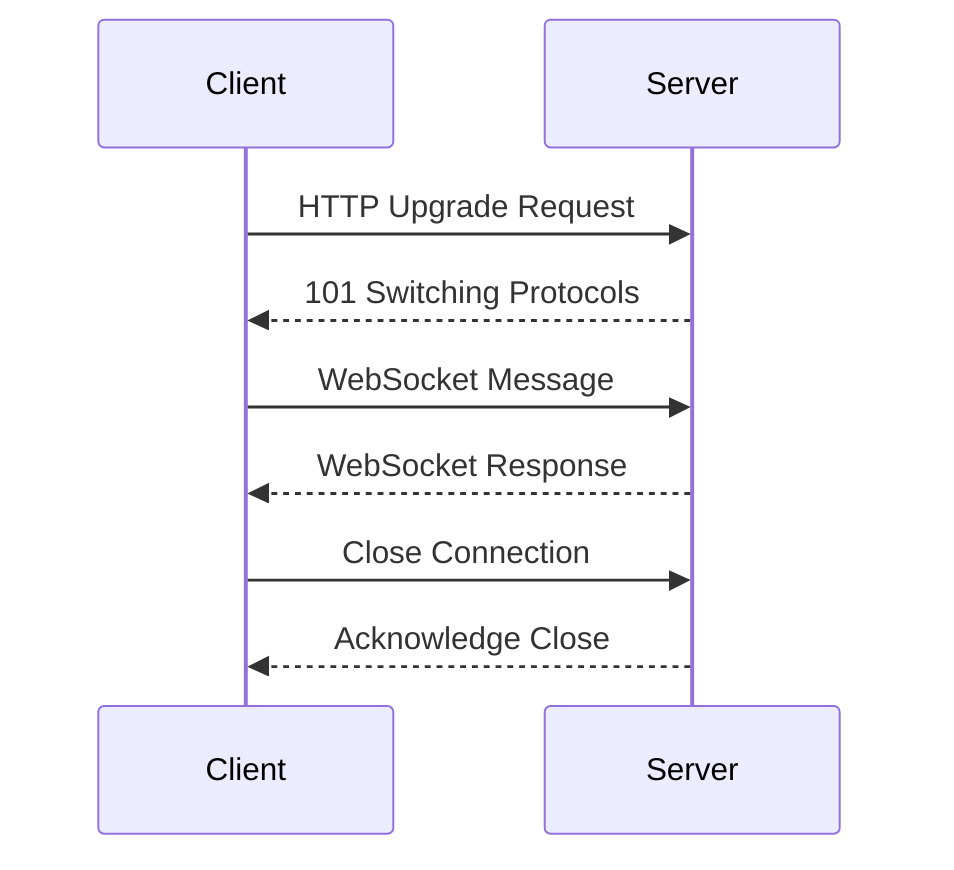

## 13.7. WebSockets and Real-Time Communication

In today's fast-paced digital world, real-time communication has become a cornerstone of modern web applications. Whether it's live updates, chat applications, or notifications, WebSockets offer a robust solution for implementing real-time features. In this section, we'll delve into WebSockets, their advantages over traditional HTTP requests, and how to implement them in Rust using popular frameworks like Actix-web and Warp.

### Understanding WebSockets

WebSockets are a protocol that provides full-duplex communication channels over a single TCP connection. Unlike traditional HTTP requests, which follow a request-response model, WebSockets allow for continuous two-way communication between the client and server. This makes them ideal for applications that require real-time data exchange.

#### Advantages of WebSockets

- **Low Latency**: WebSockets reduce latency by maintaining a persistent connection, eliminating the need for repeated handshakes.
- **Bi-directional Communication**: Both the client and server can send messages independently, enabling real-time interactions.
- **Efficient Resource Usage**: By using a single connection, WebSockets minimize the overhead associated with opening and closing connections.

### Setting Up WebSocket Servers in Rust

Rust, with its emphasis on safety and concurrency, is well-suited for building WebSocket servers. We'll explore two popular frameworks: Actix-web and Warp.

#### Actix-web WebSocket Server

Actix-web is a powerful, actor-based framework for building web applications in Rust. It provides built-in support for WebSockets, making it straightforward to set up a server.

**Example: Setting Up a WebSocket Server with Actix-web**

```rust
use actix::prelude::*;
use actix_web::{web, App, Error, HttpRequest, HttpResponse, HttpServer};
use actix_web_actors::ws;

struct MyWebSocket;

impl Actor for MyWebSocket {
    type Context = ws::WebsocketContext<Self>;
}

impl StreamHandler<Result<ws::Message, ws::ProtocolError>> for MyWebSocket {
    fn handle(&mut self, msg: Result<ws::Message, ws::ProtocolError>, ctx: &mut Self::Context) {
        match msg {
            Ok(ws::Message::Ping(msg)) => ctx.pong(&msg),
            Ok(ws::Message::Text(text)) => ctx.text(text),
            Ok(ws::Message::Binary(bin)) => ctx.binary(bin),
            _ => (),
        }
    }
}

async fn websocket_route(req: HttpRequest, stream: web::Payload) -> Result<HttpResponse, Error> {
    ws::start(MyWebSocket {}, &req, stream)
}

#[actix_web::main]
async fn main() -> std::io::Result<()> {
    HttpServer::new(|| {
        App::new()
            .route("/ws/", web::get().to(websocket_route))
    })
    .bind("127.0.0.1:8080")?
    .run()
    .await
}
```

**Explanation:**

- **Actor Model**: Actix-web uses actors to handle WebSocket connections, allowing for concurrent message processing.
- **StreamHandler**: This trait is implemented to handle incoming WebSocket messages, such as text and binary data.
- **WebSocket Context**: The `ws::WebsocketContext` provides methods to send messages back to the client.

#### Warp WebSocket Server

Warp is a lightweight, composable web framework for Rust. It offers a functional programming approach and supports WebSockets through filters.

**Example: Setting Up a WebSocket Server with Warp**

```rust
use warp::Filter;

#[tokio::main]
async fn main() {
    let ws_route = warp::path("ws")
        .and(warp::ws())
        .map(|ws: warp::ws::Ws| {
            ws.on_upgrade(|websocket| async {
                let (tx, rx) = websocket.split();
                rx.forward(tx).await.unwrap();
            })
        });

    warp::serve(ws_route).run(([127, 0, 0, 1], 8080)).await;
}
```

**Explanation:**

- **Filters**: Warp uses filters to define routes and handle WebSocket connections.
- **on_upgrade**: This method upgrades an HTTP connection to a WebSocket connection.
- **Split and Forward**: The WebSocket stream is split into a sender and receiver, allowing messages to be forwarded back to the client.

### Handling Connections and Broadcasting Messages

Managing WebSocket connections involves handling new connections, broadcasting messages, and dealing with client disconnections.

#### Connection Management

In Actix-web, connections are managed using actors. Each WebSocket connection is represented by an actor, which can maintain state and handle messages independently.

In Warp, connections are managed using asynchronous tasks. Each connection is handled in its own task, allowing for concurrent processing.

#### Broadcasting Messages

Broadcasting messages to multiple clients is a common requirement in real-time applications. This can be achieved by maintaining a list of active connections and iterating over them to send messages.

**Example: Broadcasting Messages in Actix-web**

```rust
use actix::prelude::*;
use std::collections::HashSet;

struct MyWebSocket {
    connections: HashSet<Addr<MyWebSocket>>,
}

impl MyWebSocket {
    fn broadcast(&self, message: &str) {
        for conn in &self.connections {
            conn.do_send(ws::Message::Text(message.to_string()));
        }
    }
}
```

**Example: Broadcasting Messages in Warp**

```rust
use tokio::sync::broadcast;

let (tx, _rx) = broadcast::channel(100);

let ws_route = warp::path("ws")
    .and(warp::ws())
    .map(move |ws: warp::ws::Ws| {
        let tx = tx.clone();
        ws.on_upgrade(move |websocket| {
            let (tx, rx) = websocket.split();
            rx.forward(tx).await.unwrap();
        })
    });
```

### Dealing with Client Disconnections

Handling client disconnections gracefully is crucial for maintaining a robust WebSocket server. This involves detecting when a client disconnects and cleaning up resources associated with the connection.

In Actix-web, disconnections can be detected by implementing the `Stopping` lifecycle method in the actor. In Warp, disconnections can be handled by monitoring the WebSocket stream for errors.

### Use Cases for WebSockets

WebSockets are versatile and can be used in a variety of applications:

- **Real-Time Dashboards**: Update data in real-time without refreshing the page.
- **Multiplayer Games**: Enable real-time interactions between players.
- **Collaborative Tools**: Allow multiple users to work on the same document simultaneously.

### Integrating WebSockets with Front-End Applications

To fully leverage WebSockets, it's essential to integrate them with front-end applications. This involves establishing a WebSocket connection from the client and handling incoming messages.

**Example: Integrating WebSockets with JavaScript**

```javascript
const socket = new WebSocket('ws://localhost:8080/ws');

socket.onopen = function(event) {
    console.log('WebSocket is open now.');
};

socket.onmessage = function(event) {
    console.log('Received:', event.data);
};

socket.onclose = function(event) {
    console.log('WebSocket is closed now.');
};

socket.onerror = function(error) {
    console.error('WebSocket error:', error);
};
```

### Visualizing WebSocket Communication

To better understand WebSocket communication, let's visualize the process using a sequence diagram.



**Diagram Explanation:**

- **HTTP Upgrade Request**: The client initiates a WebSocket connection by sending an HTTP upgrade request.
- **101 Switching Protocols**: The server acknowledges the request and switches to the WebSocket protocol.
- **WebSocket Message**: The client and server exchange messages over the WebSocket connection.
- **Close Connection**: The client or server can close the connection at any time.

### Best Practices for WebSocket Communication

- **Error Handling**: Implement robust error handling to manage connection issues and message parsing errors.
- **Security**: Use secure WebSocket connections (wss://) to encrypt data and protect against man-in-the-middle attacks.
- **Resource Management**: Monitor and manage resources to prevent memory leaks and ensure efficient use of system resources.

### Try It Yourself

Experiment with the provided examples by modifying the message handling logic or adding new features. For instance, try implementing a simple chat application or a real-time notification system.

### External Resources

- [Actix-web WebSocket support](https://actix.rs/docs/websockets/)
- [Warp WebSocket filters](https://docs.rs/warp/latest/warp/filters/ws/index.html)
- [Tokio-tungstenite (WebSocket client/server library)](https://github.com/snapview/tokio-tungstenite)

### Summary

WebSockets provide a powerful mechanism for real-time communication in web applications. By leveraging Rust's concurrency and safety features, developers can build efficient and robust WebSocket servers. Whether you're developing a real-time dashboard, a multiplayer game, or a collaborative tool, WebSockets offer the flexibility and performance needed to deliver a seamless user experience.

## Quiz Time!



### What is the primary advantage of WebSockets over traditional HTTP requests?

- [x] Full-duplex communication
- [ ] Simpler implementation
- [ ] Lower server costs
- [ ] Better compatibility with older browsers

> **Explanation:** WebSockets provide full-duplex communication, allowing both the client and server to send messages independently.

### Which Rust framework uses actors to handle WebSocket connections?

- [x] Actix-web
- [ ] Warp
- [ ] Rocket
- [ ] Hyper

> **Explanation:** Actix-web uses actors to manage WebSocket connections, allowing for concurrent message processing.

### In Warp, how is an HTTP connection upgraded to a WebSocket connection?

- [x] Using the `on_upgrade` method
- [ ] By implementing a custom protocol
- [ ] Through a middleware
- [ ] By sending a special header

> **Explanation:** Warp uses the `on_upgrade` method to upgrade an HTTP connection to a WebSocket connection.

### What is a common use case for WebSockets?

- [x] Real-time dashboards
- [ ] Static websites
- [ ] Batch processing
- [ ] Email notifications

> **Explanation:** WebSockets are commonly used for real-time dashboards, enabling live updates without refreshing the page.

### How can client disconnections be detected in Actix-web?

- [x] By implementing the `Stopping` lifecycle method
- [ ] By checking connection status manually
- [ ] Through a middleware
- [ ] By monitoring server logs

> **Explanation:** In Actix-web, client disconnections can be detected by implementing the `Stopping` lifecycle method in the actor.

### What is the purpose of the `ws::WebsocketContext` in Actix-web?

- [x] To provide methods for sending messages back to the client
- [ ] To manage HTTP requests
- [ ] To handle database connections
- [ ] To log server activity

> **Explanation:** The `ws::WebsocketContext` provides methods to send messages back to the client in Actix-web.

### Which method is used to split a WebSocket stream in Warp?

- [x] `split`
- [ ] `divide`
- [ ] `partition`
- [ ] `separate`

> **Explanation:** The `split` method is used to divide a WebSocket stream into a sender and receiver in Warp.

### What is a key security consideration when using WebSockets?

- [x] Use secure WebSocket connections (wss://)
- [ ] Avoid using encryption
- [ ] Use plain text for all messages
- [ ] Disable authentication

> **Explanation:** It's important to use secure WebSocket connections (wss://) to encrypt data and protect against attacks.

### Which JavaScript method is used to establish a WebSocket connection?

- [x] `new WebSocket()`
- [ ] `connectWebSocket()`
- [ ] `openSocket()`
- [ ] `startWebSocket()`

> **Explanation:** The `new WebSocket()` method is used to establish a WebSocket connection in JavaScript.

### True or False: WebSockets can only be used for text-based communication.

- [ ] True
- [x] False

> **Explanation:** WebSockets can handle both text and binary data, making them versatile for various applications.



Remember, this is just the beginning. As you progress, you'll build more complex and interactive web applications. Keep experimenting, stay curious, and enjoy the journey!
