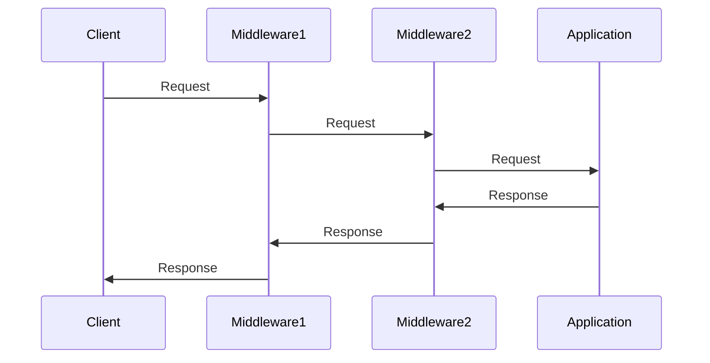

## 13.8. Middleware Patterns

Middleware plays a crucial role in web development, acting as a bridge between incoming requests and the core application logic. In Rust, middleware is used to handle cross-cutting concerns such as logging, authentication, and request modification. This section explores middleware patterns in Rust web frameworks like Actix-web and Rocket, providing insights into their creation, usage, and best practices.

### What is Middleware?

Middleware is a software layer that sits between the client and server, processing requests and responses. It allows developers to encapsulate common functionality that can be reused across different parts of an application. Middleware can perform tasks such as:

- **Logging**: Recording request and response data for monitoring and debugging.
- **Authentication**: Verifying user credentials before granting access to resources.
- **Error Handling**: Capturing and responding to errors in a consistent manner.
- **Request Modification**: Altering request data before it reaches the application logic.

### Middleware in Rust Web Frameworks

Rust web frameworks like Actix-web and Rocket provide robust support for middleware, allowing developers to implement and manage these cross-cutting concerns efficiently.

#### Actix-web Middleware

Actix-web is a powerful, actor-based web framework for Rust. It provides a flexible middleware system that allows developers to intercept and modify requests and responses.

##### Creating Middleware in Actix-web

To create middleware in Actix-web, you need to implement the `Transform` trait. This trait requires defining a `Service` that processes requests and produces responses. Here's a simple example of a logging middleware:

```rust
use actix_service::Service;
use actix_web::{dev::ServiceRequest, dev::ServiceResponse, Error, HttpServer, App};
use futures::future::{ok, Ready};
use std::task::{Context, Poll};
use std::pin::Pin;

pub struct LoggingMiddleware;

impl<S, B> Transform<S> for LoggingMiddleware
where
    S: Service<Request = ServiceRequest, Response = ServiceResponse<B>, Error = Error>,
    S::Future: 'static,
{
    type Request = ServiceRequest;
    type Response = ServiceResponse<B>;
    type Error = Error;
    type InitError = ();
    type Transform = LoggingMiddlewareService<S>;
    type Future = Ready<Result<Self::Transform, Self::InitError>>;

    fn new_transform(&self, service: S) -> Self::Future {
        ok(LoggingMiddlewareService { service })
    }
}

pub struct LoggingMiddlewareService<S> {
    service: S,
}

impl<S, B> Service for LoggingMiddlewareService<S>
where
    S: Service<Request = ServiceRequest, Response = ServiceResponse<B>, Error = Error>,
    S::Future: 'static,
{
    type Request = ServiceRequest;
    type Response = ServiceResponse<B>;
    type Error = Error;
    type Future = Pin<Box<dyn futures::Future<Output = Result<Self::Response, Self::Error>>>>;

    fn poll_ready(&mut self, cx: &mut Context<'_>) -> Poll<Result<(), Self::Error>> {
        self.service.poll_ready(cx)
    }

    fn call(&mut self, req: ServiceRequest) -> Self::Future {
        println!("Request: {:?}", req);
        let fut = self.service.call(req);
        Box::pin(async move {
            let res = fut.await?;
            println!("Response: {:?}", res);
            Ok(res)
        })
    }
}

#[actix_web::main]
async fn main() -> std::io::Result<()> {
    HttpServer::new(|| {
        App::new()
            .wrap(LoggingMiddleware)
            .route("/", actix_web::web::get().to(|| async { "Hello, World!" }))
    })
    .bind("127.0.0.1:8080")?
    .run()
    .await
}
```

In this example, `LoggingMiddleware` logs each request and response. The `Transform` trait is used to create a new middleware service, `LoggingMiddlewareService`, which wraps the original service.

##### Common Middleware Functions in Actix-web

- **Authentication**: Implement middleware to check user credentials and permissions.
- **Error Handling**: Capture errors and return appropriate HTTP responses.
- **Request Modification**: Modify headers or body content before passing to the application logic.

#### Rocket Fairings

Rocket is another popular web framework for Rust, known for its ease of use and type safety. Rocket uses a concept called "Fairings" to implement middleware-like functionality.

##### Creating Fairings in Rocket

Fairings in Rocket are used to perform actions at various stages of request processing. Here's an example of a simple logging fairing:

```rust
#[macro_use] extern crate rocket;

use rocket::{Request, Data, fairing::{Fairing, Info, Kind}, Rocket};

pub struct LoggingFairing;

#[rocket::async_trait]
impl Fairing for LoggingFairing {
    fn info(&self) -> Info {
        Info {
            name: "Logging Fairing",
            kind: Kind::Request | Kind::Response,
        }
    }

    async fn on_request(&self, request: &mut Request<'_>, _: &Data<'_>) {
        println!("Request: {:?}", request);
    }

    async fn on_response<'r>(&self, _: &'r Request<'_>, response: &mut rocket::Response<'r>) {
        println!("Response: {:?}", response);
    }
}

#[launch]
fn rocket() -> Rocket {
    rocket::build()
        .attach(LoggingFairing)
        .mount("/", routes![index])
}

#[get("/")]
fn index() -> &'static str {
    "Hello, world!"
}
```

In this example, `LoggingFairing` logs each request and response. The `Fairing` trait is used to define actions to be taken at the request and response stages.

##### Common Fairing Functions in Rocket

- **Authentication**: Validate user sessions or tokens.
- **Error Handling**: Customize error responses.
- **Request Modification**: Adjust request parameters or headers.

### Ordering of Middleware

The order in which middleware is applied can significantly affect request processing. Middleware is typically executed in the order it is added to the application. For example, logging middleware should generally be placed before authentication middleware to ensure all requests are logged, even if they fail authentication.

### Best Practices for Middleware

- **Reusability**: Write middleware that can be easily reused across different applications or routes.
- **Efficiency**: Minimize the performance impact of middleware by avoiding unnecessary computations.
- **Modularity**: Keep middleware focused on a single responsibility to enhance maintainability.
- **Testing**: Thoroughly test middleware to ensure it handles all edge cases and integrates well with the application.

### Rust Unique Features

Rust's ownership model and type system provide unique advantages when implementing middleware. The language's safety guarantees help prevent common errors such as null pointer dereferences and data races, making middleware more robust and reliable.

### Differences and Similarities

Middleware in Actix-web and Rocket share similarities in their purpose and functionality but differ in implementation. Actix-web uses the `Transform` trait, while Rocket employs the `Fairing` trait. Understanding these differences is crucial for choosing the right framework for your needs.

### Try It Yourself

Experiment with the provided code examples by modifying them to add new functionality, such as:

- Implementing an authentication middleware that checks for a specific header.
- Creating a middleware that adds a custom header to each response.
- Developing error handling middleware that returns custom error pages.

### Visualizing Middleware Flow

To better understand how middleware works, let's visualize the flow of requests and responses through middleware layers using a sequence diagram.



This diagram illustrates how a request passes through multiple middleware layers before reaching the application, and how the response travels back through the same layers.

### References and Links

- [Middleware in Actix-web](https://actix.rs/docs/middleware/)
- [Fairings (middleware) in Rocket](https://rocket.rs/v0.5-rc/guide/fairings/)

### Knowledge Check

- What is middleware, and what role does it play in web applications?
- How do you create middleware in Actix-web?
- What are fairings in Rocket, and how do they differ from middleware in Actix-web?
- Why is the order of middleware important in request processing?
- What are some best practices for writing middleware in Rust?

### Embrace the Journey

Remember, mastering middleware is just one step in your journey to becoming a proficient Rust web developer. Keep experimenting, stay curious, and enjoy the process of building robust and efficient web applications!

## Quiz Time!



### What is the primary role of middleware in web applications?

- [x] To handle cross-cutting concerns like logging and authentication
- [ ] To manage database connections
- [ ] To render HTML templates
- [ ] To compile Rust code

> **Explanation:** Middleware handles cross-cutting concerns such as logging, authentication, and request modification.

### How do you create middleware in Actix-web?

- [x] By implementing the `Transform` trait
- [ ] By using the `Middleware` struct
- [ ] By defining a `Service` trait
- [ ] By creating a `Handler` function

> **Explanation:** In Actix-web, middleware is created by implementing the `Transform` trait.

### What is a fairing in Rocket?

- [x] A middleware-like component for request and response processing
- [ ] A type of HTTP request
- [ ] A database connection manager
- [ ] A logging utility

> **Explanation:** A fairing in Rocket is a middleware-like component used for processing requests and responses.

### Why is the order of middleware important?

- [x] It affects how requests and responses are processed
- [ ] It determines the server's IP address
- [ ] It changes the application's routing logic
- [ ] It impacts the database schema

> **Explanation:** The order of middleware affects the sequence in which requests and responses are processed.

### What is a common use case for middleware?

- [x] Logging requests and responses
- [ ] Compiling Rust code
- [ ] Rendering HTML templates
- [ ] Managing CSS styles

> **Explanation:** Logging requests and responses is a common use case for middleware.

### Which Rust feature enhances middleware reliability?

- [x] Ownership model and type system
- [ ] Dynamic typing
- [ ] Garbage collection
- [ ] Weak typing

> **Explanation:** Rust's ownership model and type system enhance middleware reliability by preventing common errors.

### What is a best practice for writing middleware?

- [x] Keeping middleware focused on a single responsibility
- [ ] Writing middleware that handles all application logic
- [ ] Avoiding the use of traits
- [ ] Using global variables extensively

> **Explanation:** Keeping middleware focused on a single responsibility enhances maintainability.

### How can you test middleware effectively?

- [x] By simulating requests and checking responses
- [ ] By compiling the middleware with different flags
- [ ] By using global variables
- [ ] By avoiding unit tests

> **Explanation:** Testing middleware involves simulating requests and checking the responses to ensure correct behavior.

### What is a unique feature of Rust that benefits middleware?

- [x] Memory safety without garbage collection
- [ ] Dynamic typing
- [ ] Automatic memory management
- [ ] Weak typing

> **Explanation:** Rust provides memory safety without garbage collection, benefiting middleware reliability.

### Middleware in Actix-web and Rocket are implemented using the same trait.

- [ ] True
- [x] False

> **Explanation:** Middleware in Actix-web uses the `Transform` trait, while Rocket uses the `Fairing` trait.


