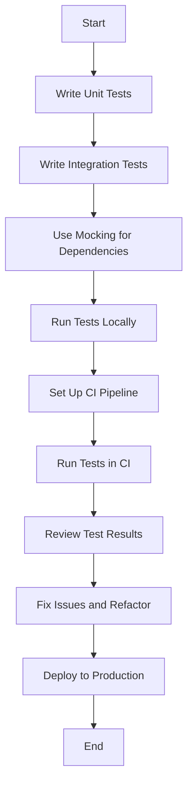

## 13.9. Testing Web Applications

In the realm of web development, testing is a cornerstone for ensuring the reliability, performance, and security of applications. As Rust continues to gain traction in web development, understanding how to effectively test Rust web applications is crucial for developers aiming to deliver robust and maintainable software.

### The Importance of Testing in Web Development

Testing is an integral part of the software development lifecycle. It helps identify bugs early, ensures code quality, and provides a safety net for future changes. In web applications, testing becomes even more critical due to the complexity of handling HTTP requests, managing state, and interacting with databases and external services.

### Setting Up Tests in Rust

Rust provides a powerful testing framework built into the language, allowing developers to write unit tests, integration tests, and documentation tests. The `#[cfg(test)]` attribute and the `test` crate are central to setting up tests in Rust.

#### Unit Testing with `#[cfg(test)]`

Unit tests focus on testing individual components or functions in isolation. In Rust, you can define unit tests within the same file as your code using the `#[cfg(test)]` attribute.

```rust
#[cfg(test)]
mod tests {
    use super::*;

    #[test]
    fn test_addition() {
        assert_eq!(add(2, 3), 5);
    }
}
```

In this example, the `#[test]` attribute marks the function as a test case. The `assert_eq!` macro is used to verify that the `add` function returns the expected result.

#### Integration Testing

Integration tests are used to test the interaction between different components of your application. In Rust, integration tests are placed in the `tests` directory at the root of your project.

```rust
// tests/integration_test.rs
use my_crate::some_function;

#[test]
fn test_integration() {
    let result = some_function();
    assert!(result.is_ok());
}
```

Integration tests are compiled as separate binaries, allowing you to test your application as a whole.

### Testing Handlers, Middleware, and HTTP Requests

Testing web applications often involves simulating HTTP requests and verifying the responses. Rust's ecosystem provides several tools and libraries to facilitate this process.

#### Testing Handlers

Handlers are functions that process HTTP requests and generate responses. Testing handlers involves verifying that they produce the correct output for given inputs.

```rust
#[cfg(test)]
mod tests {
    use super::*;
    use actix_web::{test, App};

    #[actix_rt::test]
    async fn test_index_handler() {
        let mut app = test::init_service(App::new().route("/", web::get().to(index))).await;
        let req = test::TestRequest::get().uri("/").to_request();
        let resp = test::call_service(&mut app, req).await;
        assert!(resp.status().is_success());
    }
}
```

In this example, we use `actix_web`'s testing utilities to create a test server and send a request to the `index` handler. We then assert that the response status is successful.

#### Testing Middleware

Middleware components are responsible for processing requests before they reach the handler or after the handler has generated a response. Testing middleware involves ensuring that they correctly modify requests or responses.

```rust
#[cfg(test)]
mod tests {
    use super::*;
    use actix_web::{test, App, HttpResponse};

    #[actix_rt::test]
    async fn test_middleware() {
        let mut app = test::init_service(
            App::new()
                .wrap(MyMiddleware)
                .route("/", web::get().to(|| HttpResponse::Ok()))
        ).await;

        let req = test::TestRequest::get().uri("/").to_request();
        let resp = test::call_service(&mut app, req).await;
        assert_eq!(resp.headers().get("X-Custom-Header").unwrap(), "Value");
    }
}
```

Here, we test a custom middleware by asserting that it adds a specific header to the response.

#### Testing Full HTTP Requests/Responses

For testing full HTTP requests and responses, the `reqwest` crate is a popular choice. It allows you to make HTTP requests and verify the responses in your tests.

```rust
use reqwest::Client;

#[tokio::test]
async fn test_http_request() {
    let client = Client::new();
    let res = client.get("http://localhost:8080").send().await.unwrap();
    assert!(res.status().is_success());
}
```

This example demonstrates how to use `reqwest` to send a GET request and assert that the response status is successful.

### Mocking Dependencies and Database Interactions

Mocking is essential for isolating tests and simulating different scenarios without relying on external systems. The `mockall` crate is a powerful library for creating mocks in Rust.

#### Mocking with `mockall`

```rust
use mockall::{automock, predicate::*};

#[automock]
trait Database {
    fn get_user(&self, user_id: u32) -> Option<User>;
}

#[cfg(test)]
mod tests {
    use super::*;
    use mockall::predicate::*;

    #[test]
    fn test_get_user() {
        let mut mock_db = MockDatabase::new();
        mock_db.expect_get_user()
            .with(eq(1))
            .returning(|_| Some(User { id: 1, name: "Alice".to_string() }));

        let user = mock_db.get_user(1);
        assert_eq!(user.unwrap().name, "Alice");
    }
}
```

In this example, we define a `Database` trait and use `mockall` to generate a mock implementation. We then set expectations on the mock and verify the behavior in our test.

#### Mocking Database Interactions

When testing database interactions, it's often useful to use an in-memory database or a test database to avoid affecting production data. You can also mock database calls using libraries like `mockall`.

### Continuous Integration and Testing

Including tests in your continuous integration (CI) pipeline ensures that your code is automatically tested whenever changes are made. This helps catch issues early and maintain code quality.

#### Setting Up CI for Rust Projects

Most CI services, such as GitHub Actions, Travis CI, and GitLab CI, support Rust out of the box. Here's an example of a GitHub Actions workflow for running tests:

```yaml
name: Rust

on: [push, pull_request]

jobs:
  build:
    runs-on: ubuntu-latest

    steps:
    - uses: actions/checkout@v2
    - name: Set up Rust
      uses: actions-rs/toolchain@v1
      with:
        toolchain: stable
    - name: Build
      run: cargo build --verbose
    - name: Run tests
      run: cargo test --verbose
```

This workflow checks out the code, sets up Rust, builds the project, and runs the tests.

### Try It Yourself

To solidify your understanding, try modifying the code examples provided. For instance, add more test cases to the handler tests, or experiment with different mocking scenarios using `mockall`. This hands-on approach will help reinforce the concepts covered.

### Visualizing the Testing Process

To better understand the testing process, let's visualize the flow of a typical test setup in Rust web applications.



This flowchart illustrates the steps involved in testing Rust web applications, from writing tests to deploying the application.

### Key Takeaways

- Testing is crucial for ensuring the reliability and maintainability of web applications.
- Rust's built-in testing framework, along with libraries like `reqwest` and `mockall`, provides powerful tools for testing web applications.
- Mocking allows you to isolate tests and simulate different scenarios without relying on external systems.
- Including tests in your CI pipeline ensures that your code is automatically tested, helping maintain code quality.

### References and Links

- [Rust Testing Documentation](https://doc.rust-lang.org/book/ch11-00-testing.html)
- [reqwest crate](https://crates.io/crates/reqwest)
- [mockall crate](https://crates.io/crates/mockall)

## Quiz Time!



### What is the primary purpose of testing in web development?

- [x] To identify bugs early and ensure code quality
- [ ] To increase the complexity of the application
- [ ] To reduce the need for documentation
- [ ] To make the application slower

> **Explanation:** Testing helps identify bugs early and ensures code quality, which is crucial for maintaining reliable and maintainable software.

### Which attribute is used to define unit tests in Rust?

- [x] `#[cfg(test)]`
- [ ] `#[test_case]`
- [ ] `#[unit_test]`
- [ ] `#[test_fn]`

> **Explanation:** The `#[cfg(test)]` attribute is used to define unit tests in Rust, allowing you to write test functions within the same file as your code.

### Where are integration tests typically placed in a Rust project?

- [x] In the `tests` directory at the root of the project
- [ ] In the `src` directory
- [ ] In the `lib` directory
- [ ] In the `bin` directory

> **Explanation:** Integration tests are placed in the `tests` directory at the root of the project, allowing them to be compiled as separate binaries.

### Which crate is commonly used for making HTTP requests in Rust tests?

- [x] `reqwest`
- [ ] `hyper`
- [ ] `actix-web`
- [ ] `warp`

> **Explanation:** The `reqwest` crate is commonly used for making HTTP requests in Rust tests due to its simplicity and ease of use.

### What is the purpose of the `mockall` crate?

- [x] To create mocks for testing
- [ ] To handle HTTP requests
- [ ] To manage database connections
- [ ] To perform logging

> **Explanation:** The `mockall` crate is used to create mocks for testing, allowing you to simulate different scenarios without relying on external systems.

### How can you include tests in a continuous integration pipeline?

- [x] By setting up a CI workflow that runs `cargo test`
- [ ] By manually running tests on a local machine
- [ ] By writing tests in a separate project
- [ ] By using a third-party testing service

> **Explanation:** Including tests in a CI pipeline involves setting up a workflow that automatically runs `cargo test` whenever changes are made to the codebase.

### Which of the following is a benefit of using mocks in tests?

- [x] Isolating tests from external dependencies
- [ ] Increasing the complexity of tests
- [ ] Reducing the need for unit tests
- [ ] Making tests slower

> **Explanation:** Mocks help isolate tests from external dependencies, allowing you to simulate different scenarios and test components in isolation.

### What is the role of the `#[test]` attribute in Rust?

- [x] To mark a function as a test case
- [ ] To define a new module
- [ ] To create a new struct
- [ ] To implement a trait

> **Explanation:** The `#[test]` attribute is used to mark a function as a test case, indicating that it should be executed as part of the test suite.

### True or False: Integration tests in Rust are compiled as separate binaries.

- [x] True
- [ ] False

> **Explanation:** Integration tests in Rust are compiled as separate binaries, allowing them to test the application as a whole.

### Which tool is used to visualize the testing process in the article?

- [x] Mermaid.js
- [ ] Graphviz
- [ ] PlantUML
- [ ] D3.js

> **Explanation:** Mermaid.js is used to create diagrams and visualize the testing process in the article.



Remember, testing is an ongoing process that evolves with your application. As you continue to develop and refine your Rust web applications, keep experimenting with different testing strategies and tools. Stay curious, and enjoy the journey of building reliable and robust software!
