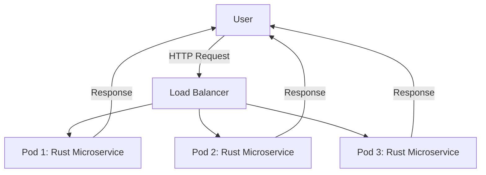

## 14.10. Deploying Rust Microservices

In this section, we will delve into the strategies and best practices for deploying Rust microservices. We'll explore containerization using Docker, orchestration with Kubernetes, and setting up CI/CD pipelines for automated deployment. Additionally, we'll discuss configuration management, secrets handling, and deployment strategies like rolling updates, canary deployments, and blue-green deployments.

### Containerizing Rust Applications with Docker

Containerization is a crucial step in deploying microservices, as it allows for consistent environments across development, testing, and production. Docker is a popular tool for containerizing applications, and Rust applications are no exception.

#### Building a Docker Image for a Rust Application

To containerize a Rust application, we start by creating a Dockerfile. This file contains instructions for building a Docker image.

```dockerfile
# Use the official Rust image as the base
FROM rust:1.65 as builder

# Set the working directory inside the container
WORKDIR /usr/src/myapp

# Copy the source code into the container
COPY . .

# Build the application
RUN cargo build --release

# Use a minimal base image for the final image
FROM debian:buster-slim

# Copy the compiled binary from the builder stage
COPY --from=builder /usr/src/myapp/target/release/myapp /usr/local/bin/myapp

# Expose the port the app runs on
EXPOSE 8080

# Run the application
CMD ["myapp"]
```

**Explanation:**

- **Multi-stage builds**: We use a multi-stage build to keep the final image small. The first stage uses the Rust official image to compile the application, and the second stage uses a minimal Debian image to run the compiled binary.
- **COPY and RUN**: We copy the source code and build it using `cargo build --release` to ensure optimizations.
- **EXPOSE and CMD**: We expose the necessary port and specify the command to run the application.

#### Try It Yourself

Experiment with modifying the Dockerfile to use different base images or to include additional dependencies required by your application.

### Deploying to Orchestration Platforms like Kubernetes

Kubernetes is a powerful orchestration platform that automates the deployment, scaling, and management of containerized applications.

#### Creating a Kubernetes Deployment

To deploy a Rust microservice on Kubernetes, we need to define a deployment configuration.

```yaml
apiVersion: apps/v1
kind: Deployment
metadata:
  name: rust-microservice
spec:
  replicas: 3
  selector:
    matchLabels:
      app: rust-microservice
  template:
    metadata:
      labels:
        app: rust-microservice
    spec:
      containers:
      - name: rust-microservice
        image: myregistry/rust-microservice:latest
        ports:
        - containerPort: 8080
```

**Explanation:**

- **Replicas**: We specify the number of replicas to ensure high availability.
- **Selector and Labels**: These are used to match the deployment with the pods.
- **Container Specification**: We define the container image and the port it listens on.

#### Visualizing Kubernetes Deployment



**Description**: This diagram illustrates how a user's request is distributed across multiple pods running the Rust microservice, ensuring load balancing and high availability.

### Setting Up CI/CD Pipelines for Automated Deployment

Continuous Integration and Continuous Deployment (CI/CD) pipelines automate the process of building, testing, and deploying applications, ensuring rapid and reliable delivery.

#### Example CI/CD Pipeline with GitHub Actions

GitHub Actions is a popular choice for setting up CI/CD pipelines.

```yaml
name: Rust CI/CD

on:
  push:
    branches:
      - main

jobs:
  build:
    runs-on: ubuntu-latest

    steps:
    - uses: actions/checkout@v2

    - name: Set up Rust
      uses: actions-rs/toolchain@v1
      with:
        toolchain: stable
        override: true

    - name: Build
      run: cargo build --release

    - name: Test
      run: cargo test

    - name: Docker Build and Push
      uses: docker/build-push-action@v2
      with:
        context: .
        push: true
        tags: myregistry/rust-microservice:latest
```

**Explanation:**

- **Checkout**: We use the `actions/checkout` action to pull the code.
- **Set up Rust**: The `actions-rs/toolchain` action sets up the Rust toolchain.
- **Build and Test**: We build and test the application using Cargo.
- **Docker Build and Push**: We build the Docker image and push it to a registry.

#### Try It Yourself

Modify the pipeline to include additional steps, such as running linting tools or deploying to a staging environment.

### Configuration Management and Secrets Handling

Managing configuration and secrets is critical in microservices to ensure security and flexibility.

#### Using Environment Variables

Environment variables are a common way to manage configuration.

```rust
use std::env;

fn main() {
    let database_url = env::var("DATABASE_URL").expect("DATABASE_URL must be set");
    println!("Connecting to database at {}", database_url);
}
```

**Explanation:**

- **Environment Variables**: We use the `env` module to read environment variables, which can be set differently in each environment (development, testing, production).

#### Secrets Management with Kubernetes

Kubernetes provides a secure way to manage secrets.

```yaml
apiVersion: v1
kind: Secret
metadata:
  name: db-secret
type: Opaque
data:
  username: dXNlcm5hbWU=  # base64 encoded
  password: cGFzc3dvcmQ=  # base64 encoded
```

**Explanation:**

- **Secrets**: We define a secret in Kubernetes, which can be mounted as a volume or exposed as environment variables in a pod.

### Deployment Strategies: Rolling Updates, Canary Deployments, and Blue-Green Deployments

Choosing the right deployment strategy is crucial for minimizing downtime and ensuring a smooth transition between application versions.

#### Rolling Updates

Rolling updates gradually replace old pods with new ones, ensuring that some instances of the application are always running.

```yaml
spec:
  strategy:
    type: RollingUpdate
    rollingUpdate:
      maxUnavailable: 1
      maxSurge: 1
```

**Explanation:**

- **RollingUpdate**: This strategy ensures that only one pod is unavailable at a time during the update.

#### Canary Deployments

Canary deployments release a new version to a small subset of users before rolling it out to the entire user base.

```yaml
spec:
  replicas: 5
  template:
    metadata:
      labels:
        app: rust-microservice
        version: canary
```

**Explanation:**

- **Canary Version**: We label a subset of pods with a `canary` version to test the new release.

#### Blue-Green Deployments

Blue-green deployments involve running two identical production environments, one active (blue) and one idle (green).

```yaml
apiVersion: apps/v1
kind: Deployment
metadata:
  name: rust-microservice-blue
spec:
  replicas: 3
  template:
    metadata:
      labels:
        app: rust-microservice
        version: blue
```

**Explanation:**

- **Blue Environment**: We deploy the new version to the green environment and switch traffic once it's verified.

### Key Considerations and Best Practices

- **Monitoring and Logging**: Implement robust monitoring and logging to track application performance and diagnose issues.
- **Security**: Ensure secure handling of secrets and sensitive data.
- **Scalability**: Design microservices to scale horizontally to handle increased load.
- **Resilience**: Implement retries and circuit breakers to handle transient failures.

### Knowledge Check

- **What is the purpose of using multi-stage builds in Docker?**
- **How can Kubernetes secrets be used to manage sensitive information?**
- **What are the benefits of using a CI/CD pipeline?**
- **Explain the difference between rolling updates and blue-green deployments.**

### Embrace the Journey

Deploying Rust microservices is an exciting journey that combines the power of Rust with modern deployment practices. Remember, this is just the beginning. As you progress, you'll build more resilient and scalable applications. Keep experimenting, stay curious, and enjoy the journey!

## Quiz Time!



### What is the primary benefit of using Docker for containerizing Rust applications?

- [x] Consistent environments across development, testing, and production
- [ ] Improved application performance
- [ ] Reduced application size
- [ ] Enhanced security features

> **Explanation:** Docker ensures consistent environments, which is crucial for microservices deployment.

### Which Kubernetes object is used to define the number of replicas for a Rust microservice?

- [ ] Service
- [x] Deployment
- [ ] Pod
- [ ] ConfigMap

> **Explanation:** A Deployment object in Kubernetes is used to define the number of replicas and manage updates.

### What is the purpose of using environment variables in Rust applications?

- [x] To manage configuration settings
- [ ] To store application logs
- [ ] To enhance application security
- [ ] To improve application performance

> **Explanation:** Environment variables are commonly used to manage configuration settings in applications.

### How does a rolling update strategy work in Kubernetes?

- [x] Gradually replaces old pods with new ones
- [ ] Deploys all new pods at once
- [ ] Switches traffic between two environments
- [ ] Deploys a new version to a small subset of users

> **Explanation:** Rolling updates gradually replace old pods with new ones, ensuring minimal downtime.

### What is a key advantage of using CI/CD pipelines?

- [x] Automated and reliable deployment process
- [ ] Manual intervention in deployment
- [ ] Increased application size
- [ ] Reduced application performance

> **Explanation:** CI/CD pipelines automate the deployment process, making it more reliable and efficient.

### Which deployment strategy involves running two identical production environments?

- [ ] Rolling Update
- [ ] Canary Deployment
- [x] Blue-Green Deployment
- [ ] A/B Testing

> **Explanation:** Blue-green deployments involve running two identical production environments, one active and one idle.

### What is the role of Kubernetes secrets?

- [x] To securely manage sensitive information
- [ ] To store application logs
- [ ] To enhance application performance
- [ ] To manage application configuration

> **Explanation:** Kubernetes secrets are used to securely manage sensitive information like passwords and API keys.

### How can you ensure high availability in a Kubernetes deployment?

- [x] By specifying multiple replicas
- [ ] By using a single pod
- [ ] By disabling rolling updates
- [ ] By using environment variables

> **Explanation:** Specifying multiple replicas ensures that the application remains available even if some pods fail.

### What is the purpose of using a multi-stage build in a Dockerfile?

- [x] To reduce the size of the final image
- [ ] To increase the build time
- [ ] To enhance application security
- [ ] To improve application performance

> **Explanation:** Multi-stage builds help reduce the size of the final Docker image by separating the build and runtime environments.

### True or False: Canary deployments release a new version to the entire user base at once.

- [ ] True
- [x] False

> **Explanation:** Canary deployments release a new version to a small subset of users before rolling it out to the entire user base.


