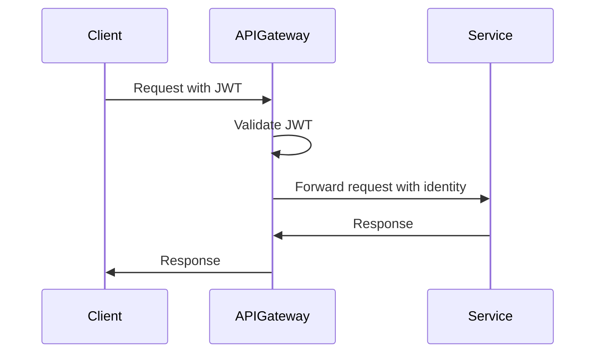

## 14.11. Security Considerations in Microservices

In the world of microservices, security is a paramount concern. As we decompose monolithic applications into smaller, independent services, we must ensure that each service is secure and that the communication between them is protected. This section will guide you through the best practices for securing Rust microservices, focusing on authentication, authorization, data protection, and compliance.

### Securing Inter-Service Communication

One of the primary concerns in microservices architecture is securing the communication between services. This is crucial because microservices often communicate over potentially insecure networks. Let's explore how we can secure these communications using mutual TLS (mTLS).

#### Mutual TLS (mTLS)

Mutual TLS is a protocol that ensures both the client and server authenticate each other. This is achieved by exchanging and verifying certificates. mTLS provides confidentiality, integrity, and authenticity of the data exchanged between services.

**Steps to Implement mTLS:**

1. **Certificate Authority (CA):** Establish a trusted CA to issue certificates for your services.
2. **Service Certificates:** Generate and distribute certificates to each service.
3. **Configuration:** Configure each service to require client certificates for incoming connections.
4. **Verification:** Implement logic to verify the client certificates against the trusted CA.

**Code Example:**

```rust
use std::fs;
use std::sync::Arc;
use tokio_rustls::rustls::{Certificate, PrivateKey, ServerConfig};
use tokio_rustls::TlsAcceptor;
use tokio::net::TcpListener;

async fn start_secure_server() -> Result<(), Box<dyn std::error::Error>> {
    // Load server certificate and private key
    let certs = load_certs("server-cert.pem")?;
    let key = load_private_key("server-key.pem")?;

    // Configure server with the certificate and private key
    let config = ServerConfig::builder()
        .with_safe_defaults()
        .with_no_client_auth()
        .with_single_cert(certs, key)?;

    let acceptor = TlsAcceptor::from(Arc::new(config));
    let listener = TcpListener::bind("127.0.0.1:443").await?;

    loop {
        let (stream, _) = listener.accept().await?;
        let acceptor = acceptor.clone();

        tokio::spawn(async move {
            let _ = acceptor.accept(stream).await;
        });
    }
}

fn load_certs(path: &str) -> Result<Vec<Certificate>, Box<dyn std::error::Error>> {
    let certfile = fs::File::open(path)?;
    let mut reader = std::io::BufReader::new(certfile);
    Ok(rustls_pemfile::certs(&mut reader)?
        .into_iter()
        .map(Certificate)
        .collect())
}

fn load_private_key(path: &str) -> Result<PrivateKey, Box<dyn std::error::Error>> {
    let keyfile = fs::File::open(path)?;
    let mut reader = std::io::BufReader::new(keyfile);
    let keys = rustls_pemfile::pkcs8_private_keys(&mut reader)?;
    Ok(PrivateKey(keys[0].clone()))
}
```

**Try It Yourself:** Modify the code to include client certificate verification by loading the CA certificate and configuring the server to require client authentication.

### Authentication and Authorization

Authentication and authorization are critical components of microservices security. They ensure that only authorized users and services can access resources.

#### Service-Level Authentication and Authorization

At the service level, each microservice should authenticate requests and authorize access to its resources. This can be achieved using JSON Web Tokens (JWT) or OAuth 2.0.

**JWT Authentication Example:**

```rust
use jsonwebtoken::{encode, decode, Header, Validation, EncodingKey, DecodingKey};
use serde::{Serialize, Deserialize};

#[derive(Debug, Serialize, Deserialize)]
struct Claims {
    sub: String,
    company: String,
    exp: usize,
}

fn create_jwt() -> String {
    let my_claims = Claims {
        sub: "user123".to_owned(),
        company: "ACME".to_owned(),
        exp: 10000000000,
    };
    encode(&Header::default(), &my_claims, &EncodingKey::from_secret("secret".as_ref())).unwrap()
}

fn verify_jwt(token: &str) -> bool {
    let token_data = decode::<Claims>(
        token,
        &DecodingKey::from_secret("secret".as_ref()),
        &Validation::default(),
    );
    token_data.is_ok()
}

fn main() {
    let token = create_jwt();
    println!("JWT: {}", token);

    let is_valid = verify_jwt(&token);
    println!("Is JWT valid? {}", is_valid);
}
```

**Try It Yourself:** Experiment with different claims and expiration times to see how they affect the token's validity.

#### API Gateway-Level Authentication and Authorization

An API Gateway can centralize authentication and authorization, reducing the complexity of individual services. The gateway can handle token validation and pass the authenticated identity to downstream services.

**Diagram: API Gateway Authentication Flow**



### Handling Sensitive Data Securely

Protecting sensitive data is crucial in microservices. This includes encrypting data at rest and in transit, and ensuring proper access controls.

#### Data Encryption

Encrypt sensitive data using strong encryption algorithms. Rust provides several libraries for encryption, such as `rust-crypto` and `ring`.

**Example: Encrypting Data with `ring`:**

```rust
use ring::aead;
use ring::rand::{SystemRandom, SecureRandom};

fn encrypt_data(data: &[u8], key: &[u8]) -> Vec<u8> {
    let nonce = [0u8; 12];
    let mut in_out = data.to_vec();
    let sealing_key = aead::SealingKey::new(&aead::AES_256_GCM, key).unwrap();
    aead::seal_in_place(&sealing_key, &nonce, aead::Aad::empty(), &mut in_out, 16).unwrap();
    in_out
}

fn main() {
    let key = [0u8; 32];
    let data = b"Sensitive data";
    let encrypted_data = encrypt_data(data, &key);
    println!("Encrypted data: {:?}", encrypted_data);
}
```

**Try It Yourself:** Modify the code to decrypt the data and verify its integrity.

### Input Validation and Sanitization

Input validation and sanitization are essential to prevent injection attacks and ensure data integrity. Always validate and sanitize inputs at the service boundary.

**Example: Validating User Input:**

```rust
fn validate_username(username: &str) -> bool {
    let re = regex::Regex::new(r"^[a-zA-Z0-9_]{3,30}$").unwrap();
    re.is_match(username)
}

fn main() {
    let username = "valid_user123";
    if validate_username(username) {
        println!("Username is valid.");
    } else {
        println!("Invalid username.");
    }
}
```

**Try It Yourself:** Test the validation function with different inputs to see how it handles invalid data.

### Compliance Standards

Adhering to compliance standards is crucial for ensuring the security and privacy of microservices. Common standards include GDPR, HIPAA, and PCI-DSS.

#### GDPR Compliance

The General Data Protection Regulation (GDPR) requires organizations to protect personal data and respect privacy rights. Key considerations include:

- **Data Minimization:** Collect only the data necessary for your purposes.
- **Consent:** Obtain explicit consent from users before collecting their data.
- **Right to Access:** Allow users to access their data and request corrections or deletions.

#### Implementing Compliance

To implement compliance, consider the following steps:

1. **Data Inventory:** Maintain an inventory of all personal data collected and processed.
2. **Data Protection Impact Assessment (DPIA):** Conduct DPIAs to identify and mitigate risks.
3. **Privacy by Design:** Incorporate privacy considerations into the design of your microservices.

### Conclusion

Securing microservices requires a comprehensive approach that includes securing inter-service communication, implementing robust authentication and authorization mechanisms, handling sensitive data securely, validating inputs, and adhering to compliance standards. By following these best practices, you can build secure and resilient microservices in Rust.

### Key Takeaways

- Use mutual TLS to secure inter-service communication.
- Implement authentication and authorization at both the service and API Gateway levels.
- Encrypt sensitive data and ensure proper access controls.
- Validate and sanitize all inputs to prevent injection attacks.
- Adhere to compliance standards such as GDPR to protect user data.

### References and Further Reading

- [RustCrypto](https://github.com/RustCrypto): A collection of cryptographic algorithms implemented in pure Rust.
- [ring](https://briansmith.org/rustdoc/ring/): A safe, fast, small crypto library for Rust.
- [OWASP Top Ten](https://owasp.org/www-project-top-ten/): A standard awareness document for developers and web application security.
- [GDPR Compliance](https://gdpr.eu/): Information and resources on GDPR compliance.

## Quiz Time!



### What is the primary purpose of mutual TLS in microservices?

- [x] To ensure both client and server authenticate each other
- [ ] To encrypt data at rest
- [ ] To provide load balancing
- [ ] To manage API rate limiting

> **Explanation:** Mutual TLS ensures both the client and server authenticate each other, providing confidentiality, integrity, and authenticity of the data exchanged.

### Which library is used in the example for encrypting data in Rust?

- [x] ring
- [ ] rust-crypto
- [ ] openssl
- [ ] sodiumoxide

> **Explanation:** The example uses the `ring` library for encrypting data in Rust.

### What is the role of an API Gateway in microservices security?

- [x] To centralize authentication and authorization
- [ ] To store user credentials
- [ ] To manage service discovery
- [ ] To provide database access

> **Explanation:** An API Gateway centralizes authentication and authorization, reducing the complexity of individual services.

### What is a key consideration for GDPR compliance?

- [x] Data minimization
- [ ] Load balancing
- [ ] Service discovery
- [ ] API rate limiting

> **Explanation:** Data minimization is a key consideration for GDPR compliance, ensuring only necessary data is collected.

### How can you validate a username in Rust?

- [x] Using regex
- [ ] Using a database query
- [ ] Using a hash function
- [ ] Using a file system check

> **Explanation:** You can validate a username in Rust using regex to ensure it meets specific criteria.

### What is the benefit of encrypting data at rest?

- [x] To protect data from unauthorized access
- [ ] To improve data retrieval speed
- [ ] To reduce storage costs
- [ ] To enhance data compression

> **Explanation:** Encrypting data at rest protects it from unauthorized access, ensuring its confidentiality.

### Which compliance standard focuses on protecting personal data and privacy rights?

- [x] GDPR
- [ ] PCI-DSS
- [ ] HIPAA
- [ ] ISO 27001

> **Explanation:** GDPR focuses on protecting personal data and privacy rights.

### What is the purpose of input validation and sanitization?

- [x] To prevent injection attacks
- [ ] To enhance data compression
- [ ] To improve network latency
- [ ] To manage service discovery

> **Explanation:** Input validation and sanitization prevent injection attacks and ensure data integrity.

### Which of the following is a step in implementing compliance?

- [x] Conducting a Data Protection Impact Assessment (DPIA)
- [ ] Implementing load balancing
- [ ] Setting up a firewall
- [ ] Configuring a database

> **Explanation:** Conducting a Data Protection Impact Assessment (DPIA) is a step in implementing compliance to identify and mitigate risks.

### True or False: An API Gateway can handle token validation and pass the authenticated identity to downstream services.

- [x] True
- [ ] False

> **Explanation:** True. An API Gateway can handle token validation and pass the authenticated identity to downstream services, simplifying the security architecture.


