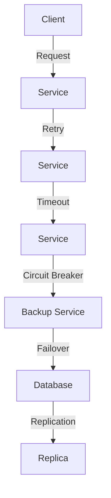

## 14.13. Fault Tolerance and Resilience

In the world of microservices, ensuring that your services are fault-tolerant and resilient is crucial for maintaining high availability and reliability. Rust, with its strong emphasis on safety and performance, provides unique advantages for building robust microservices. In this section, we will explore various techniques and patterns that can be employed to design fault-tolerant and resilient Rust microservices.

### Understanding Fault Tolerance and Resilience

**Fault Tolerance** refers to the ability of a system to continue operating properly in the event of the failure of some of its components. **Resilience**, on the other hand, is the ability of a system to recover quickly from difficulties. In the context of microservices, these concepts are vital as they ensure that services remain available and responsive even when parts of the system fail.

### Techniques for Fault Tolerance and Resilience

#### 1. Retries with Exponential Backoff

Retries are a common technique used to handle transient failures. However, indiscriminate retries can lead to cascading failures. To mitigate this, we use **exponential backoff**, which involves increasing the delay between retries exponentially.

```rust
use std::time::Duration;
use tokio::time::sleep;

async fn perform_request_with_retries() -> Result<(), &'static str> {
    let mut attempts = 0;
    let max_attempts = 5;

    while attempts < max_attempts {
        match perform_request().await {
            Ok(_) => return Ok(()),
            Err(_) => {
                attempts += 1;
                let backoff = Duration::from_secs(2u64.pow(attempts));
                println!("Retrying in {:?}...", backoff);
                sleep(backoff).await;
            }
        }
    }

    Err("Failed after multiple attempts")
}

async fn perform_request() -> Result<(), &'static str> {
    // Simulate a request that might fail
    Err("Request failed")
}
```

**Key Points:**
- **Exponential Backoff**: Gradually increase the wait time between retries to avoid overwhelming the system.
- **Maximum Attempts**: Limit the number of retries to prevent infinite loops.

#### 2. Timeouts

Implementing timeouts is essential to prevent a service from waiting indefinitely for a response. This helps in freeing up resources and maintaining system responsiveness.

```rust
use tokio::time::{timeout, Duration};

async fn perform_request_with_timeout() -> Result<(), &'static str> {
    let duration = Duration::from_secs(5);
    match timeout(duration, perform_request()).await {
        Ok(result) => result,
        Err(_) => Err("Request timed out"),
    }
}
```

**Key Points:**
- **Timeouts**: Set a reasonable timeout duration to ensure that resources are not held indefinitely.
- **Error Handling**: Gracefully handle timeout errors to maintain service stability.

#### 3. Bulkheads

The **Bulkhead Pattern** isolates different parts of a system to prevent a failure in one part from cascading to others. This is akin to compartmentalization in ships, where a breach in one compartment does not flood the entire ship.

```rust
use tokio::sync::Semaphore;
use std::sync::Arc;

async fn perform_isolated_task(semaphore: Arc<Semaphore>) {
    let _permit = semaphore.acquire().await.unwrap();
    // Perform task
}

#[tokio::main]
async fn main() {
    let semaphore = Arc::new(Semaphore::new(10)); // Limit concurrent tasks

    for _ in 0..100 {
        let semaphore_clone = Arc::clone(&semaphore);
        tokio::spawn(async move {
            perform_isolated_task(semaphore_clone).await;
        });
    }
}
```

**Key Points:**
- **Isolation**: Use semaphores or similar constructs to limit the impact of failures.
- **Concurrency Control**: Manage the number of concurrent operations to prevent resource exhaustion.

### Patterns for Fault Tolerance and Resilience

#### Circuit Breaker Pattern

The **Circuit Breaker Pattern** prevents a system from repeatedly trying to execute an operation that is likely to fail. It acts as a switch that opens when failures reach a threshold, preventing further attempts until the system recovers.

```rust
struct CircuitBreaker {
    failure_count: usize,
    threshold: usize,
    state: CircuitState,
}

enum CircuitState {
    Closed,
    Open,
    HalfOpen,
}

impl CircuitBreaker {
    fn new(threshold: usize) -> Self {
        CircuitBreaker {
            failure_count: 0,
            threshold,
            state: CircuitState::Closed,
        }
    }

    fn call(&mut self, operation: fn() -> Result<(), &'static str>) -> Result<(), &'static str> {
        match self.state {
            CircuitState::Open => Err("Circuit is open"),
            CircuitState::Closed | CircuitState::HalfOpen => {
                let result = operation();
                if result.is_err() {
                    self.failure_count += 1;
                    if self.failure_count >= self.threshold {
                        self.state = CircuitState::Open;
                    }
                } else {
                    self.failure_count = 0;
                    self.state = CircuitState::Closed;
                }
                result
            }
        }
    }
}
```

**Key Points:**
- **State Management**: Track the state of the circuit (Closed, Open, Half-Open).
- **Thresholds**: Define failure thresholds to trigger state changes.

#### Failover

**Failover** involves switching to a backup system or component when the primary one fails. This ensures continuity of service.

```rust
fn perform_operation_with_failover(primary: fn() -> Result<(), &'static str>, backup: fn() -> Result<(), &'static str>) -> Result<(), &'static str> {
    primary().or_else(|_| backup())
}
```

**Key Points:**
- **Redundancy**: Maintain backup systems to take over in case of failure.
- **Seamless Transition**: Ensure smooth switching between primary and backup systems.

### Handling Partial Failures Gracefully

In a distributed system, partial failures are inevitable. It's crucial to design systems that can handle these gracefully without affecting the overall service.

- **Fallback Mechanisms**: Provide alternative responses or degraded services when certain components fail.
- **Graceful Degradation**: Allow the system to continue operating at reduced functionality rather than failing completely.

### Importance of Redundancy and Replication

Redundancy and replication are key strategies for achieving fault tolerance and resilience. By duplicating critical components and data, you can ensure that failures do not lead to data loss or service unavailability.

- **Data Replication**: Use techniques like database replication to ensure data availability.
- **Service Redundancy**: Deploy multiple instances of services to handle load and failures.

### Stress Testing and Chaos Engineering

To ensure that your microservices are truly resilient, it's important to test them under various failure scenarios. **Stress Testing** and **Chaos Engineering** are practices that help identify weaknesses in your system.

- **Stress Testing**: Simulate high load conditions to test the system's performance and stability.
- **Chaos Engineering**: Intentionally introduce failures to observe how the system responds and to improve its resilience.

### Visualizing Fault Tolerance and Resilience Patterns



**Diagram Description**: This diagram illustrates the flow of a request through a fault-tolerant system, highlighting retries, timeouts, circuit breakers, failover, and replication.

### Rust's Unique Features for Fault Tolerance

Rust's ownership model, type system, and concurrency primitives provide unique advantages for building fault-tolerant systems:

- **Ownership and Borrowing**: Ensure memory safety and prevent data races.
- **Concurrency Primitives**: Use channels, mutexes, and locks to manage concurrent operations safely.
- **Error Handling**: Leverage Rust's `Result` and `Option` types for robust error handling.

### Differences and Similarities with Other Languages

While many languages offer libraries and frameworks for building fault-tolerant systems, Rust's focus on safety and performance makes it particularly well-suited for this task. Unlike languages with garbage collection, Rust provides fine-grained control over memory, which is crucial for high-performance systems.

### Try It Yourself

Experiment with the provided code examples by modifying parameters such as retry attempts, timeout durations, and failure thresholds. Observe how these changes affect the system's behavior and resilience.

### Knowledge Check

- What is the purpose of exponential backoff in retries?
- How does the Circuit Breaker Pattern prevent cascading failures?
- Why is redundancy important in fault-tolerant systems?
- What role does chaos engineering play in resilience testing?

### Embrace the Journey

Remember, building fault-tolerant and resilient systems is an ongoing process. As you continue to develop your Rust microservices, keep experimenting with different techniques and patterns. Stay curious, and enjoy the journey of creating robust and reliable systems!

## Quiz Time!



### What is the primary goal of fault tolerance in microservices?

- [x] To ensure the system continues to operate despite failures
- [ ] To increase the system's speed
- [ ] To reduce the system's memory usage
- [ ] To simplify the system's architecture

> **Explanation:** Fault tolerance aims to keep the system operational even when some components fail.

### How does exponential backoff help in retries?

- [x] It gradually increases the delay between retries
- [ ] It decreases the delay between retries
- [ ] It keeps the delay constant between retries
- [ ] It eliminates the need for retries

> **Explanation:** Exponential backoff increases the delay between retries to avoid overwhelming the system.

### What is a key feature of the Circuit Breaker Pattern?

- [x] It prevents repeated execution of failing operations
- [ ] It speeds up successful operations
- [ ] It reduces the number of operations
- [ ] It simplifies the code

> **Explanation:** The Circuit Breaker Pattern stops further attempts when failures reach a threshold.

### Why is redundancy important in fault-tolerant systems?

- [x] To ensure continuity of service in case of failures
- [ ] To reduce system complexity
- [ ] To increase system speed
- [ ] To decrease system cost

> **Explanation:** Redundancy provides backup systems to maintain service continuity during failures.

### What is the purpose of chaos engineering?

- [x] To identify weaknesses by introducing failures
- [ ] To improve system speed
- [ ] To reduce system cost
- [ ] To simplify system architecture

> **Explanation:** Chaos engineering helps find and fix weaknesses by intentionally causing failures.

### How can timeouts improve system resilience?

- [x] By preventing indefinite waiting for responses
- [ ] By increasing the speed of responses
- [ ] By reducing the number of responses
- [ ] By simplifying the response handling

> **Explanation:** Timeouts ensure that resources are not held indefinitely, maintaining system responsiveness.

### What is the role of bulkheads in fault-tolerant systems?

- [x] To isolate failures and prevent cascading effects
- [ ] To increase system speed
- [ ] To reduce system complexity
- [ ] To simplify code

> **Explanation:** Bulkheads isolate parts of the system to prevent failures from affecting other components.

### How does Rust's ownership model contribute to fault tolerance?

- [x] By ensuring memory safety and preventing data races
- [ ] By increasing system speed
- [ ] By reducing system complexity
- [ ] By simplifying code

> **Explanation:** Rust's ownership model prevents data races and ensures memory safety, contributing to fault tolerance.

### What is a common practice in stress testing?

- [x] Simulating high load conditions
- [ ] Reducing system load
- [ ] Simplifying system architecture
- [ ] Increasing system speed

> **Explanation:** Stress testing involves simulating high load conditions to test system performance and stability.

### True or False: Failover involves switching to a backup system when the primary one fails.

- [x] True
- [ ] False

> **Explanation:** Failover ensures continuity of service by switching to a backup system when the primary one fails.


