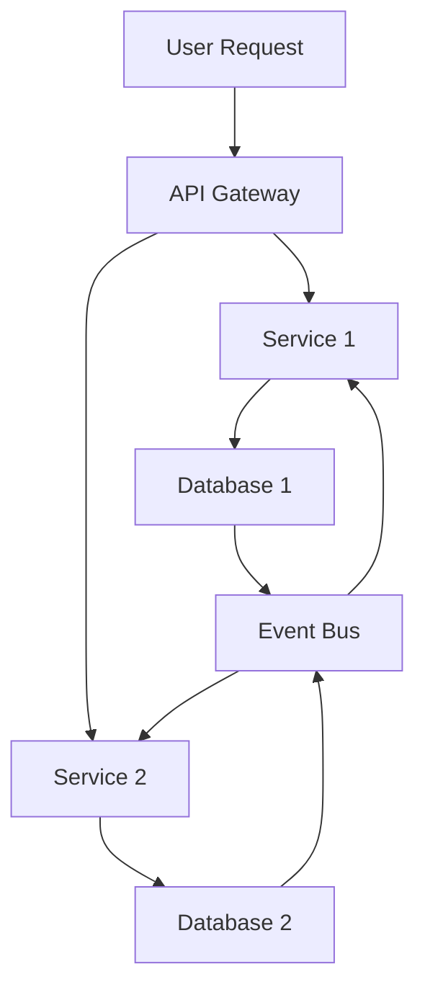

## 14.15. Data Management in Microservices

In the world of microservices, data management is a critical aspect that can significantly impact the scalability, reliability, and performance of your applications. Unlike monolithic architectures, where a single database often serves the entire application, microservices advocate for decentralized data management. This approach aligns with the core principles of microservices, promoting autonomy, scalability, and resilience.

### Decentralized Data Management

Decentralized data management involves each microservice owning its database. This pattern, often referred to as "Database per Service," ensures that each service can evolve independently without being tightly coupled to a shared database schema. Let's explore the advantages of this approach:

#### Advantages of Decentralized Data Management

1. **Autonomy and Independence**: Each microservice can choose the database technology that best suits its needs, whether it's a relational database, NoSQL store, or an in-memory database. This flexibility allows teams to optimize for performance, scalability, and specific use cases.

2. **Scalability**: By decoupling services and their databases, you can scale each service independently. This is particularly beneficial for services with varying load patterns, allowing you to allocate resources where they are most needed.

3. **Resilience and Fault Isolation**: If one service's database experiences issues, it doesn't directly impact other services. This isolation enhances the overall resilience of the system.

4. **Simplified Deployment**: With each service managing its data, deployments become more straightforward. Changes to one service's database schema don't necessitate coordination with other teams, reducing the risk of deployment failures.

### Synchronizing Data Between Services

While decentralized data management offers numerous benefits, it also introduces challenges, particularly around data consistency and synchronization. In a distributed system, ensuring that data remains consistent across services is crucial. Here are some strategies to address these challenges:

#### Strategies for Data Synchronization

1. **Event-Driven Architecture**: Utilize event-driven architectures to propagate changes across services. When a service updates its data, it emits an event that other services can consume to update their own data stores. This approach promotes eventual consistency and decouples services.

2. **Data Replication**: In scenarios where strong consistency is required, consider replicating data across services. This can be achieved through distributed databases that support multi-master replication or by implementing custom replication logic.

3. **API Composition**: For read-heavy operations that require data from multiple services, consider using an API composition layer. This layer aggregates data from various services, providing a unified response to clients.

4. **CQRS (Command Query Responsibility Segregation)**: Separate the read and write operations into different models. This pattern allows you to optimize each operation independently and maintain consistency through event sourcing.

### Handling Read/Write Operations in Distributed Databases

Distributed databases offer powerful capabilities for managing data across microservices, but they also come with complexities. Let's explore how to handle read and write operations effectively:

#### Read Operations

- **Read Replicas**: Use read replicas to distribute the load of read operations. This approach improves performance and availability by allowing multiple instances to serve read requests.

- **Caching**: Implement caching strategies to reduce the load on your databases. Tools like Redis or Memcached can be used to cache frequently accessed data, reducing latency and improving response times.

#### Write Operations

- **Sharding**: Distribute write operations across multiple database instances using sharding. This technique involves partitioning data based on a key, allowing you to scale writes horizontally.

- **Consistency Models**: Choose an appropriate consistency model based on your application's requirements. While strong consistency ensures immediate consistency across replicas, eventual consistency offers higher availability and partition tolerance.

### Considerations for Data Consistency and Integrity

Maintaining data consistency and integrity in a distributed system is challenging but essential. Here are some considerations to keep in mind:

1. **Consistency Models**: Understand the trade-offs between strong consistency, eventual consistency, and causal consistency. Choose a model that aligns with your application's requirements and user expectations.

2. **Data Integrity**: Implement mechanisms to ensure data integrity, such as validation rules, constraints, and transactions. In distributed systems, consider using distributed transactions or compensating transactions to maintain integrity.

3. **Conflict Resolution**: In scenarios where data conflicts arise, implement conflict resolution strategies. This could involve using timestamps, versioning, or custom logic to determine the correct state.

### Data Streaming and Event-Driven Architectures

Data streaming and event-driven architectures play a crucial role in managing data across microservices. They enable real-time data processing and synchronization, providing a foundation for building responsive and scalable systems.

#### Event-Driven Architecture

- **Event Sourcing**: Store the state of your application as a sequence of events. This approach allows you to reconstruct the current state by replaying events, providing a reliable audit trail and enabling time travel debugging.

- **Message Brokers**: Use message brokers like Kafka or RabbitMQ to facilitate communication between services. These tools provide reliable message delivery, ensuring that events are processed in the correct order.

#### Data Streaming

- **Real-Time Processing**: Implement real-time data processing pipelines using tools like Apache Flink or Apache Kafka Streams. These tools allow you to process and analyze data as it flows through your system, enabling real-time insights and actions.

- **Stream Processing Frameworks**: Leverage stream processing frameworks to handle large volumes of data efficiently. These frameworks provide built-in support for windowing, aggregation, and stateful processing.

### Rust's Unique Features for Data Management

Rust offers several unique features that make it well-suited for managing data in microservices:

1. **Memory Safety**: Rust's ownership model ensures memory safety without a garbage collector, reducing the risk of memory leaks and data corruption.

2. **Concurrency**: Rust's concurrency model, based on ownership and borrowing, allows you to write safe and efficient concurrent code. This is particularly beneficial for handling data synchronization and processing in distributed systems.

3. **Performance**: Rust's performance characteristics make it ideal for building high-performance data processing pipelines and handling large volumes of data.

4. **Type Safety**: Rust's strong type system helps catch errors at compile time, reducing the likelihood of runtime errors and improving the reliability of your data management logic.

### Design Considerations and Best Practices

When designing data management strategies for microservices, consider the following best practices:

1. **Decouple Services**: Ensure that services are loosely coupled and communicate through well-defined interfaces. This promotes flexibility and scalability.

2. **Embrace Asynchronous Communication**: Use asynchronous communication patterns, such as event-driven architectures, to decouple services and improve responsiveness.

3. **Optimize for Scalability**: Design your data management strategies to scale horizontally. This involves using distributed databases, sharding, and caching to handle increased load.

4. **Monitor and Analyze**: Implement monitoring and analytics tools to gain insights into your data management processes. This helps identify bottlenecks and optimize performance.

5. **Ensure Security and Compliance**: Protect sensitive data by implementing encryption, access controls, and compliance measures. This is crucial for maintaining trust and meeting regulatory requirements.

### Visualizing Data Management in Microservices

To better understand the flow of data in a microservices architecture, let's visualize a typical data management scenario using a Mermaid.js diagram:



**Diagram Description**: This diagram illustrates a typical data flow in a microservices architecture. User requests are routed through an API Gateway, which directs them to the appropriate services. Each service manages its own database, and changes are propagated through an Event Bus, ensuring data synchronization across services.

### Try It Yourself

To deepen your understanding of data management in microservices, try modifying the following code example to implement an event-driven architecture using Rust:

```rust
use std::sync::mpsc;
use std::thread;

// Define an event
struct Event {
    data: String,
}

fn main() {
    // Create a channel for communication
    let (tx, rx) = mpsc::channel();

    // Spawn a thread to simulate a service emitting an event
    let tx_clone = tx.clone();
    thread::spawn(move || {
        let event = Event {
            data: String::from("Data updated"),
        };
        tx_clone.send(event).unwrap();
    });

    // Simulate another service receiving the event
    let received_event = rx.recv().unwrap();
    println!("Received event: {}", received_event.data);
}
```

**Code Explanation**: This Rust code demonstrates a simple event-driven architecture using channels for communication between threads. Try modifying the code to add more services or implement additional event types.

### Knowledge Check

Before moving on, let's review some key concepts:

- What are the advantages of decentralized data management in microservices?
- How can you ensure data consistency across services in a distributed system?
- What role do event-driven architectures play in data management?
- How does Rust's ownership model benefit data management in microservices?

### Embrace the Journey

Remember, mastering data management in microservices is an ongoing journey. As you continue to explore and experiment, you'll gain deeper insights into building scalable, resilient, and efficient systems. Keep pushing the boundaries, stay curious, and enjoy the process!

## Quiz Time!



### What is a key advantage of decentralized data management in microservices?

- [x] Autonomy and independence for each service
- [ ] Centralized control over data
- [ ] Easier to implement than monolithic databases
- [ ] Requires fewer resources

> **Explanation:** Decentralized data management allows each service to operate independently, choosing the best database technology for its needs.

### Which strategy helps ensure data consistency across microservices?

- [x] Event-Driven Architecture
- [ ] Centralized Database
- [ ] Manual Data Synchronization
- [ ] Ignoring Consistency

> **Explanation:** Event-driven architecture helps propagate changes across services, promoting eventual consistency.

### What is a common technique for handling read operations in distributed databases?

- [x] Read Replicas
- [ ] Write Sharding
- [ ] Manual Data Aggregation
- [ ] Ignoring Read Operations

> **Explanation:** Read replicas distribute the load of read operations, improving performance and availability.

### What is the role of message brokers in event-driven architectures?

- [x] Facilitate communication between services
- [ ] Store data permanently
- [ ] Replace databases
- [ ] Ignore message order

> **Explanation:** Message brokers like Kafka or RabbitMQ ensure reliable message delivery and facilitate communication between services.

### How does Rust's ownership model benefit data management?

- [x] Ensures memory safety without a garbage collector
- [ ] Increases memory usage
- [ ] Requires manual memory management
- [ ] Reduces performance

> **Explanation:** Rust's ownership model provides memory safety, reducing the risk of memory leaks and data corruption.

### What is a key consideration for maintaining data integrity in distributed systems?

- [x] Implementing validation rules and constraints
- [ ] Ignoring data conflicts
- [ ] Using a single database for all services
- [ ] Avoiding transactions

> **Explanation:** Validation rules and constraints help ensure data integrity, even in distributed systems.

### Which pattern separates read and write operations into different models?

- [x] CQRS (Command Query Responsibility Segregation)
- [ ] Event Sourcing
- [ ] API Composition
- [ ] Data Replication

> **Explanation:** CQRS separates read and write operations, allowing for independent optimization and consistency maintenance.

### What is a benefit of using stream processing frameworks?

- [x] Efficiently handle large volumes of data
- [ ] Reduce data accuracy
- [ ] Increase latency
- [ ] Simplify database schemas

> **Explanation:** Stream processing frameworks efficiently process large data volumes, enabling real-time insights and actions.

### What is a common use case for data streaming in microservices?

- [x] Real-time data processing
- [ ] Batch processing only
- [ ] Ignoring data updates
- [ ] Manual data entry

> **Explanation:** Data streaming enables real-time data processing, providing timely insights and actions.

### True or False: Rust's concurrency model is based on ownership and borrowing.

- [x] True
- [ ] False

> **Explanation:** Rust's concurrency model leverages ownership and borrowing to ensure safe and efficient concurrent code.


