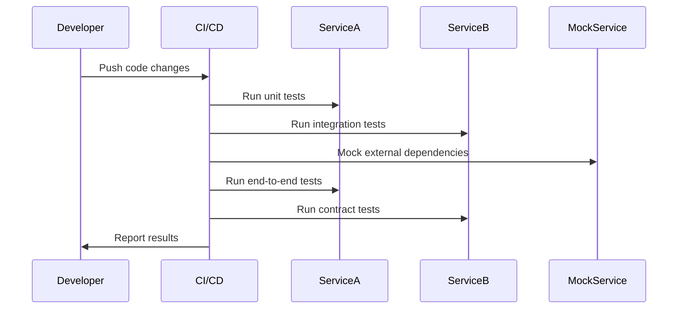

## 14.16. Testing Strategies for Microservices

In the world of microservices, where applications are composed of numerous independent services, testing becomes a critical component of the development process. Each service must be reliable, and the interactions between services must be seamless. In this section, we will explore various testing strategies for Rust microservices, including unit tests, integration tests, end-to-end tests, and more. We'll also delve into the tools and techniques that can help ensure your microservices are robust and reliable.

### Importance of Comprehensive Testing in Microservices

Microservices architecture offers numerous benefits, such as scalability, flexibility, and ease of deployment. However, it also introduces complexity in testing due to the distributed nature of services. Comprehensive testing is crucial to:

- **Ensure Service Reliability**: Each microservice must function correctly on its own.
- **Verify Inter-Service Communication**: Services must interact seamlessly with each other.
- **Maintain API Compatibility**: Changes in one service should not break others.
- **Facilitate Continuous Deployment**: Automated tests enable rapid and safe deployments.

### Setting Up Testing Environments for Microservices

Testing microservices requires an environment that can simulate the interactions between multiple services. This involves:

- **Service Virtualization**: Use tools to simulate the behavior of dependent services.
- **Containerization**: Leverage Docker to create isolated environments for each service.
- **Orchestration**: Use Kubernetes or Docker Compose to manage service interactions.

#### Example: Setting Up a Dockerized Testing Environment

```dockerfile
# Dockerfile for a Rust microservice
FROM rust:latest

WORKDIR /usr/src/app
COPY . .

RUN cargo build --release

CMD ["./target/release/my_microservice"]
```

```yaml
# docker-compose.yml for orchestrating multiple services
version: '3'
services:
  service_a:
    build: ./service_a
    ports:
      - "8080:8080"
  service_b:
    build: ./service_b
    ports:
      - "8081:8081"
```

### Unit Testing in Rust Microservices

Unit tests focus on individual components or functions within a service. They are fast and provide immediate feedback.

#### Example: Unit Testing with `cargo test`

```rust
#[cfg(test)]
mod tests {
    use super::*;

    #[test]
    fn test_addition() {
        assert_eq!(add(2, 3), 5);
    }
}
```

### Integration Testing for Microservices

Integration tests verify the interactions between components within a service or between multiple services.

#### Example: Integration Testing with `cargo test`

```rust
#[cfg(test)]
mod integration_tests {
    use super::*;

    #[test]
    fn test_service_interaction() {
        let response = call_service_b();
        assert_eq!(response.status(), 200);
    }
}
```

### End-to-End Testing

End-to-end (E2E) tests simulate real-world scenarios by testing the entire application flow. These tests are crucial for verifying that all services work together as expected.

#### Example: E2E Testing with `cucumber-rust`

```rust
// features/my_feature.feature
Feature: User login

  Scenario: Successful login
    Given the user "Alice" exists
    When the user logs in with username "Alice" and password "password"
    Then the login should be successful
```

```rust
// tests/e2e.rs
#[tokio::test]
async fn test_user_login() {
    let client = reqwest::Client::new();
    let res = client.post("http://localhost:8080/login")
        .json(&json!({"username": "Alice", "password": "password"}))
        .send()
        .await
        .unwrap();

    assert_eq!(res.status(), 200);
}
```

### Contract Testing and API Compatibility

Contract testing ensures that services adhere to agreed-upon interfaces, preventing breaking changes.

#### Example: Using `pact-rust` for Contract Testing

```rust
use pact_consumer::prelude::*;

#[tokio::test]
async fn test_consumer_service() {
    let pact = PactBuilder::new("Consumer", "Provider")
        .interaction("a request for user data", |i| {
            i.given("user exists");
            i.request.path("/user/1");
            i.response.status(200);
        })
        .start_mock_server();

    let client = reqwest::Client::new();
    let res = client.get(pact.path("/user/1"))
        .send()
        .await
        .unwrap();

    assert_eq!(res.status(), 200);
}
```

### Mocking and Stubbing External Dependencies

Mocking and stubbing are essential for isolating tests from external dependencies.

#### Example: Mocking with `mockito`

```rust
#[cfg(test)]
mod tests {
    use mockito::mock;

    #[tokio::test]
    async fn test_external_service_call() {
        let _m = mock("GET", "/external")
            .with_status(200)
            .with_body("response")
            .create();

        let client = reqwest::Client::new();
        let res = client.get(&mockito::server_url())
            .send()
            .await
            .unwrap();

        assert_eq!(res.text().await.unwrap(), "response");
    }
}
```

### Continuous Testing in CI/CD Pipelines

Continuous testing is integral to CI/CD pipelines, ensuring that code changes do not introduce regressions.

#### Example: GitHub Actions for Continuous Testing

```yaml
name: Rust CI

on: [push, pull_request]

jobs:
  build:
    runs-on: ubuntu-latest

    steps:
    - uses: actions/checkout@v2
    - name: Set up Rust
      uses: actions-rs/toolchain@v1
      with:
        toolchain: stable
    - name: Build
      run: cargo build --release
    - name: Run tests
      run: cargo test
```

### Visualizing Testing Strategies

To better understand the testing strategies for microservices, let's visualize the flow of testing processes using a sequence diagram.



### Key Takeaways

- **Comprehensive testing** is essential for ensuring the reliability and compatibility of microservices.
- **Unit tests** provide fast feedback on individual components.
- **Integration tests** verify interactions within and between services.
- **End-to-end tests** simulate real-world scenarios to ensure all services work together.
- **Contract testing** prevents breaking changes by verifying service interfaces.
- **Mocking and stubbing** isolate tests from external dependencies.
- **Continuous testing** in CI/CD pipelines ensures code quality and facilitates rapid deployment.

### Embrace the Journey

Testing microservices in Rust can be challenging, but with the right strategies and tools, you can ensure your services are robust and reliable. Remember, this is just the beginning. As you progress, you'll build more complex and resilient systems. Keep experimenting, stay curious, and enjoy the journey!

## Quiz Time!



### What is the primary purpose of unit testing in microservices?

- [x] To test individual components or functions
- [ ] To test the interaction between multiple services
- [ ] To simulate real-world scenarios
- [ ] To verify service interfaces

> **Explanation:** Unit testing focuses on testing individual components or functions within a service.

### Which tool is commonly used for mocking external dependencies in Rust?

- [ ] Pact
- [x] Mockito
- [ ] Cucumber
- [ ] Jenkins

> **Explanation:** Mockito is a popular tool for mocking external dependencies in Rust.

### What is the role of contract testing in microservices?

- [ ] To test individual components
- [ ] To simulate real-world scenarios
- [x] To verify service interfaces and prevent breaking changes
- [ ] To isolate tests from external dependencies

> **Explanation:** Contract testing ensures that services adhere to agreed-upon interfaces, preventing breaking changes.

### Which testing strategy simulates real-world scenarios by testing the entire application flow?

- [ ] Unit Testing
- [ ] Integration Testing
- [x] End-to-End Testing
- [ ] Contract Testing

> **Explanation:** End-to-end testing simulates real-world scenarios by testing the entire application flow.

### What is the benefit of using Docker for testing microservices?

- [x] It creates isolated environments for each service
- [ ] It speeds up the development process
- [ ] It simplifies code deployment
- [ ] It enhances code readability

> **Explanation:** Docker creates isolated environments for each service, making it easier to test microservices.

### Which tool is used for continuous testing in CI/CD pipelines?

- [ ] Mockito
- [ ] Pact
- [x] GitHub Actions
- [ ] Cucumber

> **Explanation:** GitHub Actions is a tool used for continuous testing in CI/CD pipelines.

### What is the main focus of integration testing in microservices?

- [ ] Testing individual components
- [x] Verifying interactions within and between services
- [ ] Simulating real-world scenarios
- [ ] Preventing breaking changes

> **Explanation:** Integration testing focuses on verifying interactions within and between services.

### What does service virtualization help achieve in microservices testing?

- [ ] It speeds up the testing process
- [x] It simulates the behavior of dependent services
- [ ] It enhances code readability
- [ ] It simplifies code deployment

> **Explanation:** Service virtualization simulates the behavior of dependent services, making it easier to test microservices.

### Which of the following is NOT a benefit of comprehensive testing in microservices?

- [ ] Ensuring service reliability
- [ ] Verifying inter-service communication
- [ ] Maintaining API compatibility
- [x] Increasing code complexity

> **Explanation:** Comprehensive testing aims to reduce, not increase, code complexity by ensuring reliability and compatibility.

### True or False: End-to-end testing is faster than unit testing.

- [ ] True
- [x] False

> **Explanation:** End-to-end testing is generally slower than unit testing because it involves testing the entire application flow.


