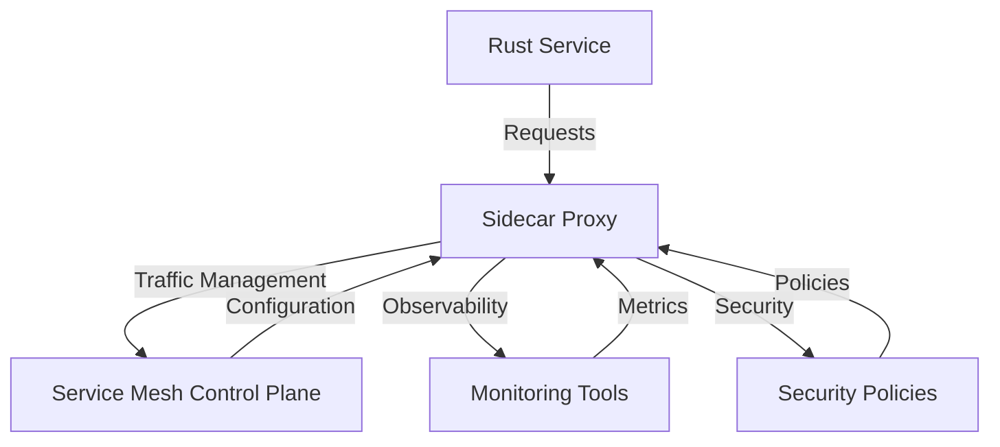

## 14.17. Sidecar Pattern and Service Mesh Integration

In the world of microservices, managing communication, security, and observability can become complex as the number of services grows. The Sidecar pattern and service mesh integration offer solutions to these challenges, providing a robust framework for managing microservices. In this section, we will explore the Sidecar pattern, its benefits, and how service meshes like Istio and Linkerd enhance Rust microservices' networking capabilities.

### Understanding the Sidecar Pattern

The Sidecar pattern is a design pattern commonly used in microservices architecture. It involves deploying a helper service, known as a sidecar, alongside a primary service. This sidecar runs in a separate process or container but shares the same lifecycle as the primary service. The sidecar can handle tasks such as logging, monitoring, configuration, and network communication, allowing the primary service to focus on its core functionality.

#### Benefits of the Sidecar Pattern

1. **Separation of Concerns**: By offloading non-core functionalities to the sidecar, the primary service remains lightweight and focused on its main tasks.
2. **Reusability**: Sidecars can be reused across different services, reducing duplication and promoting consistency.
3. **Scalability**: As the sidecar handles cross-cutting concerns, scaling the primary service becomes simpler and more efficient.
4. **Flexibility**: Sidecars can be updated or replaced independently of the primary service, allowing for greater flexibility in managing service dependencies.

### Service Meshes: Enhancing Microservices Networking

A service mesh is a dedicated infrastructure layer that manages service-to-service communication within a microservices architecture. It provides features like traffic management, observability, and security, which are crucial for maintaining a robust microservices ecosystem.

#### Key Features of Service Meshes

1. **Traffic Management**: Service meshes offer advanced routing capabilities, load balancing, and traffic splitting, enabling fine-grained control over service communication.
2. **Observability**: With built-in telemetry, service meshes provide insights into service performance, latency, and errors, facilitating monitoring and debugging.
3. **Security**: Service meshes enhance security through mutual TLS (mTLS), authentication, and authorization, ensuring secure communication between services.

### Integrating Rust Microservices with Service Meshes

Rust, known for its performance and safety, is an excellent choice for building microservices. Integrating Rust services with a service mesh involves deploying sidecars that handle networking tasks, allowing Rust services to focus on business logic.

#### Deploying Rust Services with Sidecars

To deploy Rust services with sidecars, follow these steps:

1. **Containerize Your Rust Service**: Use Docker to containerize your Rust application. This ensures consistency across different environments.

   ```dockerfile
   FROM rust:latest
   WORKDIR /app
   COPY . .
   RUN cargo build --release
   CMD ["./target/release/your_rust_service"]
   ```

2. **Configure the Sidecar**: Choose a service mesh like Istio or Linkerd and configure the sidecar to handle networking tasks. This typically involves defining policies for traffic management, security, and observability.

3. **Deploy to a Kubernetes Cluster**: Use Kubernetes to deploy your Rust service and its sidecar. The service mesh will automatically inject the sidecar into your service's pod.

   ```yaml
   apiVersion: apps/v1
   kind: Deployment
   metadata:
     name: rust-service
   spec:
     replicas: 3
     template:
       metadata:
         labels:
           app: rust-service
       spec:
         containers:
         - name: rust-service
           image: your_rust_service_image
   ```

#### Example: Using Istio with Rust

Istio is a popular service mesh that provides a comprehensive set of features for managing microservices. Here's how you can integrate a Rust service with Istio:

1. **Install Istio**: Follow the [Istio installation guide](https://istio.io/latest/docs/setup/install/) to set up Istio on your Kubernetes cluster.

2. **Deploy Your Rust Service**: Use the deployment configuration shown above to deploy your Rust service.

3. **Enable Istio Injection**: Annotate your namespace to enable automatic sidecar injection.

   ```bash
   kubectl label namespace your-namespace istio-injection=enabled
   ```

4. **Define Traffic Management Policies**: Use Istio's VirtualService and DestinationRule to manage traffic routing and load balancing.

   ```yaml
   apiVersion: networking.istio.io/v1alpha3
   kind: VirtualService
   metadata:
     name: rust-service
   spec:
     hosts:
     - rust-service
     http:
     - route:
       - destination:
           host: rust-service
           subset: v1
   ```

### Considerations for Integrating with Existing Services

When integrating Rust microservices with a service mesh, consider the following:

1. **Compatibility**: Ensure that your existing services are compatible with the service mesh. This may involve updating service configurations or dependencies.
2. **Performance Overhead**: While service meshes provide valuable features, they can introduce latency. Monitor performance and optimize configurations as needed.
3. **Security Policies**: Define clear security policies to protect sensitive data and prevent unauthorized access.
4. **Observability**: Leverage the observability features of the service mesh to gain insights into service performance and troubleshoot issues effectively.

### Visualizing the Sidecar Pattern and Service Mesh Integration

To better understand the Sidecar pattern and service mesh integration, let's visualize the architecture using a Mermaid.js diagram.



**Diagram Description**: This diagram illustrates the interaction between a Rust service, its sidecar proxy, and the service mesh control plane. The sidecar proxy handles requests, traffic management, observability, and security, while the control plane provides configuration and policy updates.

### Try It Yourself

Experiment with the Sidecar pattern and service mesh integration by modifying the code examples provided. Try deploying different Rust services and observe how the service mesh manages communication and security. Explore the configuration options available in Istio or Linkerd to customize traffic management and observability.

### External Resources

- [Istio Documentation](https://istio.io/latest/docs/)
- [Linkerd Documentation](https://linkerd.io/2.10/getting-started/)
- [Kubernetes Documentation](https://kubernetes.io/docs/home/)

### Key Takeaways

- The Sidecar pattern separates cross-cutting concerns from the primary service, enhancing modularity and scalability.
- Service meshes like Istio and Linkerd provide advanced networking capabilities, including traffic management, observability, and security.
- Integrating Rust microservices with a service mesh involves deploying sidecars and configuring policies for effective service management.
- Consider compatibility, performance, security, and observability when integrating with existing services.

Remember, this is just the beginning. As you progress, you'll build more complex and robust microservices architectures. Keep experimenting, stay curious, and enjoy the journey!

## Quiz Time!



### What is the primary purpose of the Sidecar pattern in microservices?

- [x] To separate cross-cutting concerns from the primary service
- [ ] To increase the complexity of the service architecture
- [ ] To replace the primary service with a helper service
- [ ] To reduce the number of services in the architecture

> **Explanation:** The Sidecar pattern is used to separate cross-cutting concerns, such as logging and monitoring, from the primary service, allowing it to focus on its core functionality.

### Which of the following is a key feature of service meshes?

- [x] Traffic management
- [ ] Data storage
- [ ] User authentication
- [ ] File compression

> **Explanation:** Service meshes provide traffic management, observability, and security features to manage service-to-service communication in microservices architectures.

### How does a sidecar communicate with the primary service?

- [x] Through inter-process communication or shared networking
- [ ] By replacing the primary service
- [ ] By running in the same process as the primary service
- [ ] Through a separate database

> **Explanation:** A sidecar communicates with the primary service through inter-process communication or shared networking, running in a separate process or container.

### What is a common tool used for deploying Rust services with sidecars?

- [x] Kubernetes
- [ ] Docker Compose
- [ ] Apache Kafka
- [ ] Redis

> **Explanation:** Kubernetes is commonly used to deploy Rust services with sidecars, providing orchestration and management capabilities.

### Which service mesh is known for its comprehensive set of features for managing microservices?

- [x] Istio
- [ ] Docker Swarm
- [ ] Apache Mesos
- [ ] Jenkins

> **Explanation:** Istio is a popular service mesh known for its comprehensive features, including traffic management, observability, and security.

### What is the role of the service mesh control plane?

- [x] To provide configuration and policy updates to sidecars
- [ ] To store application data
- [ ] To execute business logic
- [ ] To manage user sessions

> **Explanation:** The service mesh control plane provides configuration and policy updates to sidecars, managing service-to-service communication.

### What is a potential drawback of using service meshes?

- [x] Performance overhead
- [ ] Reduced security
- [ ] Increased data storage requirements
- [ ] Limited scalability

> **Explanation:** Service meshes can introduce performance overhead due to the additional processing required for traffic management and security.

### How can you enable Istio injection for a Kubernetes namespace?

- [x] By labeling the namespace with `istio-injection=enabled`
- [ ] By installing a separate Istio plugin
- [ ] By modifying the Kubernetes API server
- [ ] By creating a new Kubernetes cluster

> **Explanation:** Istio injection can be enabled by labeling the Kubernetes namespace with `istio-injection=enabled`, allowing automatic sidecar injection.

### Which feature of service meshes enhances security between services?

- [x] Mutual TLS (mTLS)
- [ ] Data encryption
- [ ] Load balancing
- [ ] File compression

> **Explanation:** Mutual TLS (mTLS) enhances security by ensuring secure communication between services through encryption and authentication.

### True or False: The Sidecar pattern allows for independent updates of the sidecar and primary service.

- [x] True
- [ ] False

> **Explanation:** The Sidecar pattern allows for independent updates of the sidecar and primary service, providing flexibility in managing service dependencies.


