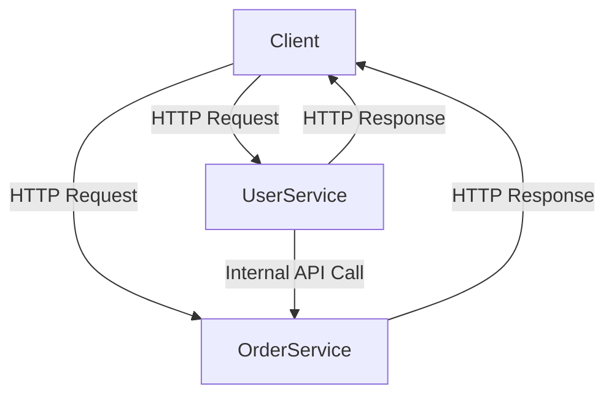

## 14.2. Designing Microservices with Rust

Designing microservices with Rust involves leveraging the language's unique features to build systems that are modular, scalable, and maintainable. In this section, we will explore the principles of microservices design, how to structure Rust projects for microservices, and best practices for handling versioning and backward compatibility. We'll also discuss using Cargo workspaces for managing multi-crate projects.

### Principles of Microservices Design

Microservices architecture is a style of software design where applications are composed of small, independent services that communicate over a network. Each service is designed to perform a specific business function and can be developed, deployed, and scaled independently. Here are some core principles:

#### Bounded Contexts

Bounded contexts are a central concept in Domain-Driven Design (DDD) and are crucial for microservices. Each microservice should have a clearly defined boundary that encapsulates a specific domain or subdomain. This helps in maintaining a clear separation of concerns and reduces the complexity of the system.

#### Decoupling

Decoupling is about minimizing dependencies between services. This allows each service to evolve independently without affecting others. In Rust, decoupling can be achieved through the use of traits and interfaces, which provide a way to define contracts between services without tightly coupling them.

#### Scalability

Microservices should be designed to scale horizontally. This means that you can add more instances of a service to handle increased load. Rust's performance characteristics make it well-suited for building high-performance microservices that can handle large volumes of requests efficiently.

#### Resilience

Microservices should be resilient to failures. This involves implementing patterns such as circuit breakers, retries, and fallbacks to ensure that the system can recover from failures gracefully.

### Structuring Rust Projects for Microservices

When designing microservices in Rust, it's important to structure your projects in a way that promotes modularity and maintainability. Here are some best practices:

#### Using Cargo Workspaces

Cargo workspaces allow you to manage multiple related packages (crates) in a single repository. This is particularly useful for microservices, as it enables you to organize your codebase into separate crates for each service, shared libraries, and common utilities.

```toml
# Cargo.toml at the root of the workspace
[workspace]
members = [
    "service-a",
    "service-b",
    "common-utils",
]
```

Each service can have its own `Cargo.toml` file, specifying its dependencies and configuration. This setup allows you to build and test each service independently while sharing common code through shared crates.

#### Clear Interfaces and APIs

Each microservice should expose a clear and well-defined API. This can be achieved using RESTful APIs, gRPC, or other communication protocols. Rust's strong type system and support for serialization libraries like Serde make it easy to define and enforce API contracts.

```rust
// Example of a RESTful API endpoint in a Rust microservice using Actix-web
use actix_web::{web, App, HttpServer, Responder};

async fn get_user() -> impl Responder {
    web::Json(User {
        id: 1,
        name: "Alice".to_string(),
    })
}

#[actix_web::main]
async fn main() -> std::io::Result<()> {
    HttpServer::new(|| {
        App::new()
            .route("/user", web::get().to(get_user))
    })
    .bind("127.0.0.1:8080")?
    .run()
    .await
}
```

#### Handling Versioning and Backward Compatibility

Versioning is crucial in microservices to ensure that changes to a service do not break existing clients. Here are some strategies for handling versioning:

- **Semantic Versioning**: Use semantic versioning to indicate backward-compatible changes, new features, and breaking changes.
- **API Versioning**: Include version numbers in your API endpoints (e.g., `/v1/user`) to allow clients to specify which version they are using.
- **Deprecation Policies**: Clearly communicate deprecation timelines and provide support for older versions for a reasonable period.

### Example: Setting Up Multiple Services with Clear Interfaces

Let's walk through an example of setting up a simple microservices architecture with Rust. We'll create two services: a `UserService` and an `OrderService`, each with its own API.

#### UserService

The `UserService` will manage user data and provide endpoints for creating and retrieving users.

```rust
// src/main.rs for UserService
use actix_web::{web, App, HttpServer, Responder};

#[derive(Serialize, Deserialize)]
struct User {
    id: u32,
    name: String,
}

async fn create_user(user: web::Json<User>) -> impl Responder {
    // Logic to create a user
    web::Json(user.into_inner())
}

async fn get_user(user_id: web::Path<u32>) -> impl Responder {
    // Logic to retrieve a user by ID
    web::Json(User {
        id: *user_id,
        name: "Alice".to_string(),
    })
}

#[actix_web::main]
async fn main() -> std::io::Result<()> {
    HttpServer::new(|| {
        App::new()
            .route("/user", web::post().to(create_user))
            .route("/user/{id}", web::get().to(get_user))
    })
    .bind("127.0.0.1:8081")?
    .run()
    .await
}
```

#### OrderService

The `OrderService` will manage orders and provide endpoints for creating and retrieving orders.

```rust
// src/main.rs for OrderService
use actix_web::{web, App, HttpServer, Responder};

#[derive(Serialize, Deserialize)]
struct Order {
    id: u32,
    user_id: u32,
    item: String,
}

async fn create_order(order: web::Json<Order>) -> impl Responder {
    // Logic to create an order
    web::Json(order.into_inner())
}

async fn get_order(order_id: web::Path<u32>) -> impl Responder {
    // Logic to retrieve an order by ID
    web::Json(Order {
        id: *order_id,
        user_id: 1,
        item: "Laptop".to_string(),
    })
}

#[actix_web::main]
async fn main() -> std::io::Result<()> {
    HttpServer::new(|| {
        App::new()
            .route("/order", web::post().to(create_order))
            .route("/order/{id}", web::get().to(get_order))
    })
    .bind("127.0.0.1:8082")?
    .run()
    .await
}
```

### Visualizing Microservices Architecture

To better understand the architecture of our microservices, let's visualize the interaction between the `UserService` and `OrderService`.



**Diagram Description**: This diagram illustrates the interaction between the client and the two microservices. The client sends HTTP requests to both `UserService` and `OrderService`, which respond with the requested data. Additionally, `UserService` can make internal API calls to `OrderService` if needed.

### Handling Communication Between Services

In a microservices architecture, services often need to communicate with each other. Here are some common patterns for inter-service communication:

#### Synchronous Communication

Synchronous communication involves direct calls between services, typically using HTTP or gRPC. This approach is straightforward but can lead to tight coupling and increased latency.

#### Asynchronous Communication

Asynchronous communication involves using message brokers (e.g., RabbitMQ, Kafka) to decouple services. This allows services to communicate without waiting for a response, improving resilience and scalability.

### Rust Unique Features for Microservices

Rust offers several unique features that make it well-suited for building microservices:

- **Memory Safety**: Rust's ownership model ensures memory safety without a garbage collector, reducing the risk of memory leaks and crashes.
- **Concurrency**: Rust provides powerful concurrency primitives, such as channels and async/await, for building highly concurrent services.
- **Performance**: Rust's performance characteristics make it ideal for building high-throughput microservices.

### Differences and Similarities with Other Languages

When designing microservices, it's important to understand how Rust compares to other languages:

- **Compared to Java**: Rust offers better performance and memory safety, but lacks the mature ecosystem of libraries and frameworks.
- **Compared to Go**: Rust provides more control over memory and concurrency, but has a steeper learning curve.
- **Compared to Python**: Rust offers significantly better performance and safety, but requires more boilerplate code.

### Design Considerations

When designing microservices with Rust, consider the following:

- **Service Boundaries**: Clearly define the boundaries of each service to avoid overlap and duplication.
- **Data Consistency**: Use eventual consistency and distributed transactions to manage data across services.
- **Security**: Implement authentication and authorization to secure your services.

### Try It Yourself

To get hands-on experience with designing microservices in Rust, try the following exercises:

1. **Modify the UserService**: Add an endpoint for updating user information and implement the logic to handle updates.
2. **Enhance the OrderService**: Implement a feature to list all orders for a specific user, and ensure the endpoint is properly documented.
3. **Experiment with Communication**: Set up a message broker (e.g., RabbitMQ) and modify the services to use asynchronous communication for certain operations.

### Knowledge Check

Before moving on, take a moment to review the key concepts covered in this section:

- What are the principles of microservices design?
- How can you structure Rust projects for microservices using Cargo workspaces?
- What are some strategies for handling versioning and backward compatibility?

### Embrace the Journey

Designing microservices with Rust is an exciting journey that combines the power of Rust with the flexibility of microservices architecture. Remember, this is just the beginning. As you progress, you'll build more complex and scalable systems. Keep experimenting, stay curious, and enjoy the journey!

## Quiz Time!



### What is a key principle of microservices design?

- [x] Bounded contexts
- [ ] Monolithic architecture
- [ ] Tight coupling
- [ ] Centralized data storage

> **Explanation:** Bounded contexts help define clear boundaries for each microservice, reducing complexity and improving maintainability.

### How can you manage multiple related Rust projects in a single repository?

- [x] Using Cargo workspaces
- [ ] Using a single Cargo.toml file
- [ ] Using separate Git repositories
- [ ] Using a monolithic structure

> **Explanation:** Cargo workspaces allow you to manage multiple related crates in a single repository, promoting modularity and maintainability.

### What is a benefit of using asynchronous communication between microservices?

- [x] Improved resilience and scalability
- [ ] Increased latency
- [ ] Tight coupling
- [ ] Synchronous processing

> **Explanation:** Asynchronous communication decouples services, allowing them to communicate without waiting for a response, which improves resilience and scalability.

### Which Rust feature ensures memory safety without a garbage collector?

- [x] Ownership model
- [ ] Garbage collection
- [ ] Manual memory management
- [ ] Reference counting

> **Explanation:** Rust's ownership model ensures memory safety by enforcing strict rules on how memory is accessed and modified.

### What is a common strategy for handling versioning in microservices?

- [x] Semantic versioning
- [ ] Ignoring versioning
- [ ] Using a single version for all services
- [ ] Hardcoding version numbers

> **Explanation:** Semantic versioning helps indicate backward-compatible changes, new features, and breaking changes, making it a common strategy for handling versioning.

### What is a key advantage of using Rust for microservices?

- [x] High performance and memory safety
- [ ] Large standard library
- [ ] Easy syntax
- [ ] Built-in garbage collection

> **Explanation:** Rust offers high performance and memory safety, making it well-suited for building efficient and reliable microservices.

### How can you ensure backward compatibility in microservices?

- [x] By maintaining older versions of APIs
- [ ] By removing deprecated features immediately
- [ ] By ignoring client feedback
- [ ] By using a single API version

> **Explanation:** Maintaining older versions of APIs ensures that existing clients can continue to function without breaking changes.

### What is a common pattern for inter-service communication in microservices?

- [x] Message brokers
- [ ] Direct database access
- [ ] Shared memory
- [ ] Hardcoded IP addresses

> **Explanation:** Message brokers enable asynchronous communication between services, decoupling them and improving scalability.

### What is the purpose of using traits in Rust microservices?

- [x] To define contracts between services
- [ ] To increase code duplication
- [ ] To enforce tight coupling
- [ ] To simplify error handling

> **Explanation:** Traits in Rust allow you to define contracts between services, promoting decoupling and flexibility.

### True or False: Rust's performance characteristics make it ideal for building high-throughput microservices.

- [x] True
- [ ] False

> **Explanation:** Rust's performance characteristics, such as low-level control and memory safety, make it ideal for building high-throughput microservices.


