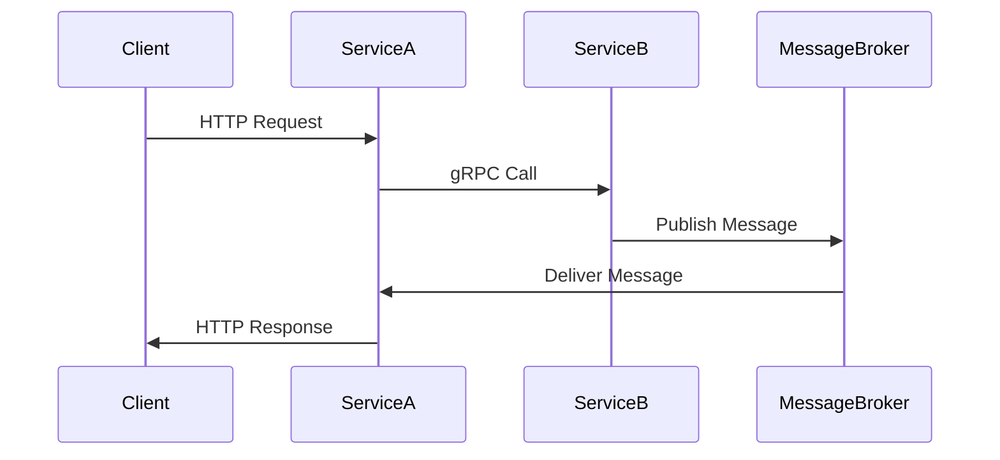

## 14.3. Communication Between Services

In the world of microservices, effective communication between services is crucial for building scalable and reliable systems. Rust, with its focus on safety and performance, offers a variety of tools and patterns to facilitate both synchronous and asynchronous communication. In this section, we will explore different methods for inter-service communication, including RESTful APIs, gRPC, and message queues, and provide practical examples using Rust.

### Synchronous Communication

Synchronous communication involves direct interaction between services, where a request is sent, and a response is expected within a certain timeframe. This is commonly implemented using HTTP-based protocols like REST and gRPC.

#### RESTful APIs

REST (Representational State Transfer) is a widely used architectural style for designing networked applications. It relies on stateless communication and standard HTTP methods such as GET, POST, PUT, and DELETE.

**Implementing an HTTP Client with Reqwest**

The `reqwest` crate is a popular choice for making HTTP requests in Rust. It provides a simple and ergonomic API for building HTTP clients.

```rust
use reqwest::Error;

#[tokio::main]
async fn main() -> Result<(), Error> {
    // Create a client
    let client = reqwest::Client::new();

    // Send a GET request
    let response = client.get("https://api.example.com/data")
        .send()
        .await?;

    // Check the status and read the response body
    if response.status().is_success() {
        let body = response.text().await?;
        println!("Response: {}", body);
    } else {
        println!("Failed to fetch data: {}", response.status());
    }

    Ok(())
}
```

**Implementing an HTTP Server with Actix-Web**

Actix-Web is a powerful framework for building web servers in Rust. It supports asynchronous request handling and is highly performant.

```rust
use actix_web::{web, App, HttpServer, Responder};

async fn greet() -> impl Responder {
    "Hello, world!"
}

#[actix_web::main]
async fn main() -> std::io::Result<()> {
    HttpServer::new(|| {
        App::new()
            .route("/", web::get().to(greet))
    })
    .bind("127.0.0.1:8080")?
    .run()
    .await
}
```

#### gRPC

gRPC is a high-performance, open-source RPC framework that uses HTTP/2 for transport and Protocol Buffers as the interface description language. It is ideal for scenarios where low latency and high throughput are required.

**Using Tonic for gRPC in Rust**

The `tonic` crate provides a comprehensive implementation of gRPC for Rust. It supports both client and server-side development.

**Defining a gRPC Service**

First, define the service using Protocol Buffers:

```proto
syntax = "proto3";

package example;

service Greeter {
    rpc SayHello (HelloRequest) returns (HelloResponse);
}

message HelloRequest {
    string name = 1;
}

message HelloResponse {
    string message = 1;
}
```

**Implementing the gRPC Server**

```rust
use tonic::{transport::Server, Request, Response, Status};
use example::greeter_server::{Greeter, GreeterServer};
use example::{HelloRequest, HelloResponse};

pub mod example {
    tonic::include_proto!("example");
}

#[derive(Default)]
pub struct MyGreeter {}

#[tonic::async_trait]
impl Greeter for MyGreeter {
    async fn say_hello(
        &self,
        request: Request<HelloRequest>,
    ) -> Result<Response<HelloResponse>, Status> {
        let reply = HelloResponse {
            message: format!("Hello, {}!", request.into_inner().name),
        };
        Ok(Response::new(reply))
    }
}

#[tokio::main]
async fn main() -> Result<(), Box<dyn std::error::Error>> {
    let addr = "[::1]:50051".parse()?;
    let greeter = MyGreeter::default();

    Server::builder()
        .add_service(GreeterServer::new(greeter))
        .serve(addr)
        .await?;

    Ok(())
}
```

**Implementing the gRPC Client**

```rust
use tonic::transport::Channel;
use example::greeter_client::GreeterClient;
use example::HelloRequest;

pub mod example {
    tonic::include_proto!("example");
}

#[tokio::main]
async fn main() -> Result<(), Box<dyn std::error::Error>> {
    let mut client = GreeterClient::connect("http://[::1]:50051").await?;

    let request = tonic::Request::new(HelloRequest {
        name: "World".into(),
    });

    let response = client.say_hello(request).await?;

    println!("RESPONSE={:?}", response);

    Ok(())
}
```

### Asynchronous Communication

Asynchronous communication allows services to interact without waiting for an immediate response. This is often achieved using message queues or event-driven architectures.

#### Message Queues

Message queues enable decoupled communication between services by allowing messages to be sent and received asynchronously. Popular message brokers include RabbitMQ and Kafka.

**Using RabbitMQ with the `lapin` Crate**

The `lapin` crate provides an AMQP client for interacting with RabbitMQ.

**Producer Example**

```rust
use lapin::{options::*, types::FieldTable, BasicProperties, Connection, ConnectionProperties};
use tokio_amqp::*;

#[tokio::main]
async fn main() -> Result<(), Box<dyn std::error::Error>> {
    let addr = std::env::var("AMQP_ADDR").unwrap_or_else(|_| "amqp://127.0.0.1:5672/%2f".into());
    let conn = Connection::connect(&addr, ConnectionProperties::default().with_tokio()).await?;

    let channel = conn.create_channel().await?;
    let queue = channel.queue_declare("hello", QueueDeclareOptions::default(), FieldTable::default()).await?;

    let payload = b"Hello, world!";
    channel.basic_publish("", "hello", BasicPublishOptions::default(), payload.to_vec(), BasicProperties::default()).await?;

    println!("Sent: {:?}", payload);

    Ok(())
}
```

**Consumer Example**

```rust
use lapin::{options::*, types::FieldTable, Connection, ConnectionProperties};
use tokio_amqp::*;

#[tokio::main]
async fn main() -> Result<(), Box<dyn std::error::Error>> {
    let addr = std::env::var("AMQP_ADDR").unwrap_or_else(|_| "amqp://127.0.0.1:5672/%2f".into());
    let conn = Connection::connect(&addr, ConnectionProperties::default().with_tokio()).await?;

    let channel = conn.create_channel().await?;
    let queue = channel.queue_declare("hello", QueueDeclareOptions::default(), FieldTable::default()).await?;

    let mut consumer = channel.basic_consume("hello", "my_consumer", BasicConsumeOptions::default(), FieldTable::default()).await?;

    while let Some(delivery) = consumer.next().await {
        let delivery = delivery?;
        println!("Received: {:?}", delivery.data);
        delivery.ack(BasicAckOptions::default()).await?;
    }

    Ok(())
}
```

**Using Kafka with the `rdkafka` Crate**

The `rdkafka` crate provides a client for interacting with Kafka.

**Producer Example**

```rust
use rdkafka::config::ClientConfig;
use rdkafka::producer::{FutureProducer, FutureRecord};

#[tokio::main]
async fn main() -> Result<(), Box<dyn std::error::Error>> {
    let producer: FutureProducer = ClientConfig::new()
        .set("bootstrap.servers", "localhost:9092")
        .create()?;

    let record = FutureRecord::to("test-topic")
        .payload("Hello, Kafka!")
        .key("key");

    producer.send(record, 0).await?;

    println!("Message sent to Kafka");

    Ok(())
}
```

**Consumer Example**

```rust
use rdkafka::config::ClientConfig;
use rdkafka::consumer::{Consumer, StreamConsumer};
use rdkafka::message::Message;
use rdkafka::util::get_rdkafka_version;

#[tokio::main]
async fn main() -> Result<(), Box<dyn std::error::Error>> {
    let consumer: StreamConsumer = ClientConfig::new()
        .set("group.id", "example_group")
        .set("bootstrap.servers", "localhost:9092")
        .create()?;

    consumer.subscribe(&["test-topic"])?;

    while let Some(message) = consumer.recv().await {
        match message {
            Ok(m) => {
                if let Some(payload) = m.payload() {
                    println!("Received: {:?}", String::from_utf8_lossy(payload));
                }
            }
            Err(e) => println!("Error receiving message: {:?}", e),
        }
    }

    Ok(())
}
```

### Considerations for Reliability, Latency, and Scalability

When designing communication between services, it's important to consider factors such as reliability, latency, and scalability. Here are some key considerations:

- **Reliability**: Ensure that messages are delivered reliably, even in the face of network failures. Use message brokers that support acknowledgments and retries.
- **Latency**: Minimize latency by choosing appropriate communication protocols and optimizing network paths. Consider using gRPC for low-latency communication.
- **Scalability**: Design your system to handle increased load by scaling services horizontally. Use load balancers and distributed message brokers to distribute traffic evenly.

### Visualizing Communication Patterns

To better understand the communication patterns in a microservices architecture, let's visualize a typical setup using Mermaid.js.



**Diagram Explanation**: This sequence diagram illustrates a typical communication flow in a microservices architecture. The client sends an HTTP request to Service A, which makes a gRPC call to Service B. Service B publishes a message to a message broker, which then delivers the message back to Service A. Finally, Service A responds to the client.

### Try It Yourself

To deepen your understanding, try modifying the code examples provided. For instance, experiment with different HTTP methods in the RESTful API example, or try adding additional fields to the gRPC service definition. You can also explore other message brokers like NATS or Redis for asynchronous communication.

### Knowledge Check

- What are the main differences between RESTful APIs and gRPC?
- How does asynchronous communication improve scalability in microservices?
- What are some common message brokers used in Rust applications?

### Embrace the Journey

Remember, mastering inter-service communication is a journey. As you continue to build and refine your microservices, you'll gain a deeper understanding of the trade-offs involved in choosing different communication patterns. Keep experimenting, stay curious, and enjoy the process!

## Quiz Time!



### What is a key advantage of using gRPC over RESTful APIs?

- [x] Lower latency and higher throughput
- [ ] Simpler to implement
- [ ] More human-readable
- [ ] Requires less setup

> **Explanation:** gRPC uses HTTP/2 and Protocol Buffers, which provide lower latency and higher throughput compared to RESTful APIs.

### Which Rust crate is commonly used for making HTTP requests?

- [x] Reqwest
- [ ] Tonic
- [ ] Lapin
- [ ] Rdkafka

> **Explanation:** The `reqwest` crate is a popular choice for making HTTP requests in Rust.

### What is the primary purpose of a message broker in microservices?

- [x] To enable asynchronous communication between services
- [ ] To store data persistently
- [ ] To provide a user interface
- [ ] To handle authentication

> **Explanation:** Message brokers facilitate asynchronous communication by allowing services to send and receive messages without waiting for immediate responses.

### Which crate is used for gRPC implementation in Rust?

- [x] Tonic
- [ ] Reqwest
- [ ] Lapin
- [ ] Rdkafka

> **Explanation:** The `tonic` crate provides a comprehensive implementation of gRPC for Rust.

### What is a common use case for asynchronous communication in microservices?

- [x] Event-driven architectures
- [ ] Real-time video streaming
- [ ] Static file hosting
- [ ] Direct database access

> **Explanation:** Asynchronous communication is often used in event-driven architectures to decouple services and improve scalability.

### Which protocol does gRPC use for transport?

- [x] HTTP/2
- [ ] HTTP/1.1
- [ ] WebSockets
- [ ] TCP

> **Explanation:** gRPC uses HTTP/2 for transport, which allows for multiplexed streams and lower latency.

### What is a benefit of using message queues in microservices?

- [x] Decoupling of services
- [ ] Increased complexity
- [ ] Reduced reliability
- [ ] Slower communication

> **Explanation:** Message queues decouple services, allowing them to communicate asynchronously and independently.

### Which crate would you use for interacting with RabbitMQ in Rust?

- [x] Lapin
- [ ] Reqwest
- [ ] Tonic
- [ ] Rdkafka

> **Explanation:** The `lapin` crate provides an AMQP client for interacting with RabbitMQ.

### What is a key consideration when designing inter-service communication?

- [x] Reliability
- [ ] User interface design
- [ ] Database schema
- [ ] File system structure

> **Explanation:** Reliability is crucial to ensure that messages are delivered correctly and consistently between services.

### True or False: gRPC is more human-readable than RESTful APIs.

- [ ] True
- [x] False

> **Explanation:** gRPC uses Protocol Buffers, which are not as human-readable as the JSON format typically used in RESTful APIs.


