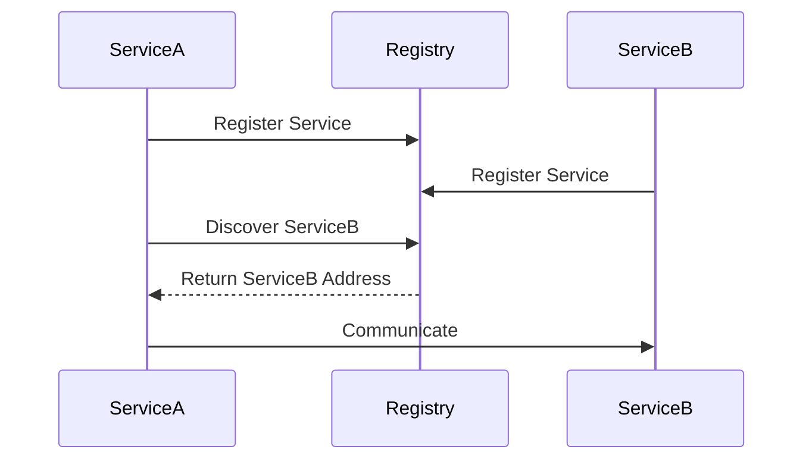

## 14.4. Service Discovery and Registration

In the realm of microservices, where applications are composed of numerous small, independent services, service discovery and registration play a crucial role. These mechanisms allow services to dynamically locate and communicate with each other, ensuring seamless operation and scalability. Let's delve into the need for service discovery, explore various approaches, and examine how Rust can be leveraged to implement these patterns effectively.

### The Need for Service Discovery

In a microservices architecture, services are often distributed across multiple hosts and can scale dynamically. This dynamic nature makes it impractical to use static IP addresses or hostnames for service communication. Service discovery solves this problem by providing a mechanism for services to register themselves and discover other services at runtime.

#### Key Benefits:
- **Scalability**: Automatically adjusts to the addition or removal of service instances.
- **Fault Tolerance**: Enables services to find healthy instances, improving resilience.
- **Flexibility**: Supports dynamic environments where services can be deployed, moved, or scaled without manual reconfiguration.

### Static Configuration vs. Dynamic Discovery

#### Static Configuration

In static configuration, service endpoints are predefined and hardcoded into the application. While simple, this approach lacks flexibility and requires manual updates whenever services change.

**Example:**

```rust
let service_url = "http://service-a.example.com:8080";
```

#### Dynamic Discovery

Dynamic discovery, on the other hand, allows services to register themselves with a central registry and discover other services at runtime. This approach is more flexible and suitable for dynamic environments.

**Example:**

```rust
fn discover_service(service_name: &str) -> Option<String> {
    // Logic to query a service registry and return the service URL
}
```

### Integrating with Service Discovery Tools

Several tools facilitate service discovery and registration, including Consul, etcd, and ZooKeeper. These tools provide APIs for service registration, discovery, and health checking.

#### Consul

Consul is a popular service discovery tool that offers a distributed key-value store, health checking, and a DNS interface.

**Integration Example:**

```rust
use reqwest::Client;
use serde_json::json;

async fn register_service() -> Result<(), reqwest::Error> {
    let client = Client::new();
    let service_definition = json!({
        "Name": "service-a",
        "ID": "service-a-1",
        "Address": "127.0.0.1",
        "Port": 8080,
        "Check": {
            "HTTP": "http://127.0.0.1:8080/health",
            "Interval": "10s"
        }
    });

    client.put("http://localhost:8500/v1/agent/service/register")
        .json(&service_definition)
        .send()
        .await?;

    Ok(())
}
```

#### etcd

etcd is a distributed key-value store used for configuration management and service discovery.

**Integration Example:**

```rust
use etcd_client::{Client, KeyValueOp};

async fn register_service() -> Result<(), Box<dyn std::error::Error>> {
    let mut client = Client::connect(["http://127.0.0.1:2379"], None).await?;
    client.put("services/service-a", "127.0.0.1:8080", None).await?;
    Ok(())
}
```

#### ZooKeeper

ZooKeeper is another tool that provides distributed configuration and synchronization services.

**Integration Example:**

```rust
use zookeeper::{Acl, CreateMode, ZooKeeper};

fn register_service(zk: &ZooKeeper) -> zookeeper::ZkResult<()> {
    zk.create(
        "/services/service-a",
        vec![],
        Acl::open_unsafe().clone(),
        CreateMode::Ephemeral
    )?;
    Ok(())
}
```

### Implementing Health Checks and Service Registration

Health checks are vital to ensure that only healthy service instances are discoverable. Most service discovery tools support health checks, which can be implemented using HTTP endpoints or custom scripts.

**Example of a Health Check Endpoint in Rust:**

```rust
use warp::Filter;

#[tokio::main]
async fn main() {
    let health_route = warp::path("health")
        .map(|| warp::reply::json(&"OK"));

    warp::serve(health_route).run(([127, 0, 0, 1], 8080)).await;
}
```

### DNS-Based Discovery and Load Balancers

DNS-based service discovery uses DNS records to resolve service names to IP addresses. This approach is simple and integrates well with existing DNS infrastructure.

**Example:**

```rust
use trust_dns_resolver::Resolver;

fn resolve_service(service_name: &str) -> Option<String> {
    let resolver = Resolver::default().unwrap();
    let response = resolver.lookup_ip(service_name).unwrap();
    response.iter().next().map(|ip| ip.to_string())
}
```

Load balancers can also be used to distribute traffic among service instances, providing a single entry point for clients.

### Visualizing Service Discovery

To better understand the flow of service discovery and registration, let's visualize the process using a sequence diagram.



### Rust's Unique Features

Rust's strong type system and memory safety features make it an excellent choice for implementing service discovery mechanisms. The language's concurrency model ensures that services can handle multiple requests efficiently without data races.

### Differences and Similarities

Service discovery patterns can be confused with load balancing. While both aim to distribute requests, service discovery focuses on locating services, whereas load balancing distributes requests among instances.

### Best Practices

- **Use Health Checks**: Regularly check the health of services to ensure only healthy instances are discoverable.
- **Leverage DNS**: Use DNS-based discovery for simplicity and integration with existing infrastructure.
- **Automate Registration**: Automate the service registration process to reduce manual errors and ensure consistency.

### Try It Yourself

Experiment with the provided code examples by modifying service names, ports, and health check intervals. Try integrating with different service discovery tools and observe how they handle service registration and discovery.

### References and Links

- [Consul Documentation](https://www.consul.io/docs)
- [etcd Documentation](https://etcd.io/docs)
- [ZooKeeper Documentation](https://zookeeper.apache.org/doc)

### Knowledge Check

- What are the benefits of dynamic service discovery over static configuration?
- How can health checks improve the reliability of service discovery?
- What are some tools that facilitate service discovery and registration?

### Embrace the Journey

Remember, mastering service discovery and registration is a journey. As you experiment with different tools and techniques, you'll gain a deeper understanding of how to build resilient and scalable microservices. Keep exploring, stay curious, and enjoy the process!

## Quiz Time!



### What is the primary benefit of dynamic service discovery?

- [x] It allows services to locate each other at runtime.
- [ ] It reduces the need for DNS.
- [ ] It eliminates the need for load balancers.
- [ ] It simplifies static configuration.

> **Explanation:** Dynamic service discovery enables services to find each other at runtime, which is crucial in dynamic environments.

### Which tool is NOT typically used for service discovery?

- [ ] Consul
- [ ] etcd
- [ ] ZooKeeper
- [x] Redis

> **Explanation:** Redis is primarily used as a data store and cache, not for service discovery.

### How do health checks contribute to service discovery?

- [x] They ensure only healthy services are discoverable.
- [ ] They provide load balancing.
- [ ] They replace DNS-based discovery.
- [ ] They automate service registration.

> **Explanation:** Health checks verify the health of services, ensuring that only healthy instances are registered and discoverable.

### What is a common method for DNS-based service discovery?

- [x] Using DNS records to resolve service names to IP addresses.
- [ ] Using HTTP requests to discover services.
- [ ] Using static IP addresses.
- [ ] Using load balancers to route traffic.

> **Explanation:** DNS-based discovery uses DNS records to map service names to IP addresses, facilitating service location.

### Which of the following is a benefit of using Rust for service discovery?

- [x] Strong type system and memory safety.
- [ ] Built-in service discovery tools.
- [ ] Automatic load balancing.
- [ ] Simplified DNS configuration.

> **Explanation:** Rust's strong type system and memory safety features make it suitable for implementing reliable service discovery mechanisms.

### What is the role of a service registry?

- [x] To store and provide service information for discovery.
- [ ] To balance load among service instances.
- [ ] To replace DNS-based discovery.
- [ ] To automate health checks.

> **Explanation:** A service registry stores information about services and provides it for discovery by other services.

### Which of the following is a key feature of Consul?

- [x] Distributed key-value store and DNS interface.
- [ ] Built-in load balancer.
- [ ] Automatic service scaling.
- [ ] Static configuration management.

> **Explanation:** Consul offers a distributed key-value store and DNS interface for service discovery.

### What is the purpose of service registration?

- [x] To make a service discoverable by others.
- [ ] To balance traffic among services.
- [ ] To replace DNS-based discovery.
- [ ] To automate health checks.

> **Explanation:** Service registration involves making a service known to a registry so that it can be discovered by other services.

### How can load balancers complement service discovery?

- [x] By distributing traffic among service instances.
- [ ] By replacing service registries.
- [ ] By automating service registration.
- [ ] By providing DNS-based discovery.

> **Explanation:** Load balancers distribute traffic among service instances, complementing service discovery by providing a single entry point.

### True or False: Service discovery eliminates the need for DNS.

- [ ] True
- [x] False

> **Explanation:** Service discovery does not eliminate the need for DNS; DNS-based discovery is one method of implementing service discovery.


