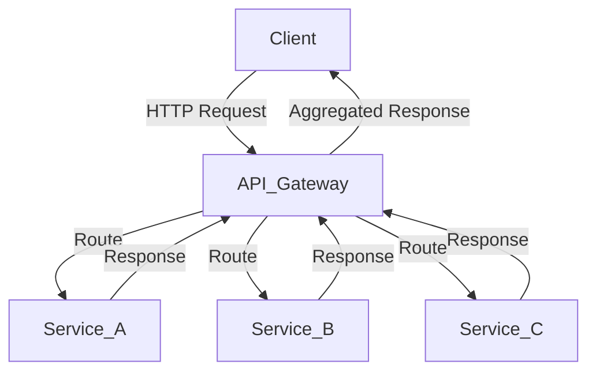

## 14.5. API Gateway Pattern

In the world of microservices, the API Gateway pattern plays a crucial role in managing the complexity of service interactions. It acts as a single entry point for clients, routing requests to the appropriate services, aggregating responses, and handling cross-cutting concerns like security and rate limiting. In this section, we will explore how to implement the API Gateway pattern in Rust, leveraging its powerful features to build efficient and secure gateways.

### Understanding the API Gateway Pattern

The API Gateway pattern is a design pattern used in microservices architectures to provide a unified interface for clients to interact with multiple backend services. It abstracts the complexity of service interactions, offering a simplified and consistent API for clients.

#### Benefits of the API Gateway Pattern

1. **Simplified Client Interaction**: Clients interact with a single endpoint, reducing the complexity of managing multiple service endpoints.
2. **Request Routing**: The gateway routes requests to the appropriate microservices based on the request path, headers, or other criteria.
3. **Response Aggregation**: It can aggregate responses from multiple services into a single response, reducing the number of client-server interactions.
4. **Security**: The gateway can enforce security policies, such as authentication and authorization, at a centralized point.
5. **Rate Limiting and Throttling**: It can implement rate limiting to prevent abuse and ensure fair usage of resources.
6. **Protocol Translation**: The gateway can translate between different protocols, such as HTTP to gRPC, enabling seamless communication between clients and services.

### Implementing an API Gateway in Rust

Rust's strong type system, memory safety, and concurrency model make it an excellent choice for implementing an API Gateway. Let's explore how to build a simple API Gateway in Rust.

#### Setting Up the Project

First, create a new Rust project using Cargo:

```bash
cargo new api_gateway
cd api_gateway
```

Add the necessary dependencies in `Cargo.toml`:

```toml
[dependencies]
actix-web = "4.0"
serde = { version = "1.0", features = ["derive"] }
serde_json = "1.0"
reqwest = "0.11"
tokio = { version = "1", features = ["full"] }
```

#### Building the Gateway

Let's start by setting up a basic HTTP server using Actix-web, a powerful web framework for Rust.

```rust
use actix_web::{web, App, HttpServer, HttpResponse, Responder};
use serde::Deserialize;
use reqwest::Client;

#[derive(Deserialize)]
struct ServiceRequest {
    service_name: String,
    endpoint: String,
}

async fn route_request(req: web::Json<ServiceRequest>) -> impl Responder {
    let client = Client::new();
    let url = format!("http://{}{}", req.service_name, req.endpoint);

    match client.get(&url).send().await {
        Ok(response) => {
            let body = response.text().await.unwrap_or_else(|_| "Error".to_string());
            HttpResponse::Ok().body(body)
        }
        Err(_) => HttpResponse::InternalServerError().body("Service Unavailable"),
    }
}

#[actix_web::main]
async fn main() -> std::io::Result<()> {
    HttpServer::new(|| {
        App::new()
            .route("/api/{service_name}/{endpoint:.*}", web::post().to(route_request))
    })
    .bind("127.0.0.1:8080")?
    .run()
    .await
}
```

In this example, we define a simple API Gateway that routes requests to different services based on the `service_name` and `endpoint` provided in the request. The `route_request` function uses the `reqwest` library to forward the request to the appropriate service and returns the response to the client.

#### Request Aggregation

To aggregate responses from multiple services, we can modify the `route_request` function to handle multiple requests concurrently using Rust's `tokio` runtime.

```rust
use futures::future::join_all;

async fn aggregate_requests(reqs: Vec<ServiceRequest>) -> impl Responder {
    let client = Client::new();
    let futures = reqs.into_iter().map(|req| {
        let url = format!("http://{}{}", req.service_name, req.endpoint);
        client.get(url).send()
    });

    let responses = join_all(futures).await;
    let results: Vec<String> = responses.into_iter().map(|res| {
        res.unwrap_or_else(|_| reqwest::Response::new()).text().await.unwrap_or_else(|_| "Error".to_string())
    }).collect();

    HttpResponse::Ok().json(results)
}
```

Here, we use `join_all` to send multiple requests concurrently and collect their responses. This approach improves performance by reducing the total time spent waiting for responses.

### Security Considerations

Security is a critical aspect of any API Gateway. Let's discuss some key security measures you can implement at the gateway level.

#### Authentication and Authorization

The gateway can enforce authentication and authorization policies to ensure that only authorized clients can access the services. You can use JSON Web Tokens (JWT) for this purpose.

```rust
use actix_web::{web, HttpRequest, HttpResponse, Responder};
use jsonwebtoken::{decode, DecodingKey, Validation, Algorithm};

async fn authenticate(req: HttpRequest) -> impl Responder {
    let token = req.headers().get("Authorization").and_then(|h| h.to_str().ok());

    if let Some(token) = token {
        let validation = Validation::new(Algorithm::HS256);
        let key = DecodingKey::from_secret("secret".as_ref());

        match decode::<Claims>(&token, &key, &validation) {
            Ok(_) => HttpResponse::Ok().body("Authenticated"),
            Err(_) => HttpResponse::Unauthorized().body("Invalid Token"),
        }
    } else {
        HttpResponse::Unauthorized().body("No Token Provided")
    }
}
```

In this example, we use the `jsonwebtoken` crate to decode and validate JWTs. The `authenticate` function checks the `Authorization` header for a valid token and returns an appropriate response.

#### Rate Limiting

Implementing rate limiting helps prevent abuse and ensures fair usage of resources. You can use a simple token bucket algorithm for this purpose.

```rust
use std::collections::HashMap;
use std::sync::Mutex;
use std::time::{Duration, Instant};

struct RateLimiter {
    requests: Mutex<HashMap<String, (u64, Instant)>>,
    max_requests: u64,
    window: Duration,
}

impl RateLimiter {
    fn new(max_requests: u64, window: Duration) -> Self {
        RateLimiter {
            requests: Mutex::new(HashMap::new()),
            max_requests,
            window,
        }
    }

    fn is_allowed(&self, client_id: &str) -> bool {
        let mut requests = self.requests.lock().unwrap();
        let now = Instant::now();
        let entry = requests.entry(client_id.to_string()).or_insert((0, now));

        if now.duration_since(entry.1) > self.window {
            *entry = (0, now);
        }

        if entry.0 < self.max_requests {
            entry.0 += 1;
            true
        } else {
            false
        }
    }
}
```

The `RateLimiter` struct maintains a record of requests per client and checks if a client is allowed to make a request based on the configured rate limit.

### Using Existing API Gateway Solutions

While building an API Gateway from scratch provides flexibility, you can also leverage existing solutions that are compatible with Rust services. Some popular options include:

- **Kong**: An open-source API Gateway that can be configured to route requests to Rust services.
- **Traefik**: A modern HTTP reverse proxy and load balancer that supports Rust services.
- **NGINX**: A widely used web server that can be configured as an API Gateway for Rust applications.

These solutions offer advanced features like load balancing, SSL termination, and monitoring, which can be beneficial for production environments.

### Visualizing the API Gateway Architecture

To better understand the API Gateway pattern, let's visualize the architecture using a Mermaid.js diagram.



**Figure 1**: The API Gateway routes requests from the client to the appropriate services and aggregates responses.

### Key Takeaways

- The API Gateway pattern simplifies client interactions with microservices by providing a single entry point.
- Rust's concurrency model and type safety make it an excellent choice for building efficient and secure API Gateways.
- Implementing security measures like authentication, authorization, and rate limiting at the gateway level is crucial.
- Consider using existing API Gateway solutions for advanced features and production readiness.

### Try It Yourself

Experiment with the provided code examples by modifying the routing logic, adding new services, or implementing additional security features. Explore how different configurations impact the performance and security of your API Gateway.

## Quiz Time!



### What is the primary role of an API Gateway in a microservices architecture?

- [x] To provide a single entry point for clients accessing multiple microservices.
- [ ] To store data for microservices.
- [ ] To compile Rust code.
- [ ] To replace all backend services.

> **Explanation:** An API Gateway acts as a single entry point for clients, managing requests to multiple microservices.

### Which Rust library is used in the example for building the HTTP server?

- [x] Actix-web
- [ ] Rocket
- [ ] Hyper
- [ ] Warp

> **Explanation:** The example uses Actix-web, a powerful web framework for Rust.

### What is the purpose of the `join_all` function in the request aggregation example?

- [x] To send multiple requests concurrently and collect their responses.
- [ ] To serialize data into JSON format.
- [ ] To decode JWT tokens.
- [ ] To limit the number of requests.

> **Explanation:** `join_all` is used to handle multiple asynchronous requests concurrently.

### Which crate is used for handling JSON Web Tokens (JWT) in the authentication example?

- [x] jsonwebtoken
- [ ] serde_json
- [ ] reqwest
- [ ] tokio

> **Explanation:** The `jsonwebtoken` crate is used for decoding and validating JWTs.

### What is a key benefit of using an API Gateway?

- [x] Simplified client interaction with microservices.
- [ ] Increased database storage.
- [ ] Faster compilation times.
- [ ] Reduced code complexity in Rust.

> **Explanation:** An API Gateway simplifies client interactions by providing a unified interface.

### Which of the following is a security feature that can be implemented at the API Gateway level?

- [x] Rate limiting
- [ ] Code compilation
- [ ] Data storage
- [ ] Memory management

> **Explanation:** Rate limiting is a security measure to prevent abuse and ensure fair usage.

### What is the role of the `reqwest` library in the example?

- [x] To send HTTP requests to backend services.
- [ ] To compile Rust code.
- [ ] To manage database connections.
- [ ] To handle file I/O operations.

> **Explanation:** `reqwest` is used to send HTTP requests to backend services.

### Which existing API Gateway solution is mentioned as compatible with Rust services?

- [x] Kong
- [ ] Apache
- [ ] MySQL
- [ ] Redis

> **Explanation:** Kong is an open-source API Gateway that can be configured to route requests to Rust services.

### True or False: An API Gateway can translate between different protocols, such as HTTP to gRPC.

- [x] True
- [ ] False

> **Explanation:** An API Gateway can perform protocol translation, enabling seamless communication between clients and services.

### Which diagramming tool is used to visualize the API Gateway architecture?

- [x] Mermaid.js
- [ ] Graphviz
- [ ] PlantUML
- [ ] Lucidchart

> **Explanation:** Mermaid.js is used to create diagrams in the guide.



Remember, this is just the beginning. As you progress, you'll build more complex and interactive API Gateways. Keep experimenting, stay curious, and enjoy the journey!
