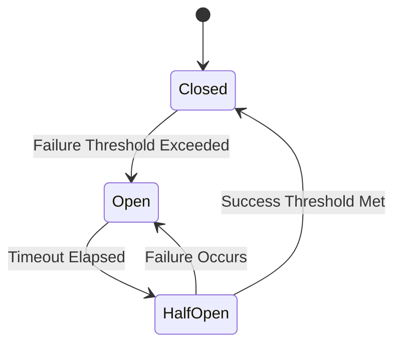

## 14.6. Circuit Breaker Pattern

In the world of microservices, where applications are composed of numerous interconnected services, ensuring system resilience is paramount. The Circuit Breaker pattern is a critical design pattern that helps prevent cascading failures and enhances the robustness of distributed systems. In this section, we will delve into the Circuit Breaker pattern, its importance, and how to implement it in Rust microservices.

### What is the Circuit Breaker Pattern?

The Circuit Breaker pattern is a design pattern used to detect failures and encapsulate the logic of preventing a failure from constantly recurring during maintenance, temporary external system failure, or unexpected system difficulties. It acts as a proxy for operations that might fail, monitoring for failures and automatically opening or closing circuits to control the flow of requests.

#### Importance of the Circuit Breaker Pattern

- **Prevents Cascading Failures**: By stopping the flow of requests to a failing service, the Circuit Breaker pattern prevents failures from propagating through the system.
- **Improves System Resilience**: It allows the system to recover gracefully from failures, maintaining overall system stability.
- **Enhances User Experience**: By providing fallback mechanisms, it ensures that users experience minimal disruption during service outages.

### Implementing Circuit Breaker Logic in Rust

To implement the Circuit Breaker pattern in Rust, we can use a combination of Rust's concurrency features and existing crates like `circuit-breaker`. Let's explore how to create a simple circuit breaker from scratch and then leverage the `circuit-breaker` crate for more advanced features.

#### Basic Circuit Breaker Implementation

Below is a basic implementation of a circuit breaker in Rust:

```rust
use std::sync::{Arc, Mutex};
use std::time::{Duration, Instant};

enum CircuitState {
    Closed,
    Open,
    HalfOpen,
}

struct CircuitBreaker {
    state: CircuitState,
    failure_count: u32,
    success_count: u32,
    last_failure_time: Option<Instant>,
    timeout: Duration,
    threshold: u32,
}

impl CircuitBreaker {
    fn new(timeout: Duration, threshold: u32) -> Self {
        CircuitBreaker {
            state: CircuitState::Closed,
            failure_count: 0,
            success_count: 0,
            last_failure_time: None,
            timeout,
            threshold,
        }
    }

    fn call<F, T>(&mut self, operation: F) -> Result<T, &'static str>
    where
        F: Fn() -> Result<T, &'static str>,
    {
        match self.state {
            CircuitState::Open => {
                if self.last_failure_time.unwrap().elapsed() > self.timeout {
                    self.state = CircuitState::HalfOpen;
                } else {
                    return Err("Circuit is open");
                }
            }
            CircuitState::HalfOpen => {
                if let Ok(result) = operation() {
                    self.success_count += 1;
                    if self.success_count > self.threshold {
                        self.state = CircuitState::Closed;
                        self.success_count = 0;
                    }
                    return Ok(result);
                } else {
                    self.state = CircuitState::Open;
                    self.last_failure_time = Some(Instant::now());
                    return Err("Operation failed");
                }
            }
            CircuitState::Closed => {
                if let Ok(result) = operation() {
                    self.failure_count = 0;
                    return Ok(result);
                } else {
                    self.failure_count += 1;
                    if self.failure_count > self.threshold {
                        self.state = CircuitState::Open;
                        self.last_failure_time = Some(Instant::now());
                    }
                    return Err("Operation failed");
                }
            }
        }
    }
}
```

In this implementation, we define a `CircuitBreaker` struct with states `Closed`, `Open`, and `HalfOpen`. The `call` method executes an operation and manages the circuit state based on the operation's success or failure.

#### Using the `circuit-breaker` Crate

For more robust circuit breaker functionality, we can use the `circuit-breaker` crate. This crate provides a comprehensive implementation of the Circuit Breaker pattern, including features like automatic state transitions and failure tracking.

To use the `circuit-breaker` crate, add it to your `Cargo.toml`:

```toml
[dependencies]
circuit-breaker = "0.1"
```

Here's an example of using the `circuit-breaker` crate:

```rust
use circuit_breaker::{CircuitBreaker, Config, State};
use std::time::Duration;

fn main() {
    let config = Config {
        failure_threshold: 3,
        success_threshold: 2,
        timeout: Duration::from_secs(5),
    };

    let mut breaker = CircuitBreaker::new(config);

    for _ in 0..5 {
        match breaker.call(|| {
            // Simulate an operation that might fail
            Err("Operation failed")
        }) {
            Ok(_) => println!("Operation succeeded"),
            Err(_) => println!("Operation failed"),
        }

        match breaker.state() {
            State::Closed => println!("Circuit is closed"),
            State::Open => println!("Circuit is open"),
            State::HalfOpen => println!("Circuit is half-open"),
        }
    }
}
```

In this example, we configure a circuit breaker with a failure threshold, success threshold, and timeout. The `call` method is used to execute operations, and the circuit state is printed after each call.

### Monitoring Service Health

Monitoring the health of services is crucial for the Circuit Breaker pattern to function effectively. By integrating health checks and monitoring tools, we can automatically open or close circuits based on real-time data.

#### Health Checks

Implement health checks that periodically test the availability and responsiveness of services. Use these checks to update the circuit breaker state.

#### Monitoring Tools

Integrate monitoring tools like Prometheus or Grafana to visualize service health metrics. These tools can provide insights into service performance and help identify potential issues before they escalate.

### Best Practices for Timeout Handling and Fallbacks

- **Timeout Handling**: Set appropriate timeouts for operations to prevent long waits during service failures. Use Rust's `tokio` or `async-std` for asynchronous timeout handling.
- **Fallback Mechanisms**: Implement fallback mechanisms to provide alternative responses when a service is unavailable. This can include returning cached data or default responses.

### Rust Crates for Circuit Breaker Implementation

In addition to the `circuit-breaker` crate, several other Rust crates can facilitate circuit breaker implementation:

- **`tower`**: A library of modular and reusable components for building robust network clients and servers. It includes a circuit breaker middleware.
- **`tokio`**: An asynchronous runtime for Rust that can be used to implement timeouts and retries in circuit breaker logic.

### Design Considerations

- **State Management**: Carefully manage circuit breaker states to ensure accurate transitions between `Closed`, `Open`, and `HalfOpen`.
- **Threshold Configuration**: Set appropriate thresholds for failures and successes based on service characteristics and requirements.
- **Concurrency**: Use Rust's concurrency features to handle multiple requests efficiently and safely.

### Rust Unique Features

Rust's ownership model and concurrency features make it well-suited for implementing the Circuit Breaker pattern. The language's emphasis on safety and performance ensures that circuit breaker logic is both robust and efficient.

### Differences and Similarities

The Circuit Breaker pattern is often compared to the Retry pattern. While both patterns aim to handle failures, the Circuit Breaker pattern is more proactive, preventing requests from reaching a failing service, whereas the Retry pattern attempts to re-execute failed operations.

### Try It Yourself

Experiment with the circuit breaker implementation by modifying the failure and success thresholds. Observe how changes affect the circuit state transitions and system resilience.

### Visualizing the Circuit Breaker Pattern

Below is a diagram illustrating the state transitions of a circuit breaker:



This diagram shows the transitions between `Closed`, `Open`, and `HalfOpen` states based on operation outcomes and timeouts.

### References and Links

- [Circuit Breaker Pattern on Wikipedia](https://en.wikipedia.org/wiki/Circuit_breaker_design_pattern)
- [circuit-breaker crate on crates.io](https://crates.io/crates/circuit-breaker)
- [Rust Programming Language](https://www.rust-lang.org/)

### Knowledge Check

- What is the primary purpose of the Circuit Breaker pattern?
- How does the Circuit Breaker pattern improve system resilience?
- What are the key states of a circuit breaker?
- How can Rust's concurrency features aid in implementing the Circuit Breaker pattern?
- What are some best practices for configuring circuit breaker thresholds?

### Embrace the Journey

Remember, implementing the Circuit Breaker pattern is just one step towards building resilient microservices. As you continue to explore Rust and its capabilities, you'll discover more patterns and techniques to enhance your systems. Keep experimenting, stay curious, and enjoy the journey!

## Quiz Time!



### What is the primary purpose of the Circuit Breaker pattern?

- [x] To prevent cascading failures in a system
- [ ] To improve the speed of a system
- [ ] To reduce the cost of system operations
- [ ] To enhance the user interface design

> **Explanation:** The Circuit Breaker pattern is primarily used to prevent cascading failures in a system by stopping the flow of requests to a failing service.

### Which state does a circuit breaker transition to after a failure threshold is exceeded?

- [ ] Closed
- [x] Open
- [ ] HalfOpen
- [ ] Reset

> **Explanation:** When a failure threshold is exceeded, the circuit breaker transitions from the Closed state to the Open state.

### What is a key benefit of using the Circuit Breaker pattern?

- [x] It improves system resilience by preventing failures from propagating.
- [ ] It increases the complexity of the system.
- [ ] It reduces the need for monitoring tools.
- [ ] It eliminates the need for error handling.

> **Explanation:** The Circuit Breaker pattern improves system resilience by preventing failures from propagating through the system.

### Which Rust crate can be used to implement circuit breaker logic?

- [ ] serde
- [ ] tokio
- [x] circuit-breaker
- [ ] hyper

> **Explanation:** The `circuit-breaker` crate provides a comprehensive implementation of the Circuit Breaker pattern in Rust.

### What is a best practice for handling timeouts in circuit breaker logic?

- [x] Use asynchronous timeout handling with libraries like `tokio`.
- [ ] Ignore timeouts to simplify the code.
- [ ] Set timeouts to a very high value to avoid interruptions.
- [ ] Use synchronous timeout handling for simplicity.

> **Explanation:** Using asynchronous timeout handling with libraries like `tokio` is a best practice for managing timeouts in circuit breaker logic.

### How does the Circuit Breaker pattern differ from the Retry pattern?

- [x] The Circuit Breaker pattern prevents requests from reaching a failing service, while the Retry pattern re-executes failed operations.
- [ ] The Circuit Breaker pattern is used for UI design, while the Retry pattern is for backend logic.
- [ ] The Circuit Breaker pattern is faster than the Retry pattern.
- [ ] The Circuit Breaker pattern is more expensive to implement than the Retry pattern.

> **Explanation:** The Circuit Breaker pattern proactively prevents requests from reaching a failing service, whereas the Retry pattern attempts to re-execute failed operations.

### What is the role of health checks in the Circuit Breaker pattern?

- [x] To periodically test the availability and responsiveness of services.
- [ ] To increase the failure threshold.
- [ ] To decrease the success threshold.
- [ ] To eliminate the need for monitoring tools.

> **Explanation:** Health checks are used to periodically test the availability and responsiveness of services, helping to update the circuit breaker state.

### Which state does a circuit breaker transition to after a timeout elapses?

- [ ] Closed
- [ ] Open
- [x] HalfOpen
- [ ] Reset

> **Explanation:** After a timeout elapses, a circuit breaker transitions from the Open state to the HalfOpen state.

### What is a common fallback mechanism in circuit breaker logic?

- [x] Returning cached data or default responses
- [ ] Ignoring the failure and proceeding
- [ ] Increasing the failure threshold
- [ ] Decreasing the success threshold

> **Explanation:** A common fallback mechanism in circuit breaker logic is to return cached data or default responses when a service is unavailable.

### True or False: The Circuit Breaker pattern can be used to enhance user experience during service outages.

- [x] True
- [ ] False

> **Explanation:** True. By providing fallback mechanisms, the Circuit Breaker pattern ensures that users experience minimal disruption during service outages.


