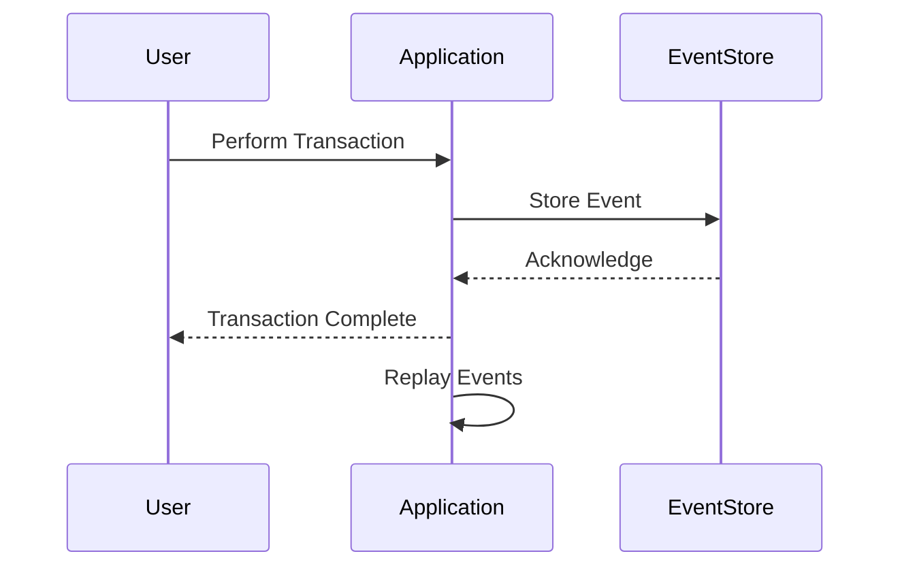

## 14.7. Event Sourcing and CQRS

In the world of microservices, managing data efficiently and effectively is crucial. Two powerful patterns that have emerged to address this challenge are Event Sourcing and Command Query Responsibility Segregation (CQRS). These patterns help in building scalable, maintainable, and robust systems. In this section, we'll explore these patterns in the context of Rust microservices, providing insights into their principles, benefits, challenges, and implementation strategies.

### Understanding Event Sourcing

**Event Sourcing** is a pattern where state changes are captured as a sequence of events. Instead of storing the current state of an entity, we store a log of state-changing events. This approach allows us to reconstruct the state of an entity at any point in time by replaying the events.

#### Key Concepts of Event Sourcing

- **Event Store**: A database that stores events. Each event represents a change in state and is immutable.
- **Event Replay**: The process of reconstructing the current state by replaying all events from the event store.
- **Eventual Consistency**: Since events are processed asynchronously, the system may not be immediately consistent but will eventually reach a consistent state.

#### Benefits of Event Sourcing

- **Auditability**: Every change is recorded as an event, providing a complete audit trail.
- **Reproducibility**: The ability to replay events allows for easy debugging and testing.
- **Scalability**: Events can be processed asynchronously, improving system scalability.

#### Challenges of Event Sourcing

- **Complexity**: Managing an event store and ensuring data consistency can be complex.
- **Storage Requirements**: Storing all events can lead to large data volumes.
- **Event Versioning**: Changes to event structures need careful management.

### Implementing Event Sourcing in Rust

Let's explore how to implement an event store in Rust. We'll use a simple example of a banking application where account transactions are stored as events.

```rust
use chrono::Utc;
use serde::{Serialize, Deserialize};
use uuid::Uuid;

// Define an event type
#[derive(Serialize, Deserialize, Debug)]
enum AccountEvent {
    Deposited { amount: f64 },
    Withdrawn { amount: f64 },
}

// Event struct with metadata
#[derive(Serialize, Deserialize, Debug)]
struct Event {
    id: Uuid,
    timestamp: i64,
    event_type: AccountEvent,
}

// Event store
struct EventStore {
    events: Vec<Event>,
}

impl EventStore {
    fn new() -> Self {
        EventStore { events: Vec::new() }
    }

    fn add_event(&mut self, event: AccountEvent) {
        let new_event = Event {
            id: Uuid::new_v4(),
            timestamp: Utc::now().timestamp(),
            event_type: event,
        };
        self.events.push(new_event);
    }

    fn get_events(&self) -> &Vec<Event> {
        &self.events
    }
}

fn main() {
    let mut store = EventStore::new();
    store.add_event(AccountEvent::Deposited { amount: 100.0 });
    store.add_event(AccountEvent::Withdrawn { amount: 50.0 });

    for event in store.get_events() {
        println!("{:?}", event);
    }
}
```

In this example, we define an `AccountEvent` enum to represent different types of account transactions. The `EventStore` struct manages a list of events, allowing us to add and retrieve events.

### Visualizing Event Sourcing

To better understand the flow of event sourcing, let's visualize the process using a sequence diagram.



This diagram illustrates how a user action results in an event being stored, and how the application can replay events to reconstruct the current state.

### Understanding CQRS

**Command Query Responsibility Segregation (CQRS)** is a pattern that separates the read and write operations of a system. In CQRS, commands are responsible for changing the state, while queries are responsible for reading the state.

#### Key Concepts of CQRS

- **Commands**: Operations that change the state of the system.
- **Queries**: Operations that retrieve data without modifying it.
- **Separation of Concerns**: By separating commands and queries, we can optimize each independently.

#### Benefits of CQRS

- **Scalability**: Read and write operations can be scaled independently.
- **Flexibility**: Different models can be used for reading and writing, optimizing performance.
- **Security**: Commands and queries can have different security requirements.

#### Challenges of CQRS

- **Complexity**: Managing separate models for commands and queries can increase complexity.
- **Consistency**: Ensuring consistency between the command and query models requires careful design.

### Implementing CQRS in Rust

Let's implement a simple CQRS pattern in Rust using the same banking application example.

```rust
use std::collections::HashMap;

// Command to deposit money
struct DepositCommand {
    account_id: String,
    amount: f64,
}

// Query to get account balance
struct GetBalanceQuery {
    account_id: String,
}

// Command handler
struct CommandHandler {
    event_store: EventStore,
}

impl CommandHandler {
    fn handle_deposit(&mut self, command: DepositCommand) {
        self.event_store.add_event(AccountEvent::Deposited { amount: command.amount });
    }
}

// Query handler
struct QueryHandler {
    event_store: EventStore,
}

impl QueryHandler {
    fn get_balance(&self, query: GetBalanceQuery) -> f64 {
        let mut balance = 0.0;
        for event in self.event_store.get_events() {
            match &event.event_type {
                AccountEvent::Deposited { amount } => balance += amount,
                AccountEvent::Withdrawn { amount } => balance -= amount,
            }
        }
        balance
    }
}

fn main() {
    let mut event_store = EventStore::new();
    let mut command_handler = CommandHandler { event_store: event_store.clone() };
    let query_handler = QueryHandler { event_store };

    command_handler.handle_deposit(DepositCommand { account_id: "123".to_string(), amount: 100.0 });
    let balance = query_handler.get_balance(GetBalanceQuery { account_id: "123".to_string() });

    println!("Account balance: {}", balance);
}
```

In this example, we define separate command and query handlers. The `CommandHandler` processes deposit commands, while the `QueryHandler` retrieves the account balance by replaying events.

### Handling Eventual Consistency

In distributed systems, achieving immediate consistency is often impractical. Instead, we aim for **eventual consistency**, where the system will become consistent over time.

#### Strategies for Eventual Consistency

- **Eventual Consistency Guarantees**: Design the system to tolerate temporary inconsistencies and ensure eventual convergence.
- **Compensating Transactions**: Implement mechanisms to correct inconsistencies when they are detected.
- **Idempotency**: Ensure that operations can be safely repeated without adverse effects.

### Rust Libraries and Frameworks for Event Sourcing and CQRS

Several libraries and frameworks can help implement Event Sourcing and CQRS in Rust:

- **EventStoreDB**: A database optimized for event sourcing, which can be integrated with Rust applications.
- **Commanded**: A framework for building CQRS and event-sourced applications in Rust.
- **Actix**: A powerful actor framework that can be used to implement CQRS patterns.

### Conclusion

Event Sourcing and CQRS are powerful patterns for managing data in microservices. They offer significant benefits in terms of scalability, auditability, and flexibility, but also come with challenges such as increased complexity and storage requirements. By leveraging Rust's strong type system and concurrency features, we can implement these patterns effectively, ensuring robust and maintainable systems.

### Try It Yourself

Experiment with the provided code examples by modifying the event types or adding new commands and queries. Consider implementing a withdrawal command or a query to retrieve the transaction history.

### Knowledge Check

- What are the main benefits of using Event Sourcing?
- How does CQRS improve system scalability?
- What are some challenges associated with implementing Event Sourcing?
- How can eventual consistency be managed in a distributed system?
- What Rust libraries can help implement Event Sourcing and CQRS?

Remember, this is just the beginning. As you progress, you'll build more complex systems that leverage these powerful patterns. Keep experimenting, stay curious, and enjoy the journey!

## Quiz Time!



### What is the primary purpose of Event Sourcing?

- [x] To store state changes as a sequence of events
- [ ] To separate read and write operations
- [ ] To improve system security
- [ ] To reduce storage requirements

> **Explanation:** Event Sourcing captures state changes as events, allowing the reconstruction of state by replaying these events.

### Which of the following is a benefit of CQRS?

- [x] Scalability
- [ ] Reduced complexity
- [ ] Immediate consistency
- [ ] Lower storage costs

> **Explanation:** CQRS allows read and write operations to be scaled independently, enhancing scalability.

### What is a challenge of Event Sourcing?

- [x] Managing large volumes of data
- [ ] Immediate consistency
- [ ] Simplified debugging
- [ ] Reduced storage requirements

> **Explanation:** Event Sourcing can lead to large data volumes due to the storage of all events.

### How can eventual consistency be achieved?

- [x] By designing the system to tolerate temporary inconsistencies
- [ ] By ensuring immediate consistency
- [ ] By storing only the current state
- [ ] By using a single database for all operations

> **Explanation:** Eventual consistency involves designing the system to handle temporary inconsistencies and ensuring eventual convergence.

### Which Rust library is optimized for event sourcing?

- [x] EventStoreDB
- [ ] Actix
- [ ] Rocket
- [ ] Diesel

> **Explanation:** EventStoreDB is a database optimized for event sourcing, suitable for integration with Rust applications.

### What is the role of a Command in CQRS?

- [x] To change the state of the system
- [ ] To retrieve data
- [ ] To store events
- [ ] To manage eventual consistency

> **Explanation:** Commands in CQRS are responsible for changing the system's state.

### What is a key advantage of separating commands and queries in CQRS?

- [x] Independent optimization of read and write operations
- [ ] Immediate consistency
- [ ] Simplified data models
- [ ] Reduced storage requirements

> **Explanation:** Separating commands and queries allows for independent optimization of read and write operations.

### What is a common strategy for handling inconsistencies in Event Sourcing?

- [x] Compensating transactions
- [ ] Immediate consistency
- [ ] Storing only the current state
- [ ] Using a single database

> **Explanation:** Compensating transactions are used to correct inconsistencies when detected.

### Which framework can be used to implement CQRS in Rust?

- [x] Commanded
- [ ] Rocket
- [ ] Diesel
- [ ] Serde

> **Explanation:** Commanded is a framework for building CQRS and event-sourced applications in Rust.

### True or False: Event Sourcing and CQRS patterns are only applicable to microservices.

- [ ] True
- [x] False

> **Explanation:** While Event Sourcing and CQRS are beneficial in microservices, they can be applied to other architectures as well.


