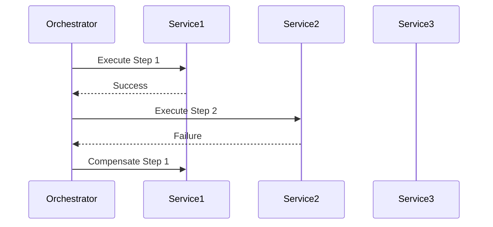
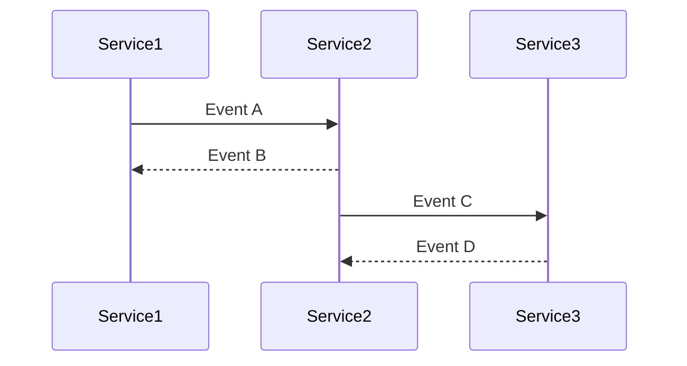

## 14.8. Saga Pattern for Distributed Transactions

In the world of microservices, managing distributed transactions is a complex challenge. The Saga pattern is a design pattern that addresses this challenge by ensuring data consistency across multiple services without requiring a distributed transaction manager. In this section, we'll explore the Saga pattern, its implementation in Rust, and how it can be used to maintain data consistency in distributed systems.

### Understanding the Saga Pattern

The Saga pattern is a sequence of local transactions where each transaction updates data within a single service. If a transaction fails, the Saga pattern ensures that compensating transactions are executed to undo the changes made by previous transactions. This approach helps maintain data consistency across distributed systems without the need for a global lock or a distributed transaction manager.

#### Key Concepts

- **Local Transactions**: Each step in a Saga is a local transaction that is executed within a single service.
- **Compensating Transactions**: These are transactions that undo the effects of a previous transaction in case of a failure.
- **Orchestration**: A centralized controller manages the Saga execution, coordinating the sequence of transactions.
- **Choreography**: Each service involved in the Saga listens for events and decides when to execute its transaction.

### Implementing the Saga Pattern in Rust

Rust, with its strong emphasis on safety and concurrency, provides an excellent platform for implementing the Saga pattern. Let's explore how we can implement Sagas using orchestration and choreography.

#### Orchestration-Based Saga

In an orchestration-based Saga, a central orchestrator manages the sequence of transactions. This approach provides a clear view of the Saga's progress and simplifies error handling.

```rust
use std::collections::HashMap;

// Define a struct to represent a Saga
struct Saga {
    steps: Vec<Box<dyn Fn() -> Result<(), String>>>,
    compensations: Vec<Box<dyn Fn() -> Result<(), String>>>,
}

impl Saga {
    // Execute the Saga
    fn execute(&self) -> Result<(), String> {
        let mut executed_steps = Vec::new();

        for (i, step) in self.steps.iter().enumerate() {
            match step() {
                Ok(_) => executed_steps.push(i),
                Err(e) => {
                    // Execute compensating actions
                    for &j in executed_steps.iter().rev() {
                        (self.compensations[j])().unwrap_or_else(|err| {
                            println!("Compensation failed: {}", err);
                        });
                    }
                    return Err(e);
                }
            }
        }
        Ok(())
    }
}

fn main() {
    // Define the Saga steps and compensations
    let saga = Saga {
        steps: vec![
            Box::new(|| {
                println!("Executing step 1");
                Ok(())
            }),
            Box::new(|| {
                println!("Executing step 2");
                Err("Step 2 failed".to_string())
            }),
        ],
        compensations: vec![
            Box::new(|| {
                println!("Compensating step 1");
                Ok(())
            }),
            Box::new(|| {
                println!("Compensating step 2");
                Ok(())
            }),
        ],
    };

    // Execute the Saga
    match saga.execute() {
        Ok(_) => println!("Saga completed successfully"),
        Err(e) => println!("Saga failed: {}", e),
    }
}
```

In this example, we define a `Saga` struct with steps and compensations. The `execute` method runs each step and, in case of failure, executes the compensating actions.

#### Choreography-Based Saga

In a choreography-based Saga, each service listens for events and decides when to execute its transaction. This approach is more decentralized and can be more resilient to failures.

```rust
use std::sync::mpsc::{channel, Sender, Receiver};
use std::thread;

// Define a function to simulate a service
fn service(name: &str, tx: Sender<String>, rx: Receiver<String>) {
    thread::spawn(move || {
        loop {
            match rx.recv() {
                Ok(event) => {
                    println!("{} received event: {}", name, event);
                    if event == "start" {
                        tx.send(format!("{} completed", name)).unwrap();
                    }
                }
                Err(_) => break,
            }
        }
    });
}

fn main() {
    let (tx1, rx1) = channel();
    let (tx2, rx2) = channel();

    // Start services
    service("Service 1", tx2.clone(), rx1);
    service("Service 2", tx1.clone(), rx2);

    // Start the Saga
    tx1.send("start".to_string()).unwrap();

    // Wait for services to complete
    for _ in 0..2 {
        match tx1.recv() {
            Ok(event) => println!("Main received event: {}", event),
            Err(_) => break,
        }
    }
}
```

In this example, we simulate two services using channels for communication. Each service listens for events and sends a completion message when its transaction is done.

### Compensating Actions and Failure Handling

Compensating actions are crucial in the Saga pattern as they ensure that the system can recover from failures. When designing compensating actions, consider the following:

- **Idempotency**: Ensure that compensating actions can be executed multiple times without adverse effects.
- **State Management**: Maintain the state of each transaction to determine which compensating actions need to be executed.
- **Failure Handling**: Implement robust error handling to manage failures during compensating actions.

### Considerations for Idempotency and State Management

Idempotency is a key consideration in distributed systems. It ensures that repeated execution of a transaction has the same effect as a single execution. To achieve idempotency:

- **Use Unique Identifiers**: Assign unique identifiers to each transaction to track its state.
- **Store Transaction State**: Maintain a persistent store of transaction states to determine which compensating actions are needed.

### Available Tooling and Libraries in Rust

While Rust does not have a dedicated Saga library, several tools and libraries can assist in implementing the Saga pattern:

- **Actix**: A powerful actor framework that can be used to implement orchestration and choreography.
- **Tokio**: An asynchronous runtime that can handle event-driven architectures.
- **Serde**: A serialization library that can be used to persist transaction states.

### Visualizing the Saga Pattern

To better understand the Saga pattern, let's visualize the orchestration and choreography approaches.

#### Orchestration Diagram



In this diagram, the orchestrator coordinates the execution of steps and compensations.

#### Choreography Diagram



In this diagram, services communicate through events, with each service deciding when to execute its transaction.

### Conclusion

The Saga pattern is a powerful tool for managing distributed transactions in microservices. By using orchestration or choreography, you can ensure data consistency and reliability in your Rust applications. Remember to consider idempotency, state management, and failure handling when implementing the Saga pattern. With the right tools and libraries, you can build robust and resilient distributed systems.

### Try It Yourself

Experiment with the provided code examples by modifying the steps and compensations. Try implementing a new service in the choreography example and observe how it interacts with the existing services.

## Quiz Time!



### What is the primary purpose of the Saga pattern in distributed systems?

- [x] To ensure data consistency across multiple services
- [ ] To improve system performance
- [ ] To simplify code structure
- [ ] To reduce network latency

> **Explanation:** The Saga pattern is used to ensure data consistency across multiple services in a distributed system.

### In the Saga pattern, what is a compensating transaction?

- [x] A transaction that undoes the effects of a previous transaction
- [ ] A transaction that enhances the effects of a previous transaction
- [ ] A transaction that is executed in parallel with another transaction
- [ ] A transaction that is ignored if a failure occurs

> **Explanation:** A compensating transaction undoes the effects of a previous transaction in case of a failure.

### Which approach involves a central controller managing the sequence of transactions in a Saga?

- [x] Orchestration
- [ ] Choreography
- [ ] Synchronization
- [ ] Coordination

> **Explanation:** In orchestration, a central controller manages the sequence of transactions.

### What is a key consideration when designing compensating actions in a Saga?

- [x] Idempotency
- [ ] Complexity
- [ ] Redundancy
- [ ] Scalability

> **Explanation:** Idempotency ensures that compensating actions can be executed multiple times without adverse effects.

### Which Rust library can be used to implement event-driven architectures?

- [x] Tokio
- [ ] Serde
- [ ] Diesel
- [ ] Rocket

> **Explanation:** Tokio is an asynchronous runtime that can handle event-driven architectures.

### What is the role of unique identifiers in achieving idempotency?

- [x] To track the state of each transaction
- [ ] To improve transaction speed
- [ ] To reduce memory usage
- [ ] To simplify code readability

> **Explanation:** Unique identifiers help track the state of each transaction, which is crucial for achieving idempotency.

### In a choreography-based Saga, how do services communicate?

- [x] Through events
- [ ] Through a central controller
- [ ] Through shared memory
- [ ] Through direct method calls

> **Explanation:** In choreography, services communicate through events.

### What is the main advantage of using the Saga pattern over a distributed transaction manager?

- [x] It avoids the need for a global lock
- [ ] It increases transaction speed
- [ ] It simplifies code structure
- [ ] It reduces network latency

> **Explanation:** The Saga pattern avoids the need for a global lock or a distributed transaction manager.

### Which of the following is NOT a benefit of using the Saga pattern?

- [ ] Ensures data consistency
- [ ] Provides a clear view of transaction progress
- [ ] Simplifies error handling
- [x] Guarantees transaction speed

> **Explanation:** The Saga pattern does not guarantee transaction speed; its primary focus is on data consistency and error handling.

### True or False: The Saga pattern can only be implemented using orchestration.

- [ ] True
- [x] False

> **Explanation:** The Saga pattern can be implemented using either orchestration or choreography.


