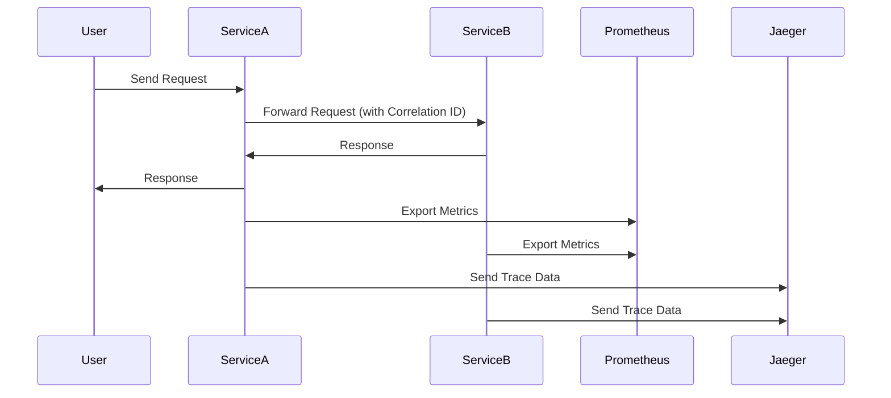

## 14.9. Logging, Monitoring, and Tracing

In the world of microservices, observability is a critical aspect that ensures the health, performance, and reliability of distributed systems. Observability encompasses logging, monitoring, and tracing, which together provide insights into the system's behavior and help diagnose issues. In this section, we will explore how to implement these practices in Rust microservices, leveraging powerful tools and frameworks.

### Importance of Observability in Microservices

Observability is crucial in microservices due to the inherent complexity and distributed nature of these systems. Unlike monolithic applications, microservices consist of multiple independent services that communicate over a network. This architecture introduces challenges such as:

- **Distributed Failures**: Failures can occur in any service or network link, making it difficult to pinpoint the root cause.
- **Complex Interactions**: Services interact in complex ways, and understanding these interactions is key to diagnosing issues.
- **Dynamic Scaling**: Services may scale dynamically, leading to changes in the system's behavior.

Observability helps address these challenges by providing:

- **Visibility**: Insights into the system's internal state and interactions.
- **Diagnostics**: Tools to diagnose and resolve issues quickly.
- **Performance Monitoring**: Metrics to monitor and optimize performance.

### Structured Logging and Correlation IDs

Logging is the foundation of observability. In microservices, structured logging and correlation IDs are essential for effective logging.

#### Structured Logging

Structured logging involves logging data in a structured format, such as JSON, which makes it easier to parse and analyze. This approach allows you to include additional context with each log entry, such as request IDs, user IDs, and other metadata.

Here's an example of structured logging in Rust using the `log` and `serde_json` crates:

```rust
use log::{info, error};
use serde_json::json;

fn log_request(request_id: &str, user_id: &str, action: &str) {
    let log_entry = json!({
        "request_id": request_id,
        "user_id": user_id,
        "action": action,
        "timestamp": chrono::Utc::now().to_rfc3339(),
    });

    info!("{}", log_entry.to_string());
}

fn main() {
    env_logger::init();
    log_request("12345", "user_678", "login");
}
```

#### Correlation IDs

Correlation IDs are unique identifiers that track a request across multiple services. By including a correlation ID in logs, you can trace the flow of a request through the system, making it easier to diagnose issues.

To implement correlation IDs, generate a unique ID at the entry point of a request and pass it along with subsequent requests to other services. Include this ID in all logs related to the request.

### Integrating with Monitoring Systems

Monitoring systems collect and visualize metrics from your services, providing insights into their performance and health. Prometheus and Grafana are popular tools for monitoring microservices.

#### Prometheus

Prometheus is an open-source monitoring system that collects metrics from services and stores them in a time-series database. It provides a powerful query language (PromQL) for analyzing metrics.

To integrate Prometheus with Rust, use the `prometheus` crate to expose metrics from your service:

```rust
use prometheus::{Encoder, TextEncoder, Counter, Opts, Registry};
use warp::Filter;

fn main() {
    let registry = Registry::new();
    let counter_opts = Opts::new("requests_total", "Total number of requests");
    let counter = Counter::with_opts(counter_opts).unwrap();
    registry.register(Box::new(counter.clone())).unwrap();

    let metrics_route = warp::path("metrics").map(move || {
        let encoder = TextEncoder::new();
        let mut buffer = Vec::new();
        let metric_families = registry.gather();
        encoder.encode(&metric_families, &mut buffer).unwrap();
        warp::http::Response::builder()
            .header("Content-Type", encoder.format_type())
            .body(buffer)
    });

    warp::serve(metrics_route).run(([127, 0, 0, 1], 3030));
}
```

#### Grafana

Grafana is a visualization tool that integrates with Prometheus to create dashboards for monitoring metrics. Once Prometheus is set up to collect metrics, you can use Grafana to visualize them.

### Distributed Tracing with Jaeger and OpenTelemetry

Distributed tracing tracks the flow of requests across services, providing insights into latency and bottlenecks. Jaeger and OpenTelemetry are tools for implementing distributed tracing.

#### Jaeger

Jaeger is an open-source tracing system that helps monitor and troubleshoot transactions in complex distributed systems. It provides a UI for visualizing traces and analyzing performance.

To integrate Jaeger with Rust, use the `opentelemetry` crate to instrument your code:

```rust
use opentelemetry::{global, sdk::export::trace::stdout, trace::Tracer};
use opentelemetry_jaeger::PipelineBuilder;

fn main() {
    let tracer = PipelineBuilder::default()
        .with_service_name("rust_service")
        .install_simple()
        .unwrap();

    tracer.in_span("operation", |_cx| {
        // Perform operation
    });

    global::shutdown_tracer_provider();
}
```

#### OpenTelemetry

OpenTelemetry is a vendor-neutral standard for collecting telemetry data, including traces, metrics, and logs. It provides a unified API for instrumenting applications.

To use OpenTelemetry in Rust, configure the `opentelemetry` crate to export traces to Jaeger or another backend:

```rust
use opentelemetry::sdk::export::trace::stdout;
use opentelemetry::trace::Tracer;
use opentelemetry::{global, sdk::trace as sdktrace};

fn main() {
    let tracer = stdout::new_pipeline().install_simple();

    tracer.in_span("example-span", |_cx| {
        // Perform operation
    });

    global::shutdown_tracer_provider();
}
```

### Best Practices for Metric Collection and Alerting

Effective metric collection and alerting are essential for maintaining the health of microservices. Here are some best practices:

- **Define Key Metrics**: Identify key performance indicators (KPIs) for your services, such as request latency, error rates, and resource utilization.
- **Set Alerts**: Configure alerts for critical metrics to notify you of issues before they impact users.
- **Use Dashboards**: Create dashboards to visualize metrics and monitor the health of your services in real-time.
- **Automate Responses**: Automate responses to common issues, such as scaling services or restarting failed instances.

### Visualizing Observability in Microservices

To better understand the flow of observability data in microservices, let's visualize the architecture using a sequence diagram.



This diagram illustrates how requests flow through services, with metrics and trace data being exported to Prometheus and Jaeger, respectively.

### Conclusion

Implementing logging, monitoring, and tracing in Rust microservices is essential for achieving observability. By using structured logging, correlation IDs, and integrating with tools like Prometheus, Grafana, Jaeger, and OpenTelemetry, you can gain valuable insights into your system's behavior and performance. Remember to define key metrics, set alerts, and use dashboards to monitor your services effectively.

### Try It Yourself

Experiment with the code examples provided in this section. Try modifying the structured logging format, adding new metrics, or integrating with different tracing backends. Observability is a journey, and by continuously improving your practices, you'll ensure the reliability and performance of your microservices.

## Quiz Time!



### What is the primary purpose of observability in microservices?

- [x] To provide insights into the system's behavior and help diagnose issues
- [ ] To increase the complexity of the system
- [ ] To replace the need for testing
- [ ] To reduce the number of services

> **Explanation:** Observability provides insights into the system's behavior and helps diagnose issues, which is crucial in complex microservices architectures.

### What is structured logging?

- [x] Logging data in a structured format, such as JSON
- [ ] Logging data in plain text
- [ ] Logging data without any format
- [ ] Logging data only when errors occur

> **Explanation:** Structured logging involves logging data in a structured format, such as JSON, which makes it easier to parse and analyze.

### What is the role of correlation IDs in microservices?

- [x] To track a request across multiple services
- [ ] To identify the developer who wrote the code
- [ ] To replace the need for logging
- [ ] To increase the performance of the system

> **Explanation:** Correlation IDs are unique identifiers that track a request across multiple services, making it easier to trace the flow of a request through the system.

### Which tool is used for monitoring metrics in microservices?

- [x] Prometheus
- [ ] Jaeger
- [ ] OpenTelemetry
- [ ] Rust

> **Explanation:** Prometheus is a monitoring system that collects and stores metrics from services, providing insights into their performance and health.

### What is the purpose of distributed tracing?

- [x] To track the flow of requests across services
- [ ] To replace logging
- [ ] To increase the number of services
- [ ] To reduce the need for monitoring

> **Explanation:** Distributed tracing tracks the flow of requests across services, providing insights into latency and bottlenecks.

### Which tool is used for visualizing traces in microservices?

- [x] Jaeger
- [ ] Prometheus
- [ ] Grafana
- [ ] Rust

> **Explanation:** Jaeger is a tracing system that helps monitor and troubleshoot transactions in complex distributed systems.

### What is OpenTelemetry?

- [x] A vendor-neutral standard for collecting telemetry data
- [ ] A logging library for Rust
- [ ] A monitoring tool for databases
- [ ] A programming language

> **Explanation:** OpenTelemetry is a vendor-neutral standard for collecting telemetry data, including traces, metrics, and logs.

### What is a best practice for metric collection?

- [x] Define key performance indicators (KPIs) for your services
- [ ] Collect as much data as possible without filtering
- [ ] Only collect metrics when issues occur
- [ ] Avoid using dashboards

> **Explanation:** Defining key performance indicators (KPIs) for your services is a best practice for metric collection, as it helps focus on the most important metrics.

### What is the role of Grafana in observability?

- [x] To visualize metrics collected by Prometheus
- [ ] To replace the need for logging
- [ ] To increase the number of services
- [ ] To reduce the need for tracing

> **Explanation:** Grafana is a visualization tool that integrates with Prometheus to create dashboards for monitoring metrics.

### True or False: Observability is only important for large-scale systems.

- [ ] True
- [x] False

> **Explanation:** Observability is important for systems of all sizes, as it provides insights into the system's behavior and helps diagnose issues.



Remember, this is just the beginning. As you progress, you'll build more complex and interactive microservices. Keep experimenting, stay curious, and enjoy the journey!
