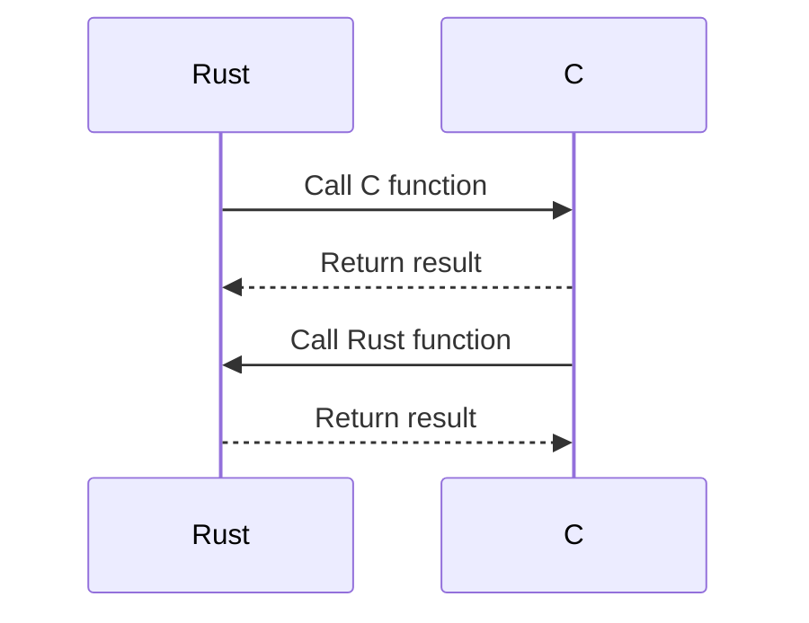

## 15.1. Interoperability with C and C++ Using FFI

In the world of systems programming, Rust stands out for its memory safety and concurrency features. However, many existing libraries and codebases are written in C and C++. To leverage these resources, Rust provides a mechanism known as the Foreign Function Interface (FFI). This section will guide you through the process of integrating Rust with C and C++ using FFI, enabling you to reuse existing libraries and codebases effectively.

### What is FFI?

The Foreign Function Interface (FFI) is a mechanism that allows a programming language to call functions and use data types defined in another language. In Rust, FFI is primarily used to interface with C and C++ code. This capability is crucial for systems programming, where performance and access to existing libraries are often paramount.

### Why Use FFI in Rust?

- **Leverage Existing Libraries**: Many libraries, especially in systems programming, are written in C or C++. FFI allows Rust to use these libraries without rewriting them.
- **Performance**: C and C++ are known for their performance. By using FFI, Rust can achieve similar performance levels by calling optimized C/C++ code.
- **Interoperability**: FFI enables Rust to interact with other languages, broadening its applicability in mixed-language projects.

### Calling C Functions from Rust

To call a C function from Rust, you need to declare the function using Rust's `extern` keyword. This tells the Rust compiler that the function is defined elsewhere, typically in a C library.

#### Example: Calling a C Function

Let's consider a simple C function that adds two integers:

```c
// add.c
#include <stdio.h>

int add(int a, int b) {
    return a + b;
}
```

To call this function from Rust, follow these steps:

1. **Compile the C Code**: First, compile the C code into a shared library.

   ```bash
   gcc -c -o add.o add.c
   gcc -shared -o libadd.so add.o
   ```

2. **Declare the C Function in Rust**: Use the `extern` block to declare the C function in Rust.

   ```rust
   // main.rs
   #[link(name = "add")]
   extern "C" {
       fn add(a: i32, b: i32) -> i32;
   }

   fn main() {
       let result = unsafe { add(5, 3) };
       println!("The sum is: {}", result);
   }
   ```

3. **Compile and Run the Rust Code**: Ensure the shared library is in the library path and compile the Rust code.

   ```bash
   rustc main.rs -L .
   ./main
   ```

#### Key Points

- **`extern "C"`**: Specifies the calling convention. C is the default, but Rust can interface with other conventions.
- **`unsafe`**: Calling foreign functions is inherently unsafe because Rust cannot guarantee memory safety across language boundaries.

### Calling Rust Functions from C

To call Rust functions from C, you need to expose the Rust functions using the `#[no_mangle]` attribute and `extern` keyword.

#### Example: Calling a Rust Function

Consider a Rust function that multiplies two integers:

```rust
// lib.rs
#[no_mangle]
pub extern "C" fn multiply(a: i32, b: i32) -> i32 {
    a * b
}
```

To call this function from C:

1. **Compile the Rust Code**: Compile the Rust code into a shared library.

   ```bash
   rustc --crate-type=cdylib lib.rs -o libmultiply.so
   ```

2. **Call the Rust Function in C**: Use the function in a C program.

   ```c
   // main.c
   #include <stdio.h>

   extern int multiply(int a, int b);

   int main() {
       int result = multiply(4, 5);
       printf("The product is: %d\n", result);
       return 0;
   }
   ```

3. **Compile and Run the C Code**: Ensure the Rust library is in the library path and compile the C code.

   ```bash
   gcc -o main main.c -L . -lmultiply
   ./main
   ```

#### Key Points

- **`#[no_mangle]`**: Prevents Rust from changing the function name during compilation, ensuring it matches the C function name.
- **`extern "C"`**: Specifies the C calling convention.

### Handling Data Types and Memory Management

Interfacing between Rust and C/C++ requires careful handling of data types and memory management. Rust's ownership model and C's manual memory management can lead to challenges.

#### Data Type Compatibility

- **Primitive Types**: Rust's primitive types (e.g., `i32`, `f64`) correspond directly to C's primitive types (`int`, `double`).
- **Pointers**: Use raw pointers (`*const T`, `*mut T`) to pass complex data structures. Ensure proper memory allocation and deallocation.
- **Strings**: Convert Rust strings to C strings using `CString` and `CStr`.

#### Example: Passing Strings

```rust
use std::ffi::{CStr, CString};
use std::os::raw::c_char;

#[no_mangle]
pub extern "C" fn greet(name: *const c_char) {
    let c_str = unsafe { CStr::from_ptr(name) };
    let r_str = c_str.to_str().unwrap();
    println!("Hello, {}!", r_str);
}
```

```c
#include <stdio.h>

extern void greet(const char* name);

int main() {
    greet("World");
    return 0;
}
```

### Safety Considerations

Using FFI involves `unsafe` code, which bypasses Rust's safety guarantees. Here are some tips to minimize risks:

- **Validate Inputs**: Ensure all inputs are valid before using them.
- **Manage Lifetimes**: Carefully manage the lifetimes of data passed between Rust and C.
- **Use `unsafe` Sparingly**: Limit the use of `unsafe` blocks to the smallest possible scope.

### Tools for FFI

Several tools can simplify the process of creating Rust bindings for C libraries:

- **`bindgen`**: Automatically generates Rust FFI bindings to C libraries. It parses C headers and generates Rust code.

  ```bash
  cargo install bindgen
  ```

  ```rust
  // build.rs
  extern crate bindgen;

  use std::env;
  use std::path::PathBuf;

  fn main() {
      let bindings = bindgen::Builder::default()
          .header("wrapper.h")
          .generate()
          .expect("Unable to generate bindings");

      let out_path = PathBuf::from(env::var("OUT_DIR").unwrap());
      bindings
          .write_to_file(out_path.join("bindings.rs"))
          .expect("Couldn't write bindings!");
  }
  ```

- **`cc` crate**: A Rust build dependency for compiling C/C++ code.

  ```toml
  [build-dependencies]
  cc = "1.0"
  ```

  ```rust
  // build.rs
  fn main() {
      cc::Build::new()
          .file("src/add.c")
          .compile("libadd.a");
  }
  ```

### Visualizing Rust and C Interoperability

To better understand the flow of data and function calls between Rust and C, let's visualize the process using a sequence diagram.



**Diagram Description**: This sequence diagram illustrates the interaction between Rust and C. Rust calls a C function, receives a result, and then C calls a Rust function, receiving a result in return.

### Knowledge Check

- **Question**: What is the role of the `extern` keyword in Rust FFI?
- **Exercise**: Modify the `add` function example to handle floating-point numbers.

### Embrace the Journey

Remember, integrating Rust with C and C++ using FFI is a powerful tool in your programming arsenal. As you progress, you'll find more complex and efficient ways to leverage existing libraries and codebases. Keep experimenting, stay curious, and enjoy the journey!

### References and Links

- [Rust FFI Guide](https://doc.rust-lang.org/nomicon/ffi.html)
- [bindgen Documentation](https://rust-lang.github.io/rust-bindgen/)
- [cc Crate Documentation](https://docs.rs/cc/latest/cc/)

## Quiz Time!



### What is the primary purpose of FFI in Rust?

- [x] To enable Rust to call functions and use data types defined in other languages.
- [ ] To compile Rust code into C code.
- [ ] To convert Rust code into a scripting language.
- [ ] To provide a graphical interface for Rust applications.

> **Explanation:** FFI allows Rust to interface with other languages, enabling it to call functions and use data types defined in those languages.

### Which keyword is used in Rust to declare a function defined in another language?

- [x] extern
- [ ] unsafe
- [ ] pub
- [ ] fn

> **Explanation:** The `extern` keyword is used to declare functions defined in other languages, specifying the calling convention.

### What attribute prevents Rust from changing a function's name during compilation?

- [x] #[no_mangle]
- [ ] #[inline]
- [ ] #[derive]
- [ ] #[cfg]

> **Explanation:** The `#[no_mangle]` attribute prevents Rust from altering the function name, ensuring it matches the expected name in other languages.

### Which tool is used to automatically generate Rust FFI bindings to C libraries?

- [x] bindgen
- [ ] cargo
- [ ] rustc
- [ ] clippy

> **Explanation:** `bindgen` is a tool that generates Rust FFI bindings to C libraries by parsing C headers.

### What is the role of the `unsafe` keyword in Rust FFI?

- [x] It allows calling foreign functions that bypass Rust's safety guarantees.
- [ ] It marks a function as public.
- [ ] It ensures memory safety across language boundaries.
- [ ] It is used for error handling.

> **Explanation:** The `unsafe` keyword allows calling foreign functions, which bypass Rust's safety guarantees, requiring careful handling.

### Which crate is commonly used for compiling C/C++ code in Rust projects?

- [x] cc
- [ ] serde
- [ ] tokio
- [ ] hyper

> **Explanation:** The `cc` crate is used for compiling C/C++ code as part of Rust projects, facilitating integration with existing codebases.

### What is the purpose of the `CString` type in Rust?

- [x] To convert Rust strings to C-compatible strings.
- [ ] To handle file I/O operations.
- [ ] To manage memory allocation.
- [ ] To perform network operations.

> **Explanation:** `CString` is used to convert Rust strings into C-compatible strings, facilitating interoperability between Rust and C.

### How can you ensure that a Rust function is callable from C?

- [x] Use `#[no_mangle]` and `extern "C"` attributes.
- [ ] Use `#[derive]` and `pub` attributes.
- [ ] Use `#[cfg]` and `unsafe` attributes.
- [ ] Use `#[inline]` and `fn` attributes.

> **Explanation:** To make a Rust function callable from C, use the `#[no_mangle]` attribute to prevent name mangling and `extern "C"` to specify the calling convention.

### What is a key safety consideration when using FFI in Rust?

- [x] Validate inputs and manage lifetimes carefully.
- [ ] Use `unsafe` blocks extensively.
- [ ] Avoid using `extern` keyword.
- [ ] Ignore memory management.

> **Explanation:** When using FFI, it's crucial to validate inputs and manage lifetimes carefully to ensure safety across language boundaries.

### True or False: FFI allows Rust to interface with any programming language.

- [ ] True
- [x] False

> **Explanation:** FFI primarily allows Rust to interface with C and C++ due to their widespread use and compatibility with Rust's calling conventions.


