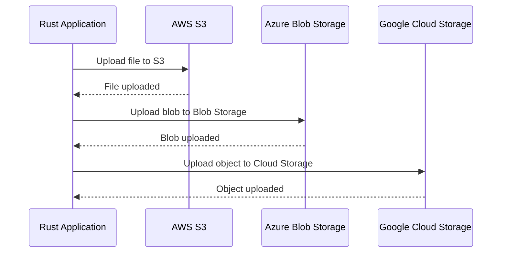

## 15.10. Integrating with Cloud Services

In today's rapidly evolving technological landscape, integrating applications with cloud services is crucial for scalability, flexibility, and efficiency. Rust, known for its performance and safety, is an excellent choice for building cloud-native applications. In this section, we'll explore how to integrate Rust applications with major cloud service providers like AWS, Azure, and Google Cloud. We'll discuss available SDKs, authentication mechanisms, best practices for resource management, and deployment strategies.

### Understanding Cloud Service Integration

Cloud service integration involves connecting your application to cloud platforms to leverage their services, such as storage, databases, and computing power. This integration allows you to build scalable applications without managing physical infrastructure.

### Available SDKs and Clients

To interact with cloud services, you need SDKs (Software Development Kits) or client libraries that provide the necessary tools and abstractions. Let's explore the SDKs available for Rust:

#### AWS SDK for Rust

The [AWS SDK for Rust](https://github.com/awslabs/aws-sdk-rust) is a comprehensive library that allows you to interact with AWS services like S3, DynamoDB, and Lambda. It provides a type-safe interface to AWS APIs, making it easier to build robust applications.

#### Azure SDK for Rust

The [Azure SDK for Rust](https://github.com/Azure/azure-sdk-for-rust) enables integration with Azure services such as Blob Storage, Cosmos DB, and Azure Functions. It offers a set of libraries that simplify the process of connecting to Azure services.

#### Google Cloud Rust Client Libraries

The [Google Cloud Rust Client Libraries](https://github.com/google-apis-rs/google-api-rust-client) provide access to Google Cloud services like Cloud Storage, BigQuery, and Compute Engine. These libraries offer a convenient way to interact with Google's cloud offerings.

### Interacting with Cloud Services

Let's dive into some practical examples of how to interact with cloud services using Rust.

#### Example: Interacting with AWS S3

AWS S3 (Simple Storage Service) is a popular object storage service. Here's how you can interact with S3 using the AWS SDK for Rust:

```rust
use aws_sdk_s3::{Client, Config, Region};
use aws_sdk_s3::types::ByteStream;
use aws_types::credentials::SharedCredentialsProvider;
use tokio;

#[tokio::main]
async fn main() -> Result<(), aws_sdk_s3::Error> {
    // Configure the AWS SDK
    let region = Region::new("us-west-2");
    let credentials_provider = SharedCredentialsProvider::new("YOUR_ACCESS_KEY", "YOUR_SECRET_KEY");
    let config = Config::builder()
        .region(region)
        .credentials_provider(credentials_provider)
        .build();

    // Create an S3 client
    let client = Client::from_conf(config);

    // Upload a file to S3
    let bucket_name = "your-bucket-name";
    let key = "example.txt";
    let body = ByteStream::from_static(b"Hello, world!");

    client.put_object()
        .bucket(bucket_name)
        .key(key)
        .body(body)
        .send()
        .await?;

    println!("File uploaded successfully!");

    Ok(())
}
```

**Explanation:**

- We configure the AWS SDK with the region and credentials.
- We create an S3 client using the configured settings.
- We use the `put_object` method to upload a file to an S3 bucket.

#### Example: Interacting with Azure Blob Storage

Azure Blob Storage is a scalable object storage service. Here's how you can interact with it using the Azure SDK for Rust:

```rust
use azure_storage::core::prelude::*;
use azure_storage_blobs::prelude::*;
use futures::stream::StreamExt;
use tokio;

#[tokio::main]
async fn main() -> azure_core::Result<()> {
    // Configure the Azure Storage account
    let account = StorageAccountClient::new_access_key("your_account_name", "your_access_key");
    let container_client = account.as_container_client("your_container_name");

    // Upload a blob
    let blob_client = container_client.as_blob_client("example.txt");
    let data = b"Hello, Azure!";
    blob_client.put_block_blob(data.to_vec()).await?;

    println!("Blob uploaded successfully!");

    Ok(())
}
```

**Explanation:**

- We configure the Azure Storage account with the account name and access key.
- We create a container client and a blob client.
- We use the `put_block_blob` method to upload a blob to Azure Blob Storage.

#### Example: Interacting with Google Cloud Storage

Google Cloud Storage is a unified object storage service. Here's how you can interact with it using the Google Cloud Rust Client Libraries:

```rust
use google_cloud_storage::client::{Client, ClientConfig};
use google_cloud_storage::object::Object;
use tokio;

#[tokio::main]
async fn main() -> Result<(), Box<dyn std::error::Error>> {
    // Configure the Google Cloud Storage client
    let config = ClientConfig::default();
    let client = Client::new(config).await?;

    // Upload an object to Google Cloud Storage
    let bucket_name = "your-bucket-name";
    let object_name = "example.txt";
    let data = b"Hello, Google Cloud!";

    let object = Object::create(&client, bucket_name, object_name, data, "text/plain").await?;

    println!("Object uploaded successfully: {:?}", object);

    Ok(())
}
```

**Explanation:**

- We configure the Google Cloud Storage client with default settings.
- We create an object and upload it to a Google Cloud Storage bucket.

### Handling Authentication and Authorization

Authentication and authorization are critical aspects of cloud integration. Each cloud provider has its own mechanisms for handling these processes.

#### AWS Authentication

AWS uses access keys and secret keys for authentication. You can also use IAM roles for more secure and flexible access management. The AWS SDK for Rust supports these authentication methods.

#### Azure Authentication

Azure supports multiple authentication methods, including access keys, shared access signatures (SAS), and Azure Active Directory (AAD) tokens. The Azure SDK for Rust provides support for these methods.

#### Google Cloud Authentication

Google Cloud uses service account keys for authentication. You can also use OAuth 2.0 tokens for user-based authentication. The Google Cloud Rust Client Libraries support these authentication methods.

### Best Practices for Resource Management and Cost Optimization

When integrating with cloud services, it's essential to manage resources efficiently and optimize costs. Here are some best practices:

- **Use Auto-scaling**: Leverage auto-scaling features to adjust resources based on demand.
- **Monitor Usage**: Use monitoring tools to track resource usage and identify cost-saving opportunities.
- **Optimize Storage**: Choose the right storage class for your needs and implement lifecycle policies to manage data efficiently.
- **Leverage Spot Instances**: Use spot instances for non-critical workloads to reduce costs.

### Tools for Deploying Rust Applications to the Cloud

Deploying Rust applications to the cloud involves packaging your application and configuring the necessary infrastructure. Here are some tools to help with deployment:

- **Docker**: Containerize your Rust application for consistent deployment across environments.
- **Terraform**: Use Terraform to define and provision cloud infrastructure as code.
- **Kubernetes**: Deploy and manage containerized applications using Kubernetes.
- **AWS Lambda**: Deploy serverless Rust functions using AWS Lambda.

### Visualizing Cloud Integration Architecture

Let's visualize a typical cloud integration architecture using a sequence diagram:



**Description:** This sequence diagram illustrates a Rust application interacting with AWS S3, Azure Blob Storage, and Google Cloud Storage to upload files, blobs, and objects.

### Knowledge Check

Before we wrap up, let's test your understanding of integrating Rust with cloud services:

- What are the available SDKs for integrating Rust with AWS, Azure, and Google Cloud?
- How do you handle authentication when interacting with cloud services?
- What are some best practices for optimizing cloud resource usage and costs?
- Which tools can you use to deploy Rust applications to the cloud?

### Embrace the Journey

Integrating Rust with cloud services opens up a world of possibilities for building scalable, efficient, and robust applications. Remember, this is just the beginning. As you continue to explore and experiment, you'll discover new ways to leverage the power of Rust and the cloud. Keep learning, stay curious, and enjoy the journey!

## Quiz Time!



### What is the primary purpose of using SDKs for cloud services in Rust?

- [x] To provide tools and abstractions for interacting with cloud services
- [ ] To replace the need for authentication
- [ ] To increase application performance
- [ ] To manage cloud costs automatically

> **Explanation:** SDKs provide the necessary tools and abstractions to interact with cloud services, simplifying the integration process.

### Which AWS service is commonly used for object storage?

- [x] S3
- [ ] EC2
- [ ] Lambda
- [ ] RDS

> **Explanation:** AWS S3 (Simple Storage Service) is commonly used for object storage.

### What is a common authentication method for Azure services?

- [x] Azure Active Directory (AAD) tokens
- [ ] OAuth 1.0
- [ ] API keys
- [ ] SSH keys

> **Explanation:** Azure supports Azure Active Directory (AAD) tokens for authentication.

### What is a best practice for optimizing cloud resource usage?

- [x] Use auto-scaling features
- [ ] Disable monitoring tools
- [ ] Use only on-demand instances
- [ ] Store all data in the highest storage class

> **Explanation:** Using auto-scaling features helps adjust resources based on demand, optimizing usage.

### Which tool is commonly used for containerizing Rust applications?

- [x] Docker
- [ ] Terraform
- [ ] Kubernetes
- [ ] AWS Lambda

> **Explanation:** Docker is commonly used for containerizing applications, including Rust applications.

### What is the role of IAM roles in AWS?

- [x] To provide secure and flexible access management
- [ ] To store data
- [ ] To increase application speed
- [ ] To manage billing

> **Explanation:** IAM roles provide secure and flexible access management in AWS.

### Which Google Cloud service is used for object storage?

- [x] Google Cloud Storage
- [ ] BigQuery
- [ ] Compute Engine
- [ ] App Engine

> **Explanation:** Google Cloud Storage is used for object storage in Google Cloud.

### What is a benefit of using spot instances in cloud computing?

- [x] Reduced costs for non-critical workloads
- [ ] Guaranteed availability
- [ ] Increased security
- [ ] Faster data processing

> **Explanation:** Spot instances offer reduced costs for non-critical workloads, making them a cost-effective option.

### What is Terraform used for in cloud deployment?

- [x] To define and provision cloud infrastructure as code
- [ ] To containerize applications
- [ ] To monitor application performance
- [ ] To manage user authentication

> **Explanation:** Terraform is used to define and provision cloud infrastructure as code.

### True or False: Kubernetes is used to manage containerized applications.

- [x] True
- [ ] False

> **Explanation:** Kubernetes is a platform used to deploy and manage containerized applications.


