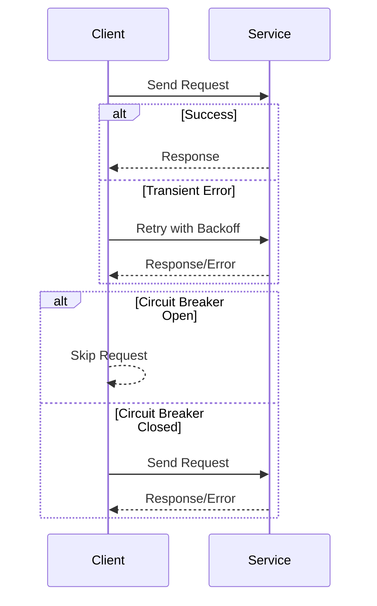

## 15.11. Handling Network Errors and Retries

In the world of network programming, errors and transient failures are inevitable. Whether you're dealing with a flaky network connection, a temporarily overloaded server, or a misconfigured DNS, robust error handling is crucial for building resilient applications. In this section, we'll explore strategies for handling network errors and implementing retries in Rust, focusing on exponential backoff, idempotent operations, and circuit breakers.

### Understanding Common Network Errors

Before diving into solutions, it's essential to understand the types of network errors you might encounter:

1. **Timeouts**: Occur when a network request takes longer than expected.
2. **Connection Refused**: Happens when the target server is not accepting connections.
3. **DNS Resolution Failures**: Arise when the domain name cannot be resolved to an IP address.
4. **Transient Errors**: Temporary issues that may resolve themselves, such as a brief network outage.
5. **Rate Limiting**: When a server limits the number of requests from a client.

### Implementing Retries with Exponential Backoff

Retries are a common strategy for handling transient errors. However, blindly retrying can lead to increased load on the server and exacerbate the problem. Instead, use exponential backoff, which increases the wait time between retries exponentially.

#### Code Example: Exponential Backoff with the `retry` Crate

The `retry` crate provides a simple way to implement retry logic with exponential backoff.

```rust
use retry::{delay::Exponential, retry, OperationResult};
use std::time::Duration;

fn fetch_data() -> Result<String, &'static str> {
    // Simulate a network operation that might fail
    Err("Network error")
}

fn main() {
    let result = retry(Exponential::from_millis(10).take(5), || {
        match fetch_data() {
            Ok(data) => OperationResult::Ok(data),
            Err(err) => {
                println!("Error occurred: {}. Retrying...", err);
                OperationResult::Retry(err)
            }
        }
    });

    match result {
        Ok(data) => println!("Successfully fetched data: {}", data),
        Err(err) => println!("Failed to fetch data after retries: {}", err),
    }
}
```

In this example, the `retry` function attempts to fetch data up to five times, with an exponentially increasing delay starting at 10 milliseconds.

### Using Libraries for Retry Policies

Several Rust libraries offer robust retry policies, including `retry` and `backoff`. These libraries provide configurable options for delay strategies, maximum retries, and more.

#### The `backoff` Crate

The `backoff` crate offers more advanced features, such as jitter (randomized delay) to prevent thundering herd problems.

```rust
use backoff::{ExponentialBackoff, Operation};
use std::time::Duration;

fn fetch_data() -> Result<String, &'static str> {
    // Simulate a network operation that might fail
    Err("Network error")
}

fn main() {
    let mut backoff = ExponentialBackoff::default();
    backoff.max_elapsed_time = Some(Duration::from_secs(2));

    let result = backoff.retry(|| {
        match fetch_data() {
            Ok(data) => Ok(data),
            Err(err) => {
                println!("Error occurred: {}. Retrying...", err);
                Err(err)
            }
        }
    });

    match result {
        Ok(data) => println!("Successfully fetched data: {}", data),
        Err(err) => println!("Failed to fetch data after retries: {}", err),
    }
}
```

### Importance of Idempotent Operations

When implementing retries, it's crucial to ensure that operations are idempotent. An idempotent operation can be performed multiple times without changing the result beyond the initial application. This is important to avoid unintended side effects, such as duplicate transactions.

#### Example: Idempotent HTTP Request

Consider an HTTP PUT request to update a resource. If the request is retried, the state of the resource remains consistent.

```rust
use reqwest::Client;
use std::collections::HashMap;

async fn update_resource(client: &Client, url: &str, data: HashMap<&str, &str>) -> Result<(), reqwest::Error> {
    client.put(url).json(&data).send().await?.error_for_status()?;
    Ok(())
}
```

### Handling Timeouts and Circuit Breakers

Timeouts are a common network error that can be mitigated by setting appropriate timeout values for network operations. Circuit breakers can prevent your application from repeatedly attempting operations that are likely to fail.

#### Code Example: Setting Timeouts

```rust
use reqwest::Client;
use std::time::Duration;

async fn fetch_with_timeout(url: &str) -> Result<String, reqwest::Error> {
    let client = Client::builder()
        .timeout(Duration::from_secs(5))
        .build()?;
    let response = client.get(url).send().await?;
    response.text().await
}
```

#### Circuit Breaker Pattern

A circuit breaker monitors for failures and temporarily halts requests to a failing service, allowing it time to recover.

```rust
use std::sync::{Arc, Mutex};
use std::time::{Duration, Instant};

struct CircuitBreaker {
    failure_count: usize,
    last_failure_time: Option<Instant>,
    threshold: usize,
    timeout: Duration,
}

impl CircuitBreaker {
    fn new(threshold: usize, timeout: Duration) -> Self {
        Self {
            failure_count: 0,
            last_failure_time: None,
            threshold,
            timeout,
        }
    }

    fn call<F, T>(&mut self, operation: F) -> Result<T, &'static str>
    where
        F: Fn() -> Result<T, &'static str>,
    {
        if let Some(last_failure) = self.last_failure_time {
            if last_failure.elapsed() < self.timeout {
                return Err("Circuit is open");
            }
        }

        match operation() {
            Ok(result) => {
                self.failure_count = 0;
                Ok(result)
            }
            Err(err) => {
                self.failure_count += 1;
                self.last_failure_time = Some(Instant::now());
                if self.failure_count >= self.threshold {
                    return Err("Circuit is open");
                }
                Err(err)
            }
        }
    }
}

fn main() {
    let mut circuit_breaker = CircuitBreaker::new(3, Duration::from_secs(10));

    for _ in 0..5 {
        match circuit_breaker.call(|| Err("Network error")) {
            Ok(_) => println!("Operation succeeded"),
            Err(err) => println!("Operation failed: {}", err),
        }
    }
}
```

### Visualizing the Retry and Circuit Breaker Process

To better understand the flow of retries and circuit breakers, let's visualize the process using a sequence diagram.



### Best Practices for Handling Network Errors

1. **Use Exponential Backoff**: Avoid overwhelming the server with retries.
2. **Ensure Idempotency**: Make sure operations can be safely retried.
3. **Set Appropriate Timeouts**: Prevent hanging requests.
4. **Implement Circuit Breakers**: Protect your application from cascading failures.
5. **Log Errors and Retries**: Keep track of failures for debugging and analysis.

### Try It Yourself

Experiment with the provided code examples by modifying the retry logic, adjusting timeout settings, or implementing your own circuit breaker. Consider how these strategies can be applied to your projects.

### External Resources

- [Retry Crate Documentation](https://crates.io/crates/retry)
- [Backoff Crate Documentation](https://crates.io/crates/backoff)
- [Reqwest Crate Documentation](https://docs.rs/reqwest/latest/reqwest/)

### Knowledge Check

- What are some common network errors you might encounter?
- How does exponential backoff help in retry strategies?
- Why is idempotency important when retrying network requests?
- What role do circuit breakers play in network error handling?

### Embrace the Journey

Remember, handling network errors is a crucial part of building resilient applications. As you continue to explore Rust's capabilities, keep experimenting with different strategies and stay curious about how you can improve your error handling techniques. Enjoy the journey!

## Quiz Time!



### What is a common reason for implementing retries in network communication?

- [x] To handle transient errors
- [ ] To increase server load
- [ ] To decrease application performance
- [ ] To avoid using exponential backoff

> **Explanation:** Retries are often implemented to handle transient errors, which are temporary and may resolve themselves.

### What is the purpose of exponential backoff in retry strategies?

- [x] To increase the wait time between retries exponentially
- [ ] To decrease the wait time between retries
- [ ] To retry immediately without delay
- [ ] To reduce the number of retries

> **Explanation:** Exponential backoff increases the wait time between retries exponentially to avoid overwhelming the server.

### Why is idempotency important in network operations?

- [x] It ensures operations can be safely retried without unintended side effects
- [ ] It increases the complexity of the operation
- [ ] It decreases the reliability of the operation
- [ ] It prevents retries altogether

> **Explanation:** Idempotency ensures that operations can be retried without changing the result beyond the initial application, preventing unintended side effects.

### What is a circuit breaker used for in network error handling?

- [x] To temporarily halt requests to a failing service
- [ ] To increase the number of retries
- [ ] To decrease the wait time between retries
- [ ] To ensure all requests are processed

> **Explanation:** A circuit breaker temporarily halts requests to a failing service, allowing it time to recover and preventing cascading failures.

### Which crate provides advanced retry features like jitter?

- [x] backoff
- [ ] retry
- [ ] reqwest
- [ ] serde

> **Explanation:** The `backoff` crate provides advanced retry features, including jitter, to prevent thundering herd problems.

### What is a common network error that can be mitigated by setting appropriate timeout values?

- [x] Timeouts
- [ ] Connection Refused
- [ ] DNS Resolution Failures
- [ ] Rate Limiting

> **Explanation:** Timeouts can be mitigated by setting appropriate timeout values for network operations.

### How can you prevent duplicate transactions when retrying network requests?

- [x] Ensure operations are idempotent
- [ ] Increase the number of retries
- [ ] Decrease the wait time between retries
- [ ] Use a circuit breaker

> **Explanation:** Ensuring operations are idempotent prevents duplicate transactions when retrying network requests.

### What is the role of jitter in retry strategies?

- [x] To randomize the delay between retries
- [ ] To decrease the number of retries
- [ ] To increase the wait time between retries
- [ ] To ensure retries happen immediately

> **Explanation:** Jitter randomizes the delay between retries to prevent thundering herd problems.

### What is a transient error?

- [x] A temporary issue that may resolve itself
- [ ] A permanent failure
- [ ] A DNS resolution failure
- [ ] A rate limiting error

> **Explanation:** A transient error is a temporary issue that may resolve itself, often addressed by retrying the operation.

### True or False: Circuit breakers are used to increase the number of retries.

- [ ] True
- [x] False

> **Explanation:** Circuit breakers are used to temporarily halt requests to a failing service, not to increase the number of retries.


