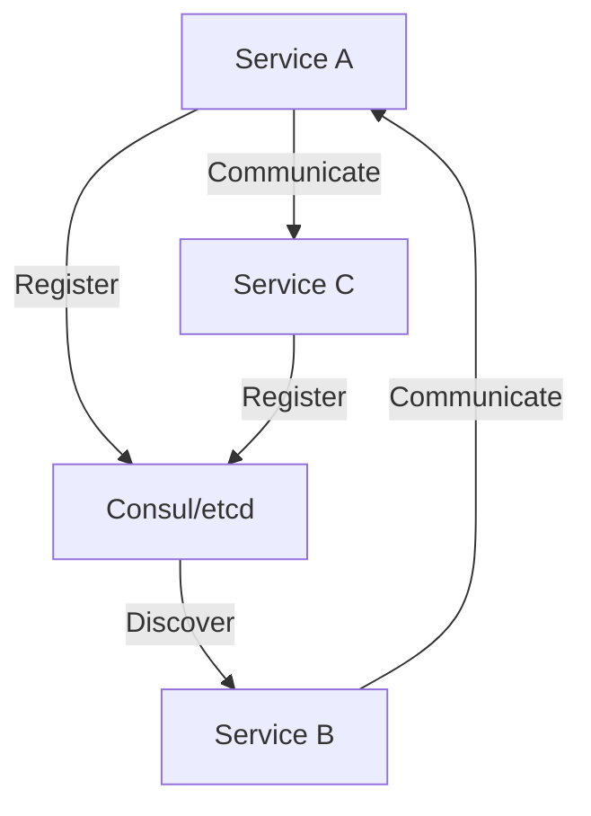

## 15.12. Distributed Systems and Service Discovery

In today's interconnected world, distributed systems have become the backbone of modern applications, enabling scalability, fault tolerance, and high availability. Rust, with its emphasis on safety and performance, is an excellent choice for building distributed systems. In this section, we'll explore the challenges of distributed systems, delve into service discovery, and discuss how Rust can be leveraged to implement robust distributed architectures.

### Understanding Distributed Systems

Distributed systems consist of multiple independent components that communicate and coordinate their actions by passing messages. These systems are designed to handle failures gracefully and provide consistent service despite the challenges of network latency, partial failures, and data consistency.

#### Key Challenges

1. **Consistency**: Ensuring that all nodes in the system have the same data at any given time.
2. **Fault Tolerance**: The ability to continue operating in the event of a failure of some of its components.
3. **Scalability**: The capability to handle increased load by adding more nodes.
4. **Latency**: Minimizing the time it takes for data to travel across the network.
5. **Synchronization**: Coordinating actions across distributed nodes.

### Service Discovery in Distributed Systems

Service discovery is a critical component of distributed systems, enabling services to find and communicate with each other. It involves maintaining a registry of available services and their locations, allowing dynamic discovery and load balancing.

#### Tools for Service Discovery

- **Consul**: A service mesh solution providing service discovery, configuration, and segmentation functionality.
- **etcd**: A distributed key-value store that provides a reliable way to store data across a cluster of machines.

#### Implementing Service Discovery in Rust

Rust applications can participate in service discovery using libraries and tools that integrate with Consul or etcd. Let's explore how to implement service discovery using these tools.

##### Example: Using Consul with Rust

```rust
use consul::Client;
use consul::agent::AgentServiceRegistration;
use std::collections::HashMap;

fn register_service() {
    let client = Client::new("http://localhost:8500").unwrap();
    let mut tags = HashMap::new();
    tags.insert("version", "1.0");

    let service = AgentServiceRegistration {
        name: "my_service".to_string(),
        id: Some("my_service_id".to_string()),
        tags: Some(tags),
        address: Some("127.0.0.1".to_string()),
        port: Some(8080),
        ..Default::default()
    };

    client.agent().register_service(&service).unwrap();
    println!("Service registered with Consul");
}

fn main() {
    register_service();
}
```

In this example, we use the `consul` crate to register a service with Consul. The service is identified by its name and ID, and additional metadata can be attached using tags.

### Distributed Coordination and Consensus Algorithms

Distributed coordination involves managing the state and actions of distributed components to achieve a common goal. Consensus algorithms play a crucial role in ensuring that all nodes agree on a single data value, even in the presence of failures.

#### Popular Consensus Algorithms

- **Raft**: A consensus algorithm designed for managing a replicated log.
- **Paxos**: A family of protocols for solving consensus in a network of unreliable processors.

##### Implementing Raft in Rust

The `raft` crate provides a Rust implementation of the Raft consensus algorithm. Here's a basic example of setting up a Raft node.

```rust
use raft::Config;
use raft::storage::MemStorage;
use raft::Raft;

fn setup_raft_node() {
    let config = Config {
        id: 1,
        ..Default::default()
    };

    let storage = MemStorage::new();
    let raft = Raft::new(&config, storage, vec![]).unwrap();

    println!("Raft node setup complete");
}

fn main() {
    setup_raft_node();
}
```

This example demonstrates setting up a Raft node using the `raft` crate. The `MemStorage` is used for simplicity, but in a real-world scenario, persistent storage would be necessary.

### Handling Distributed State and Synchronization

Managing state across distributed systems is challenging due to the need for consistency and synchronization. Rust's ownership model and concurrency primitives can help manage distributed state effectively.

#### Best Practices

1. **Use Immutable Data Structures**: Minimize state changes by using immutable data structures.
2. **Leverage Rust's Concurrency Primitives**: Use channels and locks to manage state changes safely.
3. **Implement Event Sourcing**: Capture all changes to an application state as a sequence of events.

### Inter-Service Communication Protocols

Communication between services in a distributed system can be achieved using various protocols. gRPC is a popular choice due to its efficiency and support for multiple languages.

#### Using gRPC with Rust

The `tonic` crate provides a gRPC implementation for Rust. Here's an example of setting up a simple gRPC server.

```rust
use tonic::{transport::Server, Request, Response, Status};
use hello_world::greeter_server::{Greeter, GreeterServer};
use hello_world::{HelloReply, HelloRequest};

pub mod hello_world {
    tonic::include_proto!("helloworld");
}

#[derive(Default)]
pub struct MyGreeter {}

#[tonic::async_trait]
impl Greeter for MyGreeter {
    async fn say_hello(
        &self,
        request: Request<HelloRequest>,
    ) -> Result<Response<HelloReply>, Status> {
        let reply = hello_world::HelloReply {
            message: format!("Hello {}!", request.into_inner().name),
        };
        Ok(Response::new(reply))
    }
}

#[tokio::main]
async fn main() -> Result<(), Box<dyn std::error::Error>> {
    let addr = "[::1]:50051".parse()?;
    let greeter = MyGreeter::default();

    Server::builder()
        .add_service(GreeterServer::new(greeter))
        .serve(addr)
        .await?;

    Ok(())
}
```

This example sets up a gRPC server using the `tonic` crate. The server listens for requests and responds with a greeting message.

### Visualizing Distributed Systems and Service Discovery

To better understand the architecture of distributed systems and service discovery, let's visualize the components and their interactions.



**Diagram Description**: This diagram illustrates a distributed system where services register with a service discovery tool like Consul or etcd. Services can discover each other and communicate directly.

### Conclusion

Building distributed systems with Rust offers numerous advantages, including safety, performance, and concurrency. By leveraging service discovery tools like Consul and etcd, implementing consensus algorithms, and using efficient communication protocols like gRPC, Rust applications can achieve robust distributed architectures.

### Best Practices

- **Design for Failure**: Assume that failures will occur and design systems to handle them gracefully.
- **Monitor and Log**: Implement comprehensive monitoring and logging to detect and diagnose issues.
- **Test for Scalability**: Regularly test the system's ability to scale under increased load.

### Try It Yourself

Experiment with the code examples provided by modifying service names, ports, and adding additional services. Try implementing a simple distributed system using Rust and Consul or etcd for service discovery.

### References and Further Reading

- [Consul Documentation](https://www.consul.io/docs)
- [etcd Documentation](https://etcd.io/docs)
- [Raft Consensus Algorithm](https://raft.github.io/)
- [gRPC Documentation](https://grpc.io/docs/)
- [Rust Raft Crate](https://crates.io/crates/raft)
- [Tonic gRPC Crate](https://crates.io/crates/tonic)

## Quiz Time!



### What is a key challenge of distributed systems?

- [x] Consistency
- [ ] Simplicity
- [ ] Centralization
- [ ] Isolation

> **Explanation:** Consistency is a key challenge in distributed systems, ensuring all nodes have the same data at any given time.

### Which tool is commonly used for service discovery in distributed systems?

- [x] Consul
- [ ] Docker
- [ ] Kubernetes
- [ ] Redis

> **Explanation:** Consul is a popular tool for service discovery, providing a registry of available services and their locations.

### What is the purpose of a consensus algorithm in distributed systems?

- [x] To ensure all nodes agree on a single data value
- [ ] To increase network latency
- [ ] To centralize data storage
- [ ] To simplify code

> **Explanation:** Consensus algorithms ensure that all nodes in a distributed system agree on a single data value, even in the presence of failures.

### Which Rust crate is used for implementing gRPC servers?

- [x] tonic
- [ ] serde
- [ ] tokio
- [ ] hyper

> **Explanation:** The `tonic` crate provides a gRPC implementation for Rust, allowing developers to set up gRPC servers.

### What is a best practice for handling distributed state?

- [x] Use immutable data structures
- [ ] Use global variables
- [ ] Avoid synchronization
- [ ] Ignore state changes

> **Explanation:** Using immutable data structures is a best practice for handling distributed state, minimizing state changes and ensuring consistency.

### Which protocol is commonly used for inter-service communication in distributed systems?

- [x] gRPC
- [ ] HTTP
- [ ] FTP
- [ ] SMTP

> **Explanation:** gRPC is commonly used for inter-service communication in distributed systems due to its efficiency and support for multiple languages.

### What is the role of service discovery in distributed systems?

- [x] To enable services to find and communicate with each other
- [ ] To store data persistently
- [ ] To increase network latency
- [ ] To centralize data processing

> **Explanation:** Service discovery enables services to find and communicate with each other, maintaining a registry of available services and their locations.

### Which consensus algorithm is known for managing a replicated log?

- [x] Raft
- [ ] Paxos
- [ ] Chord
- [ ] DHT

> **Explanation:** Raft is a consensus algorithm designed for managing a replicated log, ensuring consistency across distributed nodes.

### What is a common use case for the etcd tool?

- [x] Distributed key-value store
- [ ] Image processing
- [ ] Machine learning
- [ ] Video streaming

> **Explanation:** etcd is a distributed key-value store used for storing data across a cluster of machines, often used in service discovery.

### True or False: Rust's ownership model is beneficial for managing distributed state.

- [x] True
- [ ] False

> **Explanation:** True. Rust's ownership model helps manage distributed state effectively by ensuring memory safety and preventing data races.



Remember, this is just the beginning. As you progress, you'll build more complex distributed systems with Rust. Keep experimenting, stay curious, and enjoy the journey!
