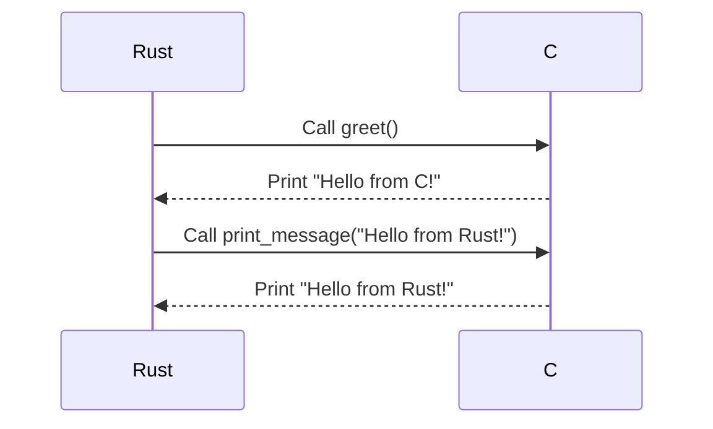

## 15.13. The Foreign Function Interface (FFI) Pattern

The Foreign Function Interface (FFI) pattern in Rust is a powerful tool that allows Rust programs to call functions written in other languages, such as C, and vice versa. This capability is crucial for integrating Rust into existing systems, leveraging existing libraries, and enhancing Rust's functionality with code written in other languages. In this section, we will explore the mechanics of FFI in Rust, discuss best practices for safe interoperability, and provide examples of wrapping complex C libraries.

### Understanding FFI in Rust

FFI is a mechanism that allows a program written in one language to call functions or use services written in another language. In Rust, FFI is primarily used to interface with C libraries, given C's widespread use and compatibility with many systems. Rust provides the `extern` keyword to declare functions and variables that are implemented in another language.

#### Basic FFI Example

Let's start with a simple example of calling a C function from Rust. Suppose we have a C library with the following function:

```c
// C code
#include <stdio.h>

void greet() {
    printf("Hello from C!\n");
}
```

To call this function from Rust, we need to declare it using the `extern` block:

```rust
// Rust code
extern "C" {
    fn greet();
}

fn main() {
    unsafe {
        greet();
    }
}
```

- **Explanation**: The `extern "C"` block declares the `greet` function as an external function with the C calling convention. The `unsafe` block is necessary because calling foreign functions is inherently unsafe due to potential mismatches in calling conventions and memory safety guarantees.

### Managing ABI Stability and Versioning

ABI (Application Binary Interface) stability is crucial when interfacing with foreign functions. The ABI defines how functions are called at the binary level, including details like calling conventions, data types, and memory layout. Rust's ABI is not stable, meaning that it can change between compiler versions. Therefore, when using FFI, it's essential to ensure that the ABI of the foreign code is stable.

#### Strategies for ABI Stability

1. **Use C Libraries**: C has a stable ABI, making it a reliable choice for FFI. Ensure that the C library you are interfacing with maintains ABI stability across versions.

2. **Versioning**: Use versioned symbols or library versioning to manage changes in the foreign library's ABI. This can help prevent compatibility issues when the library is updated.

3. **Testing**: Regularly test the integration to catch any ABI-related issues early. Automated tests can help ensure that changes in the foreign library do not break the Rust code.

### Handling Ownership and Lifetimes Across Language Boundaries

One of Rust's core features is its ownership model, which ensures memory safety without a garbage collector. However, when interfacing with foreign code, especially C, which does not have a similar ownership model, managing ownership and lifetimes becomes challenging.

#### Ownership and Lifetimes in FFI

- **Ownership**: When passing data between Rust and C, it's crucial to define who owns the data and who is responsible for freeing it. Rust's ownership model does not automatically apply to foreign code, so you must manually manage memory.

- **Lifetimes**: Rust's lifetime annotations do not extend to foreign code. You must ensure that any references passed to or from foreign functions remain valid for the duration of their use.

#### Example: Passing Strings to C

Consider a function in C that takes a string as an argument:

```c
// C code
#include <stdio.h>

void print_message(const char* message) {
    printf("%s\n", message);
}
```

To call this function from Rust, you need to convert a Rust string to a C-compatible string:

```rust
// Rust code
use std::ffi::CString;
use std::os::raw::c_char;

extern "C" {
    fn print_message(message: *const c_char);
}

fn main() {
    let message = CString::new("Hello from Rust!").expect("CString::new failed");
    unsafe {
        print_message(message.as_ptr());
    }
}
```

- **Explanation**: We use `CString` to create a C-compatible string. The `as_ptr` method returns a pointer to the C string, which can be passed to the foreign function. It's important to ensure that the `CString` outlives the call to `print_message`.

### Safety Patterns and Minimizing `unsafe` Code

FFI inherently involves `unsafe` code because Rust cannot guarantee the safety of foreign functions. However, there are patterns and practices you can follow to minimize the risks associated with `unsafe` code.

#### Safety Patterns

1. **Encapsulation**: Encapsulate `unsafe` code within safe abstractions. Provide a safe API that handles all the `unsafe` interactions internally.

2. **Validation**: Validate inputs and outputs when interfacing with foreign functions. Ensure that any data passed to or received from foreign code is valid and within expected bounds.

3. **Error Handling**: Use Rust's error handling mechanisms (`Result` and `Option`) to handle errors gracefully. Convert foreign error codes into Rust's error types.

4. **Documentation**: Clearly document the safety invariants and assumptions of any `unsafe` code. This helps maintainers understand the risks and requirements.

#### Example: Safe Wrapper for a C Library

Suppose we have a C library that provides a function to add two integers:

```c
// C code
int add(int a, int b) {
    return a + b;
}
```

We can create a safe Rust wrapper for this function:

```rust
// Rust code
extern "C" {
    fn add(a: i32, b: i32) -> i32;
}

fn safe_add(a: i32, b: i32) -> i32 {
    unsafe { add(a, b) }
}

fn main() {
    let result = safe_add(3, 4);
    println!("The sum is: {}", result);
}
```

- **Explanation**: The `safe_add` function provides a safe abstraction over the `add` function. It encapsulates the `unsafe` call, ensuring that users of `safe_add` do not need to deal with `unsafe` code directly.

### Wrapping Complex C Libraries

When working with complex C libraries, it's often necessary to create Rust bindings that provide a safe and idiomatic interface. This involves several steps:

1. **Generate Bindings**: Use tools like `bindgen` to automatically generate Rust bindings for C libraries. This tool parses C headers and generates Rust code that can be used to call C functions.

2. **Create Safe Abstractions**: Wrap the generated bindings in safe Rust abstractions. This involves creating Rust structs and methods that encapsulate the functionality of the C library.

3. **Manage Resources**: Ensure that any resources allocated by the C library are properly managed. This may involve implementing `Drop` for Rust structs to free resources when they go out of scope.

4. **Handle Errors**: Convert C error codes into Rust's error handling types. This provides a more idiomatic way to handle errors in Rust.

#### Example: Wrapping a C Library

Let's consider a hypothetical C library for managing a simple database:

```c
// C code
typedef struct Database Database;

Database* db_open(const char* filename);
void db_close(Database* db);
int db_query(Database* db, const char* query, char* result, int result_size);
```

We can create Rust bindings and a safe wrapper for this library:

```rust
// Rust code
use std::ffi::CString;
use std::ptr;
use std::os::raw::{c_char, c_int};

#[repr(C)]
struct Database;

extern "C" {
    fn db_open(filename: *const c_char) -> *mut Database;
    fn db_close(db: *mut Database);
    fn db_query(db: *mut Database, query: *const c_char, result: *mut c_char, result_size: c_int) -> c_int;
}

struct SafeDatabase {
    db: *mut Database,
}

impl SafeDatabase {
    fn open(filename: &str) -> Option<Self> {
        let c_filename = CString::new(filename).ok()?;
        let db = unsafe { db_open(c_filename.as_ptr()) };
        if db.is_null() {
            None
        } else {
            Some(SafeDatabase { db })
        }
    }

    fn query(&self, query: &str) -> Result<String, &'static str> {
        let c_query = CString::new(query).map_err(|_| "Invalid query string")?;
        let mut result = vec![0 as c_char; 256];
        let ret = unsafe { db_query(self.db, c_query.as_ptr(), result.as_mut_ptr(), result.len() as c_int) };
        if ret == 0 {
            let c_str = unsafe { CString::from_vec_unchecked(result) };
            c_str.into_string().map_err(|_| "Failed to convert result")
        } else {
            Err("Query failed")
        }
    }
}

impl Drop for SafeDatabase {
    fn drop(&mut self) {
        unsafe { db_close(self.db) };
    }
}

fn main() {
    if let Some(db) = SafeDatabase::open("my_database.db") {
        match db.query("SELECT * FROM users") {
            Ok(result) => println!("Query result: {}", result),
            Err(err) => println!("Error: {}", err),
        }
    } else {
        println!("Failed to open database");
    }
}
```

- **Explanation**: The `SafeDatabase` struct provides a safe interface to the C library. It manages the database resource, ensuring it is closed when the struct is dropped. The `query` method handles errors and converts the result into a Rust `String`.

### Visualizing FFI Interactions

To better understand the flow of data and control between Rust and C, let's visualize the FFI interaction using a sequence diagram.



- **Description**: This diagram illustrates the sequence of function calls between Rust and C. Rust calls the `greet` function in C, which prints a message. Then, Rust calls `print_message` with a string, which C prints.

### Best Practices for FFI in Rust

1. **Minimize `unsafe` Code**: Encapsulate `unsafe` code within safe abstractions. Use `unsafe` only when necessary and document the safety invariants.

2. **Validate Inputs and Outputs**: Ensure that any data passed to or received from foreign functions is valid and within expected bounds.

3. **Use Tools**: Leverage tools like `bindgen` to generate bindings and `cbindgen` to generate C headers from Rust code.

4. **Test Thoroughly**: Regularly test the integration to catch any issues early. Use automated tests to ensure compatibility with foreign libraries.

5. **Document Assumptions**: Clearly document any assumptions or invariants related to `unsafe` code and FFI interactions.

### Rust Unique Features in FFI

Rust's ownership model and type system provide unique advantages when working with FFI:

- **Ownership**: Rust's ownership model can help manage resources and prevent memory leaks when interfacing with foreign code.

- **Type Safety**: Rust's type system can catch many errors at compile time, reducing runtime errors when working with foreign functions.

- **Concurrency**: Rust's concurrency model can be leveraged to safely call foreign functions from multiple threads.

### Differences and Similarities with Other Patterns

FFI is often compared to other interoperability patterns, such as:

- **JNI (Java Native Interface)**: Similar to FFI, JNI allows Java code to call native functions. However, JNI is specific to Java, while FFI is more general.

- **P/Invoke (Platform Invocation Services)**: Used in .NET to call unmanaged code, P/Invoke is similar to FFI but specific to the .NET ecosystem.

- **SWIG (Simplified Wrapper and Interface Generator)**: A tool that generates bindings for various languages, SWIG is more automated but less flexible than manually writing FFI code.

### Conclusion

The Foreign Function Interface (FFI) pattern in Rust is a powerful tool for integrating Rust with other languages, particularly C. By following best practices and leveraging Rust's unique features, you can safely and effectively use FFI to enhance your Rust applications. Remember, this is just the beginning. As you progress, you'll build more complex integrations and gain deeper insights into Rust's capabilities. Keep experimenting, stay curious, and enjoy the journey!

## Quiz Time!



### What is the primary purpose of the Foreign Function Interface (FFI) in Rust?

- [x] To allow Rust programs to call functions written in other languages, such as C.
- [ ] To enable Rust programs to run on different operating systems.
- [ ] To provide a graphical user interface for Rust applications.
- [ ] To compile Rust code into machine code.

> **Explanation:** FFI is used to call functions written in other languages, allowing Rust to interoperate with existing libraries and systems.

### Which keyword is used in Rust to declare functions implemented in another language?

- [ ] `unsafe`
- [x] `extern`
- [ ] `foreign`
- [ ] `import`

> **Explanation:** The `extern` keyword is used to declare functions that are implemented in another language.

### What is ABI stability, and why is it important in FFI?

- [x] ABI stability ensures that the binary interface remains consistent, preventing compatibility issues.
- [ ] ABI stability ensures that the source code remains consistent across versions.
- [ ] ABI stability is not relevant to FFI.
- [ ] ABI stability ensures that the graphical interface remains consistent.

> **Explanation:** ABI stability is crucial for ensuring that the binary interface between Rust and foreign code remains consistent, preventing compatibility issues.

### How can you minimize the risks associated with `unsafe` code in FFI?

- [x] Encapsulate `unsafe` code within safe abstractions.
- [ ] Avoid using `unsafe` code altogether.
- [ ] Use `unsafe` code liberally to ensure flexibility.
- [ ] Ignore the risks, as they are negligible.

> **Explanation:** Encapsulating `unsafe` code within safe abstractions helps minimize risks by providing a safe API for users.

### What tool can be used to automatically generate Rust bindings for C libraries?

- [ ] `cargo`
- [ ] `rustc`
- [x] `bindgen`
- [ ] `clippy`

> **Explanation:** `bindgen` is a tool that automatically generates Rust bindings for C libraries by parsing C headers.

### What is the role of the `CString` type in Rust's FFI?

- [x] To create a C-compatible string that can be passed to foreign functions.
- [ ] To create a Rust-compatible string from C strings.
- [ ] To manage memory allocation for Rust strings.
- [ ] To convert Rust strings into integers.

> **Explanation:** `CString` is used to create C-compatible strings that can be safely passed to foreign functions.

### Which Rust feature helps manage resources and prevent memory leaks in FFI?

- [ ] Macros
- [ ] Traits
- [x] Ownership
- [ ] Modules

> **Explanation:** Rust's ownership model helps manage resources and prevent memory leaks when interfacing with foreign code.

### What is the purpose of the `Drop` trait in the context of FFI?

- [x] To ensure that resources allocated by foreign code are properly freed.
- [ ] To convert foreign data types into Rust data types.
- [ ] To handle errors returned by foreign functions.
- [ ] To encapsulate `unsafe` code within safe abstractions.

> **Explanation:** The `Drop` trait is used to ensure that resources allocated by foreign code are properly freed when they go out of scope.

### True or False: Rust's lifetime annotations automatically apply to foreign code.

- [ ] True
- [x] False

> **Explanation:** Rust's lifetime annotations do not extend to foreign code, so you must manually ensure that references remain valid.

### What is a key advantage of using Rust's type system in FFI?

- [x] It can catch many errors at compile time, reducing runtime errors.
- [ ] It allows for dynamic typing of foreign functions.
- [ ] It simplifies the conversion of foreign data types.
- [ ] It provides a graphical interface for foreign functions.

> **Explanation:** Rust's type system can catch many errors at compile time, reducing the likelihood of runtime errors when working with foreign functions.


