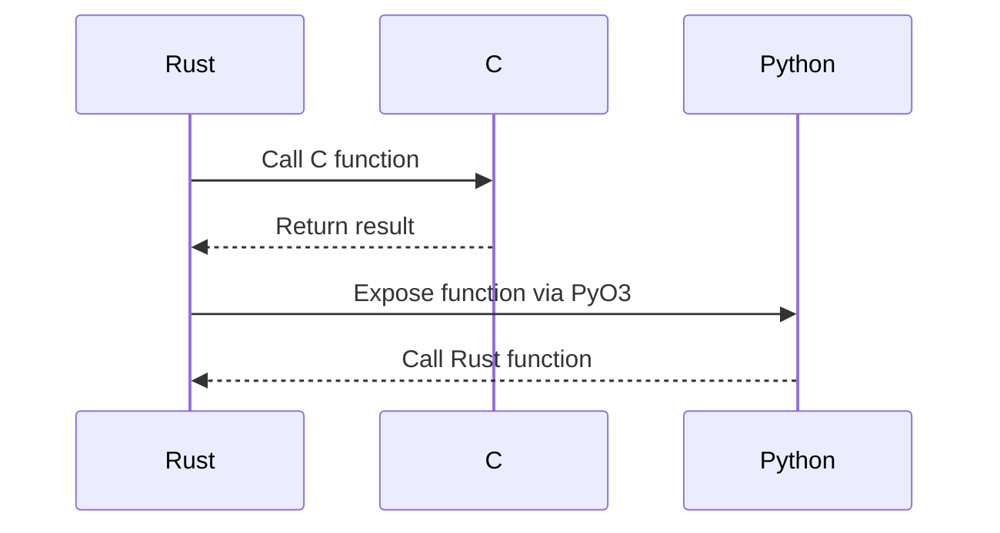

## 15.14. Cross-Language Interoperability Patterns

In today's software ecosystem, the ability to integrate multiple programming languages within a single system is crucial. Rust, with its focus on safety and performance, often finds itself at the core of such systems. This section explores the various patterns and techniques for achieving cross-language interoperability with Rust, enabling seamless integration with languages like C, Python, Java, and more.

### Understanding Cross-Language Interoperability

Cross-language interoperability refers to the ability of code written in one programming language to interact with code written in another. This is essential for leveraging the strengths of different languages within a single application. Rust provides several mechanisms to facilitate this, including Foreign Function Interface (FFI), language-specific bindings, and Inter-Process Communication (IPC).

### Approaches to Cross-Language Interoperability

#### 1. Foreign Function Interface (FFI)

FFI is a mechanism that allows a program written in one language to call functions or use services written in another. Rust's FFI primarily targets C, due to C's widespread use and its status as a lingua franca for system-level programming.

**Example: Integrating Rust with C**

```rust
// Rust code
#[no_mangle]
pub extern "C" fn add(a: i32, b: i32) -> i32 {
    a + b
}
```

```c
// C code
#include <stdio.h>

extern int add(int a, int b);

int main() {
    int result = add(5, 3);
    printf("Result: %d\n", result);
    return 0;
}
```

**Key Points:**

- **`#[no_mangle]`**: Prevents Rust from changing the function name during compilation, ensuring it can be called from C.
- **`extern "C"`**: Specifies the C calling convention, which is necessary for interoperability.

#### 2. Language-Specific Bindings

Bindings are libraries or interfaces that allow one language to use code written in another. Rust has several tools and libraries to facilitate this process.

**Example: Using Rust with Python via PyO3**

PyO3 is a library that allows Rust to interface with Python, enabling Rust functions to be called from Python and vice versa.

```rust
// Rust code using PyO3
use pyo3::prelude::*;

#[pyfunction]
fn add(a: i32, b: i32) -> PyResult<i32> {
    Ok(a + b)
}

#[pymodule]
fn my_rust_module(py: Python, m: &PyModule) -> PyResult<()> {
    m.add_function(wrap_pyfunction!(add, m)?)?;
    Ok(())
}
```

```python
# Python code
import my_rust_module

result = my_rust_module.add(5, 3)
print(f"Result: {result}")
```

**Key Points:**

- **PyO3**: Provides macros and utilities to expose Rust functions to Python.
- **`#[pyfunction]` and `#[pymodule]`**: Decorators to define Python-callable functions and modules.

#### 3. Inter-Process Communication (IPC)

IPC mechanisms allow separate processes to communicate, which can be used for cross-language interoperability when direct function calls are not feasible.

**Example: Using IPC with Rust and Java**

Rust and Java can communicate using a message queue or shared memory.

```rust
// Rust code using IPC (e.g., message queue)
use std::sync::mpsc;
use std::thread;

fn main() {
    let (tx, rx) = mpsc::channel();

    thread::spawn(move || {
        tx.send("Hello from Rust!").unwrap();
    });

    println!("Received: {}", rx.recv().unwrap());
}
```

```java
// Java code using IPC (e.g., message queue)
import java.util.concurrent.ArrayBlockingQueue;
import java.util.concurrent.BlockingQueue;

public class Main {
    public static void main(String[] args) throws InterruptedException {
        BlockingQueue<String> queue = new ArrayBlockingQueue<>(10);

        new Thread(() -> {
            try {
                queue.put("Hello from Java!");
            } catch (InterruptedException e) {
                Thread.currentThread().interrupt();
            }
        }).start();

        System.out.println("Received: " + queue.take());
    }
}
```

**Key Points:**

- **Message Queues**: Facilitate communication between processes written in different languages.
- **BlockingQueue (Java)** and **mpsc (Rust)**: Commonly used for IPC.

### Managing Data Serialization

Data serialization is crucial for cross-language communication, especially when using IPC. Common serialization formats include JSON, Protocol Buffers, and MessagePack.

**Example: Using Serde for JSON Serialization**

Serde is a powerful serialization library in Rust that supports JSON, among other formats.

```rust
// Rust code using Serde for JSON serialization
use serde::{Serialize, Deserialize};
use serde_json;

#[derive(Serialize, Deserialize)]
struct Data {
    name: String,
    value: i32,
}

fn main() {
    let data = Data {
        name: "example".to_string(),
        value: 42,
    };

    let json = serde_json::to_string(&data).unwrap();
    println!("Serialized: {}", json);

    let deserialized: Data = serde_json::from_str(&json).unwrap();
    println!("Deserialized: {:?}", deserialized);
}
```

**Key Points:**

- **Serde**: Provides a flexible and efficient way to serialize and deserialize data.
- **JSON**: A widely-used format for data interchange between languages.

### Challenges in Cross-Language Interoperability

#### 1. Memory Management

Rust's ownership model ensures memory safety, but this can complicate interoperability with languages that have different memory management strategies.

**Solution:**

- Use smart pointers like `Box`, `Rc`, and `Arc` to manage memory when interfacing with other languages.
- Ensure that memory allocated in Rust is properly deallocated, especially when exposed to languages with garbage collection.

#### 2. Error Handling

Different languages have different error handling mechanisms, which can lead to challenges in cross-language communication.

**Solution:**

- Use Rust's `Result` and `Option` types to handle errors gracefully.
- Convert Rust errors into a format that can be understood by the target language, such as error codes or exceptions.

### Tools and Frameworks for Interoperability

Several tools and frameworks can simplify cross-language interoperability with Rust:

- **cbindgen**: Generates C header files from Rust code, facilitating integration with C/C++.
- **PyO3**: Provides seamless integration with Python.
- **jni-rs**: Enables Rust to interface with Java through the Java Native Interface (JNI).
- **wasm-bindgen**: Facilitates interaction between Rust and JavaScript/WebAssembly.

### Visualizing Cross-Language Interoperability

To better understand the flow of data and control between languages, let's visualize a typical cross-language interoperability scenario using a sequence diagram.



**Diagram Description:**

- **Rust** calls a function in **C** using FFI.
- **C** returns a result to **Rust**.
- **Rust** exposes a function to **Python** using PyO3.
- **Python** calls the function, demonstrating cross-language interaction.

### Best Practices for Cross-Language Interoperability

- **Design for Simplicity**: Keep interfaces simple and well-documented to minimize errors and misunderstandings.
- **Use Standard Formats**: Leverage widely-used serialization formats like JSON or Protocol Buffers for data interchange.
- **Test Thoroughly**: Ensure that cross-language interactions are thoroughly tested to catch edge cases and potential errors.
- **Monitor Performance**: Be aware of the performance implications of cross-language calls, especially in performance-critical applications.

### Conclusion

Cross-language interoperability is a powerful tool for leveraging the strengths of multiple programming languages within a single system. By understanding and applying the patterns and techniques discussed in this section, you can effectively integrate Rust with other languages, creating robust and efficient multi-language systems.

### Try It Yourself

Experiment with the examples provided in this section. Try modifying the Rust functions to perform different operations, or explore integrating Rust with other languages like JavaScript or Ruby. Remember, the key to mastering cross-language interoperability is practice and experimentation.

## Quiz Time!



### What is the primary mechanism for Rust to interact with C?

- [x] Foreign Function Interface (FFI)
- [ ] Inter-Process Communication (IPC)
- [ ] Language-Specific Bindings
- [ ] Serialization

> **Explanation:** FFI is the primary mechanism for Rust to interact with C, allowing Rust to call C functions and vice versa.

### Which Rust library is commonly used for JSON serialization?

- [x] Serde
- [ ] PyO3
- [ ] cbindgen
- [ ] jni-rs

> **Explanation:** Serde is a powerful serialization library in Rust that supports JSON, among other formats.

### What is the purpose of the `#[no_mangle]` attribute in Rust?

- [x] Prevents Rust from changing the function name during compilation
- [ ] Specifies the C calling convention
- [ ] Enables JSON serialization
- [ ] Facilitates IPC

> **Explanation:** The `#[no_mangle]` attribute prevents Rust from changing the function name during compilation, ensuring it can be called from C.

### Which tool is used to generate C header files from Rust code?

- [x] cbindgen
- [ ] PyO3
- [ ] wasm-bindgen
- [ ] jni-rs

> **Explanation:** cbindgen is used to generate C header files from Rust code, facilitating integration with C/C++.

### What is a common challenge in cross-language interoperability?

- [x] Memory management
- [ ] JSON serialization
- [ ] Using smart pointers
- [ ] Writing unit tests

> **Explanation:** Memory management is a common challenge in cross-language interoperability due to different memory management strategies in different languages.

### Which Rust library facilitates interaction with Python?

- [x] PyO3
- [ ] Serde
- [ ] cbindgen
- [ ] jni-rs

> **Explanation:** PyO3 is a library that allows Rust to interface with Python, enabling Rust functions to be called from Python and vice versa.

### What is a benefit of using IPC for cross-language communication?

- [x] Allows separate processes to communicate
- [ ] Prevents memory leaks
- [ ] Simplifies error handling
- [ ] Enables JSON serialization

> **Explanation:** IPC allows separate processes to communicate, which can be used for cross-language interoperability when direct function calls are not feasible.

### Which serialization format is widely used for data interchange between languages?

- [x] JSON
- [ ] XML
- [ ] YAML
- [ ] CSV

> **Explanation:** JSON is a widely-used format for data interchange between languages due to its simplicity and readability.

### True or False: Rust's ownership model complicates interoperability with languages that have garbage collection.

- [x] True
- [ ] False

> **Explanation:** Rust's ownership model ensures memory safety, but it can complicate interoperability with languages that have different memory management strategies, such as garbage collection.

### Which Rust library enables interaction with Java through JNI?

- [x] jni-rs
- [ ] PyO3
- [ ] Serde
- [ ] cbindgen

> **Explanation:** jni-rs enables Rust to interface with Java through the Java Native Interface (JNI).



Remember, cross-language interoperability is a journey. Keep experimenting, stay curious, and enjoy the process of integrating Rust with other languages!
