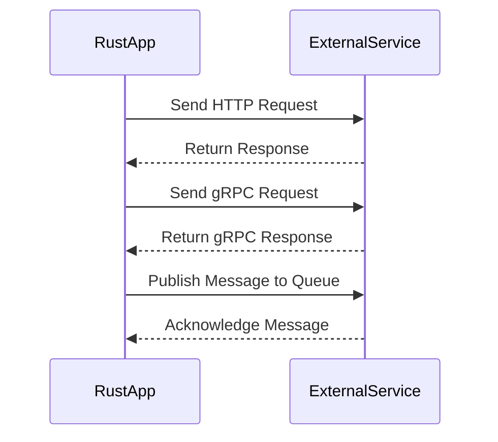

## 15.3. Communicating with External Services

In today's interconnected world, applications often need to communicate with external services to fetch data, send updates, or interact with other systems. Rust, with its strong type system and emphasis on safety, provides robust tools and libraries to facilitate this communication. In this section, we'll explore the common methods for interfacing Rust applications with external services, including HTTP, gRPC, and message queues. We'll also delve into best practices for secure and efficient communication, handling authentication, retries, error handling, and parsing messages in various data formats like JSON, XML, and Protobuf.

### Common Methods for Communicating with External Services

#### HTTP Communication

HTTP is one of the most widely used protocols for communicating with external services. Rust provides several libraries to make HTTP requests, with `reqwest` and `hyper` being two of the most popular choices.

**Reqwest** is a high-level HTTP client that is easy to use and comes with built-in support for asynchronous requests, JSON handling, and more. **Hyper**, on the other hand, is a lower-level HTTP library that offers more control and flexibility, making it suitable for performance-critical applications.

##### Making HTTP Requests with Reqwest

Let's start by demonstrating how to make a simple HTTP GET request using `reqwest`.

```rust
// Add reqwest to your Cargo.toml
// [dependencies]
// reqwest = { version = "0.11", features = ["json"] }

use reqwest::Error;

#[tokio::main]
async fn main() -> Result<(), Error> {
    // Define the URL of the external service
    let url = "https://api.example.com/data";

    // Send a GET request
    let response = reqwest::get(url).await?;

    // Check if the request was successful
    if response.status().is_success() {
        // Parse the response body as JSON
        let json: serde_json::Value = response.json().await?;
        println!("Response JSON: {:?}", json);
    } else {
        println!("Failed to fetch data: {}", response.status());
    }

    Ok(())
}
```

**Key Points:**
- We use `tokio::main` to run our asynchronous main function.
- `reqwest::get` sends an HTTP GET request and returns a `Result` containing the response.
- We check the response status and parse the body as JSON using `serde_json`.

##### Handling Authentication

When communicating with external services, authentication is often required. `Reqwest` supports various authentication methods, including Basic Auth, Bearer Tokens, and more.

```rust
use reqwest::Client;
use reqwest::Error;

#[tokio::main]
async fn main() -> Result<(), Error> {
    let client = Client::new();
    let url = "https://api.example.com/protected";

    // Use Bearer token for authentication
    let token = "your_access_token";
    let response = client
        .get(url)
        .bearer_auth(token)
        .send()
        .await?;

    if response.status().is_success() {
        let json: serde_json::Value = response.json().await?;
        println!("Authenticated response: {:?}", json);
    } else {
        println!("Authentication failed: {}", response.status());
    }

    Ok(())
}
```

**Key Points:**
- We create a `Client` instance to manage requests.
- `bearer_auth` is used to add a Bearer token to the request headers.

##### Error Handling and Retries

Handling errors and implementing retries are crucial for robust communication with external services. Let's see how we can handle errors and retry failed requests using `reqwest`.

```rust
use reqwest::Client;
use reqwest::Error;
use tokio::time::{sleep, Duration};

#[tokio::main]
async fn main() -> Result<(), Error> {
    let client = Client::new();
    let url = "https://api.example.com/data";

    let mut retries = 3;
    while retries > 0 {
        let response = client.get(url).send().await;

        match response {
            Ok(resp) if resp.status().is_success() => {
                let json: serde_json::Value = resp.json().await?;
                println!("Successful response: {:?}", json);
                break;
            }
            Ok(resp) => {
                println!("Request failed with status: {}", resp.status());
            }
            Err(err) => {
                println!("Request error: {}", err);
            }
        }

        retries -= 1;
        if retries > 0 {
            println!("Retrying... ({} retries left)", retries);
            sleep(Duration::from_secs(2)).await;
        }
    }

    Ok(())
}
```

**Key Points:**
- We use a loop to retry the request up to three times.
- `tokio::time::sleep` is used to introduce a delay between retries.

#### gRPC Communication

gRPC is a high-performance, open-source RPC framework that uses HTTP/2 for transport and Protocol Buffers for message serialization. Rust has excellent support for gRPC through libraries like `tonic`.

##### Setting Up gRPC with Tonic

To use gRPC in Rust, you'll need to define your service and messages using Protocol Buffers. Here's a simple example of a gRPC service definition:

```protobuf
syntax = "proto3";

package example;

service Greeter {
  rpc SayHello (HelloRequest) returns (HelloReply);
}

message HelloRequest {
  string name = 1;
}

message HelloReply {
  string message = 1;
}
```

After defining your service, you can generate Rust code using `tonic-build` and implement the server and client.

```rust
// Add tonic and tonic-build to your Cargo.toml
// [dependencies]
// tonic = "0.4"
// tokio = { version = "1", features = ["full"] }

// [build-dependencies]
// tonic-build = "0.4"

use tonic::{transport::Server, Request, Response, Status};
use example::greeter_server::{Greeter, GreeterServer};
use example::{HelloRequest, HelloReply};

pub mod example {
    tonic::include_proto!("example");
}

#[derive(Default)]
pub struct MyGreeter {}

#[tonic::async_trait]
impl Greeter for MyGreeter {
    async fn say_hello(
        &self,
        request: Request<HelloRequest>,
    ) -> Result<Response<HelloReply>, Status> {
        let reply = example::HelloReply {
            message: format!("Hello {}!", request.into_inner().name),
        };
        Ok(Response::new(reply))
    }
}

#[tokio::main]
async fn main() -> Result<(), Box<dyn std::error::Error>> {
    let addr = "[::1]:50051".parse()?;
    let greeter = MyGreeter::default();

    println!("GreeterServer listening on {}", addr);

    Server::builder()
        .add_service(GreeterServer::new(greeter))
        .serve(addr)
        .await?;

    Ok(())
}
```

**Key Points:**
- We define a gRPC service using Protocol Buffers.
- `tonic::include_proto!` is used to include the generated code.
- We implement the `Greeter` trait for our service.

#### Message Queues

Message queues are essential for decoupling services and ensuring reliable communication. Rust supports various message queue systems, including RabbitMQ and Kafka.

##### Communicating with RabbitMQ

To communicate with RabbitMQ, you can use the `lapin` library, which provides an asynchronous client for AMQP.

```rust
// Add lapin and tokio to your Cargo.toml
// [dependencies]
// lapin = "1.6"
// tokio = { version = "1", features = ["full"] }

use lapin::{options::*, types::FieldTable, BasicProperties, Connection, ConnectionProperties};
use tokio_amqp::*;

#[tokio::main]
async fn main() -> Result<(), Box<dyn std::error::Error>> {
    let addr = std::env::var("AMQP_ADDR").unwrap_or_else(|_| "amqp://127.0.0.1:5672/%2f".into());
    let conn = Connection::connect(&addr, ConnectionProperties::default().with_tokio()).await?;
    let channel = conn.create_channel().await?;

    let queue = channel.queue_declare(
        "hello",
        QueueDeclareOptions::default(),
        FieldTable::default(),
    ).await?;

    let payload = b"Hello, world!";
    channel.basic_publish(
        "",
        "hello",
        BasicPublishOptions::default(),
        payload.to_vec(),
        BasicProperties::default(),
    ).await?;

    println!("Sent message: {:?}", payload);

    Ok(())
}
```

**Key Points:**
- We use `lapin` to connect to RabbitMQ and declare a queue.
- `basic_publish` is used to send a message to the queue.

### Best Practices for Secure and Efficient Communication

1. **Use HTTPS**: Always use HTTPS for secure communication to protect data in transit.
2. **Handle Authentication Securely**: Use secure methods for storing and transmitting authentication credentials, such as environment variables or secure vaults.
3. **Implement Retries with Exponential Backoff**: To handle transient errors, implement retries with exponential backoff to avoid overwhelming the service.
4. **Validate and Sanitize Inputs**: Ensure that all inputs are validated and sanitized to prevent injection attacks.
5. **Use Timeouts**: Set appropriate timeouts for network requests to avoid hanging indefinitely.
6. **Log and Monitor**: Implement logging and monitoring to track communication issues and performance.

### Parsing and Constructing Messages

#### JSON

JSON is a lightweight data interchange format that is easy to read and write. Rust's `serde_json` library provides powerful tools for parsing and constructing JSON.

```rust
use serde::{Deserialize, Serialize};
use serde_json::Result;

#[derive(Serialize, Deserialize)]
struct User {
    name: String,
    age: u8,
    email: String,
}

fn main() -> Result<()> {
    let user = User {
        name: "Alice".to_string(),
        age: 30,
        email: "alice@example.com".to_string(),
    };

    // Serialize the User struct to a JSON string
    let json = serde_json::to_string(&user)?;
    println!("Serialized JSON: {}", json);

    // Deserialize the JSON string back to a User struct
    let deserialized_user: User = serde_json::from_str(&json)?;
    println!("Deserialized User: {:?}", deserialized_user);

    Ok(())
}
```

**Key Points:**
- `serde` is used to derive `Serialize` and `Deserialize` traits for the `User` struct.
- `serde_json::to_string` and `serde_json::from_str` are used for serialization and deserialization.

#### XML

XML is another common data format, especially in legacy systems. The `quick-xml` library can be used to parse and construct XML in Rust.

```rust
use quick_xml::de::from_str;
use quick_xml::se::to_string;
use serde::{Deserialize, Serialize};

#[derive(Debug, Serialize, Deserialize)]
struct User {
    name: String,
    age: u8,
    email: String,
}

fn main() -> Result<(), Box<dyn std::error::Error>> {
    let user = User {
        name: "Bob".to_string(),
        age: 25,
        email: "bob@example.com".to_string(),
    };

    // Serialize the User struct to an XML string
    let xml = to_string(&user)?;
    println!("Serialized XML: {}", xml);

    // Deserialize the XML string back to a User struct
    let deserialized_user: User = from_str(&xml)?;
    println!("Deserialized User: {:?}", deserialized_user);

    Ok(())
}
```

**Key Points:**
- `quick_xml` is used for XML serialization and deserialization.
- The process is similar to JSON, using `to_string` and `from_str`.

#### Protobuf

Protocol Buffers (Protobuf) is a language-neutral, platform-neutral extensible mechanism for serializing structured data. Rust's `prost` library can be used to work with Protobuf.

```protobuf
syntax = "proto3";

message User {
  string name = 1;
  uint32 age = 2;
  string email = 3;
}
```

```rust
// Add prost and prost-build to your Cargo.toml
// [dependencies]
// prost = "0.8"
// tokio = { version = "1", features = ["full"] }

// [build-dependencies]
// prost-build = "0.8"

use prost::Message;

#[derive(Message)]
struct User {
    #[prost(string, tag = "1")]
    name: String,
    #[prost(uint32, tag = "2")]
    age: u32,
    #[prost(string, tag = "3")]
    email: String,
}

fn main() -> Result<(), Box<dyn std::error::Error>> {
    let user = User {
        name: "Charlie".to_string(),
        age: 28,
        email: "charlie@example.com".to_string(),
    };

    // Serialize the User struct to a Protobuf message
    let mut buf = Vec::new();
    user.encode(&mut buf)?;
    println!("Serialized Protobuf: {:?}", buf);

    // Deserialize the Protobuf message back to a User struct
    let deserialized_user = User::decode(&buf[..])?;
    println!("Deserialized User: {:?}", deserialized_user);

    Ok(())
}
```

**Key Points:**
- `prost` is used to define and work with Protobuf messages.
- `encode` and `decode` methods are used for serialization and deserialization.

### Visualizing Communication Flow

To better understand the communication flow between a Rust application and external services, let's visualize it using a sequence diagram.



**Diagram Description:**
- The diagram illustrates the sequence of interactions between a Rust application and an external service using HTTP, gRPC, and message queues.

### Knowledge Check

- What are the benefits of using `reqwest` for HTTP communication in Rust?
- How can you handle authentication when making HTTP requests?
- What is the purpose of implementing retries with exponential backoff?
- How does gRPC differ from HTTP in terms of communication?
- What are the advantages of using message queues for communication between services?

### Embrace the Journey

Remember, communicating with external services is a fundamental aspect of modern software development. As you continue to explore Rust's capabilities, you'll find that its strong type system and emphasis on safety make it an excellent choice for building robust and efficient applications. Keep experimenting, stay curious, and enjoy the journey!

## Quiz Time!



### What library is commonly used for making HTTP requests in Rust?

- [x] reqwest
- [ ] serde
- [ ] tonic
- [ ] lapin

> **Explanation:** `reqwest` is a popular library for making HTTP requests in Rust.

### Which library is used for gRPC communication in Rust?

- [ ] reqwest
- [x] tonic
- [ ] hyper
- [ ] serde_json

> **Explanation:** `tonic` is a library used for gRPC communication in Rust.

### What is the benefit of using message queues?

- [x] Decoupling services
- [ ] Faster HTTP requests
- [ ] Easier JSON parsing
- [ ] Simplified authentication

> **Explanation:** Message queues help in decoupling services and ensuring reliable communication.

### How can you handle authentication in HTTP requests using `reqwest`?

- [x] Using bearer_auth method
- [ ] Using serde_json
- [ ] Using tonic
- [ ] Using lapin

> **Explanation:** The `bearer_auth` method in `reqwest` is used to handle authentication.

### What is the purpose of exponential backoff in retries?

- [x] To avoid overwhelming the service
- [ ] To speed up requests
- [ ] To simplify JSON parsing
- [ ] To handle authentication

> **Explanation:** Exponential backoff helps avoid overwhelming the service by gradually increasing the delay between retries.

### Which library is used for parsing and constructing JSON in Rust?

- [ ] tonic
- [x] serde_json
- [ ] lapin
- [ ] hyper

> **Explanation:** `serde_json` is used for parsing and constructing JSON in Rust.

### What is the main advantage of using gRPC over HTTP?

- [x] High-performance communication
- [ ] Easier JSON parsing
- [ ] Simplified authentication
- [ ] Faster retries

> **Explanation:** gRPC offers high-performance communication using HTTP/2 and Protocol Buffers.

### Which library is used for communicating with RabbitMQ in Rust?

- [ ] reqwest
- [ ] tonic
- [x] lapin
- [ ] serde_json

> **Explanation:** `lapin` is used for communicating with RabbitMQ in Rust.

### What is the role of `prost` in Rust?

- [x] Working with Protobuf messages
- [ ] Making HTTP requests
- [ ] Parsing JSON
- [ ] Communicating with RabbitMQ

> **Explanation:** `prost` is used for working with Protobuf messages in Rust.

### True or False: `hyper` is a high-level HTTP client library in Rust.

- [ ] True
- [x] False

> **Explanation:** `hyper` is a lower-level HTTP library that offers more control and flexibility.


