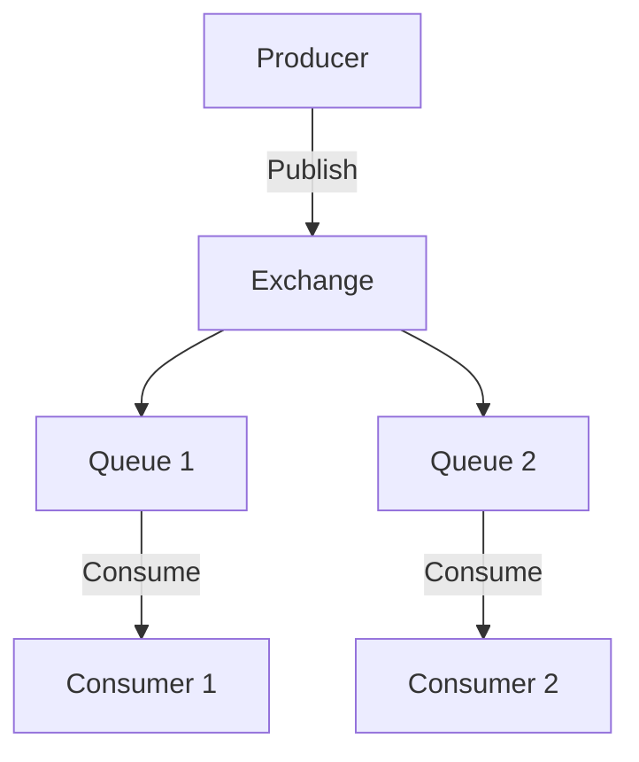

## 15.5. Message Brokers and Queues (RabbitMQ, Kafka)

In modern software architecture, message brokers play a crucial role in enabling asynchronous, decoupled communication between different components of an application. By integrating Rust applications with message brokers like RabbitMQ and Kafka, developers can build scalable, resilient systems that handle high volumes of data efficiently. In this section, we'll explore how to work with these message brokers using Rust, focusing on producing and consuming messages, implementing common patterns, and ensuring reliability and error handling.

### Understanding Message Brokers

Message brokers are systems that facilitate the exchange of information between different parts of an application. They allow for asynchronous communication, meaning that the sender and receiver of a message do not need to interact with the message at the same time. This decoupling of components leads to more scalable and maintainable systems.

#### Key Concepts

- **Message Queue**: A data structure used to store messages until they are processed by a consumer.
- **Producer**: An application or service that sends messages to a message broker.
- **Consumer**: An application or service that receives messages from a message broker.
- **Exchange**: In RabbitMQ, an exchange is responsible for routing messages to different queues based on routing rules.
- **Topic**: In Kafka, a topic is a category or feed name to which records are published.

### Integrating Rust with RabbitMQ

RabbitMQ is a widely-used message broker that supports multiple messaging protocols. It is known for its reliability and ease of use. In Rust, the `lapin` crate is a popular choice for interacting with RabbitMQ.

#### Setting Up RabbitMQ

Before we dive into Rust code, ensure that RabbitMQ is installed and running on your system. You can download it from the [official RabbitMQ website](https://www.rabbitmq.com/download.html).

#### Producing Messages with Lapin

Let's start by creating a simple Rust application that sends messages to a RabbitMQ queue using the `lapin` crate.

```rust
use lapin::{options::*, types::FieldTable, BasicProperties, Connection, ConnectionProperties};
use tokio_amqp::*;

#[tokio::main]
async fn main() {
    // Establish a connection to RabbitMQ
    let conn = Connection::connect("amqp://127.0.0.1:5672/%2f", ConnectionProperties::default().with_tokio()).await.unwrap();

    // Create a channel
    let channel = conn.create_channel().await.unwrap();

    // Declare a queue
    let _queue = channel.queue_declare(
        "hello",
        QueueDeclareOptions::default(),
        FieldTable::default(),
    ).await.unwrap();

    // Publish a message to the queue
    let payload = b"Hello, world!";
    channel.basic_publish(
        "",
        "hello",
        BasicPublishOptions::default(),
        payload.to_vec(),
        BasicProperties::default(),
    ).await.unwrap();

    println!("Sent: {}", String::from_utf8_lossy(payload));
}
```

**Explanation**:
- We establish a connection to RabbitMQ using the `lapin` crate.
- A channel is created, which is a virtual connection inside a connection.
- We declare a queue named "hello" where messages will be sent.
- A message "Hello, world!" is published to the queue.

#### Consuming Messages with Lapin

Now, let's create a consumer that listens for messages from the RabbitMQ queue.

```rust
use lapin::{options::*, types::FieldTable, Connection, ConnectionProperties};
use tokio_amqp::*;
use futures_lite::stream::StreamExt;

#[tokio::main]
async fn main() {
    // Establish a connection to RabbitMQ
    let conn = Connection::connect("amqp://127.0.0.1:5672/%2f", ConnectionProperties::default().with_tokio()).await.unwrap();

    // Create a channel
    let channel = conn.create_channel().await.unwrap();

    // Declare a queue
    let _queue = channel.queue_declare(
        "hello",
        QueueDeclareOptions::default(),
        FieldTable::default(),
    ).await.unwrap();

    // Start consuming messages
    let mut consumer = channel.basic_consume(
        "hello",
        "my_consumer",
        BasicConsumeOptions::default(),
        FieldTable::default(),
    ).await.unwrap();

    println!("Waiting for messages...");

    while let Some(delivery) = consumer.next().await {
        let delivery = delivery.unwrap();
        println!("Received: {}", String::from_utf8_lossy(&delivery.data));
        delivery.ack(BasicAckOptions::default()).await.unwrap();
    }
}
```

**Explanation**:
- We establish a connection and create a channel, similar to the producer.
- We declare the same queue "hello" to ensure it exists.
- We start consuming messages from the queue using `basic_consume`.
- Each message is acknowledged after being processed.

### Integrating Rust with Kafka

Apache Kafka is a distributed event streaming platform capable of handling trillions of events a day. It is designed for high-throughput, fault-tolerant, and scalable systems. In Rust, the `rdkafka` crate provides a client for interacting with Kafka.

#### Setting Up Kafka

Ensure Kafka is installed and running on your system. You can download it from the [official Apache Kafka website](https://kafka.apache.org/downloads).

#### Producing Messages with rdkafka

Let's create a Rust application that sends messages to a Kafka topic using the `rdkafka` crate.

```rust
use rdkafka::config::ClientConfig;
use rdkafka::producer::{BaseProducer, BaseRecord};

fn main() {
    // Create a Kafka producer
    let producer: BaseProducer = ClientConfig::new()
        .set("bootstrap.servers", "localhost:9092")
        .create()
        .expect("Producer creation error");

    // Send a message to the "test" topic
    producer.send(
        BaseRecord::to("test")
            .payload("Hello, Kafka!")
            .key("key"),
    ).expect("Failed to enqueue");

    // Flush the producer to ensure all messages are sent
    producer.flush(std::time::Duration::from_secs(1));
    println!("Message sent to Kafka");
}
```

**Explanation**:
- We configure a Kafka producer with the `bootstrap.servers` setting pointing to the Kafka broker.
- A message "Hello, Kafka!" is sent to the "test" topic.
- We flush the producer to ensure all messages are sent before exiting.

#### Consuming Messages with rdkafka

Now, let's create a consumer that listens for messages from a Kafka topic.

```rust
use rdkafka::config::ClientConfig;
use rdkafka::consumer::{BaseConsumer, Consumer};
use rdkafka::message::Message;

fn main() {
    // Create a Kafka consumer
    let consumer: BaseConsumer = ClientConfig::new()
        .set("group.id", "example_consumer_group")
        .set("bootstrap.servers", "localhost:9092")
        .create()
        .expect("Consumer creation error");

    // Subscribe to the "test" topic
    consumer.subscribe(&["test"]).expect("Can't subscribe to specified topic");

    println!("Waiting for messages...");

    // Poll for messages
    loop {
        match consumer.poll(std::time::Duration::from_millis(100)) {
            Some(Ok(message)) => {
                if let Some(payload) = message.payload() {
                    println!("Received: {}", String::from_utf8_lossy(payload));
                }
            }
            Some(Err(e)) => eprintln!("Error while receiving message: {:?}", e),
            None => (),
        }
    }
}
```

**Explanation**:
- We configure a Kafka consumer with a `group.id` for consumer group management.
- The consumer subscribes to the "test" topic.
- We poll for messages in a loop, printing each received message's payload.

### Patterns in Message Brokers

Message brokers support various messaging patterns that help in designing robust systems. Let's explore some common patterns.

#### Publish/Subscribe

In the Publish/Subscribe pattern, messages are broadcast to multiple consumers. This is useful for scenarios where multiple components need to react to the same event.

- **RabbitMQ**: Use exchanges to route messages to multiple queues.
- **Kafka**: Use topics to broadcast messages to multiple consumers.

#### Work Queues

Work Queues distribute tasks among multiple workers, ensuring that each task is processed by only one worker. This pattern is useful for load balancing and parallel processing.

- **RabbitMQ**: Use queues to distribute messages among consumers.
- **Kafka**: Use partitions to distribute messages among consumers in a consumer group.

#### Routing

Routing allows messages to be delivered to different consumers based on specific criteria. This pattern is useful for directing messages to the appropriate handler.

- **RabbitMQ**: Use routing keys and bindings to direct messages.
- **Kafka**: Use message keys to control partitioning and routing.

### Message Serialization and Data Formats

When working with message brokers, it's important to consider how messages are serialized and deserialized. Common formats include JSON, Avro, and Protocol Buffers.

- **JSON**: Easy to use and human-readable, but less efficient in terms of size and speed.
- **Avro**: A compact binary format with schema evolution support.
- **Protocol Buffers**: A language-agnostic binary format with efficient serialization.

#### Example: Serializing Messages with Serde

```rust
use serde::{Serialize, Deserialize};
use serde_json;

#[derive(Serialize, Deserialize)]
struct Message {
    content: String,
    timestamp: u64,
}

fn main() {
    let message = Message {
        content: "Hello, world!".to_string(),
        timestamp: 1625247600,
    };

    // Serialize the message to JSON
    let serialized = serde_json::to_string(&message).unwrap();
    println!("Serialized: {}", serialized);

    // Deserialize the JSON back to a Message
    let deserialized: Message = serde_json::from_str(&serialized).unwrap();
    println!("Deserialized: {:?}", deserialized);
}
```

**Explanation**:
- We define a `Message` struct with `Serialize` and `Deserialize` traits.
- The message is serialized to JSON using `serde_json`.
- The JSON is deserialized back to a `Message` struct.

### Reliability and Error Handling

Ensuring reliability in message-based systems involves handling errors gracefully and ensuring message delivery guarantees.

#### Error Handling Strategies

- **Retry Mechanisms**: Implement retries for transient errors.
- **Dead Letter Queues**: Use dead letter queues to handle messages that cannot be processed.
- **Idempotency**: Design consumers to handle duplicate messages gracefully.

#### Delivery Guarantees

- **At Most Once**: Messages are delivered once or not at all.
- **At Least Once**: Messages are delivered at least once, but may be duplicated.
- **Exactly Once**: Messages are delivered exactly once, ensuring no duplicates.

### Visualizing Message Flow

To better understand how messages flow through a system, let's visualize a simple Publish/Subscribe pattern using a Mermaid.js diagram.



**Diagram Explanation**:
- The producer publishes messages to an exchange.
- The exchange routes messages to multiple queues.
- Each queue is consumed by a different consumer.

### Conclusion

Integrating Rust applications with message brokers like RabbitMQ and Kafka enables developers to build scalable, decoupled systems. By understanding the key concepts, patterns, and considerations for serialization and reliability, you can effectively leverage these tools in your projects. Remember to experiment with the provided code examples and explore further to deepen your understanding.

### Try It Yourself

- Modify the producer code to send different types of messages.
- Experiment with different message serialization formats.
- Implement a simple Publish/Subscribe system using RabbitMQ or Kafka.

## Quiz Time!



### What is the primary role of a message broker in application architecture?

- [x] Facilitating asynchronous communication between components
- [ ] Storing data persistently
- [ ] Providing a user interface for applications
- [ ] Compiling code into executable binaries

> **Explanation:** Message brokers facilitate asynchronous communication, allowing different components to interact without being directly connected.

### Which Rust crate is commonly used for interacting with RabbitMQ?

- [x] lapin
- [ ] rdkafka
- [ ] serde
- [ ] tokio

> **Explanation:** The `lapin` crate is a popular choice for interacting with RabbitMQ in Rust.

### In Kafka, what is a "topic"?

- [x] A category or feed name to which records are published
- [ ] A type of message queue
- [ ] A consumer group identifier
- [ ] A configuration setting for producers

> **Explanation:** In Kafka, a topic is a category or feed name to which records are published.

### What pattern involves broadcasting messages to multiple consumers?

- [x] Publish/Subscribe
- [ ] Work Queues
- [ ] Routing
- [ ] Load Balancing

> **Explanation:** The Publish/Subscribe pattern involves broadcasting messages to multiple consumers.

### Which of the following is a common message serialization format?

- [x] JSON
- [x] Avro
- [ ] HTML
- [ ] CSS

> **Explanation:** JSON and Avro are common message serialization formats used in message brokers.

### What is a dead letter queue used for?

- [x] Handling messages that cannot be processed
- [ ] Storing messages permanently
- [ ] Encrypting messages for security
- [ ] Compressing messages to save space

> **Explanation:** A dead letter queue is used to handle messages that cannot be processed.

### Which delivery guarantee ensures messages are delivered exactly once?

- [x] Exactly Once
- [ ] At Most Once
- [ ] At Least Once
- [ ] Best Effort

> **Explanation:** The Exactly Once delivery guarantee ensures messages are delivered exactly once, preventing duplicates.

### What is the purpose of a consumer group in Kafka?

- [x] To allow multiple consumers to share the work of consuming messages
- [ ] To store messages persistently
- [ ] To encrypt messages for security
- [ ] To compile code into executable binaries

> **Explanation:** A consumer group allows multiple consumers to share the work of consuming messages from a topic.

### Which crate provides a client for interacting with Kafka in Rust?

- [x] rdkafka
- [ ] lapin
- [ ] serde
- [ ] tokio

> **Explanation:** The `rdkafka` crate provides a client for interacting with Kafka in Rust.

### True or False: In RabbitMQ, an exchange is responsible for routing messages to different queues.

- [x] True
- [ ] False

> **Explanation:** In RabbitMQ, an exchange is responsible for routing messages to different queues based on routing rules.



Remember, this is just the beginning. As you progress, you'll build more complex and interactive systems. Keep experimenting, stay curious, and enjoy the journey!
