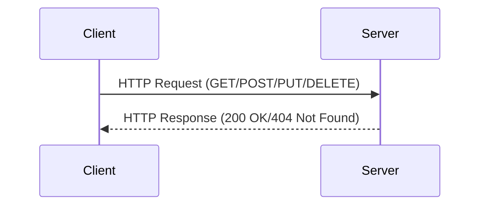

## 15.6. RESTful Services and HTTP Clients

In today's interconnected world, RESTful services have become a cornerstone of web development, enabling seamless communication between different systems. Rust, with its emphasis on safety and performance, provides robust tools for building and consuming RESTful APIs. In this section, we'll explore how to implement RESTful service clients in Rust using popular HTTP client libraries like `reqwest` and `hyper`. We'll cover making various types of HTTP requests, handling authentication, parsing responses, and managing errors effectively.

### Understanding RESTful Services

REST (Representational State Transfer) is an architectural style for designing networked applications. It relies on stateless, client-server communication, typically over HTTP. RESTful services expose resources that can be accessed and manipulated using standard HTTP methods such as GET, POST, PUT, and DELETE.

### Choosing the Right HTTP Client Library

Rust offers several libraries for HTTP communication, each with its own strengths:

- **Reqwest**: A high-level HTTP client library that is easy to use and feature-rich. It supports asynchronous requests, making it suitable for most RESTful service interactions.
- **Hyper**: A low-level HTTP library that provides more control over HTTP requests and responses. It's ideal for performance-critical applications or when you need fine-grained control over HTTP details.

For most applications, `reqwest` is a great starting point due to its simplicity and comprehensive feature set.

### Making HTTP Requests with Reqwest

Let's start by exploring how to make basic HTTP requests using `reqwest`. First, ensure you have added `reqwest` to your `Cargo.toml`:

```toml
[dependencies]
reqwest = { version = "0.11", features = ["json"] }
tokio = { version = "1", features = ["full"] }
serde = { version = "1.0", features = ["derive"] }
serde_json = "1.0"
```

#### GET Request

A GET request is used to retrieve data from a server. Here's how you can make a GET request using `reqwest`:

```rust
use reqwest::Error;
use serde::Deserialize;

#[derive(Deserialize, Debug)]
struct ApiResponse {
    data: String,
}

#[tokio::main]
async fn main() -> Result<(), Error> {
    let url = "https://api.example.com/data";
    let response = reqwest::get(url).await?;

    if response.status().is_success() {
        let api_response: ApiResponse = response.json().await?;
        println!("{:?}", api_response);
    } else {
        println!("Failed to fetch data: {}", response.status());
    }

    Ok(())
}
```

**Explanation**: 
- We define a struct `ApiResponse` to match the expected JSON response.
- We use `reqwest::get` to send a GET request.
- The response is checked for success, and the JSON is parsed into our struct using `serde`.

#### POST Request

A POST request is used to send data to a server. Here's an example:

```rust
use reqwest::Error;
use serde::Serialize;

#[derive(Serialize)]
struct PostData {
    key: String,
    value: String,
}

#[tokio::main]
async fn main() -> Result<(), Error> {
    let url = "https://api.example.com/submit";
    let new_data = PostData {
        key: "example".to_string(),
        value: "data".to_string(),
    };

    let client = reqwest::Client::new();
    let response = client.post(url)
        .json(&new_data)
        .send()
        .await?;

    if response.status().is_success() {
        println!("Data submitted successfully!");
    } else {
        println!("Failed to submit data: {}", response.status());
    }

    Ok(())
}
```

**Explanation**:
- We define a struct `PostData` to represent the data being sent.
- We create a `reqwest::Client` to make a POST request.
- The `json` method serializes the struct into JSON.

#### PUT and DELETE Requests

PUT and DELETE requests are similar to POST, used for updating and deleting resources, respectively. Here's a quick example of each:

**PUT Request**:

```rust
let response = client.put("https://api.example.com/update")
    .json(&updated_data)
    .send()
    .await?;
```

**DELETE Request**:

```rust
let response = client.delete("https://api.example.com/delete/1")
    .send()
    .await?;
```

### Handling Authentication

Many APIs require authentication. Common methods include API keys, OAuth tokens, and basic authentication. Here's how to handle them with `reqwest`:

#### API Key Authentication

```rust
let client = reqwest::Client::new();
let response = client.get("https://api.example.com/protected")
    .header("Authorization", "Bearer YOUR_API_KEY")
    .send()
    .await?;
```

#### Basic Authentication

```rust
let client = reqwest::Client::new();
let response = client.get("https://api.example.com/protected")
    .basic_auth("username", Some("password"))
    .send()
    .await?;
```

### Parsing JSON and XML Responses

Rust's `serde` library is excellent for parsing JSON and XML. Here's how to parse a JSON response:

```rust
#[derive(Deserialize)]
struct User {
    id: u32,
    name: String,
    email: String,
}

let user: User = response.json().await?;
```

For XML, you can use libraries like `quick-xml`:

```toml
[dependencies]
quick-xml = "0.22"
serde = { version = "1.0", features = ["derive"] }
serde_xml_rs = "0.5"
```

```rust
use quick_xml::de::from_str;
use serde::Deserialize;

#[derive(Deserialize, Debug)]
struct User {
    id: u32,
    name: String,
    email: String,
}

let xml_data = "<User><id>1</id><name>John Doe</name><email>john@example.com</email></User>";
let user: User = from_str(xml_data)?;
println!("{:?}", user);
```

### Error Handling and Response Validation

Handling errors gracefully is crucial for robust applications. `reqwest` provides comprehensive error handling capabilities:

```rust
match response.error_for_status() {
    Ok(success_response) => {
        // Handle successful response
    }
    Err(err) => {
        eprintln!("Request failed: {}", err);
    }
}
```

### Try It Yourself

Experiment with the examples above by modifying the URLs, data structures, and authentication methods. Try integrating with a public API like [JSONPlaceholder](https://jsonplaceholder.typicode.com/) to practice making requests and handling responses.

### Visualizing HTTP Request Flow

Let's visualize the flow of an HTTP request using a sequence diagram:



**Diagram Explanation**: This sequence diagram illustrates the basic interaction between a client and a server in a RESTful service. The client sends an HTTP request, and the server responds with an HTTP response.

### References and Further Reading

- [Reqwest Documentation](https://docs.rs/reqwest/)
- [Hyper Documentation](https://hyper.rs/)
- [Serde Documentation](https://serde.rs/)
- [JSONPlaceholder API](https://jsonplaceholder.typicode.com/)

### Key Takeaways

- **Reqwest** is a powerful and easy-to-use HTTP client for Rust, suitable for most RESTful service interactions.
- **Hyper** provides low-level control for performance-critical applications.
- **Serde** is essential for parsing JSON and XML responses.
- Proper error handling and response validation are crucial for robust applications.

## Quiz Time!



### What is the primary purpose of a GET request in RESTful services?

- [x] To retrieve data from a server
- [ ] To send data to a server
- [ ] To update data on a server
- [ ] To delete data from a server

> **Explanation:** A GET request is used to retrieve data from a server in RESTful services.

### Which Rust library is commonly used for making HTTP requests?

- [x] Reqwest
- [ ] Hyper
- [ ] Serde
- [ ] Tokio

> **Explanation:** Reqwest is a popular library for making HTTP requests in Rust.

### How do you handle JSON parsing in Rust?

- [x] Using the Serde library
- [ ] Using the Hyper library
- [ ] Using the Tokio library
- [ ] Using the Reqwest library

> **Explanation:** Serde is used for parsing JSON in Rust.

### What method is used to send a POST request with Reqwest?

- [x] client.post()
- [ ] client.get()
- [ ] client.put()
- [ ] client.delete()

> **Explanation:** The `client.post()` method is used to send a POST request with Reqwest.

### How can you authenticate a request using an API key in Reqwest?

- [x] By adding an Authorization header
- [ ] By using basic_auth()
- [ ] By using a query parameter
- [ ] By using a form parameter

> **Explanation:** An API key can be added as an Authorization header for authentication.

### What is the purpose of the `error_for_status` method in Reqwest?

- [x] To check if the response status indicates an error
- [ ] To parse JSON responses
- [ ] To send HTTP requests
- [ ] To handle authentication

> **Explanation:** The `error_for_status` method checks if the response status indicates an error.

### Which library is used for low-level HTTP control in Rust?

- [x] Hyper
- [ ] Reqwest
- [ ] Serde
- [ ] Tokio

> **Explanation:** Hyper is used for low-level HTTP control in Rust.

### What is the role of the `serde_json` crate?

- [x] To serialize and deserialize JSON data
- [ ] To make HTTP requests
- [ ] To handle concurrency
- [ ] To manage asynchronous tasks

> **Explanation:** The `serde_json` crate is used to serialize and deserialize JSON data.

### Which HTTP method is typically used to update a resource?

- [x] PUT
- [ ] GET
- [ ] POST
- [ ] DELETE

> **Explanation:** The PUT method is typically used to update a resource.

### True or False: Reqwest can handle both synchronous and asynchronous requests.

- [x] True
- [ ] False

> **Explanation:** Reqwest can handle both synchronous and asynchronous requests, making it versatile for various use cases.



Remember, this is just the beginning. As you progress, you'll build more complex and interactive applications. Keep experimenting, stay curious, and enjoy the journey!
