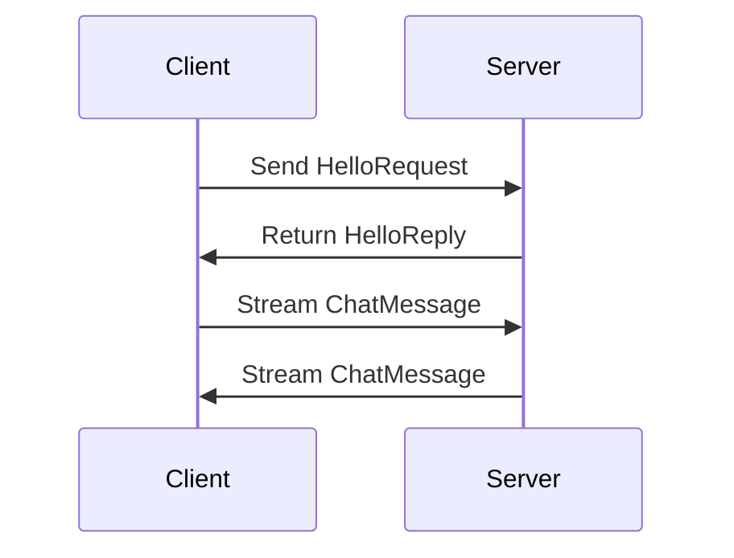

## 15.7. gRPC and Protobuf Integration

In the world of microservices and distributed systems, efficient and reliable communication between services is crucial. gRPC (gRPC Remote Procedure Calls) and Protocol Buffers (Protobuf) provide a powerful combination for achieving this in Rust. Let's explore how these technologies work together to facilitate efficient, strongly-typed communication between services.

### Introduction to gRPC

gRPC is a high-performance, open-source universal RPC framework initially developed by Google. It enables applications to communicate with each other easily and efficiently, using HTTP/2 for transport, Protocol Buffers as the interface description language, and providing features such as authentication, load balancing, and more.

#### Benefits of gRPC Over REST

- **Strong Typing**: Unlike REST, which typically uses JSON, gRPC uses Protocol Buffers, providing a strongly-typed schema for your data.
- **Efficient Serialization**: Protocol Buffers are more compact and faster to serialize/deserialize than JSON.
- **HTTP/2 Support**: gRPC leverages HTTP/2, enabling features like multiplexing, flow control, header compression, and bidirectional streaming.
- **Code Generation**: gRPC generates client and server code in multiple languages, ensuring consistency and reducing boilerplate.

### Defining Service Contracts with Protocol Buffers

Protocol Buffers (Protobuf) is a language-agnostic binary serialization format developed by Google. It is used to define the structure of your data and the services that operate on it.

#### Creating a Protobuf File

To define a gRPC service, you start by creating a `.proto` file. This file describes the service and its methods, as well as the data structures used in the communication.

```protobuf
syntax = "proto3";

package helloworld;

// The greeting service definition.
service Greeter {
  // Sends a greeting
  rpc SayHello (HelloRequest) returns (HelloReply) {}
}

// The request message containing the user's name.
message HelloRequest {
  string name = 1;
}

// The response message containing the greetings.
message HelloReply {
  string message = 1;
}
```

### Using Tonic and Prost in Rust

In Rust, we use the `tonic` crate for gRPC and the `prost` crate for compiling Protocol Buffers.

#### Setting Up Your Rust Project

First, add the necessary dependencies to your `Cargo.toml`:

```toml
[dependencies]
tonic = "0.6"
prost = "0.9"
tokio = { version = "1", features = ["full"] }

[build-dependencies]
tonic-build = "0.6"
```

#### Generating Rust Code from Protobuf

Create a `build.rs` file to automate the code generation process:

```rust
fn main() {
    tonic_build::compile_protos("proto/helloworld.proto").unwrap();
}
```

This will generate Rust code from your `.proto` file, which you can use in your application.

#### Implementing the gRPC Server

Let's implement a simple gRPC server using Tonic:

```rust
use tonic::{transport::Server, Request, Response, Status};
use helloworld::greeter_server::{Greeter, GreeterServer};
use helloworld::{HelloRequest, HelloReply};

pub mod helloworld {
    tonic::include_proto!("helloworld");
}

#[derive(Default)]
pub struct MyGreeter {}

#[tonic::async_trait]
impl Greeter for MyGreeter {
    async fn say_hello(
        &self,
        request: Request<HelloRequest>,
    ) -> Result<Response<HelloReply>, Status> {
        let reply = HelloReply {
            message: format!("Hello {}!", request.into_inner().name),
        };
        Ok(Response::new(reply))
    }
}

#[tokio::main]
async fn main() -> Result<(), Box<dyn std::error::Error>> {
    let addr = "[::1]:50051".parse()?;
    let greeter = MyGreeter::default();

    println!("GreeterServer listening on {}", addr);

    Server::builder()
        .add_service(GreeterServer::new(greeter))
        .serve(addr)
        .await?;

    Ok(())
}
```

#### Implementing the gRPC Client

Now, let's create a client to communicate with our server:

```rust
use tonic::transport::Channel;
use helloworld::greeter_client::GreeterClient;
use helloworld::HelloRequest;

pub mod helloworld {
    tonic::include_proto!("helloworld");
}

#[tokio::main]
async fn main() -> Result<(), Box<dyn std::error::Error>> {
    let mut client = GreeterClient::connect("http://[::1]:50051").await?;

    let request = tonic::Request::new(HelloRequest {
        name: "World".into(),
    });

    let response = client.say_hello(request).await?;

    println!("RESPONSE={:?}", response);

    Ok(())
}
```

### Advanced Features of gRPC

gRPC supports advanced features such as bi-directional streaming, which allows both the client and server to send a stream of messages to each other.

#### Bi-Directional Streaming Example

Here's how you can implement a bi-directional streaming service:

```protobuf
syntax = "proto3";

package chat;

// The chat service definition.
service Chat {
  rpc ChatStream (stream ChatMessage) returns (stream ChatMessage) {}
}

// The chat message.
message ChatMessage {
  string user = 1;
  string text = 2;
}
```

Implementing the server:

```rust
use tonic::{transport::Server, Request, Response, Status, Streaming};
use futures::Stream;
use tokio_stream::wrappers::ReceiverStream;
use tokio::sync::mpsc;
use chat::chat_server::{Chat, ChatServer};
use chat::ChatMessage;

pub mod chat {
    tonic::include_proto!("chat");
}

#[derive(Default)]
pub struct MyChat {}

#[tonic::async_trait]
impl Chat for MyChat {
    type ChatStreamStream = ReceiverStream<Result<ChatMessage, Status>>;

    async fn chat_stream(
        &self,
        request: Request<Streaming<ChatMessage>>,
    ) -> Result<Response<Self::ChatStreamStream>, Status> {
        let mut stream = request.into_inner();
        let (tx, rx) = mpsc::channel(4);

        tokio::spawn(async move {
            while let Some(Ok(msg)) = stream.message().await {
                println!("Received: {:?}", msg);
                tx.send(Ok(msg)).await.unwrap();
            }
        });

        Ok(Response::new(ReceiverStream::new(rx)))
    }
}

#[tokio::main]
async fn main() -> Result<(), Box<dyn std::error::Error>> {
    let addr = "[::1]:50052".parse()?;
    let chat = MyChat::default();

    println!("ChatServer listening on {}", addr);

    Server::builder()
        .add_service(ChatServer::new(chat))
        .serve(addr)
        .await?;

    Ok(())
}
```

### Interoperability with Other Languages

One of the key strengths of gRPC is its ability to work seamlessly across different programming languages. By defining your service contracts in Protobuf, you can generate client and server code in languages like Java, Python, Go, and more. This makes gRPC an excellent choice for heterogeneous environments where services are written in different languages.

### Visualizing gRPC Communication

To better understand how gRPC facilitates communication, let's visualize the process using a sequence diagram.



**Figure 1**: This diagram illustrates a simple gRPC communication flow, including a unary call and a bi-directional streaming call.

### Design Considerations

When integrating gRPC and Protobuf in Rust, consider the following:

- **Service Design**: Carefully design your service contracts to ensure they are future-proof and can evolve without breaking existing clients.
- **Error Handling**: Implement robust error handling to manage network failures and service errors gracefully.
- **Security**: Use TLS to secure your gRPC communications and consider authentication mechanisms like OAuth2.
- **Performance**: Optimize your Protobuf messages for size and serialization speed to improve performance.

### Rust Unique Features

Rust's ownership model and concurrency features make it an excellent choice for building high-performance, safe gRPC services. The `tonic` crate leverages Rust's async/await syntax to provide a non-blocking, efficient implementation of gRPC.

### Differences and Similarities

While gRPC and REST both facilitate communication between services, they differ significantly in their approach. gRPC's use of HTTP/2 and Protobuf provides advantages in performance and type safety, whereas REST's simplicity and ubiquity make it a good choice for simpler use cases.

### Try It Yourself

Experiment with the provided code examples by modifying the message structures or adding new methods to the service. Try implementing a new service with different message types or explore the advanced features of gRPC, such as client-side and server-side streaming.

### Knowledge Check

- What are the main benefits of using gRPC over REST?
- How does Protocol Buffers enhance the communication between services?
- What role does the `tonic` crate play in Rust's gRPC implementation?
- How can you implement bi-directional streaming in a gRPC service?
- What are some design considerations when using gRPC in Rust?

### Embrace the Journey

Remember, integrating gRPC and Protobuf into your Rust applications is just the beginning. As you gain more experience, you'll be able to build more complex and efficient communication systems. Keep experimenting, stay curious, and enjoy the journey!

## Quiz Time!



### What is one of the main benefits of using gRPC over REST?

- [x] Strong typing with Protocol Buffers
- [ ] Simplicity of JSON
- [ ] Use of HTTP/1.1
- [ ] Lack of code generation

> **Explanation:** gRPC uses Protocol Buffers, which provide strong typing, unlike REST, which typically uses JSON.

### Which crate is used in Rust for compiling Protocol Buffers?

- [ ] tonic
- [x] prost
- [ ] serde
- [ ] hyper

> **Explanation:** The `prost` crate is used for compiling Protocol Buffers in Rust.

### What transport protocol does gRPC use?

- [ ] HTTP/1.1
- [x] HTTP/2
- [ ] TCP
- [ ] UDP

> **Explanation:** gRPC uses HTTP/2 for transport, which enables features like multiplexing and bidirectional streaming.

### How can you implement bi-directional streaming in gRPC?

- [x] By defining a service method with `stream` keyword for both request and response
- [ ] By using RESTful endpoints
- [ ] By using only unary calls
- [ ] By using HTTP/1.1

> **Explanation:** Bi-directional streaming in gRPC is implemented by defining service methods with the `stream` keyword for both requests and responses.

### What is the purpose of the `tonic` crate in Rust?

- [x] To provide a gRPC implementation
- [ ] To handle JSON serialization
- [ ] To manage HTTP requests
- [ ] To compile Protocol Buffers

> **Explanation:** The `tonic` crate provides a gRPC implementation in Rust, leveraging async/await for non-blocking operations.

### What is a key feature of Protocol Buffers?

- [x] Efficient serialization
- [ ] Human-readable format
- [ ] Lack of schema
- [ ] Use of XML

> **Explanation:** Protocol Buffers provide efficient serialization, making them more compact and faster than JSON.

### Which feature of HTTP/2 is leveraged by gRPC?

- [x] Multiplexing
- [ ] Statelessness
- [ ] Lack of headers
- [ ] Single request-response

> **Explanation:** gRPC leverages HTTP/2's multiplexing feature, allowing multiple streams over a single connection.

### What is a design consideration when using gRPC?

- [x] Service contract design
- [ ] Avoiding strong typing
- [ ] Using HTTP/1.1
- [ ] Ignoring error handling

> **Explanation:** Designing service contracts carefully is crucial to ensure they are future-proof and can evolve without breaking existing clients.

### What is the role of the `build.rs` file in a Rust project using gRPC?

- [x] To automate the code generation process from `.proto` files
- [ ] To manage HTTP requests
- [ ] To compile Rust code
- [ ] To handle JSON serialization

> **Explanation:** The `build.rs` file automates the code generation process from `.proto` files using `tonic-build`.

### True or False: gRPC can only be used with Rust services.

- [ ] True
- [x] False

> **Explanation:** gRPC is language-agnostic and can be used with services written in various programming languages, not just Rust.



By integrating gRPC and Protobuf into your Rust applications, you can achieve efficient, strongly-typed communication between services, paving the way for robust and scalable distributed systems.
