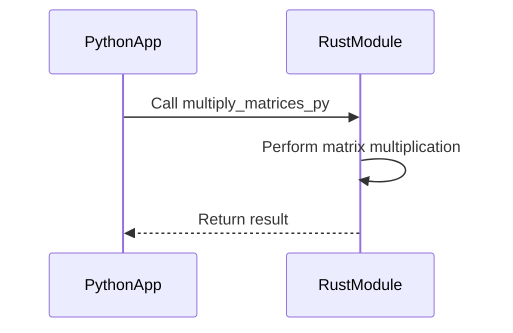

## 15.9. Using Rust in Existing Ecosystems

Integrating Rust into existing software ecosystems can bring significant benefits, such as improved performance, enhanced safety, and modern concurrency features. However, it also presents challenges, especially when dealing with legacy systems or projects written in other languages. In this section, we will explore strategies for integrating Rust into existing codebases, discuss scenarios where Rust can be particularly beneficial, and provide practical examples and guidance on managing build systems, dependencies, and interoperability challenges.

### Why Integrate Rust into Existing Ecosystems?

Before diving into the technical details, let's discuss why you might want to integrate Rust into an existing ecosystem:

1. **Performance**: Rust's zero-cost abstractions and control over memory allocation can lead to significant performance improvements, especially in computationally intensive tasks.

2. **Safety**: Rust's ownership model and type system help prevent common bugs such as null pointer dereferencing and data races, making it an excellent choice for safety-critical applications.

3. **Concurrency**: Rust's concurrency model allows for safe and efficient parallel execution, which can be a game-changer for applications that need to scale.

4. **Modernization**: Integrating Rust can be a step towards modernizing a legacy codebase, making it easier to maintain and extend.

5. **Ecosystem**: Rust's growing ecosystem of libraries and tools can complement existing technologies and provide new capabilities.

### Scenarios for Integrating Rust

Let's explore some scenarios where adding Rust to an existing codebase can be particularly beneficial:

#### Replacing Performance-Critical Components

One common approach is to replace performance-critical components of an application with Rust. This can be particularly effective in systems where certain modules are bottlenecks. For example, a computationally intensive algorithm written in Python or JavaScript could be rewritten in Rust to achieve better performance.

#### Enhancing Safety in Legacy Systems

Legacy systems often contain code that is difficult to maintain and prone to bugs. By rewriting critical parts of such systems in Rust, you can enhance safety and reliability. Rust's strict compile-time checks can help catch errors early, reducing the risk of runtime failures.

#### Introducing Concurrency

If your application needs to handle a large number of concurrent tasks, Rust's concurrency model can be a significant advantage. By integrating Rust, you can leverage its powerful concurrency features to improve scalability and responsiveness.

### Managing Build Systems and Dependencies

Integrating Rust into an existing project requires careful management of build systems and dependencies. Here are some strategies to consider:

#### Using Cargo

Cargo is Rust's package manager and build system. It simplifies dependency management and can be integrated with other build systems. When adding Rust to a project, you can use Cargo to manage Rust-specific dependencies while maintaining the existing build system for other parts of the project.

#### Interfacing with C and C++

Rust's Foreign Function Interface (FFI) allows you to call C functions from Rust and vice versa. This makes it possible to integrate Rust with existing C or C++ codebases. By creating Rust bindings for C libraries, you can gradually replace C components with Rust without rewriting the entire codebase.

```rust
// Example of calling a C function from Rust using FFI
extern "C" {
    fn c_function(x: i32) -> i32;
}

fn main() {
    unsafe {
        let result = c_function(42);
        println!("Result from C function: {}", result);
    }
}
```

#### Handling Dependencies

When integrating Rust, it's essential to manage dependencies carefully to avoid conflicts. You can use Cargo's `build.rs` script to customize the build process and ensure compatibility with other parts of the project.

### Tooling Support and Interoperability Challenges

Integrating Rust into an existing ecosystem involves several tooling and interoperability challenges. Here are some considerations:

#### Tooling Support

Rust has a rich set of tools that can aid integration, such as `rust-bindgen` for generating Rust bindings to C libraries and `cbindgen` for generating C bindings to Rust libraries. These tools can automate much of the work involved in interfacing Rust with other languages.

#### Interoperability Challenges

Interoperability between Rust and other languages can be challenging due to differences in memory management, data representation, and error handling. It's crucial to understand these differences and design interfaces that handle them gracefully.

### Considerations for Team Adoption

Adopting Rust in an existing project requires buy-in from the development team. Here are some strategies to facilitate adoption:

1. **Training**: Provide training and resources to help team members learn Rust. This can include workshops, online courses, and access to Rust documentation.

2. **Incremental Adoption**: Start by integrating Rust in small, non-critical parts of the project. This allows the team to gain experience with Rust without risking the stability of the entire system.

3. **Community Support**: Leverage the Rust community for support and guidance. The Rust community is known for being welcoming and helpful, and there are many resources available for developers new to Rust.

### Practical Example: Replacing a Python Module with Rust

Let's walk through a practical example of replacing a Python module with Rust to improve performance. Suppose we have a Python application that performs a computationally intensive task, and we want to rewrite this task in Rust.

#### Step 1: Identify the Module

First, identify the module in the Python application that is a performance bottleneck. For this example, let's assume it's a module that performs matrix multiplication.

#### Step 2: Write the Rust Code

Next, write the Rust code to perform the same task. Here's a simple example of matrix multiplication in Rust:

```rust
fn multiply_matrices(a: &Vec<Vec<i32>>, b: &Vec<Vec<i32>>) -> Vec<Vec<i32>> {
    let n = a.len();
    let m = b[0].len();
    let mut result = vec![vec![0; m]; n];

    for i in 0..n {
        for j in 0..m {
            for k in 0..b.len() {
                result[i][j] += a[i][k] * b[k][j];
            }
        }
    }

    result
}
```

#### Step 3: Create Python Bindings

Use a tool like `pyo3` to create Python bindings for the Rust code. This allows the Rust function to be called from Python.

```rust
use pyo3::prelude::*;

#[pyfunction]
fn multiply_matrices_py(a: Vec<Vec<i32>>, b: Vec<Vec<i32>>) -> Vec<Vec<i32>> {
    multiply_matrices(&a, &b)
}

#[pymodule]
fn rust_matrix(_py: Python, m: &PyModule) -> PyResult<()> {
    m.add_function(wrap_pyfunction!(multiply_matrices_py, m)?)?;
    Ok(())
}
```

#### Step 4: Integrate with the Python Application

Finally, integrate the Rust module with the Python application. You can use `setuptools-rust` to build and package the Rust code as a Python extension.

```python
from setuptools import setup
from setuptools_rust import RustExtension

setup(
    name="rust_matrix",
    version="0.1",
    rust_extensions=[RustExtension("rust_matrix.rust_matrix", "Cargo.toml")],
    packages=["rust_matrix"],
    zip_safe=False,
)
```

### Visualizing the Integration Process

To better understand the integration process, let's visualize the workflow using a sequence diagram. This diagram illustrates the interaction between the Python application and the Rust module.



### Key Takeaways

- **Performance and Safety**: Rust can significantly improve performance and safety in existing ecosystems.
- **Incremental Integration**: Start small and gradually integrate Rust into the project.
- **Tooling and Interoperability**: Leverage Rust's tooling and understand interoperability challenges.
- **Team Adoption**: Provide training and support to facilitate team adoption.

### Embrace the Journey

Integrating Rust into existing ecosystems is a journey that requires careful planning and execution. Remember, this is just the beginning. As you progress, you'll discover new ways to leverage Rust's capabilities to enhance your projects. Keep experimenting, stay curious, and enjoy the journey!

## Quiz Time!



### What is one of the primary benefits of integrating Rust into an existing ecosystem?

- [x] Improved performance and safety
- [ ] Increased code complexity
- [ ] Reduced team collaboration
- [ ] Limited tooling support

> **Explanation:** Rust offers improved performance and safety due to its zero-cost abstractions and ownership model.

### Which Rust feature helps prevent common bugs like null pointer dereferencing?

- [x] Ownership model
- [ ] Garbage collection
- [ ] Dynamic typing
- [ ] Reflection

> **Explanation:** Rust's ownership model ensures memory safety and prevents null pointer dereferencing.

### What is Cargo in the context of Rust?

- [x] Rust's package manager and build system
- [ ] A tool for generating Rust bindings
- [ ] A library for concurrency
- [ ] A testing framework

> **Explanation:** Cargo is Rust's package manager and build system, used for managing dependencies and building projects.

### How can Rust be integrated with existing C or C++ codebases?

- [x] Using Rust's Foreign Function Interface (FFI)
- [ ] By rewriting the entire codebase in Rust
- [ ] Through dynamic typing
- [ ] By using Rust's garbage collector

> **Explanation:** Rust's FFI allows calling C functions from Rust and vice versa, enabling integration with C/C++ codebases.

### What tool can be used to create Python bindings for Rust code?

- [x] `pyo3`
- [ ] `cargo`
- [ ] `serde`
- [ ] `tokio`

> **Explanation:** `pyo3` is a tool for creating Python bindings for Rust code, allowing Rust functions to be called from Python.

### What is a common challenge when integrating Rust with other languages?

- [x] Interoperability due to differences in memory management
- [ ] Lack of performance benefits
- [ ] Limited community support
- [ ] Absence of concurrency features

> **Explanation:** Interoperability challenges arise due to differences in memory management and data representation between Rust and other languages.

### What is a recommended strategy for team adoption of Rust?

- [x] Provide training and resources
- [ ] Rewrite the entire project in Rust immediately
- [ ] Avoid using Rust's advanced features
- [ ] Limit Rust usage to a single developer

> **Explanation:** Providing training and resources helps the team learn Rust and facilitates adoption.

### What is the role of `rust-bindgen` in Rust integration?

- [x] Generating Rust bindings to C libraries
- [ ] Managing Rust dependencies
- [ ] Building Rust projects
- [ ] Testing Rust code

> **Explanation:** `rust-bindgen` is used to generate Rust bindings to C libraries, aiding in integration with C codebases.

### What is a benefit of using Rust's concurrency model?

- [x] Safe and efficient parallel execution
- [ ] Increased code complexity
- [ ] Reduced performance
- [ ] Limited scalability

> **Explanation:** Rust's concurrency model allows for safe and efficient parallel execution, improving scalability and responsiveness.

### True or False: Rust's ownership model is similar to garbage collection.

- [ ] True
- [x] False

> **Explanation:** Rust's ownership model is different from garbage collection; it ensures memory safety without a garbage collector.


