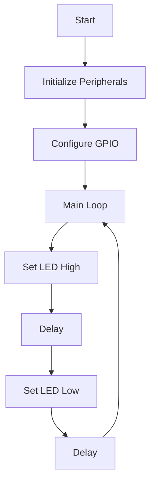

## 16.1. Introduction to Embedded Programming with Rust

Embedded programming involves developing software for devices that are not traditional computers, such as microcontrollers, sensors, and other hardware components. These devices often have limited resources, such as memory and processing power, and require software that is efficient, reliable, and safe. In this section, we will explore how Rust, a modern systems programming language, is uniquely suited for embedded development, offering significant advantages over traditional languages like C.

### Understanding the Challenges of Embedded Programming

Embedded systems present unique challenges that differ from those encountered in general-purpose computing:

- **Resource Constraints**: Embedded devices often have limited memory, processing power, and storage. Efficient use of these resources is critical.
- **Real-Time Requirements**: Many embedded systems must respond to events within strict time constraints, requiring precise control over execution timing.
- **Safety and Reliability**: Embedded systems are often used in critical applications where failures can have severe consequences. Ensuring safety and reliability is paramount.
- **Hardware Interfacing**: Embedded software must interact directly with hardware components, requiring low-level programming and a deep understanding of the hardware.
- **Concurrency**: Many embedded systems must handle multiple tasks simultaneously, necessitating effective concurrency management.

### Why Rust is Well-Suited for Embedded Development

Rust offers several features that make it an excellent choice for embedded systems programming:

- **Memory Safety**: Rust's ownership model ensures memory safety without the need for a garbage collector, preventing common bugs like null pointer dereferencing and buffer overflows.
- **Performance**: Rust's zero-cost abstractions allow developers to write high-level code without sacrificing performance, making it suitable for resource-constrained environments.
- **Concurrency**: Rust's concurrency model, based on ownership and borrowing, helps prevent data races and makes concurrent programming safer and more manageable.
- **Interoperability**: Rust can interoperate with C and other languages, allowing developers to leverage existing libraries and integrate with legacy systems.
- **Tooling and Ecosystem**: Rust's tooling, including Cargo, rustc, and Clippy, provides a robust development environment, and its growing ecosystem offers libraries and frameworks for embedded development.

### Examples of Embedded Projects Using Rust

Rust has been successfully used in various embedded projects, demonstrating its versatility and effectiveness:

- **Tock OS**: An operating system for low-power embedded devices, written in Rust, focusing on safety and concurrency.
- **Rust on Microcontrollers**: Projects like `rust-embedded` provide support for running Rust on microcontrollers, enabling developers to write safe and efficient firmware.
- **IoT Applications**: Rust is increasingly being used in IoT applications, where safety, performance, and concurrency are critical.

### Differences Between Standard Rust Programs and Embedded Rust Applications

While Rust's core principles remain the same, there are key differences when developing embedded applications:

- **`no_std` Environment**: Embedded Rust often operates in a `no_std` environment, meaning it does not use the standard library. This is necessary for systems without an operating system or with limited resources.
- **Bare-Metal Programming**: Embedded Rust involves writing bare-metal code, directly interfacing with hardware without an operating system.
- **Hardware Abstraction**: Embedded Rust applications often use hardware abstraction layers (HALs) to interact with hardware components, providing a higher-level interface for hardware access.
- **Cross-Compilation**: Embedded development requires cross-compiling code for the target architecture, which may differ from the development machine.

### Setting the Context for More Detailed Topics

This introduction provides a foundation for exploring more detailed topics in embedded programming with Rust. In subsequent sections, we will delve into specific aspects of embedded development, including:

- **`no_std` and Bare-Metal Development**: Understanding how to develop Rust applications without the standard library and directly interface with hardware.
- **Memory-Constrained Environments**: Techniques for optimizing Rust code to run efficiently on devices with limited memory.
- **Interfacing with Hardware Peripherals**: Using Rust to interact with various hardware components, such as sensors and actuators.
- **Real-Time Systems with RTIC**: Implementing real-time systems using the Real-Time Interrupt-driven Concurrency (RTIC) framework.
- **Building IoT Applications**: Leveraging Rust's features to develop robust and efficient IoT applications.

### Code Example: Blinking an LED with Rust

Let's look at a simple example of using Rust to blink an LED on a microcontroller. This example demonstrates the basic structure of an embedded Rust application.

```rust
#![no_std]
#![no_main]

use cortex_m_rt::entry;
use panic_halt as _; // halting on panic
use stm32f1xx_hal::{pac, prelude::*};

#[entry]
fn main() -> ! {
    // Get access to the device specific peripherals from the peripheral access crate
    let dp = pac::Peripherals::take().unwrap();

    // Take ownership over the raw flash and rcc devices and convert them into the corresponding HAL structs
    let mut flash = dp.FLASH.constrain();
    let mut rcc = dp.RCC.constrain();

    // Freeze the configuration of all the clocks in the system and store the frozen frequencies in `clocks`
    let clocks = rcc.cfgr.freeze(&mut flash.acr);

    // Acquire the GPIOC peripheral
    let mut gpioc = dp.GPIOC.split();

    // Configure gpio C pin 13 as a push-pull output. The `crh` register is passed to the function in order to configure the port.
    let mut led = gpioc.pc13.into_push_pull_output(&mut gpioc.crh);

    loop {
        // Turn the LED on
        led.set_high().unwrap();
        cortex_m::asm::delay(8_000_000);

        // Turn the LED off
        led.set_low().unwrap();
        cortex_m::asm::delay(8_000_000);
    }
}
```

**Explanation:**

- **`#![no_std]`**: This attribute indicates that the program does not use the standard library, which is typical for embedded applications.
- **`#![no_main]`**: This attribute is used to define a custom entry point for the program.
- **`cortex_m_rt::entry`**: This macro defines the entry point of the program.
- **`panic_halt`**: This crate provides a panic handler that halts the program on panic.
- **`stm32f1xx_hal`**: This is a hardware abstraction layer for the STM32F1 series of microcontrollers.
- **`loop`**: The main loop of the program, where the LED is turned on and off with a delay.

### Try It Yourself

To experiment with this example, try modifying the delay values to change the blink rate of the LED. You can also explore using different GPIO pins or adding more LEDs to the circuit.

### Visualizing Embedded Rust Development

To better understand the flow of an embedded Rust application, let's visualize the process using a flowchart.



**Diagram Explanation:**

- **Initialize Peripherals**: Set up the microcontroller peripherals.
- **Configure GPIO**: Configure the GPIO pins for output.
- **Main Loop**: The main loop of the program, continuously toggling the LED state.
- **Set LED High/Low**: Control the LED state.
- **Delay**: Introduce a delay to control the blink rate.

### References and Links

For further reading and resources on embedded programming with Rust, consider the following:

- [The Embedded Rust Book](https://docs.rust-embedded.org/book/)
- [Rust Embedded Working Group](https://github.com/rust-embedded/wg)
- [Tock OS](https://www.tockos.org/)
- [STM32 HAL for Rust](https://github.com/stm32-rs/stm32f1xx-hal)

### Knowledge Check

To reinforce your understanding of embedded programming with Rust, consider the following questions:

1. What are the key challenges of embedded programming, and how does Rust address them?
2. How does Rust's ownership model contribute to memory safety in embedded systems?
3. What is the significance of the `no_std` attribute in embedded Rust applications?
4. How can Rust's concurrency model benefit embedded systems development?
5. What are some examples of embedded projects that have successfully used Rust?

### Embrace the Journey

Remember, this is just the beginning of your journey into embedded programming with Rust. As you progress, you'll explore more advanced topics and build increasingly complex applications. Keep experimenting, stay curious, and enjoy the journey!

## Quiz Time!



### What is a key challenge of embedded programming?

- [x] Resource constraints
- [ ] Abundant memory
- [ ] High processing power
- [ ] Unlimited storage

> **Explanation:** Embedded systems often have limited resources, such as memory and processing power, making efficient use of these resources critical.

### How does Rust ensure memory safety in embedded systems?

- [x] Ownership model
- [ ] Garbage collection
- [ ] Manual memory management
- [ ] Dynamic typing

> **Explanation:** Rust's ownership model ensures memory safety without the need for a garbage collector, preventing common bugs like null pointer dereferencing and buffer overflows.

### What is the `no_std` attribute used for in embedded Rust applications?

- [x] To indicate the program does not use the standard library
- [ ] To enable garbage collection
- [ ] To allow dynamic typing
- [ ] To increase memory usage

> **Explanation:** The `no_std` attribute is used in embedded Rust applications to indicate that the program does not use the standard library, which is necessary for systems without an operating system or with limited resources.

### Why is Rust's concurrency model beneficial for embedded systems?

- [x] It helps prevent data races
- [ ] It allows for dynamic typing
- [ ] It requires manual memory management
- [ ] It increases memory usage

> **Explanation:** Rust's concurrency model, based on ownership and borrowing, helps prevent data races and makes concurrent programming safer and more manageable.

### Which of the following is an example of an embedded project using Rust?

- [x] Tock OS
- [ ] Windows OS
- [ ] macOS
- [ ] Linux Kernel

> **Explanation:** Tock OS is an operating system for low-power embedded devices, written in Rust, focusing on safety and concurrency.

### What is a common requirement for embedded systems?

- [x] Real-time response
- [ ] Unlimited processing power
- [ ] Abundant memory
- [ ] High-level abstractions

> **Explanation:** Many embedded systems must respond to events within strict time constraints, requiring precise control over execution timing.

### How does Rust's performance compare to traditional languages like C in embedded systems?

- [x] Comparable performance with zero-cost abstractions
- [ ] Slower due to garbage collection
- [ ] Faster due to dynamic typing
- [ ] Slower due to manual memory management

> **Explanation:** Rust's zero-cost abstractions allow developers to write high-level code without sacrificing performance, making it suitable for resource-constrained environments.

### What is a benefit of using Rust for IoT applications?

- [x] Safety and concurrency
- [ ] Dynamic typing
- [ ] Manual memory management
- [ ] High-level abstractions

> **Explanation:** Rust is increasingly being used in IoT applications, where safety, performance, and concurrency are critical.

### What does cross-compilation involve in embedded development?

- [x] Compiling code for the target architecture
- [ ] Using the standard library
- [ ] Enabling garbage collection
- [ ] Increasing memory usage

> **Explanation:** Embedded development requires cross-compiling code for the target architecture, which may differ from the development machine.

### True or False: Rust's tooling and ecosystem provide a robust development environment for embedded systems.

- [x] True
- [ ] False

> **Explanation:** Rust's tooling, including Cargo, rustc, and Clippy, provides a robust development environment, and its growing ecosystem offers libraries and frameworks for embedded development.


