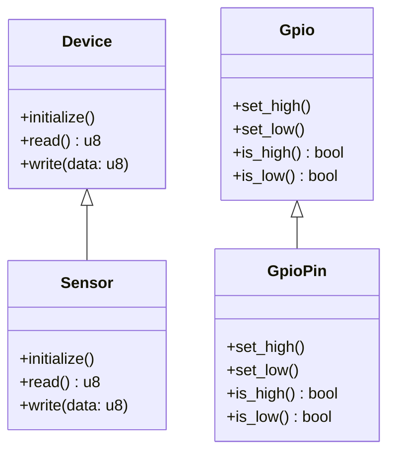

## 16.10. Device Drivers and HAL (Hardware Abstraction Layer)

In the world of embedded systems, device drivers and hardware abstraction layers (HALs) play a crucial role in bridging the gap between hardware and software. Rust, with its emphasis on safety and performance, provides a unique opportunity to develop robust and efficient device drivers. In this section, we will explore the role of device drivers and HALs, discuss how to write device drivers in Rust using traits and generics, and provide examples of implementing drivers for common peripherals. We will also highlight the use of existing HAL crates for various microcontrollers and discuss the benefits of abstraction and code reuse.

### Understanding Device Drivers and HALs

**Device Drivers** are specialized software components that allow the operating system and application software to interact with hardware devices. They serve as an interface between the hardware and the software, translating high-level commands into low-level operations that the hardware can execute.

**Hardware Abstraction Layers (HALs)** provide a uniform interface to interact with different hardware components. By abstracting the hardware specifics, HALs promote code portability and reuse, allowing developers to write code that can run on multiple platforms with minimal changes.

### Writing Device Drivers in Rust

Rust's strong type system, ownership model, and zero-cost abstractions make it an excellent choice for writing device drivers. By leveraging traits and generics, we can create flexible and reusable driver code.

#### Using Traits and Generics

Traits in Rust allow us to define shared behavior across different types, while generics enable us to write code that can operate on different data types. Together, they provide a powerful mechanism for writing device drivers.

```rust
// Define a trait for a generic device
trait Device {
    fn initialize(&self);
    fn read(&self) -> u8;
    fn write(&self, data: u8);
}

// Implement the trait for a specific device
struct Sensor;

impl Device for Sensor {
    fn initialize(&self) {
        println!("Initializing sensor...");
    }

    fn read(&self) -> u8 {
        // Simulate reading data from the sensor
        42
    }

    fn write(&self, data: u8) {
        println!("Writing {} to sensor", data);
    }
}

fn main() {
    let sensor = Sensor;
    sensor.initialize();
    let data = sensor.read();
    println!("Read data: {}", data);
    sensor.write(data);
}
```

In this example, we define a `Device` trait with methods for initializing, reading, and writing. The `Sensor` struct implements this trait, providing specific behavior for these methods.

#### Implementing Drivers for Common Peripherals

Let's consider implementing a driver for a common peripheral, such as a GPIO (General Purpose Input/Output) pin. GPIO pins are used for digital input and output operations in embedded systems.

```rust
// Define a trait for GPIO operations
trait Gpio {
    fn set_high(&mut self);
    fn set_low(&mut self);
    fn is_high(&self) -> bool;
    fn is_low(&self) -> bool;
}

// Implement the trait for a specific GPIO pin
struct GpioPin {
    state: bool,
}

impl Gpio for GpioPin {
    fn set_high(&mut self) {
        self.state = true;
    }

    fn set_low(&mut self) {
        self.state = false;
    }

    fn is_high(&self) -> bool {
        self.state
    }

    fn is_low(&self) -> bool {
        !self.state
    }
}

fn main() {
    let mut pin = GpioPin { state: false };
    pin.set_high();
    assert!(pin.is_high());
    pin.set_low();
    assert!(pin.is_low());
}
```

Here, we define a `Gpio` trait with methods for setting the pin high or low and checking its state. The `GpioPin` struct implements this trait, managing the pin's state internally.

### Utilizing Existing HAL Crates

The Rust ecosystem provides several HAL crates that abstract hardware specifics for various microcontrollers. These crates offer a consistent API for interacting with peripherals, making it easier to write portable code.

#### Embedded HAL

The [Embedded HAL](https://github.com/rust-embedded/embedded-hal) crate is a popular choice for abstracting hardware interactions in embedded systems. It defines a set of traits for common peripherals, such as GPIO, I2C, SPI, and more.

```rust
use embedded_hal::digital::v2::OutputPin;

struct Led<PIN: OutputPin> {
    pin: PIN,
}

impl<PIN: OutputPin> Led<PIN> {
    fn new(pin: PIN) -> Self {
        Led { pin }
    }

    fn turn_on(&mut self) {
        self.pin.set_high().ok();
    }

    fn turn_off(&mut self) {
        self.pin.set_low().ok();
    }
}
```

In this example, we define an `Led` struct that uses a generic `PIN` type implementing the `OutputPin` trait from the Embedded HAL crate. This allows us to use the `Led` struct with any pin that implements the `OutputPin` trait.

#### Awesome Embedded Rust List

The [Awesome Embedded Rust List](https://github.com/rust-embedded/awesome-embedded-rust) is a curated collection of resources for embedded Rust development. It includes links to HAL crates for various microcontrollers, as well as drivers, tools, and libraries.

### Benefits of Abstraction and Code Reuse

By using HALs and traits, we can achieve a high level of abstraction in our code. This abstraction allows us to write code that is not tied to a specific hardware platform, making it easier to port our applications to different devices.

- **Portability**: Code written using HALs can be easily adapted to run on different hardware platforms.
- **Reusability**: By defining common interfaces using traits, we can reuse code across different projects and devices.
- **Maintainability**: Abstracting hardware specifics makes the codebase easier to maintain and extend.

### Visualizing the Device Driver Architecture

To better understand the architecture of device drivers and HALs, let's visualize the interaction between different components using a class diagram.



This diagram illustrates the relationship between the `Device` and `Gpio` traits and their respective implementations, `Sensor` and `GpioPin`.

### Try It Yourself

Now that we've covered the basics, try modifying the code examples to implement additional functionality. For instance, you could:

- Add error handling to the `Device` and `Gpio` trait methods.
- Implement a driver for a different peripheral, such as an I2C or SPI device.
- Explore the Embedded HAL crate and experiment with different traits and implementations.

### References and Further Reading

- [Embedded HAL](https://github.com/rust-embedded/embedded-hal)
- [Awesome Embedded Rust List](https://github.com/rust-embedded/awesome-embedded-rust)
- [Rust Programming Language](https://www.rust-lang.org/)
- [Rust Embedded Book](https://docs.rust-embedded.org/book/)

### Knowledge Check

- What is the role of a device driver in an embedded system?
- How do HALs promote code portability and reuse?
- What are the benefits of using traits and generics in Rust for writing device drivers?
- How does the Embedded HAL crate facilitate hardware abstraction in Rust?

### Embrace the Journey

Remember, this is just the beginning. As you progress, you'll build more complex and efficient device drivers. Keep experimenting, stay curious, and enjoy the journey!

## Quiz Time!



### What is the primary role of a device driver in an embedded system?

- [x] To serve as an interface between hardware and software
- [ ] To provide a graphical user interface
- [ ] To manage network connections
- [ ] To compile code

> **Explanation:** Device drivers serve as an interface between hardware and software, allowing the operating system and applications to interact with hardware devices.

### How do HALs promote code portability?

- [x] By providing a uniform interface to interact with different hardware components
- [ ] By compiling code into machine language
- [ ] By encrypting data
- [ ] By managing memory allocation

> **Explanation:** HALs provide a uniform interface to interact with different hardware components, abstracting hardware specifics and promoting code portability.

### Which Rust feature is crucial for writing flexible and reusable device drivers?

- [x] Traits and generics
- [ ] Macros
- [ ] Enums
- [ ] Modules

> **Explanation:** Traits and generics in Rust allow for defining shared behavior and writing code that can operate on different data types, making them crucial for writing flexible and reusable device drivers.

### What is the Embedded HAL crate used for?

- [x] Abstracting hardware interactions in embedded systems
- [ ] Compiling Rust code
- [ ] Managing network connections
- [ ] Encrypting data

> **Explanation:** The Embedded HAL crate is used for abstracting hardware interactions in embedded systems, providing a consistent API for interacting with peripherals.

### What is a benefit of using HALs in embedded systems?

- [x] Portability
- [ ] Increased power consumption
- [ ] Reduced security
- [ ] Slower performance

> **Explanation:** HALs promote portability by allowing code to be easily adapted to run on different hardware platforms.

### What is a common peripheral that device drivers often interact with?

- [x] GPIO pins
- [ ] Web servers
- [ ] Databases
- [ ] Cloud services

> **Explanation:** GPIO pins are common peripherals that device drivers often interact with for digital input and output operations in embedded systems.

### What is a key advantage of using traits in Rust for device drivers?

- [x] Defining shared behavior across different types
- [ ] Compiling code faster
- [ ] Encrypting data
- [ ] Managing memory allocation

> **Explanation:** Traits in Rust allow for defining shared behavior across different types, making them useful for writing device drivers.

### What is the purpose of the `OutputPin` trait in the Embedded HAL crate?

- [x] To provide an interface for controlling digital output pins
- [ ] To manage network connections
- [ ] To encrypt data
- [ ] To compile code

> **Explanation:** The `OutputPin` trait in the Embedded HAL crate provides an interface for controlling digital output pins.

### How can you extend the functionality of a device driver in Rust?

- [x] By implementing additional trait methods
- [ ] By compiling the code with different flags
- [ ] By encrypting the source code
- [ ] By using a different programming language

> **Explanation:** You can extend the functionality of a device driver in Rust by implementing additional trait methods.

### True or False: HALs make it easier to port applications to different devices.

- [x] True
- [ ] False

> **Explanation:** HALs abstract hardware specifics, making it easier to port applications to different devices by providing a consistent interface.




