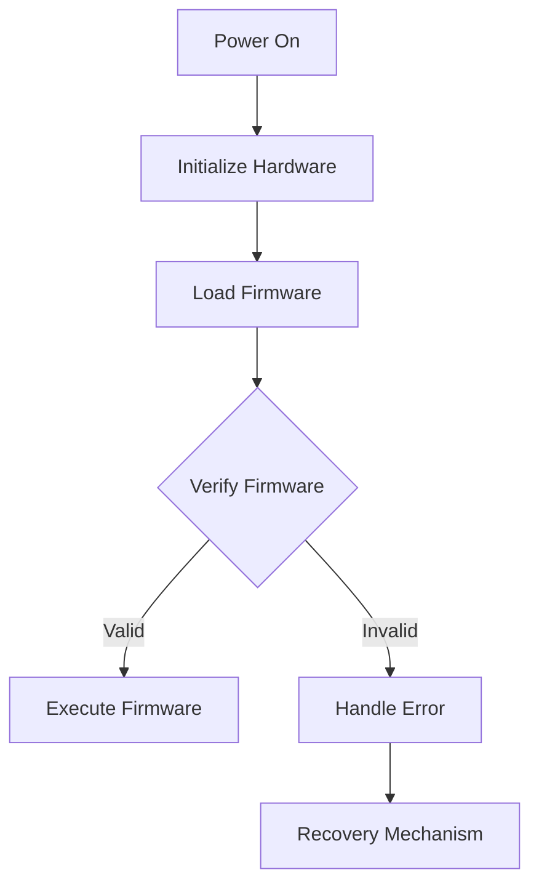

## 16.11. Bootloaders and Firmware Updates

In the realm of embedded systems and the Internet of Things (IoT), bootloaders and firmware updates are critical components that ensure devices operate correctly and securely. This section delves into the purpose of bootloaders, techniques for implementing them in Rust, secure firmware update mechanisms, and considerations for reliability and rollback capabilities. We will also discuss challenges such as code size limitations and hardware constraints.

### Understanding Bootloaders in Embedded Systems

**Bootloaders** are specialized programs that initialize the hardware and load the operating system or main application firmware when an embedded device is powered on. They play a crucial role in embedded systems by:

- **Initializing Hardware**: Setting up the processor, memory, and peripherals.
- **Loading Firmware**: Locating and loading the main application firmware into memory.
- **Providing Update Mechanisms**: Enabling firmware updates to fix bugs or add new features.
- **Ensuring Security**: Verifying the integrity and authenticity of the firmware before execution.

### Implementing Bootloaders in Rust

Rust's emphasis on safety and concurrency makes it an excellent choice for developing bootloaders. Here are some techniques for implementing bootloaders in Rust:

#### 1. **Minimalistic Design**

Bootloaders should be minimalistic to reduce complexity and potential vulnerabilities. Rust's zero-cost abstractions and efficient memory management help achieve this by allowing developers to write concise and efficient code.

#### 2. **Memory Management**

Rust's ownership model ensures safe memory management, which is crucial for bootloaders that operate in resource-constrained environments. By leveraging Rust's borrow checker, developers can prevent memory leaks and undefined behavior.

#### 3. **Hardware Abstraction**

Using Rust's `no_std` feature, developers can write code without relying on the standard library, which is essential for bare-metal programming. This allows for direct interaction with hardware registers and peripherals.

#### 4. **Secure Boot**

Implementing secure boot involves verifying the integrity and authenticity of the firmware before execution. Rust's strong type system and pattern matching capabilities can be used to implement cryptographic checks and validation logic.

### Example: A Simple Bootloader in Rust

Below is a simplified example of a bootloader implemented in Rust. This example demonstrates basic hardware initialization and firmware loading.

```rust
#![no_std]
#![no_main]

use core::ptr;

extern "C" {
    fn main_firmware(); // Entry point of the main firmware
}

#[no_mangle]
pub extern "C" fn bootloader_main() -> ! {
    // Initialize hardware
    unsafe {
        init_hardware();
    }

    // Load and verify firmware
    if verify_firmware() {
        unsafe {
            // Jump to main firmware
            main_firmware();
        }
    } else {
        // Handle verification failure
        panic!("Firmware verification failed!");
    }
}

unsafe fn init_hardware() {
    // Example: Set up a peripheral register
    let peripheral_register = 0x4000_0000 as *mut u32;
    ptr::write_volatile(peripheral_register, 0x1);
}

fn verify_firmware() -> bool {
    // Implement firmware verification logic here
    true // Placeholder: Assume verification is successful
}
```

### Secure Firmware Update Mechanisms

Firmware updates are essential for maintaining the security and functionality of embedded devices. Here are some secure update mechanisms:

#### 1. **Cryptographic Signatures**

Use cryptographic signatures to verify the authenticity of firmware updates. Rust's `ring` crate provides cryptographic primitives for implementing signature verification.

#### 2. **Rollback Protection**

Implement rollback protection to prevent attackers from reverting to a vulnerable firmware version. This can be achieved by maintaining a version counter in non-volatile memory.

#### 3. **Atomic Updates**

Ensure that firmware updates are atomic, meaning they are either fully applied or not applied at all. This prevents devices from being left in an inconsistent state.

#### 4. **Secure Channels**

Use secure communication channels, such as TLS, to deliver firmware updates. Rust's `rustls` crate can be used to implement secure communication.

### Considerations for Reliability and Rollback Capabilities

When implementing bootloaders and firmware updates, consider the following:

- **Reliability**: Ensure that the bootloader can recover from failures, such as power loss during an update.
- **Rollback Capabilities**: Provide mechanisms to revert to a previous firmware version in case of update failure.
- **Testing**: Thoroughly test bootloaders and update mechanisms to ensure they handle edge cases and failures gracefully.

### Challenges in Bootloader and Firmware Update Implementation

Implementing bootloaders and firmware updates in embedded systems presents several challenges:

#### 1. **Code Size Limitations**

Embedded devices often have limited memory, requiring bootloaders to be compact. Rust's efficient code generation helps minimize code size, but developers must still be mindful of memory usage.

#### 2. **Hardware Constraints**

Different hardware platforms have varying capabilities and constraints. Developers must tailor bootloader implementations to the specific hardware, which may involve writing platform-specific code.

#### 3. **Security Concerns**

Ensuring the security of bootloaders and firmware updates is paramount. Developers must implement robust cryptographic checks and secure communication channels to protect against attacks.

### Visualizing the Bootloader Process

To better understand the bootloader process, let's visualize it using a flowchart:



**Figure 1**: Bootloader Process Flowchart

### Try It Yourself

Experiment with the bootloader example provided above. Try modifying the `init_hardware` function to initialize different peripherals or change the `verify_firmware` logic to implement actual cryptographic checks. This hands-on approach will deepen your understanding of bootloader implementation in Rust.

### References and Further Reading

- [Rust Embedded Book](https://docs.rust-embedded.org/book/)
- [The Rust Programming Language](https://doc.rust-lang.org/book/)
- [Cryptography in Rust with `ring`](https://briansmith.org/rustdoc/ring/)
- [Secure Communication with `rustls`](https://docs.rs/rustls/)

### Knowledge Check

- What is the primary purpose of a bootloader in an embedded system?
- How does Rust's ownership model benefit bootloader development?
- What are some secure mechanisms for firmware updates?
- Why is rollback protection important in firmware updates?
- What challenges might you face when implementing bootloaders in Rust?

### Embrace the Journey

Remember, mastering bootloaders and firmware updates is just the beginning of your journey in embedded systems development with Rust. As you progress, you'll build more complex and secure systems. Keep experimenting, stay curious, and enjoy the journey!

## Quiz Time!



### What is the primary role of a bootloader in an embedded system?

- [x] Initialize hardware and load the main firmware
- [ ] Manage memory allocation for applications
- [ ] Provide a user interface for device settings
- [ ] Handle network communication

> **Explanation:** The bootloader initializes hardware and loads the main firmware, preparing the system for operation.

### How does Rust's ownership model benefit bootloader development?

- [x] Ensures safe memory management
- [ ] Increases code execution speed
- [ ] Simplifies user interface design
- [ ] Enhances network connectivity

> **Explanation:** Rust's ownership model ensures safe memory management, which is crucial in resource-constrained environments like bootloaders.

### Which of the following is a secure mechanism for firmware updates?

- [x] Cryptographic signatures
- [ ] Plain text configuration files
- [ ] Unencrypted network transmission
- [ ] Manual updates via USB

> **Explanation:** Cryptographic signatures verify the authenticity of firmware updates, ensuring they are from a trusted source.

### Why is rollback protection important in firmware updates?

- [x] Prevents reverting to vulnerable firmware versions
- [ ] Increases update speed
- [ ] Simplifies the update process
- [ ] Reduces memory usage

> **Explanation:** Rollback protection prevents attackers from reverting to older, potentially vulnerable firmware versions.

### What challenge might you face when implementing bootloaders in Rust?

- [x] Code size limitations
- [ ] Lack of concurrency support
- [ ] Inability to handle network protocols
- [ ] Difficulty in writing user interfaces

> **Explanation:** Embedded systems often have limited memory, requiring bootloaders to be compact and efficient.

### What is the purpose of the `no_std` feature in Rust?

- [x] Allows writing code without the standard library
- [ ] Enables graphical user interface development
- [ ] Increases network bandwidth
- [ ] Simplifies database interactions

> **Explanation:** The `no_std` feature allows developers to write code without relying on the standard library, which is essential for bare-metal programming.

### How can you ensure atomic firmware updates?

- [x] Use transactional update mechanisms
- [ ] Rely on manual update processes
- [ ] Use plain text files for updates
- [ ] Avoid version control

> **Explanation:** Atomic updates ensure that firmware updates are either fully applied or not applied at all, preventing inconsistent states.

### What is a common security concern with bootloaders?

- [x] Ensuring firmware integrity and authenticity
- [ ] Providing user-friendly interfaces
- [ ] Managing high network traffic
- [ ] Supporting multiple languages

> **Explanation:** Ensuring firmware integrity and authenticity is crucial to prevent unauthorized or malicious firmware from being executed.

### Which Rust crate can be used for secure communication channels?

- [x] `rustls`
- [ ] `serde`
- [ ] `tokio`
- [ ] `hyper`

> **Explanation:** The `rustls` crate provides tools for implementing secure communication channels using TLS.

### True or False: Bootloaders should be complex to handle all possible scenarios.

- [ ] True
- [x] False

> **Explanation:** Bootloaders should be minimalistic to reduce complexity and potential vulnerabilities.


