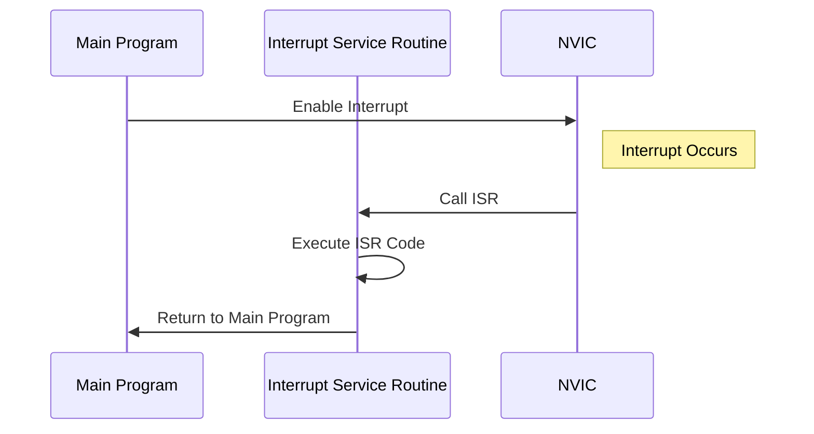

## 16.12. The Interrupt Handling Pattern in Rust

In the world of embedded systems, interrupts are a fundamental concept that allows a microcontroller to respond to external events in real-time. Rust, with its focus on safety and concurrency, provides powerful tools to handle interrupts efficiently and safely. In this section, we will delve into the Interrupt Handling Pattern in Rust, exploring how to define and manage interrupts, ensure safe execution of interrupt service routines (ISRs), and optimize performance in embedded applications.

### Understanding Interrupts in Embedded Systems

Interrupts are signals sent to the processor by hardware or software indicating an event that needs immediate attention. They temporarily halt the current execution flow, allowing the processor to execute a special routine known as an Interrupt Service Routine (ISR). Once the ISR is completed, the processor resumes its previous task. Interrupts are crucial in embedded systems for tasks such as handling input from sensors, managing communication protocols, and controlling time-sensitive operations.

#### Key Characteristics of Interrupts

- **Asynchronous Nature**: Interrupts can occur at any time, independent of the main program flow.
- **Priority Levels**: Different interrupts can have varying priority levels, determining the order in which they are handled.
- **Latency**: The time taken from the occurrence of an interrupt to the start of its ISR is critical in real-time systems.

### Defining and Handling Interrupts in Rust

Rust's embedded ecosystem provides several crates and tools to define and handle interrupts. The `cortex-m` and `cortex-m-rt` crates are commonly used for ARM Cortex-M microcontrollers, providing macros and attributes to define ISRs.

#### Setting Up a Rust Embedded Project

Before diving into interrupt handling, let's set up a basic Rust embedded project. Ensure you have the Rust toolchain installed and add the necessary target for your microcontroller:

```bash
rustup target add thumbv7em-none-eabihf
```

Create a new Rust project:

```bash
cargo new --bin my_embedded_project
cd my_embedded_project
```

Add dependencies in `Cargo.toml`:

```toml
[dependencies]
cortex-m = "0.7"
cortex-m-rt = "0.6"
```

#### Defining an Interrupt Service Routine (ISR)

In Rust, ISRs are defined using the `#[interrupt]` attribute provided by the `cortex-m-rt` crate. Here's an example of defining an ISR for a timer interrupt:

```rust
#![no_std]
#![no_main]

use cortex_m_rt::entry;
use cortex_m::peripheral::NVIC;

#[entry]
fn main() -> ! {
    // Initialize peripherals and enable interrupts
    let mut nvic = unsafe { NVIC::steal() };
    nvic.enable(Interrupt::TIM2);

    loop {
        // Main loop
    }
}

#[interrupt]
fn TIM2() {
    // Timer interrupt service routine
    // Handle timer event
}
```

In this example, the `TIM2` function is marked with the `#[interrupt]` attribute, indicating it is an ISR for the TIM2 interrupt. The `NVIC` (Nested Vectored Interrupt Controller) is used to enable the interrupt.

### Safety Considerations in Interrupt Handling

Handling interrupts safely is crucial to prevent data corruption and ensure system stability. Rust's ownership model and type system provide a strong foundation for safety, but additional considerations are necessary when dealing with interrupts.

#### Critical Sections and Shared Data

When an ISR accesses shared data, it is essential to protect this data from concurrent access by the main program or other ISRs. Rust provides the `cortex-m` crate, which includes mechanisms for creating critical sections.

```rust
use cortex_m::interrupt::{self, Mutex};
use core::cell::RefCell;

static SHARED_DATA: Mutex<RefCell<u32>> = Mutex::new(RefCell::new(0));

#[interrupt]
fn TIM2() {
    interrupt::free(|cs| {
        let mut data = SHARED_DATA.borrow(cs).borrow_mut();
        *data += 1;
    });
}
```

In this example, `SHARED_DATA` is protected by a `Mutex`, ensuring that it can only be accessed within a critical section. The `interrupt::free` function temporarily disables interrupts, allowing safe access to shared data.

#### Minimizing Interrupt Latency

To minimize interrupt latency, ISRs should be kept as short as possible. Offload complex processing to the main loop or a background task. Use flags or queues to signal the main program about events that need further processing.

```rust
static FLAG: Mutex<RefCell<bool>> = Mutex::new(RefCell::new(false));

#[interrupt]
fn TIM2() {
    interrupt::free(|cs| {
        *FLAG.borrow(cs).borrow_mut() = true;
    });
}

fn main_loop() {
    loop {
        interrupt::free(|cs| {
            if *FLAG.borrow(cs).borrow() {
                // Handle event
                *FLAG.borrow(cs).borrow_mut() = false;
            }
        });
    }
}
```

### Best Practices for Interrupt Handling

- **Prioritize ISRs**: Assign appropriate priority levels to interrupts to ensure critical tasks are handled promptly.
- **Avoid Blocking Operations**: ISRs should not perform blocking operations or long computations.
- **Use Atomic Operations**: For simple shared data, consider using atomic operations to avoid the need for critical sections.
- **Test Thoroughly**: Interrupt-driven systems can be challenging to debug. Use extensive testing to ensure reliability.

### Visualizing Interrupt Handling in Rust

To better understand the flow of interrupt handling in Rust, let's visualize the process using a sequence diagram.



This diagram illustrates the sequence of events from enabling an interrupt to executing the ISR and returning to the main program.

### Rust Unique Features for Interrupt Handling

Rust's unique features, such as its ownership model, type system, and zero-cost abstractions, make it well-suited for interrupt handling in embedded systems. The language's focus on safety ensures that common pitfalls, such as data races and undefined behavior, are minimized.

### Differences and Similarities with Other Languages

Compared to languages like C, Rust provides a safer and more structured approach to interrupt handling. While C requires manual management of critical sections and shared data, Rust's abstractions simplify these tasks, reducing the likelihood of errors.

### Try It Yourself

Now that we've covered the basics of interrupt handling in Rust, try modifying the code examples to handle different types of interrupts or implement additional safety mechanisms. Experiment with different priority levels and observe how they affect system behavior.

### References and Further Reading

- [Rust Embedded Book](https://docs.rust-embedded.org/book/)
- [Cortex-M RTIC Framework](https://rtic.rs/)
- [Rust Programming Language](https://www.rust-lang.org/)

### Knowledge Check

- What are the key characteristics of interrupts in embedded systems?
- How does Rust ensure safety in interrupt handling?
- What are the best practices for minimizing interrupt latency?

### Embrace the Journey

Remember, mastering interrupt handling in Rust is a journey. As you gain experience, you'll develop more efficient and reliable embedded systems. Keep experimenting, stay curious, and enjoy the process!

## Quiz Time!



### What is the primary role of interrupts in embedded systems?

- [x] To handle external events in real-time
- [ ] To execute long computations
- [ ] To manage memory allocation
- [ ] To perform input/output operations

> **Explanation:** Interrupts allow a microcontroller to respond to external events in real-time by temporarily halting the current execution flow and executing an ISR.

### How are ISRs defined in Rust for ARM Cortex-M microcontrollers?

- [x] Using the `#[interrupt]` attribute
- [ ] Using the `#[async]` attribute
- [ ] Using the `#[derive]` macro
- [ ] Using the `#[inline]` attribute

> **Explanation:** The `#[interrupt]` attribute provided by the `cortex-m-rt` crate is used to define ISRs for ARM Cortex-M microcontrollers in Rust.

### What is a critical section in the context of interrupt handling?

- [x] A code block where interrupts are temporarily disabled to safely access shared data
- [ ] A section of code that executes faster than other sections
- [ ] A part of the code that handles errors
- [ ] A section of code that is executed only once

> **Explanation:** A critical section is a code block where interrupts are temporarily disabled to safely access shared data, preventing data corruption.

### Why should ISRs be kept short?

- [x] To minimize interrupt latency
- [ ] To increase code readability
- [ ] To reduce memory usage
- [ ] To improve error handling

> **Explanation:** ISRs should be kept short to minimize interrupt latency, ensuring that the system can respond quickly to other interrupts.

### What is the purpose of using atomic operations in interrupt handling?

- [x] To safely modify shared data without critical sections
- [ ] To increase the speed of computations
- [ ] To handle errors more effectively
- [ ] To reduce memory usage

> **Explanation:** Atomic operations allow safe modification of shared data without the need for critical sections, simplifying interrupt handling.

### What is the role of the NVIC in interrupt handling?

- [x] To manage interrupt priorities and enable/disable interrupts
- [ ] To execute ISRs
- [ ] To allocate memory for interrupts
- [ ] To handle input/output operations

> **Explanation:** The NVIC (Nested Vectored Interrupt Controller) manages interrupt priorities and enables/disables interrupts in ARM Cortex-M microcontrollers.

### How does Rust's ownership model contribute to safe interrupt handling?

- [x] By preventing data races and ensuring safe access to shared data
- [ ] By increasing the speed of computations
- [ ] By reducing memory usage
- [ ] By improving error handling

> **Explanation:** Rust's ownership model prevents data races and ensures safe access to shared data, contributing to safe interrupt handling.

### What is the benefit of using the `cortex-m` crate in Rust embedded projects?

- [x] It provides mechanisms for creating critical sections and managing interrupts
- [ ] It increases the speed of computations
- [ ] It reduces memory usage
- [ ] It handles input/output operations

> **Explanation:** The `cortex-m` crate provides mechanisms for creating critical sections and managing interrupts, aiding in safe and efficient interrupt handling.

### What is the primary goal of minimizing interrupt latency?

- [x] To ensure timely response to external events
- [ ] To increase code readability
- [ ] To reduce memory usage
- [ ] To improve error handling

> **Explanation:** Minimizing interrupt latency ensures timely response to external events, which is crucial in real-time embedded systems.

### True or False: Rust's abstractions simplify the management of critical sections and shared data compared to C.

- [x] True
- [ ] False

> **Explanation:** Rust's abstractions, such as its ownership model and type system, simplify the management of critical sections and shared data compared to C, reducing the likelihood of errors.


