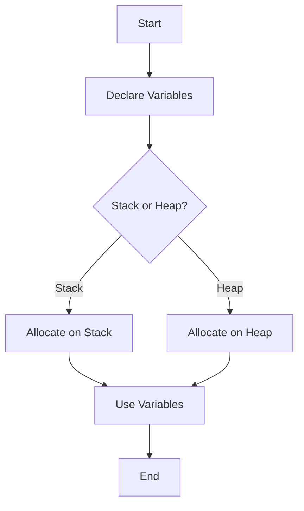

## 16.3. Memory-Constrained Environments

In the realm of embedded systems and IoT applications, developers often face the challenge of working within memory-constrained environments. These environments typically have limited RAM and ROM, necessitating efficient memory management to ensure optimal performance and reliability. Rust, with its focus on safety and performance, provides a robust set of tools and techniques to tackle these challenges effectively.

### Understanding Memory Constraints

Memory constraints in embedded systems arise due to the limited availability of RAM (Random Access Memory) and ROM (Read-Only Memory). These constraints can significantly impact the design and implementation of software, requiring developers to be mindful of memory usage at every step.

#### Challenges of Memory Constraints

1. **Limited RAM**: RAM is used for dynamic data storage during program execution. In memory-constrained environments, the available RAM is often minimal, necessitating careful management to avoid overflow and ensure efficient usage.

2. **Limited ROM**: ROM is used for storing the program code and static data. The limited size of ROM requires developers to optimize code size and minimize static data storage.

3. **Performance Trade-offs**: Balancing memory usage with performance can be challenging. Efficient memory management often involves trade-offs between speed and memory consumption.

4. **Resource Contention**: Multiple processes or threads competing for limited memory resources can lead to contention and potential system instability.

### Strategies for Reducing Memory Usage in Rust

Rust offers several strategies to reduce memory usage and optimize performance in memory-constrained environments. These strategies leverage Rust's unique features, such as ownership, borrowing, and zero-cost abstractions.

#### 1. Use of Fixed-Size Data Structures

Fixed-size data structures are crucial in memory-constrained environments as they provide predictable memory usage. Rust's type system allows for the creation of fixed-size arrays and structs, which can be used to manage memory efficiently.

```rust
struct SensorData {
    temperature: [f32; 10], // Fixed-size array for temperature readings
    humidity: [f32; 10],    // Fixed-size array for humidity readings
}

fn main() {
    let data = SensorData {
        temperature: [0.0; 10],
        humidity: [0.0; 10],
    };
    // Use data...
}
```

#### 2. Avoiding Dynamic Allocation

Dynamic memory allocation can lead to unpredictable memory usage and fragmentation, which is undesirable in constrained environments. Rust's ownership system encourages the use of stack allocation and minimizes the need for heap allocation.

```rust
fn process_data(data: &[u8]) {
    let mut buffer: [u8; 256] = [0; 256]; // Stack allocation
    // Process data using buffer...
}
```

#### 3. Controlling Stack and Heap Allocation

Rust provides control over stack and heap allocation, allowing developers to optimize memory usage. The `Box` type can be used for heap allocation when necessary, but should be used judiciously.

```rust
fn main() {
    let stack_value = 42; // Stack allocation
    let heap_value = Box::new(42); // Heap allocation
    // Use stack_value and heap_value...
}
```

#### 4. Leveraging Rust's Ownership Model

Rust's ownership model ensures memory safety and prevents data races, which is particularly beneficial in memory-constrained environments. By leveraging ownership and borrowing, developers can manage memory efficiently without the risk of leaks or undefined behavior.

```rust
fn calculate_sum(data: &[i32]) -> i32 {
    data.iter().sum()
}

fn main() {
    let numbers = vec![1, 2, 3, 4, 5];
    let sum = calculate_sum(&numbers);
    println!("Sum: {}", sum);
}
```

### Profiling and Optimizing Memory Usage

Profiling and optimization are essential steps in developing applications for memory-constrained environments. Rust provides tools and techniques to profile memory usage and identify areas for optimization.

#### 1. Using Profiling Tools

Profiling tools such as `valgrind`, `heaptrack`, and Rust-specific tools like `cargo-flamegraph` can help identify memory usage patterns and potential bottlenecks.

#### 2. Analyzing Memory Usage

Analyzing memory usage involves examining the allocation patterns and identifying areas where memory can be reduced or optimized. This may involve refactoring code to use more efficient data structures or algorithms.

#### 3. Implementing Memory-Saving Techniques

Implement memory-saving techniques such as:

- **Inlining Functions**: Reduce function call overhead by inlining small functions.
- **Using `const` and `static`**: Store immutable data in ROM instead of RAM.
- **Minimizing Copying**: Use references and borrowing to avoid unnecessary data copying.

### Visualizing Memory Management in Rust

To better understand memory management in Rust, let's visualize the stack and heap allocation process using a Mermaid.js diagram.



**Diagram Description**: This diagram illustrates the decision-making process for memory allocation in Rust. Variables are either allocated on the stack or the heap, depending on their size and usage. Stack allocation is preferred for small, fixed-size data, while heap allocation is used for larger, dynamic data.

### Knowledge Check

Before we conclude, let's test your understanding of memory-constrained environments in Rust with a few questions:

1. What are the main challenges of programming in memory-constrained environments?
2. How can fixed-size data structures help reduce memory usage?
3. Why is avoiding dynamic allocation important in constrained environments?
4. How does Rust's ownership model contribute to memory safety?
5. What tools can be used to profile memory usage in Rust applications?

### Summary

In this section, we've explored the challenges and strategies for programming in memory-constrained environments using Rust. By leveraging Rust's unique features and adopting efficient memory management techniques, developers can create robust and performant applications for embedded systems and IoT devices.

Remember, this is just the beginning. As you continue to explore Rust's capabilities, you'll discover even more ways to optimize memory usage and enhance performance. Keep experimenting, stay curious, and enjoy the journey!

## Quiz Time!



### What is a primary challenge in memory-constrained environments?

- [x] Limited RAM and ROM
- [ ] Excessive CPU power
- [ ] High network bandwidth
- [ ] Unlimited storage

> **Explanation:** Memory-constrained environments often have limited RAM and ROM, which requires careful memory management.

### How can fixed-size data structures benefit memory-constrained environments?

- [x] They provide predictable memory usage
- [ ] They increase dynamic allocation
- [ ] They require more memory
- [ ] They are slower to access

> **Explanation:** Fixed-size data structures offer predictable memory usage, which is crucial in constrained environments.

### Why is avoiding dynamic allocation important in constrained environments?

- [x] It prevents unpredictable memory usage
- [ ] It increases memory fragmentation
- [ ] It requires more CPU cycles
- [ ] It slows down execution

> **Explanation:** Avoiding dynamic allocation helps prevent unpredictable memory usage and fragmentation.

### How does Rust's ownership model contribute to memory safety?

- [x] It prevents data races and memory leaks
- [ ] It increases memory usage
- [ ] It allows for unsafe code
- [ ] It requires manual memory management

> **Explanation:** Rust's ownership model ensures memory safety by preventing data races and memory leaks.

### Which tool can be used to profile memory usage in Rust applications?

- [x] `cargo-flamegraph`
- [ ] `cargo-run`
- [ ] `cargo-build`
- [ ] `cargo-test`

> **Explanation:** `cargo-flamegraph` is a tool used to profile memory usage in Rust applications.

### What is a benefit of using stack allocation over heap allocation?

- [x] Faster access and deallocation
- [ ] More memory available
- [ ] Slower execution
- [ ] Requires manual management

> **Explanation:** Stack allocation is faster for access and deallocation compared to heap allocation.

### What is the role of `Box` in Rust?

- [x] It allows for heap allocation
- [ ] It is used for stack allocation
- [ ] It is a type of fixed-size array
- [ ] It is used for static data

> **Explanation:** `Box` is used for heap allocation in Rust.

### How can profiling help in memory-constrained environments?

- [x] By identifying memory usage patterns
- [ ] By increasing memory usage
- [ ] By reducing CPU cycles
- [ ] By slowing down execution

> **Explanation:** Profiling helps identify memory usage patterns and potential optimization areas.

### What is a common trade-off in memory-constrained environments?

- [x] Balancing memory usage with performance
- [ ] Increasing CPU usage
- [ ] Reducing network bandwidth
- [ ] Increasing storage capacity

> **Explanation:** Balancing memory usage with performance is a common trade-off in constrained environments.

### True or False: Rust's ownership model requires manual memory management.

- [ ] True
- [x] False

> **Explanation:** Rust's ownership model automates memory management, preventing manual errors.


