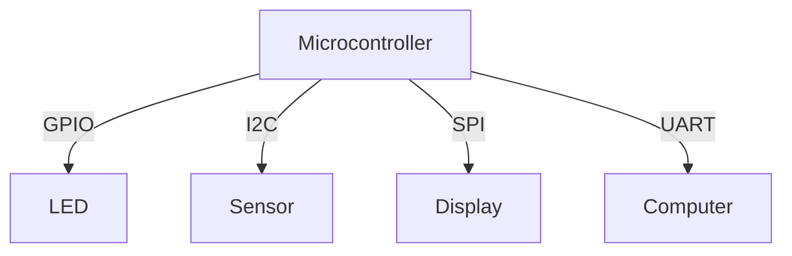

## 16.4. Interfacing with Hardware Peripherals

Interfacing with hardware peripherals is a critical aspect of embedded systems programming. Rust, with its focus on safety and performance, provides robust tools and libraries to facilitate this process. In this section, we'll explore how to interact with hardware peripherals using Rust, focusing on reading from and writing to memory-mapped registers, utilizing embedded HAL crates, and working with common interfaces like GPIO, I2C, SPI, and UART.

### Understanding Memory-Mapped Registers

Memory-mapped registers are a fundamental concept in embedded systems. They allow software to interact with hardware by reading and writing to specific memory addresses. In Rust, accessing these registers requires careful handling to ensure safety and correctness.

#### Reading and Writing to Memory-Mapped Registers

To read from or write to a memory-mapped register, you typically need to know the specific address of the register. Rust's type system and ownership model can help manage these operations safely.

```rust
const GPIO_BASE: usize = 0x4002_0000;
const GPIO_DATA_OFFSET: usize = 0x3FC;

fn read_gpio_data() -> u32 {
    unsafe {
        let gpio_data_ptr = (GPIO_BASE + GPIO_DATA_OFFSET) as *const u32;
        *gpio_data_ptr
    }
}

fn write_gpio_data(value: u32) {
    unsafe {
        let gpio_data_ptr = (GPIO_BASE + GPIO_DATA_OFFSET) as *mut u32;
        *gpio_data_ptr = value;
    }
}
```

> **Note:** The `unsafe` keyword is necessary because we're performing raw pointer dereferencing, which bypasses Rust's safety checks.

### Using Embedded HAL Crates

The [Embedded HAL](https://github.com/rust-embedded/embedded-hal) is a set of traits that provide a standard interface for interacting with hardware peripherals. It abstracts over the specifics of different microcontrollers, allowing for more portable and reusable code.

#### Example: Using GPIO with Embedded HAL

```rust
use embedded_hal::digital::v2::OutputPin;
use stm32f1xx_hal::gpio::gpioc::PC13;
use stm32f1xx_hal::gpio::{Output, PushPull};

fn toggle_led(led: &mut PC13<Output<PushPull>>) {
    led.set_high().unwrap();
    // Delay for a bit
    led.set_low().unwrap();
}
```

### Working with Common Interfaces

#### General-Purpose Input/Output (GPIO)

GPIO pins are used for digital input and output. They can be configured as either input or output pins and are often used for controlling LEDs, reading button states, etc.

```rust
use embedded_hal::digital::v2::{InputPin, OutputPin};

fn read_button(button: &dyn InputPin) -> bool {
    button.is_high().unwrap()
}

fn control_led(led: &mut dyn OutputPin, state: bool) {
    if state {
        led.set_high().unwrap();
    } else {
        led.set_low().unwrap();
    }
}
```

#### Inter-Integrated Circuit (I2C)

I2C is a multi-master, multi-slave, packet-switched, single-ended, serial communication bus. It's commonly used for connecting low-speed peripherals to processors and microcontrollers.

```rust
use embedded_hal::blocking::i2c::{Write, Read};

fn read_sensor_data<I2C, E>(i2c: &mut I2C, address: u8) -> Result<u8, E>
where
    I2C: Write<Error = E> + Read<Error = E>,
{
    let mut buffer = [0];
    i2c.write(address, &[0x00])?;
    i2c.read(address, &mut buffer)?;
    Ok(buffer[0])
}
```

#### Serial Peripheral Interface (SPI)

SPI is a synchronous serial communication interface used for short-distance communication, primarily in embedded systems.

```rust
use embedded_hal::blocking::spi::Transfer;

fn transfer_data<SPI, E>(spi: &mut SPI, data: &mut [u8]) -> Result<(), E>
where
    SPI: Transfer<u8, Error = E>,
{
    spi.transfer(data)?;
    Ok(())
}
```

#### Universal Asynchronous Receiver-Transmitter (UART)

UART is a hardware communication protocol that uses asynchronous serial communication with configurable speed.

```rust
use embedded_hal::serial::{Read, Write};

fn send_data<UART, E>(uart: &mut UART, data: u8) -> Result<(), E>
where
    UART: Write<u8, Error = E>,
{
    uart.write(data)?;
    Ok(())
}

fn receive_data<UART, E>(uart: &mut UART) -> Result<u8, E>
where
    UART: Read<u8, Error = E>,
{
    uart.read()
}
```

### Safety Considerations

When interfacing with hardware, safety is paramount. Rust's ownership model and type system help prevent common errors such as data races and null pointer dereferences. However, when using `unsafe` code to access hardware registers, it's crucial to ensure that:

- The memory addresses are correct and valid.
- The operations do not cause undefined behavior.
- Access to shared resources is properly synchronized.

### Tools for Generating Peripheral Access Crates

The [`svd2rust`](https://github.com/rust-embedded/svd2rust) tool is used to generate Rust code from SVD (System View Description) files, which describe the registers and peripherals of a microcontroller. This tool automates the creation of safe, type-checked access to hardware registers.

#### Using `svd2rust`

1. **Obtain the SVD file** for your microcontroller.
2. **Run `svd2rust`** to generate the Rust code.
3. **Integrate the generated code** into your project.

```bash
svd2rust -i path/to/svd/file.svd
```

### Visualizing Peripheral Interfacing

To better understand how these components interact, consider the following diagram illustrating the flow of data between a microcontroller and its peripherals:



> **Diagram Description:** This diagram shows a microcontroller interfacing with various peripherals using different communication protocols: GPIO for an LED, I2C for a sensor, SPI for a display, and UART for communication with a computer.

### Knowledge Check

- **Question:** What is the purpose of memory-mapped registers in embedded systems?
- **Exercise:** Modify the GPIO example to toggle an LED at a different frequency.

### Embrace the Journey

Interfacing with hardware peripherals in Rust is a rewarding endeavor that combines low-level programming with high-level safety guarantees. Remember, this is just the beginning. As you progress, you'll gain more confidence in building robust and efficient embedded systems. Keep experimenting, stay curious, and enjoy the journey!

## Quiz Time!



### What is the primary purpose of memory-mapped registers in embedded systems?

- [x] To allow software to interact with hardware by reading and writing to specific memory addresses.
- [ ] To provide a graphical interface for hardware configuration.
- [ ] To store application-level data.
- [ ] To manage power consumption of the device.

> **Explanation:** Memory-mapped registers enable software to directly control hardware by accessing specific memory locations.

### Which Rust keyword is necessary when accessing memory-mapped registers directly?

- [x] unsafe
- [ ] async
- [ ] impl
- [ ] pub

> **Explanation:** The `unsafe` keyword is required because accessing memory-mapped registers involves raw pointer dereferencing, which bypasses Rust's safety checks.

### What is the Embedded HAL in Rust?

- [x] A set of traits providing a standard interface for interacting with hardware peripherals.
- [ ] A graphical library for embedded systems.
- [ ] A debugging tool for embedded applications.
- [ ] A memory management system for Rust.

> **Explanation:** The Embedded HAL provides a standard interface for hardware interaction, abstracting over different microcontroller specifics.

### Which communication protocol is typically used for short-distance communication in embedded systems?

- [x] SPI
- [ ] HTTP
- [ ] FTP
- [ ] SMTP

> **Explanation:** SPI (Serial Peripheral Interface) is commonly used for short-distance communication in embedded systems.

### What tool is used to generate Rust code from SVD files?

- [x] svd2rust
- [ ] cargo
- [ ] rustc
- [ ] clippy

> **Explanation:** `svd2rust` generates Rust code from SVD files, providing safe access to hardware registers.

### What is a key safety consideration when using `unsafe` code to access hardware registers?

- [x] Ensuring memory addresses are correct and valid.
- [ ] Using the latest version of Rust.
- [ ] Writing unit tests for all functions.
- [ ] Documenting the code thoroughly.

> **Explanation:** Correct and valid memory addresses are crucial to prevent undefined behavior when using `unsafe` code.

### Which of the following is a common use for GPIO pins?

- [x] Controlling LEDs
- [ ] Sending HTTP requests
- [ ] Managing file systems
- [ ] Encrypting data

> **Explanation:** GPIO pins are often used for controlling LEDs and reading button states in embedded systems.

### What does the `svd2rust` tool automate?

- [x] The creation of safe, type-checked access to hardware registers.
- [ ] The deployment of Rust applications to embedded devices.
- [ ] The compilation of Rust code to machine code.
- [ ] The generation of graphical user interfaces.

> **Explanation:** `svd2rust` automates the generation of Rust code for safe access to hardware registers.

### Which protocol is used for asynchronous serial communication?

- [x] UART
- [ ] I2C
- [ ] SPI
- [ ] HTTP

> **Explanation:** UART (Universal Asynchronous Receiver-Transmitter) is used for asynchronous serial communication.

### True or False: The Embedded HAL allows for portable and reusable code across different microcontrollers.

- [x] True
- [ ] False

> **Explanation:** The Embedded HAL abstracts over microcontroller specifics, enabling portable and reusable code.


