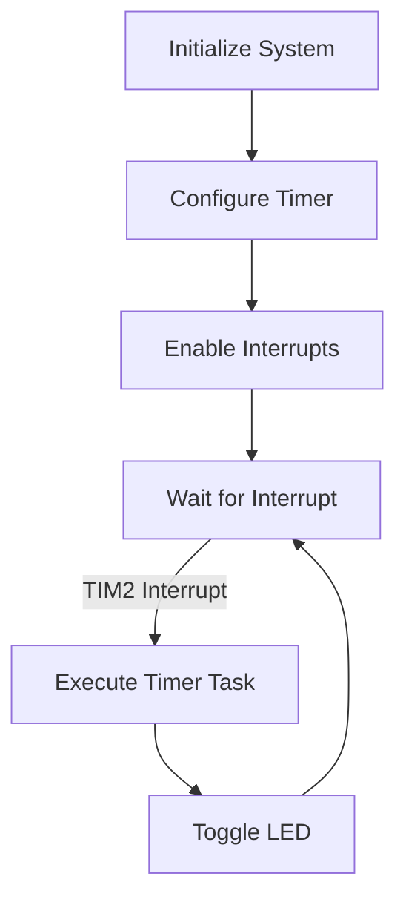

## 16.5. Real-Time Systems with RTIC

Real-time systems are crucial in embedded applications where timely and predictable responses to events are required. Rust, with its emphasis on safety and concurrency, provides a robust platform for developing such systems. In this section, we delve into the Real-Time Interrupt-driven Concurrency (RTIC) framework, a powerful tool for building real-time embedded applications in Rust.

### Introduction to RTIC

RTIC is a framework designed to simplify the development of real-time systems by providing a structured way to manage concurrency and interrupts. It leverages Rust's ownership model to ensure memory safety and prevent data races, making it an ideal choice for embedded systems where reliability is paramount.

#### What is RTIC?

RTIC stands for Real-Time Interrupt-driven Concurrency. It is a concurrency framework specifically tailored for embedded systems, allowing developers to define tasks and interrupts in a structured manner. RTIC abstracts the complexities of interrupt handling and task scheduling, enabling developers to focus on application logic.

#### Role of RTIC in Real-Time Systems

RTIC plays a crucial role in managing the concurrency and timing requirements of real-time systems. It provides a task-based model where tasks are triggered by interrupts or scheduled events. This model ensures that tasks are executed in a predictable manner, adhering to the timing constraints of the system.

### Managing Concurrency and Interrupts with RTIC

Concurrency and interrupt management are central to real-time systems. RTIC provides a clear and concise way to define tasks and manage their execution.

#### Task and Interrupt Setup

In RTIC, tasks are defined as functions that are triggered by specific events, such as interrupts or timers. Each task is associated with a priority, which determines its execution order relative to other tasks.

```rust
#![no_std]
#![no_main]

use rtic::app;

#[app(device = stm32f4xx_hal::stm32)]
const APP: () = {
    #[init]
    fn init(ctx: init::Context) {
        // Initialization code here
    }

    #[task(binds = TIM2, priority = 1)]
    fn timer_interrupt(ctx: timer_interrupt::Context) {
        // Code to handle timer interrupt
    }

    #[task(priority = 2)]
    fn background_task(ctx: background_task::Context) {
        // Background task code
    }
};
```

In this example, we define two tasks: `timer_interrupt` and `background_task`. The `timer_interrupt` task is bound to the TIM2 interrupt and has a higher priority than the `background_task`.

#### Scheduling and Priorities

RTIC uses a priority-based scheduling model, where tasks with higher priorities preempt those with lower priorities. This ensures that critical tasks are executed promptly, meeting the real-time requirements of the system.

```rust
#[task(priority = 3)]
fn high_priority_task(ctx: high_priority_task::Context) {
    // High priority task code
}

#[task(priority = 1)]
fn low_priority_task(ctx: low_priority_task::Context) {
    // Low priority task code
}
```

In this setup, `high_priority_task` will preempt `low_priority_task` if both are ready to execute simultaneously.

#### Resource Management

RTIC provides a safe way to manage shared resources between tasks. Resources are defined in the `resources` section and are accessed using a lock mechanism that ensures exclusive access.

```rust
#[resources]
struct Resources {
    shared_counter: u32,
}

#[task(binds = TIM2, priority = 1, resources = [shared_counter])]
fn timer_interrupt(ctx: timer_interrupt::Context) {
    let counter = ctx.resources.shared_counter;
    *counter += 1;
}
```

In this example, `shared_counter` is a shared resource accessed by the `timer_interrupt` task. RTIC ensures that access to `shared_counter` is synchronized, preventing data races.

### Benefits of RTIC's Safety and Simplicity

RTIC's design leverages Rust's safety features to provide a framework that is both safe and simple to use. Here are some of the key benefits:

- **Memory Safety**: RTIC's use of Rust's ownership model ensures that memory access is safe, preventing common issues such as buffer overflows and null pointer dereferences.
- **Concurrency Management**: RTIC abstracts the complexities of concurrency, providing a simple task-based model that is easy to understand and use.
- **Predictable Execution**: The priority-based scheduling model ensures that tasks are executed in a predictable manner, meeting the timing constraints of real-time systems.
- **Ease of Use**: RTIC's syntax and structure are straightforward, making it accessible to developers with varying levels of experience in embedded systems.

### Setting Up RTIC in Your Project

To use RTIC in your Rust project, you need to include the RTIC crate in your `Cargo.toml` file and configure your project for the target embedded platform.

```toml
[dependencies]
rtic = "0.5"
cortex-m-rt = "0.6"
```

Ensure that your project is set up for the correct target architecture, such as ARM Cortex-M for many embedded systems.

### Example: Building a Simple Real-Time Application

Let's build a simple real-time application using RTIC. Our application will toggle an LED at a fixed interval using a timer interrupt.

```rust
#![no_std]
#![no_main]

use rtic::app;
use stm32f4xx_hal::{gpio::GpioExt, prelude::*, stm32};

#[app(device = stm32f4xx_hal::stm32)]
const APP: () = {
    #[resources]
    struct Resources {
        led: stm32f4xx_hal::gpio::gpioc::PC13<stm32f4xx_hal::gpio::Output<stm32f4xx_hal::gpio::PushPull>>,
    }

    #[init]
    fn init(ctx: init::Context) -> init::LateResources {
        let device: stm32::Peripherals = ctx.device;

        // Set up the LED pin
        let gpioc = device.GPIOC.split();
        let led = gpioc.pc13.into_push_pull_output();

        // Return the initialized resources
        init::LateResources { led }
    }

    #[task(binds = TIM2, priority = 1, resources = [led])]
    fn timer_interrupt(ctx: timer_interrupt::Context) {
        let led = ctx.resources.led;
        led.toggle().unwrap();
    }
};
```

In this example, we configure a GPIO pin as an output to control an LED. The `timer_interrupt` task toggles the LED state each time the TIM2 interrupt occurs.

### Visualizing RTIC's Task Management

To better understand how RTIC manages tasks and interrupts, let's visualize the task scheduling and execution flow.



This flowchart illustrates the initialization and execution flow of our RTIC-based application. The system initializes, configures the timer, and waits for interrupts. When the TIM2 interrupt occurs, the timer task is executed, toggling the LED.

### Try It Yourself

Experiment with the RTIC framework by modifying the example code. Here are some suggestions:

- **Change the LED Toggle Interval**: Adjust the timer configuration to change the interval at which the LED toggles.
- **Add More Tasks**: Define additional tasks with different priorities and observe how they interact.
- **Use Different Peripherals**: Experiment with other peripherals, such as UART or ADC, to expand the functionality of your application.

### Knowledge Check

Before we conclude, let's reinforce what we've learned with some questions and exercises:

- **What is the role of priorities in RTIC?**
- **How does RTIC ensure memory safety when accessing shared resources?**
- **Modify the example to include a button press interrupt that changes the LED toggle interval.**

### Conclusion

RTIC provides a powerful and safe framework for developing real-time embedded systems in Rust. Its task-based model, priority scheduling, and resource management features make it an excellent choice for building reliable and efficient applications. As you continue to explore RTIC, remember to experiment and apply these concepts to your projects.

### Further Reading

For more information on RTIC and real-time systems in Rust, consider exploring the following resources:

- [RTIC Framework Documentation](https://rtic.rs/)
- [Rust Embedded Book](https://docs.rust-embedded.org/book/)
- [Real-Time Systems Concepts](https://en.wikipedia.org/wiki/Real-time_computing)

## Quiz Time!



### What does RTIC stand for?

- [x] Real-Time Interrupt-driven Concurrency
- [ ] Real-Time Integrated Circuit
- [ ] Real-Time Input Control
- [ ] Real-Time Interactive Computing

> **Explanation:** RTIC stands for Real-Time Interrupt-driven Concurrency, a framework for managing concurrency in embedded systems.

### How does RTIC manage task priorities?

- [x] By using a priority-based scheduling model
- [ ] By executing tasks in a round-robin fashion
- [ ] By using a first-come, first-served model
- [ ] By executing tasks randomly

> **Explanation:** RTIC uses a priority-based scheduling model to ensure that higher-priority tasks preempt lower-priority ones.

### What is the purpose of the `resources` section in an RTIC application?

- [x] To define shared resources that tasks can access
- [ ] To configure the device peripherals
- [ ] To initialize the system clock
- [ ] To set up the interrupt vector table

> **Explanation:** The `resources` section in RTIC is used to define shared resources that tasks can access safely.

### How does RTIC ensure memory safety?

- [x] By leveraging Rust's ownership model
- [ ] By using garbage collection
- [ ] By manually managing memory
- [ ] By using reference counting

> **Explanation:** RTIC ensures memory safety by leveraging Rust's ownership model, preventing data races and unsafe memory access.

### What is the role of the `#[task]` attribute in RTIC?

- [x] To define a function as a task
- [ ] To configure the system clock
- [ ] To set the interrupt vector table
- [ ] To initialize the device peripherals

> **Explanation:** The `#[task]` attribute in RTIC is used to define a function as a task, specifying its priority and trigger conditions.

### Can RTIC handle multiple interrupts simultaneously?

- [x] Yes, using priority-based scheduling
- [ ] No, it can only handle one interrupt at a time
- [ ] Yes, using round-robin scheduling
- [ ] No, it does not support interrupts

> **Explanation:** RTIC can handle multiple interrupts simultaneously using priority-based scheduling, allowing higher-priority tasks to preempt lower-priority ones.

### What is a common use case for RTIC in embedded systems?

- [x] Managing real-time tasks and interrupts
- [ ] Rendering graphics
- [ ] Performing complex mathematical computations
- [ ] Running a web server

> **Explanation:** RTIC is commonly used in embedded systems to manage real-time tasks and interrupts, ensuring timely and predictable responses.

### How can you modify the LED toggle interval in the example?

- [x] By adjusting the timer configuration
- [ ] By changing the LED pin
- [ ] By modifying the task priority
- [ ] By altering the interrupt vector table

> **Explanation:** You can modify the LED toggle interval by adjusting the timer configuration to change the frequency of the TIM2 interrupt.

### What is the benefit of using RTIC's task-based model?

- [x] It simplifies concurrency management
- [ ] It increases memory usage
- [ ] It complicates interrupt handling
- [ ] It reduces code readability

> **Explanation:** RTIC's task-based model simplifies concurrency management by providing a structured way to define and manage tasks and interrupts.

### RTIC is suitable for which type of applications?

- [x] Real-time embedded applications
- [ ] Web applications
- [ ] Desktop applications
- [ ] Database applications

> **Explanation:** RTIC is specifically designed for real-time embedded applications, providing tools for managing concurrency and timing requirements.



Remember, this is just the beginning. As you progress, you'll build more complex and interactive embedded systems. Keep experimenting, stay curious, and enjoy the journey!
