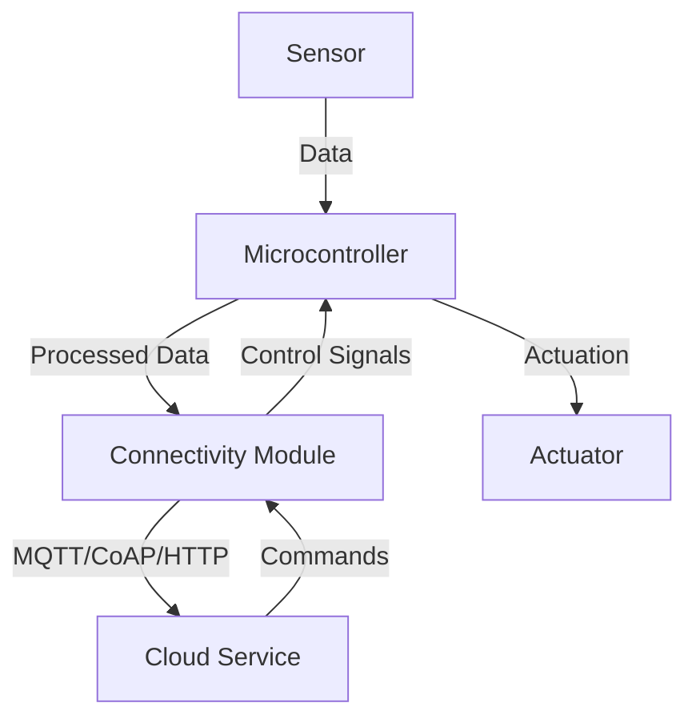

## 16.6. Building IoT Applications

The Internet of Things (IoT) represents a significant shift in how we interact with technology, enabling devices to communicate and share data seamlessly. Rust, with its focus on safety, concurrency, and performance, is an excellent choice for building robust IoT applications. In this section, we will explore the components of typical IoT systems, demonstrate how to connect devices using protocols like MQTT, CoAP, and HTTP, and discuss handling sensor data, serialization, and communication with cloud services. We will also highlight security considerations and power management for battery-powered devices.

### Components of Typical IoT Systems

IoT systems are composed of several key components:

1. **Sensors and Actuators**: These are the physical devices that collect data from the environment or perform actions based on received commands.
2. **Connectivity**: IoT devices need to communicate with each other and with cloud services. Common protocols include MQTT, CoAP, and HTTP.
3. **Data Processing**: This involves processing the data collected by sensors, which may include filtering, aggregation, and analysis.
4. **Cloud Integration**: IoT devices often send data to cloud services for storage, further processing, and analysis.
5. **Security**: Ensuring the security of IoT devices and data is critical, given the potential for sensitive information to be transmitted.
6. **Power Management**: Many IoT devices are battery-powered, requiring efficient power management to extend their operational life.

### Connecting Devices Using Protocols

#### MQTT (Message Queuing Telemetry Transport)

MQTT is a lightweight messaging protocol designed for low-bandwidth, high-latency, or unreliable networks. It is ideal for IoT applications due to its simplicity and efficiency.

```rust
use rumqttc::{MqttOptions, Client, QoS, EventLoop, Incoming};
use std::time::Duration;

fn main() {
    // Configure MQTT options
    let mut mqttoptions = MqttOptions::new("test-client", "broker.hivemq.com", 1883);
    mqttoptions.set_keep_alive(Duration::from_secs(5));

    // Create an MQTT client
    let (mut client, mut connection) = Client::new(mqttoptions, 10);

    // Subscribe to a topic
    client.subscribe("iot/sensors/temperature", QoS::AtMostOnce).unwrap();

    // Publish a message
    client.publish("iot/sensors/temperature", QoS::AtLeastOnce, false, "23.5").unwrap();

    // Event loop to handle incoming messages
    for notification in connection.iter() {
        match notification {
            Ok(Incoming::Publish(publish)) => {
                println!("Received: {:?}", publish.payload);
            }
            _ => {}
        }
    }
}
```

In this example, we use the `rumqttc` crate to connect to an MQTT broker, subscribe to a topic, and publish a message. The event loop handles incoming messages.

#### CoAP (Constrained Application Protocol)

CoAP is a protocol designed for constrained devices and networks, similar to HTTP but optimized for low-power and lossy networks.

```rust
use coap::CoAPClient;

fn main() {
    let response = CoAPClient::get("coap://coap.me/test").unwrap();
    println!("Response: {}", String::from_utf8_lossy(&response.message.payload));
}
```

Here, we use the `coap` crate to send a GET request to a CoAP server and print the response.

#### HTTP

HTTP is a widely used protocol for communication between devices and cloud services. While not as lightweight as MQTT or CoAP, it is often used due to its ubiquity and ease of integration with web services.

```rust
use reqwest::blocking::Client;

fn main() -> Result<(), Box<dyn std::error::Error>> {
    let client = Client::new();
    let res = client.get("http://httpbin.org/get").send()?;
    println!("Response: {}", res.text()?);
    Ok(())
}
```

In this example, we use the `reqwest` crate to perform an HTTP GET request and print the response.

### Handling Sensor Data and Serialization

IoT devices often need to handle and serialize sensor data for transmission. Rust's `serde` crate is a powerful tool for serialization and deserialization.

```rust
use serde::{Serialize, Deserialize};
use serde_json;

#[derive(Serialize, Deserialize)]
struct SensorData {
    temperature: f32,
    humidity: f32,
}

fn main() {
    let data = SensorData {
        temperature: 23.5,
        humidity: 60.0,
    };

    // Serialize the data to JSON
    let json_data = serde_json::to_string(&data).unwrap();
    println!("Serialized: {}", json_data);

    // Deserialize the JSON back to a SensorData struct
    let deserialized: SensorData = serde_json::from_str(&json_data).unwrap();
    println!("Deserialized: {:?}", deserialized);
}
```

This code demonstrates how to serialize and deserialize sensor data using JSON, a common format for data interchange in IoT applications.

### Communication with Cloud Services

IoT devices often communicate with cloud services for data storage and analysis. This can be achieved using HTTP or MQTT, as shown in the previous examples. Additionally, cloud providers offer SDKs and APIs for seamless integration.

### Security Considerations in IoT Devices

Security is paramount in IoT applications due to the sensitive nature of the data and the potential for unauthorized access. Key security considerations include:

- **Data Encryption**: Use encryption protocols like TLS to secure data in transit.
- **Authentication and Authorization**: Implement robust authentication mechanisms to ensure only authorized devices can communicate with the network.
- **Firmware Updates**: Ensure devices can receive secure firmware updates to patch vulnerabilities.
- **Network Security**: Use firewalls and intrusion detection systems to protect the network.

### Power Management and Optimization

For battery-powered IoT devices, efficient power management is crucial. Consider the following strategies:

- **Sleep Modes**: Use low-power sleep modes to conserve energy when the device is idle.
- **Efficient Protocols**: Choose communication protocols that minimize power consumption, such as MQTT or CoAP.
- **Data Aggregation**: Aggregate data locally before transmission to reduce the frequency of network communication.

### Visualizing IoT Architecture

To better understand the architecture of an IoT system, let's visualize it using a Mermaid.js diagram.



**Diagram Description**: This diagram illustrates a typical IoT architecture where sensors collect data, which is processed by a microcontroller. The connectivity module handles communication with cloud services using protocols like MQTT, CoAP, or HTTP. The cloud service can send commands back to the device, which may result in actuation.

### Try It Yourself

Experiment with the code examples provided:

- Modify the MQTT example to publish data from a simulated sensor.
- Extend the CoAP example to handle POST requests.
- Serialize additional sensor data fields using `serde`.

### References and Links

- [MQTT Protocol](https://mqtt.org/)
- [CoAP Protocol](https://coap.technology/)
- [Rust `rumqttc` crate](https://crates.io/crates/rumqttc)
- [Rust `coap` crate](https://crates.io/crates/coap)
- [Rust `serde` crate](https://serde.rs/)

### Knowledge Check

- What are the key components of an IoT system?
- How does MQTT differ from HTTP in terms of IoT applications?
- Why is security critical in IoT applications?
- What strategies can be used for power management in IoT devices?

### Embrace the Journey

Building IoT applications with Rust is an exciting journey that combines the power of systems programming with the connectivity of the internet. As you explore these concepts, remember that this is just the beginning. Keep experimenting, stay curious, and enjoy the journey!

## Quiz Time!



### What is a key advantage of using Rust for IoT applications?

- [x] Memory safety and concurrency
- [ ] High-level abstractions
- [ ] Built-in garbage collection
- [ ] Dynamic typing

> **Explanation:** Rust provides memory safety and concurrency, which are crucial for building reliable IoT applications.

### Which protocol is designed for low-bandwidth, high-latency networks?

- [x] MQTT
- [ ] HTTP
- [ ] FTP
- [ ] SMTP

> **Explanation:** MQTT is a lightweight messaging protocol designed for low-bandwidth, high-latency, or unreliable networks.

### What is the purpose of the `serde` crate in Rust?

- [x] Serialization and deserialization
- [ ] Networking
- [ ] Memory management
- [ ] Concurrency

> **Explanation:** The `serde` crate is used for serialization and deserialization of data in Rust.

### Which protocol is optimized for constrained devices and networks?

- [x] CoAP
- [ ] HTTP
- [ ] FTP
- [ ] SMTP

> **Explanation:** CoAP is a protocol designed for constrained devices and networks, similar to HTTP but optimized for low-power and lossy networks.

### What is a common format for data interchange in IoT applications?

- [x] JSON
- [ ] XML
- [ ] CSV
- [ ] YAML

> **Explanation:** JSON is a common format for data interchange in IoT applications due to its simplicity and readability.

### Why is security critical in IoT applications?

- [x] To protect sensitive data and prevent unauthorized access
- [ ] To increase data transmission speed
- [ ] To reduce power consumption
- [ ] To simplify device management

> **Explanation:** Security is critical in IoT applications to protect sensitive data and prevent unauthorized access to devices and networks.

### What is a strategy for power management in battery-powered IoT devices?

- [x] Use low-power sleep modes
- [ ] Increase data transmission frequency
- [ ] Use high-power communication protocols
- [ ] Disable encryption

> **Explanation:** Using low-power sleep modes is a strategy for conserving energy in battery-powered IoT devices.

### Which crate is used for MQTT communication in Rust?

- [x] `rumqttc`
- [ ] `reqwest`
- [ ] `serde`
- [ ] `tokio`

> **Explanation:** The `rumqttc` crate is used for MQTT communication in Rust.

### What is the role of a microcontroller in an IoT system?

- [x] Process sensor data and control actuators
- [ ] Store data in the cloud
- [ ] Provide network connectivity
- [ ] Encrypt data

> **Explanation:** A microcontroller processes sensor data and controls actuators in an IoT system.

### True or False: HTTP is the most efficient protocol for all IoT applications.

- [ ] True
- [x] False

> **Explanation:** While HTTP is widely used, it is not always the most efficient protocol for IoT applications, especially in low-power or constrained environments where MQTT or CoAP may be more suitable.


