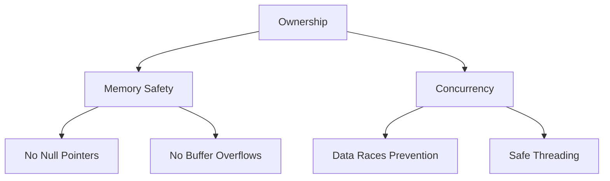

## 16.7. Safety and Reliability in Embedded Systems

Embedded systems are ubiquitous, powering everything from household appliances to critical infrastructure. Ensuring their safety and reliability is paramount, as failures can lead to catastrophic consequences. Rust, with its strong emphasis on safety and concurrency, offers a compelling choice for embedded systems development. In this section, we will explore how Rust's unique features contribute to building safe and reliable embedded systems.

### Leveraging Rust's Ownership Model

Rust's ownership model is a cornerstone of its safety guarantees. By enforcing strict rules about how memory is accessed and modified, Rust prevents common errors such as buffer overflows and null pointer dereferences.

#### Ownership and Borrowing

Ownership in Rust ensures that each piece of data has a single owner at any given time. This ownership can be temporarily transferred or borrowed, but the rules ensure that data races and memory leaks are impossible.

```rust
fn main() {
    let data = vec![1, 2, 3];
    let sum = calculate_sum(&data);
    println!("Sum: {}", sum);
}

fn calculate_sum(data: &Vec<i32>) -> i32 {
    data.iter().sum()
}
```

In this example, the `calculate_sum` function borrows the vector `data` without taking ownership, allowing safe access without risking memory corruption.

#### Preventing Memory Safety Issues

Rust's type system and ownership model work together to prevent memory safety issues. For instance, Rust's compiler checks for null pointer dereferences at compile time, eliminating a class of runtime errors prevalent in languages like C and C++.

### Avoiding Concurrency Problems

Concurrency is a common requirement in embedded systems, where tasks must run simultaneously without interfering with each other. Rust's concurrency model, based on ownership, ensures that data races are impossible.

#### Safe Concurrency with Rust

Rust provides several concurrency primitives, such as threads, channels, and locks, all designed to work safely within its ownership model.

```rust
use std::sync::{Arc, Mutex};
use std::thread;

fn main() {
    let data = Arc::new(Mutex::new(vec![1, 2, 3]));

    let handles: Vec<_> = (0..3).map(|_| {
        let data = Arc::clone(&data);
        thread::spawn(move || {
            let mut data = data.lock().unwrap();
            data.push(1);
        })
    }).collect();

    for handle in handles {
        handle.join().unwrap();
    }

    println!("{:?}", *data.lock().unwrap());
}
```

In this example, we use `Arc` (Atomic Reference Counting) and `Mutex` to safely share and modify data across threads. Rust's type system ensures that the data is accessed in a thread-safe manner.

### Handling Critical Sections and Interrupt Safety

In embedded systems, critical sections are parts of the code that must not be interrupted. Rust provides mechanisms to handle these safely.

#### Critical Sections

Critical sections can be managed using locks or atomic operations. Rust's standard library provides atomic types that can be used to implement lock-free data structures.

```rust
use std::sync::atomic::{AtomicUsize, Ordering};

fn main() {
    let counter = AtomicUsize::new(0);

    // Simulate critical section
    counter.fetch_add(1, Ordering::SeqCst);
    println!("Counter: {}", counter.load(Ordering::SeqCst));
}
```

#### Interrupt Safety

Rust's `no_std` environment, used in embedded systems, allows for writing interrupt-safe code by avoiding dynamic memory allocation and ensuring deterministic behavior.

### Verifying Correctness of Embedded Code

Ensuring the correctness of embedded code is crucial, given the potential impact of errors. Rust's type system and compile-time checks provide strong guarantees about code correctness.

#### Static Analysis and Testing

Rust's compiler performs extensive static analysis, catching many errors at compile time. Additionally, tools like `cargo test` and `rustdoc` facilitate testing and documentation.

```rust
#[cfg(test)]
mod tests {
    use super::*;

    #[test]
    fn test_calculate_sum() {
        let data = vec![1, 2, 3];
        assert_eq!(calculate_sum(&data), 6);
    }
}
```

This test ensures that the `calculate_sum` function behaves as expected, providing confidence in the code's correctness.

### Importance of Deterministic Behavior

Deterministic behavior is critical in embedded systems, where timing and predictability are essential. Rust's design encourages writing deterministic code by avoiding undefined behavior and ensuring memory safety.

#### Ensuring Determinism

Rust's `no_std` environment and its focus on compile-time checks help ensure that embedded systems behave predictably.

### Visualizing Rust's Safety in Embedded Systems

To better understand how Rust's safety features work in embedded systems, let's visualize the interaction between ownership, borrowing, and concurrency.



**Diagram Description**: This diagram illustrates how Rust's ownership model contributes to memory safety and safe concurrency, preventing common errors like null pointers and buffer overflows.

### References and Further Reading

- [Rust Programming Language](https://www.rust-lang.org/)
- [The Embedded Rust Book](https://docs.rust-embedded.org/book/)
- [Rust's Ownership Model](https://doc.rust-lang.org/book/ch04-00-understanding-ownership.html)

### Knowledge Check

- How does Rust's ownership model prevent memory safety issues?
- What are the benefits of using Rust's concurrency model in embedded systems?
- How can critical sections be safely managed in Rust?
- Why is deterministic behavior important in embedded systems?

### Embrace the Journey

Remember, mastering Rust for embedded systems is a journey. As you progress, you'll build more robust and reliable systems. Keep experimenting, stay curious, and enjoy the journey!

## Quiz Time!



### How does Rust's ownership model contribute to memory safety?

- [x] By ensuring each piece of data has a single owner
- [ ] By allowing multiple owners for each piece of data
- [ ] By using garbage collection
- [ ] By allowing null pointers

> **Explanation:** Rust's ownership model ensures that each piece of data has a single owner, preventing memory safety issues like data races and memory leaks.

### What is a key benefit of Rust's concurrency model?

- [x] Prevention of data races
- [ ] Increased memory usage
- [ ] Simplified syntax
- [ ] Use of global variables

> **Explanation:** Rust's concurrency model, based on ownership, prevents data races, ensuring safe concurrent execution.

### How can critical sections be managed in Rust?

- [x] Using locks or atomic operations
- [ ] By disabling interrupts
- [ ] By using global variables
- [ ] By ignoring them

> **Explanation:** Critical sections can be managed using locks or atomic operations to ensure safe access to shared resources.

### Why is deterministic behavior important in embedded systems?

- [x] Ensures predictability and timing accuracy
- [ ] Allows for dynamic memory allocation
- [ ] Increases code complexity
- [ ] Reduces performance

> **Explanation:** Deterministic behavior ensures that embedded systems behave predictably, which is crucial for timing and accuracy.

### What does Rust's `no_std` environment provide?

- [x] A way to write interrupt-safe code
- [ ] Dynamic memory allocation
- [ ] Garbage collection
- [ ] Automatic error handling

> **Explanation:** Rust's `no_std` environment allows for writing interrupt-safe code by avoiding dynamic memory allocation.

### How does Rust prevent null pointer dereferences?

- [x] Through compile-time checks
- [ ] By using garbage collection
- [ ] By allowing null pointers
- [ ] By using global variables

> **Explanation:** Rust prevents null pointer dereferences through compile-time checks, eliminating a class of runtime errors.

### What is the role of `Arc` in Rust?

- [x] Provides atomic reference counting for safe concurrency
- [ ] Allows for dynamic memory allocation
- [ ] Simplifies syntax
- [ ] Enables global variables

> **Explanation:** `Arc` provides atomic reference counting, allowing for safe sharing of data across threads.

### How does Rust ensure the correctness of embedded code?

- [x] Through static analysis and testing
- [ ] By using global variables
- [ ] By ignoring errors
- [ ] By allowing null pointers

> **Explanation:** Rust ensures the correctness of embedded code through static analysis and testing, catching many errors at compile time.

### What is a benefit of using `Mutex` in Rust?

- [x] Ensures safe access to shared resources
- [ ] Increases code complexity
- [ ] Allows for dynamic memory allocation
- [ ] Simplifies syntax

> **Explanation:** `Mutex` ensures safe access to shared resources, preventing data races in concurrent programming.

### Rust's ownership model eliminates which common error?

- [x] Data races
- [ ] Increased memory usage
- [ ] Simplified syntax
- [ ] Use of global variables

> **Explanation:** Rust's ownership model eliminates data races, ensuring safe concurrent execution.



By understanding and leveraging Rust's safety features, you can build embedded systems that are both safe and reliable, ensuring they perform as expected in critical applications.
