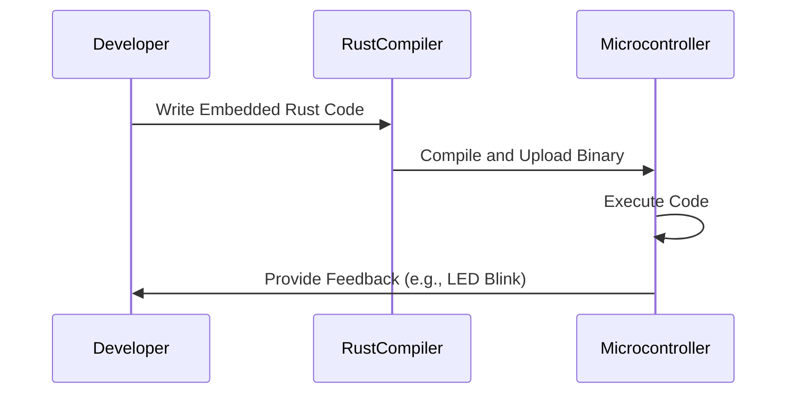

## 16.9. Best Practices for Embedded Rust Development

Embedded systems development with Rust offers a unique blend of performance, safety, and concurrency. As we delve into the best practices for embedded Rust development, we'll explore key principles, code organization, modularity, reusability, documentation, testing, debugging, and common pitfalls. By adhering to these guidelines, developers can ensure their embedded systems are efficient, maintainable, and robust.

### Key Principles for Writing Embedded Rust Code

1. **Leverage Rust's Ownership Model**: Rust's ownership model is a powerful tool for managing memory safely. In embedded systems, where resources are limited, understanding and effectively using ownership, borrowing, and lifetimes is crucial. This ensures that memory is used efficiently and safely, preventing common issues like memory leaks and dangling pointers.

2. **Embrace Zero-Cost Abstractions**: Rust provides abstractions that do not incur runtime overhead. Use these abstractions to write clean and maintainable code without sacrificing performance. This is particularly important in embedded systems, where every byte and cycle counts.

3. **Prioritize Safety and Concurrency**: Rust's type system and concurrency model help prevent data races and ensure thread safety. Use these features to write concurrent code that is both safe and efficient, taking advantage of Rust's fearless concurrency.

4. **Optimize for Resource Constraints**: Embedded systems often run on hardware with limited resources. Optimize your code for memory and processing efficiency. Use Rust's `no_std` environment to develop applications without the standard library, reducing overhead.

5. **Use Platform-Specific Features Wisely**: Rust allows for direct interaction with hardware. Use platform-specific features judiciously, ensuring that your code remains portable and maintainable.

### Code Organization, Modularity, and Reusability

1. **Organize Code into Modules and Crates**: Use Rust's module system to organize your code into logical units. This enhances readability and maintainability. Crates can be used to encapsulate functionality, making it reusable across projects.

2. **Adopt a Layered Architecture**: Structure your application in layers, separating hardware interaction, business logic, and application logic. This separation of concerns makes the code easier to understand and test.

3. **Use Traits for Abstraction**: Traits in Rust allow for defining shared behavior across different types. Use traits to abstract hardware-specific functionality, enabling code reuse and flexibility.

4. **Encapsulate Hardware Interactions**: Isolate hardware-specific code in separate modules or crates. This makes it easier to port your application to different hardware platforms.

5. **Promote Code Reusability**: Write generic code using Rust's powerful type system and generics. This allows for code reuse across different parts of your application and even across different projects.

### Importance of Documentation and Testing

1. **Document Extensively**: Use `rustdoc` to generate documentation from your code comments. Document your code thoroughly, explaining the purpose and functionality of modules, functions, and data structures.

2. **Write Unit and Integration Tests**: Use `cargo test` to write and run tests. Unit tests verify individual components, while integration tests ensure that different parts of your application work together as expected.

3. **Test on Target Hardware**: Whenever possible, test your application on the actual hardware it will run on. This helps identify issues that may not be apparent in a simulated environment.

4. **Use Continuous Integration**: Set up a CI pipeline to automate testing and ensure that your code remains functional as it evolves. This is especially important in embedded systems, where changes can have far-reaching effects.

### Tips for Debugging Embedded Rust Applications

1. **Use Debugging Tools**: Leverage tools like GDB and OpenOCD for debugging embedded applications. These tools allow you to inspect the state of your application and identify issues.

2. **Implement Logging**: Use logging to capture runtime information. In embedded systems, where traditional debugging may be limited, logging can provide valuable insights into application behavior.

3. **Simulate Hardware Interactions**: Use simulation tools to test hardware interactions in a controlled environment. This can help identify issues early in the development process.

4. **Analyze Compiler Warnings**: Pay attention to compiler warnings and use tools like Clippy to identify potential issues in your code. Rust's compiler provides valuable feedback that can help improve code quality.

### Common Pitfalls and How to Avoid Them

1. **Avoid Overusing Unsafe Code**: While Rust allows for unsafe code, use it sparingly and only when absolutely necessary. Ensure that any unsafe code is well-documented and thoroughly tested.

2. **Manage Lifetimes Carefully**: Lifetimes can be complex, especially in embedded systems. Ensure that you understand how lifetimes work and use them correctly to avoid memory safety issues.

3. **Beware of Blocking Operations**: In embedded systems, blocking operations can lead to performance bottlenecks. Use non-blocking alternatives where possible to keep your application responsive.

4. **Handle Errors Gracefully**: Use Rust's `Result` and `Option` types for error handling. This ensures that your application can recover from errors and continue operating.

5. **Optimize for Power Efficiency**: Embedded systems often run on battery power. Optimize your code for power efficiency by minimizing CPU usage and using low-power modes.

### Code Example: Basic Embedded Rust Application

Let's look at a simple example of an embedded Rust application that blinks an LED on a microcontroller:

```rust
#![no_std]
#![no_main]

use panic_halt as _; // Panic handler
use cortex_m_rt::entry;
use stm32f4xx_hal::{pac, prelude::*};

#[entry]
fn main() -> ! {
    // Get access to the device specific peripherals from the peripheral access crate
    let dp = pac::Peripherals::take().unwrap();

    // Take ownership over the raw rcc device and convert it into the corresponding HAL struct
    let rcc = dp.RCC.constrain();

    // Freeze the configuration of all the clocks in the system
    let clocks = rcc.cfgr.freeze();

    // Acquire the GPIOA peripheral
    let gpioa = dp.GPIOA.split();

    // Configure PA5 as output
    let mut led = gpioa.pa5.into_push_pull_output();

    loop {
        // Set the LED high
        led.set_high().unwrap();
        cortex_m::asm::delay(8_000_000);

        // Set the LED low
        led.set_low().unwrap();
        cortex_m::asm::delay(8_000_000);
    }
}
```

**Explanation**:
- We use the `#![no_std]` attribute to indicate that the application does not use the standard library.
- The `#![no_main]` attribute is used to define a custom entry point.
- The `panic_halt` crate is used to define a panic handler.
- We use the `stm32f4xx_hal` crate to interact with the STM32F4 microcontroller.
- The `main` function is marked with the `#[entry]` attribute to indicate the entry point of the application.
- We configure the GPIOA peripheral and set PA5 as an output to control the LED.

### Try It Yourself

Experiment with the code example by modifying the delay values to change the blink rate of the LED. Try configuring different GPIO pins or using other peripherals available on your microcontroller.

### Visualizing Embedded Rust Development

To better understand the flow of an embedded Rust application, let's visualize the process using a sequence diagram:



**Description**: This diagram illustrates the typical flow of developing an embedded Rust application. The developer writes the code, which is then compiled and uploaded to the microcontroller. The microcontroller executes the code and provides feedback, such as blinking an LED.

### References and Links

- [Rust Embedded Book](https://docs.rust-embedded.org/book/)
- [The Embedded Rust Book](https://rust-embedded.github.io/book/)
- [Rust Programming Language](https://www.rust-lang.org/)
- [STM32F4xx HAL](https://docs.rs/stm32f4xx-hal/latest/stm32f4xx_hal/)

### Knowledge Check

1. What are the benefits of using Rust's ownership model in embedded systems?
2. How can you optimize an embedded Rust application for resource constraints?
3. Why is it important to test embedded applications on target hardware?
4. What tools can be used for debugging embedded Rust applications?
5. How can you avoid common pitfalls in embedded Rust development?

### Embrace the Journey

Remember, embedded Rust development is a journey. As you progress, you'll encounter new challenges and opportunities to learn. Keep experimenting, stay curious, and enjoy the process of building efficient and reliable embedded systems with Rust.

## Quiz Time!



### What is a key benefit of using Rust's ownership model in embedded systems?

- [x] Ensures memory safety without a garbage collector
- [ ] Increases code execution speed
- [ ] Simplifies syntax for hardware interaction
- [ ] Provides built-in support for all microcontrollers

> **Explanation:** Rust's ownership model ensures memory safety without the need for a garbage collector, which is crucial in resource-constrained embedded systems.

### Which Rust feature allows for defining shared behavior across different types?

- [ ] Modules
- [x] Traits
- [ ] Crates
- [ ] Lifetimes

> **Explanation:** Traits in Rust allow for defining shared behavior across different types, enabling code reuse and abstraction.

### Why is it important to test embedded applications on target hardware?

- [x] To identify hardware-specific issues
- [ ] To reduce code size
- [ ] To improve compilation speed
- [ ] To simplify code syntax

> **Explanation:** Testing on target hardware helps identify hardware-specific issues that may not be apparent in a simulated environment.

### What tool can be used for debugging embedded Rust applications?

- [x] GDB
- [ ] Cargo
- [ ] Clippy
- [ ] Rustfmt

> **Explanation:** GDB is a tool that can be used for debugging embedded Rust applications, allowing developers to inspect the state of their application.

### How can you avoid blocking operations in embedded systems?

- [x] Use non-blocking alternatives
- [ ] Increase CPU clock speed
- [ ] Use more memory
- [ ] Simplify code structure

> **Explanation:** Using non-blocking alternatives helps avoid performance bottlenecks in embedded systems, keeping the application responsive.

### What is the purpose of the `#![no_std]` attribute in Rust?

- [x] To indicate that the application does not use the standard library
- [ ] To enable garbage collection
- [ ] To simplify syntax
- [ ] To increase code execution speed

> **Explanation:** The `#![no_std]` attribute indicates that the application does not use the standard library, which is useful in resource-constrained environments.

### Which crate is used to define a panic handler in the provided code example?

- [x] panic_halt
- [ ] cortex_m_rt
- [ ] stm32f4xx_hal
- [ ] rustdoc

> **Explanation:** The `panic_halt` crate is used to define a panic handler in the provided code example.

### What is a common pitfall in embedded Rust development?

- [x] Overusing unsafe code
- [ ] Using too many modules
- [ ] Writing too many tests
- [ ] Over-documenting code

> **Explanation:** Overusing unsafe code is a common pitfall in embedded Rust development, as it can lead to memory safety issues.

### Which Rust feature helps prevent data races and ensure thread safety?

- [x] Concurrency model
- [ ] Modules
- [ ] Crates
- [ ] Lifetimes

> **Explanation:** Rust's concurrency model helps prevent data races and ensure thread safety, making it ideal for concurrent programming.

### True or False: Rust's type system and concurrency model help prevent data races.

- [x] True
- [ ] False

> **Explanation:** True. Rust's type system and concurrency model are designed to help prevent data races and ensure thread safety.


