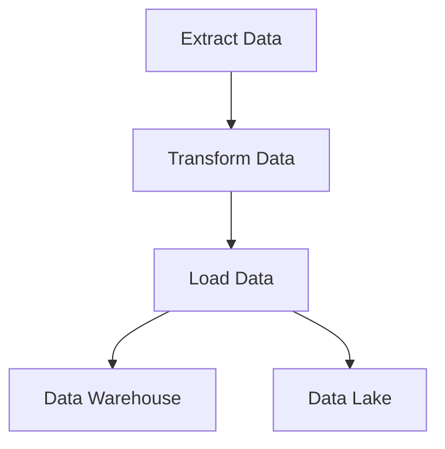

## 17.1. Introduction to Data Engineering in Rust

Data engineering is a critical field that involves the design and construction of systems for collecting, storing, and analyzing data at scale. The Extract, Transform, Load (ETL) process is a cornerstone of data engineering, enabling organizations to transform raw data into actionable insights. In this section, we will explore how Rust, with its unique features, can be leveraged for data engineering tasks, focusing on performance, safety, and concurrency.

### The Role of Data Engineering

Data engineering is the backbone of data-driven decision-making. It involves creating pipelines that extract data from various sources, transform it into a usable format, and load it into a data warehouse or other storage systems. These processes are essential for:

- **Data Integration**: Combining data from different sources to provide a unified view.
- **Data Cleaning**: Removing inaccuracies and inconsistencies to ensure data quality.
- **Data Transformation**: Converting data into a format suitable for analysis.
- **Data Storage**: Efficiently storing data for quick retrieval and analysis.

### The Significance of ETL Processes

ETL processes are crucial for preparing data for analysis. They involve:

1. **Extracting** data from various sources, such as databases, APIs, and files.
2. **Transforming** data to fit operational needs, which may include filtering, aggregating, and enriching the data.
3. **Loading** the transformed data into a target system, such as a data warehouse.

These processes must be efficient, reliable, and scalable to handle the growing volume and complexity of data.

### Challenges in Data Engineering

Data engineering faces several challenges:

- **Processing Large Datasets**: Handling vast amounts of data efficiently requires robust systems that can scale horizontally.
- **Ensuring Data Integrity**: Maintaining the accuracy and consistency of data across different stages of processing.
- **Performance Optimization**: Minimizing latency and maximizing throughput in data pipelines.
- **Concurrency Management**: Safely managing concurrent data processing tasks to avoid race conditions and deadlocks.

### Why Rust for Data Engineering?

Rust is a systems programming language known for its performance, safety, and concurrency features, making it an excellent choice for data engineering tasks. Here’s why:

- **Memory Safety**: Rust’s ownership model ensures memory safety without a garbage collector, preventing common bugs such as null pointer dereferencing and buffer overflows.
- **Zero-Cost Abstractions**: Rust provides high-level abstractions without sacrificing performance, allowing developers to write expressive code that compiles to efficient machine code.
- **Concurrency**: Rust’s concurrency model, based on ownership and borrowing, enables safe concurrent programming, which is crucial for processing large datasets in parallel.
- **Performance**: Rust’s performance is comparable to C and C++, making it suitable for high-performance computing tasks required in data engineering.

### Data Engineering Scenarios Where Rust Excels

Rust excels in several data engineering scenarios:

- **Real-Time Data Processing**: Rust’s performance and concurrency features make it ideal for building systems that process data in real-time, such as streaming analytics platforms.
- **Data Transformation Pipelines**: Rust’s expressive type system and pattern matching capabilities facilitate the creation of complex data transformation logic.
- **Integration with Existing Systems**: Rust’s interoperability with C and other languages allows it to integrate seamlessly with existing data infrastructure.
- **Handling Big Data**: Rust’s ability to manage memory efficiently and execute concurrent tasks safely makes it suitable for handling big data workloads.

### Setting the Context for Subsequent Sections

In the following sections, we will delve deeper into building ETL pipelines with Rust, integrating with various data stores, and handling big data. We will explore how Rust’s features can be leveraged to create efficient, reliable, and scalable data engineering solutions.

### Code Example: Simple Data Transformation in Rust

Let's look at a simple example of data transformation in Rust. Suppose we have a CSV file containing user data, and we want to transform it into a JSON format.

```rust
use csv::ReaderBuilder;
use serde_json::json;
use std::error::Error;
use std::fs::File;
use std::io::Write;

fn main() -> Result<(), Box<dyn Error>> {
    // Open the CSV file
    let file = File::open("users.csv")?;
    let mut rdr = ReaderBuilder::new().from_reader(file);

    // Create a JSON file to write the transformed data
    let mut json_file = File::create("users.json")?;

    // Iterate over each record in the CSV
    for result in rdr.records() {
        let record = result?;
        // Transform the CSV record into a JSON object
        let user_json = json!({
            "name": record.get(0).unwrap_or(""),
            "email": record.get(1).unwrap_or(""),
            "age": record.get(2).unwrap_or("")
        });

        // Write the JSON object to the file
        writeln!(json_file, "{}", user_json)?;
    }

    Ok(())
}
```

In this example, we use the `csv` crate to read data from a CSV file and the `serde_json` crate to transform each record into a JSON object. The transformed data is then written to a JSON file.

### Visualizing Data Engineering Workflow

To better understand the data engineering workflow, let's visualize a typical ETL process using a flowchart.



**Figure 1**: This flowchart illustrates a typical ETL process where data is extracted from various sources, transformed into a suitable format, and loaded into a data warehouse or data lake for analysis.

### References and Links

- [Rust Programming Language](https://www.rust-lang.org/)
- [CSV Crate Documentation](https://docs.rs/csv/)
- [Serde JSON Documentation](https://docs.rs/serde_json/)

### Knowledge Check

- What are the key components of an ETL process?
- How does Rust’s ownership model contribute to memory safety?
- Why is concurrency important in data engineering?

### Embrace the Journey

Remember, this is just the beginning. As you progress, you'll build more complex data engineering solutions with Rust. Keep experimenting, stay curious, and enjoy the journey!

### Best Practices for Tags

- Use Specific and Relevant Tags
- Use 4 to 8 relevant and specific tags that reflect the article's content.
- Tags should reflect key topics, technologies, or concepts.

## Quiz Time!



### What is the primary role of data engineering?

- [x] Designing systems for collecting, storing, and analyzing data
- [ ] Developing user interfaces for data visualization
- [ ] Creating machine learning models
- [ ] Writing scripts for data entry

> **Explanation:** Data engineering focuses on creating systems for data collection, storage, and analysis.

### Which of the following is NOT a part of the ETL process?

- [ ] Extract
- [ ] Transform
- [ ] Load
- [x] Visualize

> **Explanation:** ETL stands for Extract, Transform, Load. Visualization is not part of the ETL process.

### Why is Rust a compelling choice for data engineering?

- [x] Memory safety and concurrency
- [ ] Built-in garbage collection
- [ ] Dynamic typing
- [ ] Lack of performance optimization

> **Explanation:** Rust offers memory safety and concurrency without a garbage collector, making it suitable for data engineering.

### What is a common challenge in data engineering?

- [x] Processing large datasets efficiently
- [ ] Designing user interfaces
- [ ] Writing documentation
- [ ] Creating marketing strategies

> **Explanation:** Efficiently processing large datasets is a key challenge in data engineering.

### How does Rust ensure memory safety?

- [x] Ownership model
- [ ] Garbage collection
- [ ] Dynamic typing
- [ ] Manual memory management

> **Explanation:** Rust's ownership model ensures memory safety without a garbage collector.

### What is the significance of zero-cost abstractions in Rust?

- [x] High-level abstractions without performance loss
- [ ] Automatic memory management
- [ ] Simplified syntax
- [ ] Built-in concurrency

> **Explanation:** Zero-cost abstractions allow Rust to provide high-level abstractions without sacrificing performance.

### Which feature of Rust is crucial for handling big data workloads?

- [x] Concurrency
- [ ] Dynamic typing
- [ ] Manual memory management
- [ ] Built-in garbage collection

> **Explanation:** Concurrency is crucial for processing large datasets in parallel, making Rust suitable for big data workloads.

### What is the purpose of the `serde_json` crate in Rust?

- [x] Transforming data into JSON format
- [ ] Reading CSV files
- [ ] Managing memory
- [ ] Handling concurrency

> **Explanation:** The `serde_json` crate is used for transforming data into JSON format.

### What does the flowchart in the article represent?

- [x] A typical ETL process
- [ ] A machine learning pipeline
- [ ] A web application architecture
- [ ] A user interface design

> **Explanation:** The flowchart represents a typical ETL process in data engineering.

### True or False: Rust's performance is comparable to C and C++.

- [x] True
- [ ] False

> **Explanation:** Rust's performance is indeed comparable to C and C++, making it suitable for high-performance computing tasks.


