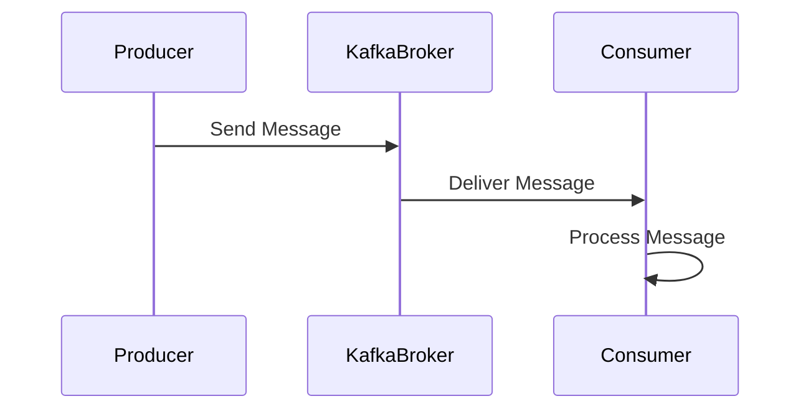

## 17.10. Real-Time Data Processing with Kafka and Rust

In the world of data engineering, real-time data processing has become a crucial component for businesses that need to react to data as it arrives. Apache Kafka, a distributed event streaming platform, is a popular choice for building real-time data pipelines. In this section, we will explore how to leverage Rust, a systems programming language known for its performance and safety, to interact with Kafka for real-time data processing.

### Introduction to Apache Kafka

Apache Kafka is an open-source platform designed for building real-time data pipelines and streaming applications. It is capable of handling trillions of events a day, making it a robust choice for large-scale data processing. Kafka's architecture is based on a distributed commit log, which allows it to store streams of records in a fault-tolerant manner.

#### Key Features of Kafka

- **Scalability**: Kafka can scale horizontally by adding more brokers to the cluster.
- **Durability**: Data is replicated across multiple brokers, ensuring fault tolerance.
- **High Throughput**: Kafka can handle large volumes of data with low latency.
- **Stream Processing**: Kafka Streams API allows for complex stream processing.

### Integrating Rust with Kafka

Rust's performance and memory safety make it an excellent choice for building high-performance data processing applications. The `rdkafka` crate is a Rust client for Kafka, providing both high-level and low-level APIs to interact with Kafka clusters.

#### Setting Up the Environment

Before we dive into code examples, ensure you have Kafka and Rust installed on your system. You can download Kafka from the [official website](https://kafka.apache.org/downloads) and install Rust using [rustup](https://rustup.rs/).

#### Producing Kafka Messages with Rust

Let's start by creating a simple Kafka producer in Rust. We'll use the `rdkafka` crate to send messages to a Kafka topic.

```rust
use rdkafka::config::ClientConfig;
use rdkafka::producer::{FutureProducer, FutureRecord};
use std::time::Duration;

fn main() {
    // Create a producer configuration
    let producer: FutureProducer = ClientConfig::new()
        .set("bootstrap.servers", "localhost:9092")
        .create()
        .expect("Producer creation error");

    // Send a message to the Kafka topic "test"
    let delivery_status = producer
        .send(
            FutureRecord::to("test")
                .payload("Hello, Kafka!")
                .key("key"),
            Duration::from_secs(0),
        )
        .await;

    match delivery_status {
        Ok(delivery) => println!("Message delivered: {:?}", delivery),
        Err((e, _)) => println!("Failed to deliver message: {:?}", e),
    }
}
```

**Explanation**: In this example, we configure a `FutureProducer` to connect to a Kafka broker running on `localhost:9092`. We then send a message with a payload and a key to the topic "test". The `send` method returns a future that resolves to the delivery status of the message.

#### Consuming Kafka Messages with Rust

Next, let's create a Kafka consumer to read messages from a topic.

```rust
use rdkafka::config::ClientConfig;
use rdkafka::consumer::{Consumer, StreamConsumer};
use rdkafka::message::Message;
use rdkafka::util::get_rdkafka_version;
use std::time::Duration;

fn main() {
    let (version_n, version_s) = get_rdkafka_version();
    println!("rd_kafka version: 0x{:08x}, {}", version_n, version_s);

    // Create a consumer configuration
    let consumer: StreamConsumer = ClientConfig::new()
        .set("group.id", "example_group")
        .set("bootstrap.servers", "localhost:9092")
        .set("enable.partition.eof", "false")
        .set("session.timeout.ms", "6000")
        .set("enable.auto.commit", "true")
        .create()
        .expect("Consumer creation failed");

    // Subscribe to the "test" topic
    consumer.subscribe(&["test"]).expect("Can't subscribe to specified topic");

    // Poll for messages
    loop {
        match consumer.recv().await {
            Err(e) => println!("Error receiving message: {:?}", e),
            Ok(m) => {
                let payload = m.payload_view::<str>().unwrap_or(None).unwrap_or("");
                println!("Received message: {}", payload);
            }
        }
    }
}
```

**Explanation**: Here, we configure a `StreamConsumer` to connect to the Kafka broker and subscribe to the "test" topic. The consumer polls for messages in a loop and prints the payload of each received message.

### Processing Streaming Data in Real-Time

With the ability to produce and consume messages, we can now focus on processing streaming data in real-time. Rust's concurrency model, based on ownership and borrowing, ensures safe concurrent processing of data streams.

#### Example: Real-Time Log Aggregation

Consider a scenario where we need to aggregate logs from multiple sources in real-time. We can use Kafka to collect logs and Rust to process and store them.

```rust
use rdkafka::consumer::{Consumer, StreamConsumer};
use rdkafka::message::Message;
use rdkafka::util::get_rdkafka_version;
use std::collections::HashMap;
use std::sync::{Arc, Mutex};
use tokio::task;

#[tokio::main]
async fn main() {
    let (version_n, version_s) = get_rdkafka_version();
    println!("rd_kafka version: 0x{:08x}, {}", version_n, version_s);

    let consumer: StreamConsumer = ClientConfig::new()
        .set("group.id", "log_aggregator")
        .set("bootstrap.servers", "localhost:9092")
        .set("enable.partition.eof", "false")
        .set("session.timeout.ms", "6000")
        .set("enable.auto.commit", "true")
        .create()
        .expect("Consumer creation failed");

    consumer.subscribe(&["logs"]).expect("Can't subscribe to specified topic");

    let log_counts = Arc::new(Mutex::new(HashMap::new()));

    loop {
        match consumer.recv().await {
            Err(e) => println!("Error receiving message: {:?}", e),
            Ok(m) => {
                let payload = m.payload_view::<str>().unwrap_or(None).unwrap_or("");
                let mut counts = log_counts.lock().unwrap();
                *counts.entry(payload.to_string()).or_insert(0) += 1;
            }
        }
    }
}
```

**Explanation**: In this example, we use a `HashMap` to count occurrences of each log message. The `log_counts` map is shared across threads using `Arc` and `Mutex`, ensuring safe concurrent access.

### Challenges in Real-Time Data Processing

Real-time data processing comes with its own set of challenges. Let's discuss some of the common issues and how to address them.

#### Message Ordering

Kafka guarantees message ordering within a partition. However, when consuming from multiple partitions, maintaining order can be challenging. Use partition keys to ensure related messages are sent to the same partition.

#### Partitioning

Partitioning allows Kafka to scale horizontally. Choose partition keys wisely to ensure even distribution of messages across partitions. This helps in balancing load and improving throughput.

#### Fault Tolerance

Kafka's replication mechanism provides fault tolerance. Ensure your Kafka cluster is configured with an appropriate replication factor. Use consumer groups to distribute load and handle consumer failures gracefully.

### Use Cases for Kafka and Rust

Real-time data processing with Kafka and Rust can be applied to various use cases:

- **Event Processing**: Process events from IoT devices, user interactions, or system logs in real-time.
- **Log Aggregation**: Collect and analyze logs from multiple sources for monitoring and alerting.
- **Data Analytics**: Perform real-time analytics on streaming data for insights and decision-making.

### Visualizing Kafka and Rust Integration

To better understand the integration between Kafka and Rust, let's visualize the data flow using a sequence diagram.



**Description**: This diagram illustrates the flow of messages from a producer to a Kafka broker and then to a consumer. The consumer processes the message in real-time.

### Try It Yourself

Experiment with the provided code examples by modifying the message payloads, topics, or consumer group IDs. Try implementing additional features such as filtering messages based on content or aggregating data over time.

### References and Links

- [Apache Kafka Official Documentation](https://kafka.apache.org/documentation/)
- [rdkafka crate on crates.io](https://crates.io/crates/rdkafka)
- [Rust Programming Language](https://www.rust-lang.org/)

### Knowledge Check

- What are the key features of Apache Kafka?
- How does Rust's concurrency model benefit real-time data processing?
- What are some challenges associated with message ordering in Kafka?

### Embrace the Journey

Remember, integrating Rust with Kafka for real-time data processing is just the beginning. As you gain experience, you'll be able to build more complex and efficient data pipelines. Keep experimenting, stay curious, and enjoy the journey!

## Quiz Time!



### What is Apache Kafka primarily used for?

- [x] Building real-time data pipelines and streaming applications
- [ ] Storing large amounts of static data
- [ ] Managing relational databases
- [ ] Creating web applications

> **Explanation:** Apache Kafka is designed for building real-time data pipelines and streaming applications, handling large volumes of data efficiently.

### Which Rust crate is commonly used for interacting with Kafka?

- [x] rdkafka
- [ ] tokio
- [ ] serde
- [ ] hyper

> **Explanation:** The `rdkafka` crate is a Rust client for Kafka, providing APIs to produce and consume messages.

### What does Kafka guarantee within a partition?

- [x] Message ordering
- [ ] Fault tolerance
- [ ] Data encryption
- [ ] Load balancing

> **Explanation:** Kafka guarantees message ordering within a partition, ensuring that messages are processed in the order they were sent.

### How can you ensure related messages are sent to the same Kafka partition?

- [x] Use partition keys
- [ ] Increase the replication factor
- [ ] Use multiple consumer groups
- [ ] Enable auto-commit

> **Explanation:** Using partition keys ensures that related messages are sent to the same partition, maintaining order.

### What is a common use case for Kafka and Rust integration?

- [x] Real-time log aggregation
- [ ] Static website hosting
- [ ] Image processing
- [ ] Video editing

> **Explanation:** Real-time log aggregation is a common use case for Kafka and Rust, allowing for efficient collection and analysis of logs.

### What is the role of a consumer group in Kafka?

- [x] Distribute load and handle consumer failures
- [ ] Store messages permanently
- [ ] Encrypt data in transit
- [ ] Manage Kafka broker configurations

> **Explanation:** Consumer groups distribute load among consumers and handle failures, ensuring reliable message processing.

### How does Kafka achieve fault tolerance?

- [x] Data replication across multiple brokers
- [ ] Using a single broker for all data
- [ ] Encrypting all messages
- [ ] Disabling partitioning

> **Explanation:** Kafka achieves fault tolerance by replicating data across multiple brokers, ensuring data availability even if some brokers fail.

### What is a challenge associated with consuming messages from multiple Kafka partitions?

- [x] Maintaining message order
- [ ] Increasing message size
- [ ] Encrypting messages
- [ ] Reducing message latency

> **Explanation:** Maintaining message order is challenging when consuming from multiple partitions, as each partition processes messages independently.

### True or False: Kafka can handle trillions of events a day.

- [x] True
- [ ] False

> **Explanation:** Kafka is designed to handle large volumes of data, capable of processing trillions of events a day.

### What is the benefit of using Rust for real-time data processing?

- [x] Performance and memory safety
- [ ] Built-in garbage collection
- [ ] Dynamic typing
- [ ] Lack of concurrency support

> **Explanation:** Rust's performance and memory safety make it an excellent choice for real-time data processing, ensuring efficient and safe code execution.


