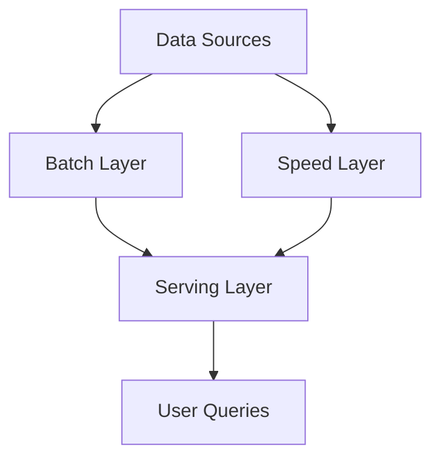

## 17.11. The Lambda Architecture Pattern

In the world of big data, the Lambda Architecture has emerged as a powerful pattern for building robust and scalable data processing systems. This architecture is designed to handle massive quantities of data by leveraging both batch and real-time processing capabilities. In this section, we'll explore the Lambda Architecture, its components, and how Rust can be utilized to implement this architecture effectively.

### Understanding the Lambda Architecture

The Lambda Architecture is a data-processing architecture designed to handle large volumes of data by taking advantage of both batch and real-time processing methods. It is composed of three main layers:

1. **Batch Layer**: This layer is responsible for managing the master dataset and pre-computing batch views. It processes data in large chunks and is optimized for throughput rather than latency.

2. **Speed Layer**: Also known as the real-time layer, this component processes data in real-time to provide low-latency updates to the data views. It complements the batch layer by handling data that needs immediate processing.

3. **Serving Layer**: This layer indexes the batch and real-time views to provide a unified view of the data. It serves queries by merging results from both the batch and speed layers.

#### Diagram: Lambda Architecture Overview



*Figure 1: Overview of the Lambda Architecture showing the flow of data from sources through batch and speed layers to the serving layer.*

### Implementing the Lambda Architecture in Rust

Rust, with its focus on performance and safety, is well-suited for implementing components of the Lambda Architecture. Let's explore how Rust can be used in each layer.

#### Batch Layer with Rust

The batch layer is responsible for processing large volumes of data and generating batch views. Tools like Hadoop and Apache Spark are commonly used for batch processing. Rust can be integrated into these systems to enhance performance and safety.

- **Hadoop Integration**: Rust can be used to write custom mappers and reducers in Hadoop. By leveraging Rust's performance, you can optimize data processing tasks that require high throughput.

- **Apache Spark**: While Spark is primarily a JVM-based tool, Rust can be used to write high-performance native extensions or to process data before feeding it into Spark jobs.

**Example: Batch Processing with Rust and Hadoop**

```rust
// Example of a simple Rust program for batch processing
use std::fs::File;
use std::io::{BufRead, BufReader};

fn process_batch(file_path: &str) {
    let file = File::open(file_path).expect("Unable to open file");
    let reader = BufReader::new(file);

    for line in reader.lines() {
        let line = line.expect("Unable to read line");
        // Process each line of the batch data
        println!("Processing: {}", line);
    }
}

fn main() {
    process_batch("data/batch_data.txt");
}
```

*In this example, Rust is used to read and process a batch data file, demonstrating its capability to handle large datasets efficiently.*

#### Speed Layer with Rust

The speed layer processes data in real-time, providing immediate insights and updates. Rust's concurrency model and performance make it an excellent choice for building real-time data processing systems.

- **Kafka Integration**: Rust can be used to write consumers and producers for Apache Kafka, a popular tool for real-time data streaming.

- **Real-Time Processing**: Rust's `async`/`await` syntax and libraries like Tokio enable the development of high-performance, non-blocking applications that can process real-time data streams.

**Example: Real-Time Processing with Rust and Kafka**

```rust
use rdkafka::consumer::{Consumer, StreamConsumer};
use rdkafka::ClientConfig;
use tokio::stream::StreamExt;

async fn process_real_time() {
    let consumer: StreamConsumer = ClientConfig::new()
        .set("group.id", "example_group")
        .set("bootstrap.servers", "localhost:9092")
        .create()
        .expect("Consumer creation failed");

    consumer.subscribe(&["example_topic"]).expect("Subscription failed");

    let mut message_stream = consumer.start();

    while let Some(message) = message_stream.next().await {
        match message {
            Ok(m) => println!("Received message: {:?}", m.payload()),
            Err(e) => eprintln!("Error receiving message: {:?}", e),
        }
    }
}

#[tokio::main]
async fn main() {
    process_real_time().await;
}
```

*This example demonstrates how Rust can be used to consume messages from a Kafka topic in real-time, processing each message as it arrives.*

#### Serving Layer with Rust

The serving layer combines the results from the batch and speed layers to provide a comprehensive view of the data. Rust's performance and safety features make it ideal for building efficient serving systems.

- **Indexing and Querying**: Rust can be used to build custom indexing and querying systems that merge batch and real-time data views.

- **Web Services**: Rust's web frameworks, such as Actix and Rocket, can be used to expose data through RESTful APIs, allowing users to query the unified data view.

**Example: Serving Layer with Rust**

```rust
use actix_web::{web, App, HttpServer, Responder};

async fn get_data() -> impl Responder {
    // Combine batch and real-time data views
    "Unified data view"
}

#[actix_web::main]
async fn main() -> std::io::Result<()> {
    HttpServer::new(|| {
        App::new()
            .route("/data", web::get().to(get_data))
    })
    .bind("127.0.0.1:8080")?
    .run()
    .await
}
```

*In this example, Rust is used to create a simple web service that serves a unified data view, combining results from both batch and real-time processing.*

### Advantages and Complexities of the Lambda Architecture

The Lambda Architecture offers several advantages:

- **Scalability**: By separating batch and real-time processing, the architecture can scale to handle large volumes of data.
- **Fault Tolerance**: The batch layer provides a reliable backup in case of failures in the speed layer.
- **Flexibility**: The architecture supports a wide range of data processing use cases, from historical analysis to real-time insights.

However, the Lambda Architecture also introduces complexities:

- **Complexity in Maintenance**: Maintaining two separate codebases for batch and real-time processing can be challenging.
- **Data Consistency**: Ensuring consistency between batch and real-time views can be difficult.
- **Latency**: The batch layer introduces latency, which may not be acceptable for all use cases.

### Alternatives and Modern Approaches

While the Lambda Architecture is powerful, it is not without its drawbacks. The Kappa Architecture is a modern alternative that simplifies the architecture by focusing solely on real-time processing.

- **Kappa Architecture**: This architecture eliminates the batch layer, relying entirely on real-time processing. It simplifies maintenance and reduces latency but may require more complex real-time processing systems.

### Conclusion

The Lambda Architecture is a robust pattern for building scalable data processing systems that handle both batch and real-time data. Rust's performance and safety features make it an excellent choice for implementing components of this architecture. By leveraging Rust's capabilities, developers can build efficient and reliable data systems that meet the demands of modern data processing.

### Try It Yourself

Experiment with the provided code examples by modifying them to suit your data processing needs. Try integrating Rust with other tools like Apache Flink or Apache Beam for more advanced data processing capabilities.

### Key Takeaways

- The Lambda Architecture combines batch and real-time processing to handle large volumes of data.
- Rust's performance and safety features make it well-suited for implementing components of the Lambda Architecture.
- While powerful, the Lambda Architecture introduces complexities that must be managed carefully.
- Alternatives like the Kappa Architecture offer simpler approaches to data processing.

## Quiz Time!



### What are the three main components of the Lambda Architecture?

- [x] Batch Layer, Speed Layer, Serving Layer
- [ ] Data Layer, Processing Layer, Output Layer
- [ ] Input Layer, Transformation Layer, Output Layer
- [ ] Collection Layer, Analysis Layer, Presentation Layer

> **Explanation:** The Lambda Architecture consists of the Batch Layer, Speed Layer, and Serving Layer, each serving a distinct purpose in data processing.

### How can Rust be used in the batch layer of the Lambda Architecture?

- [x] By writing custom mappers and reducers for Hadoop
- [ ] By creating real-time data streams with Kafka
- [ ] By building web services with Actix
- [ ] By developing mobile applications

> **Explanation:** Rust can be used in the batch layer by writing custom mappers and reducers for Hadoop, enhancing performance and safety.

### What is the primary purpose of the speed layer in the Lambda Architecture?

- [x] To process data in real-time and provide low-latency updates
- [ ] To store historical data for analysis
- [ ] To index and serve batch views
- [ ] To manage the master dataset

> **Explanation:** The speed layer processes data in real-time to provide immediate insights and updates, complementing the batch layer.

### Which Rust feature is particularly useful for building real-time data processing systems?

- [x] `async`/`await` syntax
- [ ] Pattern matching
- [ ] Ownership and borrowing
- [ ] The type system

> **Explanation:** Rust's `async`/`await` syntax is particularly useful for building high-performance, non-blocking real-time data processing systems.

### What is a key advantage of the Lambda Architecture?

- [x] Scalability and fault tolerance
- [ ] Simplicity and ease of maintenance
- [ ] Low latency in all scenarios
- [ ] Eliminates the need for batch processing

> **Explanation:** The Lambda Architecture offers scalability and fault tolerance by separating batch and real-time processing.

### What is a major complexity introduced by the Lambda Architecture?

- [x] Maintaining two separate codebases for batch and real-time processing
- [ ] Lack of scalability
- [ ] Inability to handle large volumes of data
- [ ] Limited flexibility in data processing

> **Explanation:** The Lambda Architecture introduces complexity by requiring the maintenance of two separate codebases for batch and real-time processing.

### What is the Kappa Architecture?

- [x] An alternative to the Lambda Architecture that focuses solely on real-time processing
- [ ] A layer in the Lambda Architecture
- [ ] A tool for batch processing
- [ ] A method for data visualization

> **Explanation:** The Kappa Architecture is an alternative to the Lambda Architecture that simplifies the architecture by focusing solely on real-time processing.

### How can Rust be used in the serving layer of the Lambda Architecture?

- [x] By building web services with frameworks like Actix and Rocket
- [ ] By writing custom mappers for Hadoop
- [ ] By developing mobile applications
- [ ] By creating real-time data streams with Kafka

> **Explanation:** Rust can be used in the serving layer by building web services with frameworks like Actix and Rocket to expose data through RESTful APIs.

### What is a potential drawback of the Lambda Architecture?

- [x] Complexity in ensuring data consistency between batch and real-time views
- [ ] Inability to handle real-time data
- [ ] Lack of support for batch processing
- [ ] Limited scalability

> **Explanation:** A potential drawback of the Lambda Architecture is the complexity in ensuring data consistency between batch and real-time views.

### True or False: The Lambda Architecture is designed to handle both batch and real-time data processing.

- [x] True
- [ ] False

> **Explanation:** True. The Lambda Architecture is specifically designed to handle both batch and real-time data processing, providing a comprehensive data processing solution.


