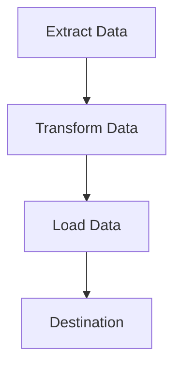

## 17.2. Building Efficient ETL Pipelines in Rust with Polars and DataFusion

In the realm of data engineering, ETL (Extract, Transform, Load) processes are crucial for preparing data for analysis. Rust, known for its performance and safety, offers powerful libraries like Polars and DataFusion to build efficient ETL pipelines. In this section, we will explore how to leverage these libraries to handle large volumes of data effectively.

### Introduction to Polars and DataFusion

**Polars** is a fast DataFrame library implemented in Rust, designed to handle large datasets efficiently. It provides a user-friendly API for data manipulation, similar to Pandas in Python, but with the added benefits of Rust's performance and safety.

**DataFusion** is a query execution framework that is part of the Apache Arrow ecosystem. It allows for SQL-like query execution on data stored in Arrow format, making it a powerful tool for data transformation and analysis.

### Setting Up an ETL Pipeline

To build an ETL pipeline using Polars and DataFusion, we need to follow these steps:

1. **Extract**: Read data from various sources such as CSV files, databases, or APIs.
2. **Transform**: Process and manipulate the data to fit the desired format or structure.
3. **Load**: Write the transformed data to a destination, such as a database or a file.

Let's dive into each step with examples.

#### Extracting Data

Polars provides a straightforward way to read data from CSV files. Here's a basic example:

```rust
use polars::prelude::*;

fn main() -> Result<()> {
    // Read a CSV file into a DataFrame
    let df = CsvReader::from_path("data.csv")?
        .has_header(true)
        .finish()?;

    println!("{:?}", df);
    Ok(())
}
```

In this example, we use `CsvReader` to load data from a CSV file into a Polars DataFrame. The `has_header` method specifies whether the CSV file includes a header row.

#### Transforming Data

Once the data is loaded, we can perform various transformations. Polars supports a wide range of operations, such as filtering, aggregating, and joining DataFrames.

```rust
fn transform_data(df: DataFrame) -> Result<DataFrame> {
    // Filter rows where the "age" column is greater than 30
    let filtered_df = df.filter(&df["age"].gt(30))?;

    // Group by "department" and calculate the average "salary"
    let grouped_df = filtered_df
        .groupby("department")?
        .agg(&[("salary", &["mean"])])?;

    Ok(grouped_df)
}
```

In this transformation, we filter rows based on a condition and then group the data to calculate the average salary per department.

#### Loading Data

After transforming the data, we can write it to a destination. Polars supports writing DataFrames to CSV files, among other formats.

```rust
fn load_data(df: DataFrame) -> Result<()> {
    // Write the DataFrame to a CSV file
    CsvWriter::new("transformed_data.csv")
        .has_header(true)
        .finish(&df)?;

    Ok(())
}
```

This code snippet demonstrates how to write a DataFrame to a CSV file, including a header row.

### Performance Optimizations and Parallel Processing

Both Polars and DataFusion are designed with performance in mind. They leverage Rust's concurrency model to perform operations in parallel, significantly speeding up data processing tasks.

#### Parallel Processing with Polars

Polars automatically parallelizes operations where possible. For example, when performing aggregations or joins, Polars utilizes multiple CPU cores to enhance performance.

#### Optimizing DataFusion Queries

DataFusion allows you to execute SQL queries on Arrow data, which can be optimized for performance. Here's an example of executing a SQL query using DataFusion:

```rust
use datafusion::prelude::*;

#[tokio::main]
async fn main() -> datafusion::error::Result<()> {
    // Create a DataFusion context
    let mut ctx = ExecutionContext::new();

    // Register a CSV file as a table
    ctx.register_csv("my_table", "data.csv", CsvReadOptions::new()).await?;

    // Execute a SQL query
    let df = ctx.sql("SELECT department, AVG(salary) FROM my_table GROUP BY department").await?;

    // Collect the results
    let results = df.collect().await?;

    // Print the results
    for batch in results {
        println!("{:?}", batch);
    }

    Ok(())
}
```

This example shows how to register a CSV file as a table and execute a SQL query to calculate the average salary per department.

### Use Cases for Polars and DataFusion

Polars and DataFusion are particularly effective in scenarios where:

- **Large Datasets**: They can handle large datasets efficiently, making them suitable for big data applications.
- **Complex Transformations**: Their rich APIs support complex data transformations and aggregations.
- **Performance-Critical Applications**: Rust's performance and safety features make these libraries ideal for performance-critical applications.

### Visualizing ETL Pipelines

To better understand the flow of data through an ETL pipeline, let's visualize the process using a flowchart.



This diagram illustrates the basic steps of an ETL pipeline: extracting data, transforming it, and loading it into a destination.

### Knowledge Check

- **What are the primary steps in an ETL pipeline?**
- **How does Polars handle parallel processing?**
- **What are some use cases for DataFusion?**

### Try It Yourself

Experiment with the code examples by modifying the data source or transformation logic. Try loading data from a different format, such as JSON, or apply additional transformations to the DataFrame.

### Conclusion

Building ETL pipelines in Rust using Polars and DataFusion offers a powerful and efficient way to process large volumes of data. By leveraging Rust's performance and safety features, along with the capabilities of these libraries, you can create robust data processing solutions.

Remember, this is just the beginning. As you progress, you'll discover more advanced techniques and optimizations. Keep experimenting, stay curious, and enjoy the journey!

## Quiz Time!



### What is the primary purpose of an ETL pipeline?

- [x] To extract, transform, and load data
- [ ] To encrypt data
- [ ] To visualize data
- [ ] To delete data

> **Explanation:** ETL stands for Extract, Transform, Load, which are the primary steps in processing data for analysis.

### Which library is used for SQL-like query execution in Rust?

- [ ] Polars
- [x] DataFusion
- [ ] Serde
- [ ] Tokio

> **Explanation:** DataFusion is a query execution framework that allows SQL-like queries on data stored in Arrow format.

### How does Polars enhance performance?

- [x] By parallelizing operations
- [ ] By using a garbage collector
- [ ] By reducing data size
- [ ] By encrypting data

> **Explanation:** Polars leverages Rust's concurrency model to perform operations in parallel, enhancing performance.

### What format does DataFusion use for data storage?

- [ ] JSON
- [ ] CSV
- [x] Arrow
- [ ] XML

> **Explanation:** DataFusion is part of the Apache Arrow ecosystem and uses the Arrow format for data storage.

### Which step in ETL involves writing data to a destination?

- [ ] Extract
- [ ] Transform
- [x] Load
- [ ] Analyze

> **Explanation:** The Load step involves writing the transformed data to a destination, such as a database or file.

### What is a common use case for Polars?

- [x] Handling large datasets
- [ ] Encrypting data
- [ ] Visualizing data
- [ ] Deleting data

> **Explanation:** Polars is designed to handle large datasets efficiently, making it suitable for big data applications.

### What is the role of the ExecutionContext in DataFusion?

- [x] To manage query execution
- [ ] To visualize data
- [ ] To encrypt data
- [ ] To delete data

> **Explanation:** The ExecutionContext in DataFusion is used to manage the execution of SQL queries on data.

### What type of operations does Polars automatically parallelize?

- [x] Aggregations and joins
- [ ] Data deletion
- [ ] Data encryption
- [ ] Data visualization

> **Explanation:** Polars automatically parallelizes operations like aggregations and joins to enhance performance.

### What is the benefit of using Rust for ETL pipelines?

- [x] Performance and safety
- [ ] Data encryption
- [ ] Data visualization
- [ ] Data deletion

> **Explanation:** Rust offers performance and safety features, making it ideal for building efficient ETL pipelines.

### True or False: DataFusion can execute SQL queries on JSON data.

- [ ] True
- [x] False

> **Explanation:** DataFusion executes SQL queries on data stored in Arrow format, not JSON.


