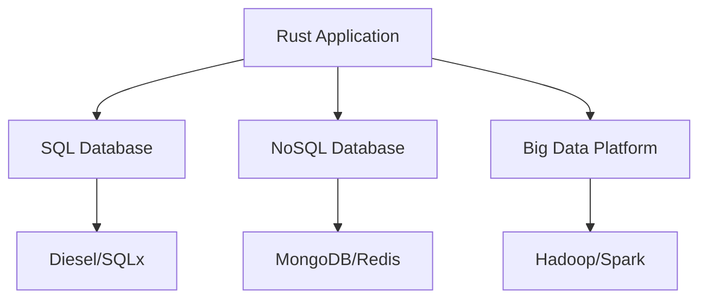

## 17.3. Integrating with Data Stores (SQL, NoSQL, Big Data)

In the realm of data engineering, the ability to efficiently integrate with various data stores is crucial. Rust, with its emphasis on safety and performance, offers robust solutions for connecting to SQL databases, NoSQL databases, and big data platforms. This section will guide you through the techniques and tools available for integrating Rust applications with these data stores, ensuring your applications are both efficient and scalable.

### Importance of Data Storage in Data Engineering Workflows

Data storage is a fundamental component of data engineering workflows. It serves as the backbone for data processing, analysis, and retrieval. Efficient data storage solutions enable organizations to handle large volumes of data, perform complex queries, and derive meaningful insights. In Rust, integrating with data stores involves leveraging libraries and frameworks that facilitate seamless communication between your application and the data storage systems.

### Integrating with SQL Databases

SQL databases are a staple in data engineering due to their structured nature and powerful querying capabilities. Rust provides several libraries to interact with SQL databases, with Diesel and SQLx being two of the most popular options.

#### Diesel ORM

Diesel is a powerful ORM (Object-Relational Mapping) tool for Rust that provides a type-safe query builder. It allows you to write database queries in Rust, ensuring compile-time safety and reducing runtime errors.

**Key Features of Diesel:**
- **Type Safety**: Diesel ensures that your queries are type-checked at compile time.
- **Migrations**: Diesel provides a robust migration system to manage database schema changes.
- **Query Builder**: It offers a flexible query builder that allows you to construct complex queries programmatically.

**Example: Connecting to a PostgreSQL Database with Diesel**

```rust
use diesel::prelude::*;
use diesel::pg::PgConnection;
use dotenv::dotenv;
use std::env;

fn establish_connection() -> PgConnection {
    dotenv().ok();

    let database_url = env::var("DATABASE_URL")
        .expect("DATABASE_URL must be set");
    PgConnection::establish(&database_url)
        .expect(&format!("Error connecting to {}", database_url))
}
```

In this example, we use Diesel to establish a connection to a PostgreSQL database. The `dotenv` crate is used to load environment variables, ensuring sensitive information like database URLs are not hardcoded.

#### SQLx

SQLx is another popular library for interacting with SQL databases in Rust. Unlike Diesel, SQLx is an async library, making it suitable for applications that require non-blocking database operations.

**Key Features of SQLx:**
- **Asynchronous**: SQLx supports async operations, which are crucial for high-performance applications.
- **Compile-Time Checked Queries**: SQLx can check your SQL queries at compile time, ensuring they are syntactically correct.
- **Support for Multiple Databases**: SQLx supports PostgreSQL, MySQL, and SQLite.

**Example: Using SQLx with MySQL**

```rust
use sqlx::mysql::MySqlPool;
use std::env;

#[tokio::main]
async fn main() -> Result<(), sqlx::Error> {
    let database_url = env::var("DATABASE_URL").expect("DATABASE_URL must be set");
    let pool = MySqlPool::connect(&database_url).await?;

    let row: (i64,) = sqlx::query_as("SELECT COUNT(*) FROM users")
        .fetch_one(&pool)
        .await?;

    println!("Number of users: {}", row.0);

    Ok(())
}
```

In this example, we connect to a MySQL database using SQLx. The query is executed asynchronously, demonstrating SQLx's capability to handle non-blocking operations.

### Working with NoSQL Databases

NoSQL databases offer flexibility in terms of data modeling and are well-suited for applications that require scalability and high availability. Rust provides libraries to interact with popular NoSQL databases like MongoDB and Redis.

#### MongoDB

MongoDB is a document-oriented NoSQL database known for its scalability and flexibility. The `mongodb` crate provides a comprehensive API for interacting with MongoDB databases.

**Example: Connecting to MongoDB**

```rust
use mongodb::{Client, options::ClientOptions};
use tokio;

#[tokio::main]
async fn main() -> mongodb::error::Result<()> {
    let mut client_options = ClientOptions::parse("mongodb://localhost:27017").await?;
    client_options.app_name = Some("RustApp".to_string());

    let client = Client::with_options(client_options)?;

    let database = client.database("mydb");
    let collection = database.collection("mycollection");

    // Perform operations on the collection

    Ok(())
}
```

This example demonstrates how to connect to a MongoDB database using the `mongodb` crate. We configure the client options and establish a connection to the database.

#### Redis

Redis is an in-memory data structure store often used as a database, cache, and message broker. The `redis` crate provides a straightforward API for interacting with Redis.

**Example: Using Redis in Rust**

```rust
use redis::Commands;

fn main() -> redis::RedisResult<()> {
    let client = redis::Client::open("redis://127.0.0.1/")?;
    let mut con = client.get_connection()?;

    let _: () = con.set("my_key", 42)?;
    let result: i32 = con.get("my_key")?;

    println!("Value for 'my_key': {}", result);

    Ok(())
}
```

In this example, we connect to a Redis server and perform basic operations like setting and getting a key-value pair.

### Integrating with Big Data Platforms

Big data platforms like Hadoop and Spark are designed to handle massive volumes of data. While Rust is not traditionally associated with big data, it can still interact with these platforms through various means.

#### Hadoop

Hadoop is an open-source framework for distributed storage and processing of large data sets. Rust can interact with Hadoop through its REST APIs or by using libraries that provide bindings to Hadoop's native protocols.

#### Apache Spark

Apache Spark is a unified analytics engine for large-scale data processing. Rust can interact with Spark through its REST APIs or by using the `sparkly` crate, which provides a Rust interface to Spark.

**Considerations for Performance, Scalability, and Consistency**

When integrating Rust with data stores, it's essential to consider performance, scalability, and consistency:

- **Performance**: Choose libraries that offer asynchronous operations to maximize throughput and minimize latency.
- **Scalability**: Ensure your application can handle increased load by leveraging distributed data stores and efficient data access patterns.
- **Consistency**: Understand the consistency models of your chosen data stores and design your application to handle eventual consistency if necessary.

### Visualizing Rust's Interaction with Data Stores

To better understand how Rust interacts with different data stores, let's visualize the architecture using a Mermaid.js diagram.



**Diagram Description**: This diagram illustrates a Rust application interacting with various data stores. The application connects to SQL databases using Diesel or SQLx, to NoSQL databases using MongoDB or Redis, and to big data platforms like Hadoop or Spark.

### Knowledge Check

- **What are the key features of Diesel and SQLx?**
- **How does Rust interact with MongoDB and Redis?**
- **What are the considerations for integrating Rust with big data platforms?**

### Try It Yourself

Experiment with the code examples provided in this section. Try modifying the database queries, changing the database configurations, or integrating with a different data store. This hands-on approach will deepen your understanding of Rust's capabilities in data engineering.

### References and Links

- [Diesel ORM](https://diesel.rs/)
- [SQLx](https://crates.io/crates/sqlx)
- [`mongodb` crate](https://crates.io/crates/mongodb)
- [`redis` crate](https://crates.io/crates/redis)

### Embrace the Journey

Remember, integrating Rust with data stores is just the beginning. As you progress, you'll discover more advanced techniques and optimizations. Keep experimenting, stay curious, and enjoy the journey!

## Quiz Time!



### What is the primary advantage of using Diesel ORM in Rust?

- [x] Type-safe query building
- [ ] Asynchronous operations
- [ ] Support for NoSQL databases
- [ ] Built-in caching

> **Explanation:** Diesel ORM provides type-safe query building, ensuring compile-time safety for database queries.

### Which Rust library is best suited for asynchronous database operations?

- [ ] Diesel
- [x] SQLx
- [ ] mongodb
- [ ] redis

> **Explanation:** SQLx is designed for asynchronous database operations, making it suitable for high-performance applications.

### How does Rust interact with MongoDB?

- [ ] Through SQL queries
- [x] Using the `mongodb` crate
- [ ] Via REST APIs
- [ ] Using the `redis` crate

> **Explanation:** Rust interacts with MongoDB using the `mongodb` crate, which provides a comprehensive API for MongoDB operations.

### What is a common use case for Redis in Rust applications?

- [ ] Document storage
- [ ] Complex queries
- [x] In-memory caching
- [ ] Data warehousing

> **Explanation:** Redis is often used for in-memory caching in Rust applications due to its fast data access capabilities.

### Which big data platform can Rust interact with using REST APIs?

- [x] Hadoop
- [ ] SQL Server
- [ ] MongoDB
- [ ] Redis

> **Explanation:** Rust can interact with Hadoop using its REST APIs for distributed data processing.

### What should you consider when integrating Rust with data stores?

- [x] Performance, scalability, and consistency
- [ ] Only performance
- [ ] Only scalability
- [ ] Only consistency

> **Explanation:** It's important to consider performance, scalability, and consistency when integrating Rust with data stores.

### Which crate provides a Rust interface to Apache Spark?

- [ ] Diesel
- [ ] SQLx
- [x] sparkly
- [ ] redis

> **Explanation:** The `sparkly` crate provides a Rust interface to Apache Spark for large-scale data processing.

### What is the role of the `dotenv` crate in Rust applications?

- [x] Load environment variables
- [ ] Perform database migrations
- [ ] Handle HTTP requests
- [ ] Manage in-memory data

> **Explanation:** The `dotenv` crate is used to load environment variables, ensuring sensitive information is not hardcoded.

### How can Rust handle eventual consistency in data stores?

- [x] By designing applications to handle eventual consistency
- [ ] By using only SQL databases
- [ ] By avoiding NoSQL databases
- [ ] By using synchronous operations

> **Explanation:** Rust applications can be designed to handle eventual consistency, especially when using NoSQL databases.

### True or False: Rust can only interact with SQL databases.

- [ ] True
- [x] False

> **Explanation:** Rust can interact with both SQL and NoSQL databases, as well as big data platforms.


