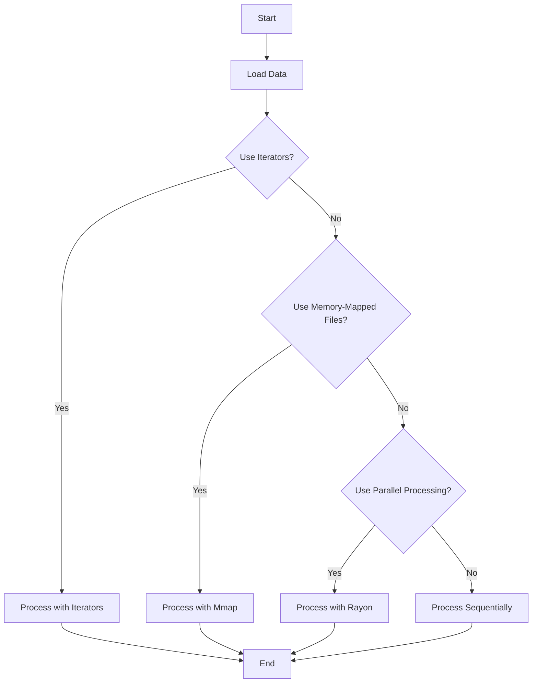

## 17.4. Handling Large Data Sets Efficiently

Handling large datasets efficiently is a critical aspect of data engineering and ETL (Extract, Transform, Load) processes. In Rust, a systems programming language known for its performance and safety, we have several tools and techniques at our disposal to manage large datasets without succumbing to memory limitations or performance bottlenecks. In this section, we will explore these strategies, focusing on Rust's unique features and external frameworks that can aid in efficient data processing.

### Challenges of Handling Large Datasets

Before diving into solutions, let's first understand the challenges associated with handling large datasets:

1. **Memory Usage**: Large datasets can quickly exhaust available memory, leading to crashes or degraded performance.
2. **Processing Time**: The time required to process large datasets can be significant, impacting the overall efficiency of data pipelines.
3. **I/O Bottlenecks**: Reading and writing large amounts of data can be slow, especially if not optimized.
4. **Concurrency and Parallelism**: Efficiently utilizing multiple cores and threads can be challenging but is essential for performance.
5. **Scalability**: Solutions must be scalable to handle increasing data volumes over time.

### Techniques for Efficient Data Handling

#### Streaming Data Processing

Streaming data processing allows us to handle data in chunks rather than loading the entire dataset into memory. This approach is particularly useful for large datasets that cannot fit into memory.

**Example: Using Iterators and Chunks**

Rust's iterator trait provides a powerful abstraction for processing data lazily. By using iterators, we can process data one element at a time, reducing memory usage.

```rust
fn process_large_dataset(data: &[i32]) {
    data.chunks(1000).for_each(|chunk| {
        // Process each chunk of 1000 elements
        for &item in chunk {
            // Perform operations on each item
            println!("{}", item);
        }
    });
}

fn main() {
    let large_data: Vec<i32> = (0..10_000).collect();
    process_large_dataset(&large_data);
}
```

In this example, we use the `chunks` method to process the dataset in chunks of 1000 elements. This reduces memory usage and allows for more efficient data processing.

#### Lazy Evaluation

Lazy evaluation is a technique where computations are deferred until their results are needed. This can lead to significant performance improvements, especially when dealing with large datasets.

**Example: Lazy Iterators**

Rust's iterators are inherently lazy, meaning they do not compute their results until explicitly consumed.

```rust
fn lazy_processing(data: &[i32]) {
    let result: Vec<i32> = data.iter()
        .map(|&x| x * 2)
        .filter(|&x| x % 3 == 0)
        .collect();

    println!("{:?}", result);
}

fn main() {
    let large_data: Vec<i32> = (0..10_000).collect();
    lazy_processing(&large_data);
}
```

In this example, the `map` and `filter` operations are performed lazily, only computing results when `collect` is called.

#### Memory-Mapped Files

Memory-mapped files allow us to map a file's contents directly into memory, enabling efficient file I/O operations without loading the entire file into memory.

**Example: Using the `mmap` crate**

```rust
use memmap::MmapOptions;
use std::fs::File;
use std::io::{self, Read};

fn read_large_file(file_path: &str) -> io::Result<()> {
    let file = File::open(file_path)?;
    let mmap = unsafe { MmapOptions::new().map(&file)? };

    for byte in mmap.iter() {
        // Process each byte
        println!("{}", byte);
    }

    Ok(())
}

fn main() -> io::Result<()> {
    read_large_file("large_dataset.txt")
}
```

In this example, we use the `mmap` crate to map a large file into memory, allowing us to process it efficiently without loading the entire file.

#### Parallel and Distributed Processing

Leveraging parallel and distributed processing can significantly improve the performance of data processing tasks.

**Example: Using the `rayon` crate for Parallel Iterators**

The `rayon` crate provides a simple way to parallelize data processing using parallel iterators.

```rust
use rayon::prelude::*;

fn parallel_processing(data: &[i32]) {
    data.par_iter()
        .map(|&x| x * 2)
        .for_each(|x| println!("{}", x));
}

fn main() {
    let large_data: Vec<i32> = (0..10_000).collect();
    parallel_processing(&large_data);
}
```

In this example, we use `par_iter` to process data in parallel, utilizing multiple cores for improved performance.

### External Frameworks

In addition to Rust's built-in features, several external frameworks can aid in handling large datasets efficiently:

- **[Mmap](https://crates.io/crates/mmap)**: Provides memory-mapped file support for efficient file I/O operations.
- **[Rayon](https://github.com/rayon-rs/rayon)**: Offers data parallelism for Rust, making it easy to parallelize data processing tasks.

### Visualizing Data Processing Techniques

To better understand the flow of data processing techniques, let's visualize the process using a Mermaid.js flowchart:



**Description**: This flowchart illustrates the decision-making process for choosing a data processing technique based on the dataset's characteristics and requirements.

### Knowledge Check

To reinforce your understanding of handling large datasets in Rust, consider the following questions:

1. What are the main challenges of handling large datasets?
2. How can streaming data processing help manage memory usage?
3. What is lazy evaluation, and how does it benefit data processing?
4. How do memory-mapped files improve file I/O operations?
5. What role does parallel processing play in handling large datasets?

### Embrace the Journey

Remember, mastering the art of handling large datasets efficiently is a journey. As you continue to explore Rust's capabilities and external frameworks, you'll discover new ways to optimize your data processing tasks. Keep experimenting, stay curious, and enjoy the journey!

### Quiz Time!



### What is a primary challenge when handling large datasets?

- [x] Memory usage
- [ ] Syntax errors
- [ ] Compilation time
- [ ] Code readability

> **Explanation:** Memory usage is a primary challenge when handling large datasets, as they can quickly exhaust available memory.

### How does streaming data processing help in handling large datasets?

- [x] By processing data in chunks
- [ ] By loading all data into memory
- [ ] By increasing I/O operations
- [ ] By using complex algorithms

> **Explanation:** Streaming data processing helps by processing data in chunks, reducing memory usage.

### What is lazy evaluation?

- [x] Deferring computations until results are needed
- [ ] Performing computations eagerly
- [ ] Ignoring computations
- [ ] Using complex algorithms

> **Explanation:** Lazy evaluation defers computations until results are needed, improving performance.

### How do memory-mapped files improve file I/O operations?

- [x] By mapping file contents directly into memory
- [ ] By loading files into memory
- [ ] By using complex algorithms
- [ ] By increasing I/O operations

> **Explanation:** Memory-mapped files map file contents directly into memory, enabling efficient file I/O operations.

### What is the benefit of using parallel processing?

- [x] Improved performance by utilizing multiple cores
- [ ] Increased memory usage
- [ ] Simplified code
- [ ] Reduced I/O operations

> **Explanation:** Parallel processing improves performance by utilizing multiple cores for data processing tasks.

### Which crate provides memory-mapped file support in Rust?

- [x] Mmap
- [ ] Rayon
- [ ] Tokio
- [ ] Hyper

> **Explanation:** The `mmap` crate provides memory-mapped file support for efficient file I/O operations.

### Which crate offers data parallelism in Rust?

- [x] Rayon
- [ ] Mmap
- [ ] Tokio
- [ ] Hyper

> **Explanation:** The `rayon` crate offers data parallelism, making it easy to parallelize data processing tasks.

### What is the role of iterators in data processing?

- [x] To process data lazily
- [ ] To increase memory usage
- [ ] To simplify code
- [ ] To reduce I/O operations

> **Explanation:** Iterators process data lazily, deferring computations until results are needed.

### Which method is used to process data in chunks?

- [x] chunks
- [ ] map
- [ ] filter
- [ ] collect

> **Explanation:** The `chunks` method is used to process data in chunks, reducing memory usage.

### True or False: Lazy evaluation computes results eagerly.

- [ ] True
- [x] False

> **Explanation:** False. Lazy evaluation defers computations until results are needed, not eagerly.


