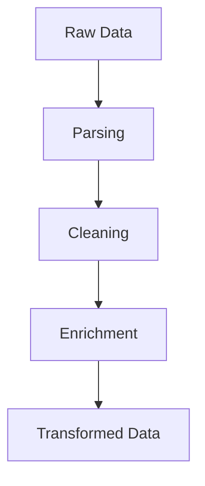

## 17.5. Data Transformation and Enrichment

Data transformation and enrichment are critical components of the Extract, Transform, Load (ETL) process, which is essential for preparing data for analysis and decision-making. In this section, we will explore how Rust, with its powerful libraries and performance capabilities, can be leveraged to efficiently transform and enrich data. We will cover parsing various data formats, cleaning techniques, and methods for enriching datasets.

### Importance of Data Transformation in ETL Processes

Data transformation is the process of converting data from its raw form into a format that is suitable for analysis. This involves parsing, cleaning, and enriching data to ensure it is consistent, accurate, and ready for use. In ETL processes, transformation is crucial because:

- **Data Consistency**: Ensures that data from different sources is uniform and can be easily integrated.
- **Data Quality**: Improves the accuracy and reliability of data by handling missing or inconsistent values.
- **Data Enrichment**: Enhances datasets by adding new information, making them more valuable for analysis.

### Parsing Different Data Formats

Rust provides several libraries to parse common data formats such as CSV, JSON, and XML. Let's explore how to use these libraries effectively.

#### Parsing CSV Files

The `csv` crate is a popular choice for handling CSV files in Rust. It provides a simple and efficient way to read and write CSV data.

```rust
use csv::ReaderBuilder;
use std::error::Error;

fn read_csv(file_path: &str) -> Result<(), Box<dyn Error>> {
    let mut rdr = ReaderBuilder::new()
        .delimiter(b',')
        .from_path(file_path)?;

    for result in rdr.records() {
        let record = result?;
        println!("{:?}", record);
    }
    Ok(())
}

fn main() {
    if let Err(err) = read_csv("data.csv") {
        eprintln!("Error reading CSV: {}", err);
    }
}
```

**Explanation**: This code reads a CSV file and prints each record. The `ReaderBuilder` allows customization, such as setting the delimiter.

#### Parsing JSON Data

For JSON data, the `serde_json` crate is widely used. It integrates seamlessly with the `serde` library for serialization and deserialization.

```rust
use serde::{Deserialize, Serialize};
use serde_json::Result;

#[derive(Serialize, Deserialize, Debug)]
struct Person {
    name: String,
    age: u8,
    email: String,
}

fn parse_json(data: &str) -> Result<()> {
    let person: Person = serde_json::from_str(data)?;
    println!("{:?}", person);
    Ok(())
}

fn main() {
    let data = r#"
        {
            "name": "Alice",
            "age": 30,
            "email": "alice@example.com"
        }
    "#;

    if let Err(err) = parse_json(data) {
        eprintln!("Error parsing JSON: {}", err);
    }
}
```

**Explanation**: This example demonstrates how to parse JSON data into a Rust struct using `serde_json`. The `#[derive(Serialize, Deserialize)]` attribute is used to automatically generate code for serialization and deserialization.

#### Parsing XML Data

While Rust does not have a built-in XML parser, the `quick-xml` crate is a fast and efficient option for parsing XML data.

```rust
use quick_xml::Reader;
use quick_xml::events::Event;
use std::error::Error;

fn read_xml(file_path: &str) -> Result<(), Box<dyn Error>> {
    let mut reader = Reader::from_file(file_path)?;
    reader.trim_text(true);

    let mut buf = Vec::new();
    loop {
        match reader.read_event(&mut buf) {
            Ok(Event::Start(ref e)) => {
                println!("Start: {:?}", std::str::from_utf8(e.name())?);
            }
            Ok(Event::Text(e)) => {
                println!("Text: {:?}", e.unescape_and_decode(&reader)?);
            }
            Ok(Event::Eof) => break,
            Err(e) => return Err(Box::new(e)),
            _ => (),
        }
        buf.clear();
    }
    Ok(())
}

fn main() {
    if let Err(err) = read_xml("data.xml") {
        eprintln!("Error reading XML: {}", err);
    }
}
```

**Explanation**: This code reads an XML file and prints the start tags and text content. The `quick_xml` crate provides a streaming parser that is efficient for large XML files.

### Data Cleaning Techniques

Data cleaning is essential to handle missing or inconsistent data. Rust's type system and error handling capabilities make it well-suited for implementing robust data cleaning processes.

#### Handling Missing Data

Rust's `Option` type is ideal for representing optional values and handling missing data.

```rust
fn clean_data(value: Option<&str>) -> String {
    match value {
        Some(v) => v.to_string(),
        None => "Unknown".to_string(),
    }
}

fn main() {
    let data = vec![Some("Alice"), None, Some("Bob")];
    let cleaned_data: Vec<String> = data.into_iter().map(clean_data).collect();
    println!("{:?}", cleaned_data);
}
```

**Explanation**: This example demonstrates how to handle missing data using the `Option` type. The `clean_data` function replaces `None` with a default value.

#### Removing Inconsistent Data

Inconsistent data can be filtered out using Rust's iterator methods.

```rust
fn is_valid_age(age: &Option<u8>) -> bool {
    match age {
        Some(&a) if a > 0 && a < 120 => true,
        _ => false,
    }
}

fn main() {
    let ages = vec![Some(25), None, Some(130), Some(45)];
    let valid_ages: Vec<u8> = ages.into_iter().filter_map(|age| {
        if is_valid_age(&age) {
            age
        } else {
            None
        }
    }).collect();
    println!("{:?}", valid_ages);
}
```

**Explanation**: This code filters out invalid ages using the `filter_map` method, which combines filtering and mapping operations.

### Enriching Datasets

Data enrichment involves adding new information to datasets, such as joining, aggregating, or deriving new data.

#### Joining Datasets

The `polars` library provides powerful data manipulation capabilities, including joining datasets.

```rust
use polars::prelude::*;

fn join_datasets() -> Result<DataFrame> {
    let df1 = df![
        "name" => &["Alice", "Bob"],
        "age" => &[30, 40]
    ]?;

    let df2 = df![
        "name" => &["Alice", "Bob"],
        "email" => &["alice@example.com", "bob@example.com"]
    ]?;

    let joined = df1.left_join(&df2, "name", "name")?;
    Ok(joined)
}

fn main() {
    match join_datasets() {
        Ok(df) => println!("{:?}", df),
        Err(err) => eprintln!("Error joining datasets: {}", err),
    }
}
```

**Explanation**: This example demonstrates how to perform a left join on two datasets using the `polars` library. The `left_join` method combines rows from both datasets based on a common key.

#### Aggregating Data

Aggregation involves summarizing data, such as calculating averages or totals.

```rust
use polars::prelude::*;

fn aggregate_data() -> Result<DataFrame> {
    let df = df![
        "name" => &["Alice", "Bob", "Alice"],
        "score" => &[85, 90, 95]
    ]?;

    let aggregated = df.groupby("name")?
        .agg(&[("score", &["mean"])])?;
    Ok(aggregated)
}

fn main() {
    match aggregate_data() {
        Ok(df) => println!("{:?}", df),
        Err(err) => eprintln!("Error aggregating data: {}", err),
    }
}
```

**Explanation**: This code aggregates scores by name, calculating the mean score for each group using the `polars` library.

#### Deriving New Data

Deriving new data involves creating new columns or features based on existing data.

```rust
use polars::prelude::*;

fn derive_new_data() -> Result<DataFrame> {
    let df = df![
        "name" => &["Alice", "Bob"],
        "age" => &[30, 40]
    ]?;

    let new_df = df.with_column((df["age"] * 2).alias("double_age"))?;
    Ok(new_df)
}

fn main() {
    match derive_new_data() {
        Ok(df) => println!("{:?}", df),
        Err(err) => eprintln!("Error deriving new data: {}", err),
    }
}
```

**Explanation**: This example demonstrates how to derive a new column by doubling the age column using the `polars` library.

### Libraries Facilitating Data Transformation

Several Rust libraries facilitate data transformation and enrichment:

- **Serde**: A framework for serializing and deserializing Rust data structures efficiently and generically.
- **Csv**: A library for reading and writing CSV data with a focus on performance and ease of use.
- **Polars**: A fast DataFrame library for Rust, providing powerful data manipulation capabilities similar to Pandas in Python.

### Visualizing Data Transformation Process

To better understand the data transformation process, let's visualize it using a flowchart.



**Description**: This flowchart illustrates the data transformation process, starting with raw data, followed by parsing, cleaning, enrichment, and resulting in transformed data.

### Try It Yourself

Experiment with the provided code examples by modifying them to suit your data transformation needs. For instance, try changing the data formats, adding new columns, or implementing additional cleaning techniques.

### References and Links

- [Serde Documentation](https://serde.rs/)
- [Csv Crate](https://crates.io/crates/csv)
- [Polars Documentation](https://www.pola.rs/)

### Knowledge Check

- What are the key steps in the data transformation process?
- How can Rust's type system help in data cleaning?
- What are some common techniques for enriching datasets?

### Embrace the Journey

Remember, mastering data transformation and enrichment in Rust is a journey. As you progress, you'll discover more efficient ways to handle data and unlock its full potential. Keep experimenting, stay curious, and enjoy the process!

## Quiz Time!



### What is the primary purpose of data transformation in ETL processes?

- [x] To convert raw data into a format suitable for analysis
- [ ] To store data in a database
- [ ] To visualize data
- [ ] To delete unnecessary data

> **Explanation:** Data transformation is crucial for converting raw data into a format that is consistent, accurate, and ready for analysis.

### Which Rust library is commonly used for parsing JSON data?

- [ ] Csv
- [x] Serde
- [ ] Quick-xml
- [ ] Polars

> **Explanation:** The `serde` library, along with `serde_json`, is commonly used for parsing JSON data in Rust.

### What is the role of the `Option` type in data cleaning?

- [x] To represent optional values and handle missing data
- [ ] To store multiple values
- [ ] To perform arithmetic operations
- [ ] To manage memory allocation

> **Explanation:** The `Option` type is used to represent optional values, making it ideal for handling missing data in Rust.

### Which library provides powerful data manipulation capabilities similar to Pandas in Python?

- [ ] Csv
- [ ] Serde
- [x] Polars
- [ ] Quick-xml

> **Explanation:** The `polars` library provides powerful data manipulation capabilities similar to Pandas in Python.

### What is the purpose of the `left_join` method in the `polars` library?

- [x] To combine rows from two datasets based on a common key
- [ ] To sort data in ascending order
- [ ] To filter out invalid data
- [ ] To calculate the mean of a column

> **Explanation:** The `left_join` method in the `polars` library is used to combine rows from two datasets based on a common key.

### How can you handle inconsistent data in Rust?

- [x] By using iterator methods like `filter_map`
- [ ] By using the `Option` type
- [ ] By using the `Result` type
- [ ] By using the `Box` type

> **Explanation:** Inconsistent data can be filtered out using Rust's iterator methods like `filter_map`.

### What is the benefit of deriving new data in datasets?

- [x] It creates new columns or features based on existing data
- [ ] It deletes unnecessary data
- [ ] It stores data in a database
- [ ] It visualizes data

> **Explanation:** Deriving new data involves creating new columns or features based on existing data, enhancing the dataset.

### Which crate is used for parsing XML data in Rust?

- [ ] Csv
- [ ] Serde
- [x] Quick-xml
- [ ] Polars

> **Explanation:** The `quick-xml` crate is used for parsing XML data in Rust.

### What is the main advantage of using the `serde` library?

- [x] Efficient serialization and deserialization of Rust data structures
- [ ] Fast reading and writing of CSV data
- [ ] Powerful data manipulation capabilities
- [ ] Streaming XML parsing

> **Explanation:** The `serde` library is known for its efficient serialization and deserialization of Rust data structures.

### True or False: Data enrichment involves adding new information to datasets.

- [x] True
- [ ] False

> **Explanation:** Data enrichment involves adding new information to datasets, making them more valuable for analysis.


