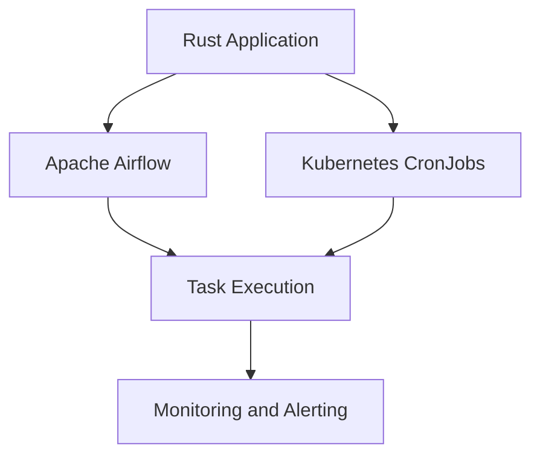

## 17.6. Scheduling and Automation

In the realm of data engineering, scheduling and automation are crucial for ensuring that data processing tasks occur reliably and on time. Rust, with its emphasis on safety and performance, offers a robust platform for implementing these tasks. This section will delve into the need for scheduling and automation in ETL (Extract, Transform, Load) processes, introduce tools and crates available in Rust, and provide practical examples of setting up automated jobs. We will also explore integration with existing schedulers like Apache Airflow and Kubernetes CronJobs, and highlight best practices for monitoring and alerting.

### The Need for Scheduling and Automation

Data pipelines are the backbone of modern data-driven applications. They ensure that data is collected, processed, and delivered to the right place at the right time. However, managing these pipelines manually is not feasible due to the complexity and scale of data operations. This is where scheduling and automation come into play.

**Key Benefits of Scheduling and Automation:**

- **Consistency**: Automated tasks ensure that data processing occurs consistently without human intervention, reducing the risk of errors.
- **Efficiency**: By automating repetitive tasks, resources can be allocated more efficiently, allowing teams to focus on more strategic activities.
- **Scalability**: Automation allows data pipelines to scale seamlessly as data volumes grow.
- **Reliability**: Scheduled tasks can be monitored and retried in case of failures, ensuring data integrity and availability.

### Tools and Crates for Scheduling in Rust

Rust provides several tools and crates that facilitate scheduling and automation. One of the most popular crates for scheduling tasks in Rust is the `cron` crate.

#### The `cron` Crate

The `cron` crate allows you to schedule tasks using cron expressions, which are a powerful way to specify time-based job schedules.

**Example: Scheduling a Task with the `cron` Crate**

```rust
use cron::Schedule;
use std::str::FromStr;
use std::time::Duration;
use std::thread;

fn main() {
    // Define a cron expression for scheduling
    let expression = "0 5 * * * *"; // Every 5 minutes
    let schedule = Schedule::from_str(expression).unwrap();

    // Iterate over the upcoming times
    for datetime in schedule.upcoming(chrono::Utc).take(10) {
        println!("Scheduled task will run at: {:?}", datetime);

        // Simulate task execution
        thread::sleep(Duration::from_secs(300)); // Sleep for 5 minutes
        println!("Task executed at: {:?}", chrono::Utc::now());
    }
}
```

**Explanation:**

- **Cron Expression**: The cron expression `0 5 * * * *` specifies that the task should run every 5 minutes.
- **Schedule**: The `Schedule` object is created from the cron expression and iterates over the upcoming execution times.
- **Task Execution**: The task is simulated with a sleep function, representing the task's execution time.

### Integrating Rust with Existing Schedulers

While Rust provides native solutions for scheduling, integrating with existing schedulers like Apache Airflow or Kubernetes CronJobs can offer additional benefits such as scalability, monitoring, and orchestration.

#### Apache Airflow

Apache Airflow is a platform to programmatically author, schedule, and monitor workflows. It is widely used for orchestrating complex data pipelines.

**Integration with Apache Airflow:**

- **REST API**: Use Airflow's REST API to trigger Rust-based tasks.
- **Python Operator**: Create a custom Python operator in Airflow that calls Rust executables.

#### Kubernetes CronJobs

Kubernetes CronJobs allow you to run jobs on a time-based schedule within a Kubernetes cluster.

**Integration with Kubernetes CronJobs:**

- **Containerization**: Package your Rust application as a Docker container.
- **CronJob Resource**: Define a Kubernetes CronJob resource that specifies the schedule and container image.

**Example: Kubernetes CronJob YAML**

```yaml
apiVersion: batch/v1
kind: CronJob
metadata:
  name: rust-cronjob
spec:
  schedule: "*/5 * * * *" # Every 5 minutes
  jobTemplate:
    spec:
      template:
        spec:
          containers:
          - name: rust-task
            image: rust-task-image:latest
            command: ["./rust-task"]
          restartPolicy: OnFailure
```

**Explanation:**

- **Schedule**: The `schedule` field uses a cron expression to specify the job's frequency.
- **Containers**: The `containers` section defines the Docker image and command to run the Rust task.
- **Restart Policy**: The `restartPolicy` is set to `OnFailure` to retry the task in case of failure.

### Best Practices for Monitoring and Alerting

Monitoring and alerting are essential components of any automated system. They ensure that issues are detected and addressed promptly.

**Best Practices:**

- **Logging**: Implement comprehensive logging within your Rust applications to capture task execution details and errors.
- **Metrics**: Use metrics to monitor task performance and resource usage. Libraries like `prometheus` can be integrated for this purpose.
- **Alerts**: Set up alerts to notify you of failures or performance issues. Tools like Grafana can be used to visualize metrics and configure alerts.

### Try It Yourself

Experiment with the code examples provided by modifying the cron expressions or task logic. Try integrating a Rust application with a scheduler of your choice, such as Apache Airflow or Kubernetes CronJobs, and observe how the automation process works.

### Visualizing Scheduling and Automation

Below is a diagram illustrating the integration of Rust applications with Apache Airflow and Kubernetes CronJobs.



**Diagram Explanation:**

- **Rust Application**: Represents the Rust-based task or application.
- **Apache Airflow and Kubernetes CronJobs**: Show the integration points for scheduling.
- **Task Execution**: Represents the execution of the scheduled task.
- **Monitoring and Alerting**: Highlights the importance of monitoring and alerting in the automation process.

### References and Links

- [Cron Crate Documentation](https://crates.io/crates/cron)
- [Apache Airflow](https://airflow.apache.org/)
- [Kubernetes CronJobs](https://kubernetes.io/docs/concepts/workloads/controllers/cron-jobs/)

### Knowledge Check

- What are the benefits of scheduling and automation in data pipelines?
- How can the `cron` crate be used to schedule tasks in Rust?
- What are some best practices for monitoring automated tasks?

### Embrace the Journey

Remember, this is just the beginning. As you progress, you'll build more complex and reliable data pipelines. Keep experimenting, stay curious, and enjoy the journey!

## Quiz Time!



### What is the primary benefit of automating ETL tasks?

- [x] Consistency and reliability
- [ ] Increased manual intervention
- [ ] Reduced data quality
- [ ] Increased complexity

> **Explanation:** Automating ETL tasks ensures consistency and reliability by reducing the need for manual intervention and minimizing errors.

### Which Rust crate is commonly used for scheduling tasks?

- [ ] tokio
- [x] cron
- [ ] serde
- [ ] rayon

> **Explanation:** The `cron` crate is commonly used for scheduling tasks in Rust using cron expressions.

### How can Rust applications be integrated with Apache Airflow?

- [x] Using Airflow's REST API
- [x] Creating a custom Python operator
- [ ] Directly executing Rust code
- [ ] Using Kubernetes CronJobs

> **Explanation:** Rust applications can be integrated with Apache Airflow using its REST API or by creating a custom Python operator to call Rust executables.

### What is the purpose of the `restartPolicy` in a Kubernetes CronJob?

- [x] To specify the behavior on task failure
- [ ] To define the task's schedule
- [ ] To monitor task performance
- [ ] To containerize the application

> **Explanation:** The `restartPolicy` in a Kubernetes CronJob specifies the behavior when a task fails, such as retrying the task.

### Which tools can be used for monitoring and alerting in automated tasks?

- [x] Prometheus
- [x] Grafana
- [ ] Docker
- [ ] Apache Kafka

> **Explanation:** Prometheus and Grafana are tools that can be used for monitoring metrics and setting up alerts for automated tasks.

### What does the `cron` expression `*/5 * * * *` mean?

- [x] Every 5 minutes
- [ ] Every 5 hours
- [ ] Every 5 days
- [ ] Every 5 seconds

> **Explanation:** The `cron` expression `*/5 * * * *` specifies that the task should run every 5 minutes.

### What is a key advantage of using Kubernetes CronJobs for scheduling?

- [x] Scalability and orchestration
- [ ] Manual task execution
- [ ] Reduced reliability
- [ ] Increased complexity

> **Explanation:** Kubernetes CronJobs offer scalability and orchestration, making them suitable for scheduling tasks in a distributed environment.

### How can logging be implemented in Rust applications?

- [x] Using logging libraries like `log` and `env_logger`
- [ ] By writing directly to the console
- [ ] Using the `serde` crate
- [ ] By integrating with Apache Kafka

> **Explanation:** Logging in Rust applications can be implemented using libraries like `log` and `env_logger` to capture execution details and errors.

### What is the role of metrics in automated tasks?

- [x] To monitor performance and resource usage
- [ ] To execute tasks
- [ ] To define task schedules
- [ ] To containerize applications

> **Explanation:** Metrics are used to monitor the performance and resource usage of automated tasks, providing insights into their efficiency.

### True or False: Automation in data pipelines reduces the need for manual intervention.

- [x] True
- [ ] False

> **Explanation:** Automation in data pipelines reduces the need for manual intervention, ensuring tasks are executed consistently and reliably.


