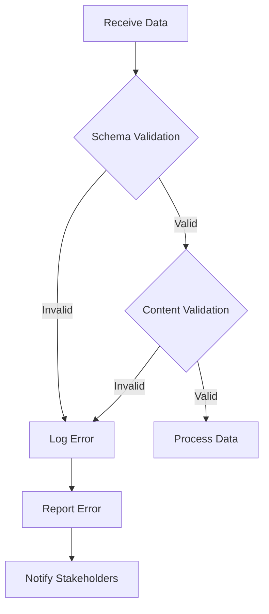

## 17.7. Data Validation and Quality Assurance

In the realm of data engineering, ensuring data integrity and quality is paramount. Data validation and quality assurance are critical components of any data pipeline, as they prevent the propagation of erroneous data that can lead to inaccurate analyses and poor decision-making. In this section, we will delve into the importance of data validation, explore techniques for validating data schemas and content, and provide practical examples using Rust. We will also highlight tools and libraries that assist with data validation and discuss strategies for handling validation errors and reporting.

### Why Data Validation is Critical in Data Pipelines

Data validation is the process of ensuring that data meets certain criteria before it is processed or stored. This step is crucial in data pipelines for several reasons:

1. **Data Integrity**: Ensures that the data is accurate and consistent across different systems and stages of processing.
2. **Error Prevention**: Identifies and corrects errors early in the pipeline, reducing the risk of propagating bad data.
3. **Compliance**: Ensures that data adheres to regulatory and organizational standards.
4. **Efficiency**: Reduces the need for costly data cleaning and reprocessing by catching errors early.

### Techniques for Validating Data Schemas and Content

Data validation can be broadly categorized into schema validation and content validation:

- **Schema Validation**: Ensures that the data structure conforms to a predefined schema. This includes checking data types, required fields, and constraints.
- **Content Validation**: Involves checking the actual data values against business rules and logic, such as range checks, format checks, and cross-field validations.

#### Schema Validation

Schema validation is often the first step in the validation process. It involves defining a schema that specifies the structure, types, and constraints of the data. In Rust, we can use libraries like `jsonschema` for JSON data validation.

```rust
use jsonschema::{Draft, JSONSchema};
use serde_json::json;

fn main() {
    // Define a JSON schema
    let schema = json!({
        "type": "object",
        "properties": {
            "name": {"type": "string"},
            "age": {"type": "integer", "minimum": 0}
        },
        "required": ["name", "age"]
    });

    // Compile the schema
    let compiled_schema = JSONSchema::compile(&schema, Some(Draft::Draft7)).unwrap();

    // Validate a JSON instance
    let instance = json!({"name": "Alice", "age": 30});
    let result = compiled_schema.validate(&instance);

    match result {
        Ok(_) => println!("Validation succeeded."),
        Err(errors) => {
            for error in errors {
                println!("Validation error: {}", error);
            }
        }
    }
}
```

In this example, we define a JSON schema that requires a `name` field of type string and an `age` field of type integer with a minimum value of 0. The `jsonschema` crate is used to compile and validate JSON instances against this schema.

#### Content Validation

Content validation involves checking the actual data values. This can be done using custom validation logic or by leveraging libraries like `validator`.

```rust
use validator::{Validate, ValidationErrors};

#[derive(Debug, Validate)]
struct User {
    #[validate(length(min = 1))]
    name: String,
    #[validate(range(min = 0))]
    age: i32,
}

fn main() {
    let user = User {
        name: String::from(""),
        age: -5,
    };

    match user.validate() {
        Ok(_) => println!("User is valid."),
        Err(errors) => handle_validation_errors(errors),
    }
}

fn handle_validation_errors(errors: ValidationErrors) {
    for (field, error) in errors.field_errors() {
        println!("Error in field '{}': {:?}", field, error);
    }
}
```

In this example, we define a `User` struct with validation rules using the `validator` crate. The `name` field must have a minimum length of 1, and the `age` field must be non-negative. The `validate` method checks these constraints and returns any validation errors.

### Implementing Validation Rules and Data Checks

Implementing validation rules involves defining the criteria that data must meet. These rules can be simple, such as checking for non-empty strings, or complex, involving multiple fields and conditions.

#### Simple Validation Rules

Simple validation rules can be implemented using Rust's type system and pattern matching.

```rust
fn validate_email(email: &str) -> bool {
    email.contains('@') && email.contains('.')
}

fn main() {
    let email = "example@domain.com";
    if validate_email(email) {
        println!("Email is valid.");
    } else {
        println!("Email is invalid.");
    }
}
```

In this example, we define a simple function to validate email addresses by checking for the presence of `@` and `.` characters.

#### Complex Validation Rules

Complex validation rules may involve multiple fields and conditions. These can be implemented using custom logic or by extending existing validation libraries.

```rust
use validator::{Validate, ValidationError};

#[derive(Debug, Validate)]
struct Product {
    #[validate(length(min = 1))]
    name: String,
    #[validate(custom = "validate_price")]
    price: f64,
}

fn validate_price(price: f64) -> Result<(), ValidationError> {
    if price > 0.0 {
        Ok(())
    } else {
        Err(ValidationError::new("invalid_price"))
    }
}

fn main() {
    let product = Product {
        name: String::from("Laptop"),
        price: -1000.0,
    };

    match product.validate() {
        Ok(_) => println!("Product is valid."),
        Err(errors) => handle_validation_errors(errors),
    }
}
```

In this example, we define a `Product` struct with a custom validation rule for the `price` field. The `validate_price` function checks that the price is positive.

### Tools and Libraries for Data Validation

Several tools and libraries can assist with data validation in Rust:

- **`validator` crate**: Provides a comprehensive set of validation attributes and functions for struct validation.
- **`jsonschema` crate**: Allows for JSON schema validation, supporting various JSON Schema drafts.
- **`serde` crate**: While primarily used for serialization and deserialization, it can be leveraged for basic validation during data parsing.

### Handling Validation Errors and Reporting

Handling validation errors effectively is crucial for maintaining data quality. When validation fails, it's important to provide clear and actionable error messages.

#### Error Handling Strategies

1. **Immediate Feedback**: Provide immediate feedback to users or systems when validation fails, allowing for quick correction.
2. **Logging**: Log validation errors for auditing and debugging purposes.
3. **Error Reporting**: Aggregate and report errors to stakeholders to inform data quality improvement efforts.

#### Example: Error Handling and Reporting

```rust
use validator::{Validate, ValidationErrors};

#[derive(Debug, Validate)]
struct Order {
    #[validate(length(min = 1))]
    product_id: String,
    #[validate(range(min = 1))]
    quantity: i32,
}

fn main() {
    let order = Order {
        product_id: String::from(""),
        quantity: 0,
    };

    match order.validate() {
        Ok(_) => println!("Order is valid."),
        Err(errors) => report_validation_errors(errors),
    }
}

fn report_validation_errors(errors: ValidationErrors) {
    for (field, error) in errors.field_errors() {
        println!("Validation error in field '{}': {:?}", field, error);
    }
    // Additional reporting logic, e.g., sending errors to a monitoring system
}
```

In this example, we define an `Order` struct with validation rules and a function to report validation errors. The `report_validation_errors` function logs errors and can be extended to send errors to a monitoring system.

### Visualizing Data Validation Workflow

To better understand the data validation process, let's visualize a typical data validation workflow using a flowchart.



**Description**: This flowchart illustrates a typical data validation workflow. Data is first subjected to schema validation. If valid, it proceeds to content validation. Invalid data is logged and reported, notifying stakeholders for corrective action.

### Strategies for Continuous Quality Assurance

Continuous quality assurance involves ongoing monitoring and improvement of data quality. Here are some strategies:

1. **Automated Testing**: Implement automated tests to validate data at various stages of the pipeline.
2. **Data Profiling**: Regularly profile data to identify anomalies and trends.
3. **Feedback Loops**: Establish feedback loops with data producers and consumers to address quality issues promptly.

### Conclusion

Data validation and quality assurance are essential for maintaining data integrity and preventing the propagation of bad data. By leveraging Rust's robust type system and validation libraries, we can implement effective validation rules and handle errors gracefully. Remember, ensuring data quality is an ongoing process that requires continuous monitoring and improvement.

### Try It Yourself

Experiment with the provided code examples by modifying validation rules or adding new fields to the structs. Try implementing custom validation logic for different data types and scenarios.

## Quiz Time!



### Why is data validation critical in data pipelines?

- [x] Ensures data integrity and prevents the propagation of bad data.
- [ ] Increases the speed of data processing.
- [ ] Reduces the need for data storage.
- [ ] Simplifies data transformation.

> **Explanation:** Data validation ensures data integrity and prevents the propagation of bad data, which is crucial for accurate analyses and decision-making.

### What is schema validation?

- [x] Ensuring data structure conforms to a predefined schema.
- [ ] Checking data values against business rules.
- [ ] Validating data types only.
- [ ] Ensuring data is free of duplicates.

> **Explanation:** Schema validation ensures that the data structure conforms to a predefined schema, including data types, required fields, and constraints.

### Which Rust crate is used for JSON schema validation?

- [x] `jsonschema`
- [ ] `serde`
- [ ] `validator`
- [ ] `tokio`

> **Explanation:** The `jsonschema` crate is used for JSON schema validation in Rust.

### What does content validation involve?

- [x] Checking actual data values against business rules.
- [ ] Ensuring data structure conforms to a schema.
- [ ] Validating only numeric data.
- [ ] Checking for duplicate entries.

> **Explanation:** Content validation involves checking actual data values against business rules and logic.

### Which crate provides validation attributes for struct validation in Rust?

- [x] `validator`
- [ ] `serde`
- [ ] `jsonschema`
- [ ] `tokio`

> **Explanation:** The `validator` crate provides a comprehensive set of validation attributes and functions for struct validation in Rust.

### What is a common strategy for handling validation errors?

- [x] Logging errors for auditing and debugging.
- [ ] Ignoring errors to speed up processing.
- [ ] Automatically correcting errors.
- [ ] Deleting invalid data.

> **Explanation:** Logging validation errors is a common strategy for auditing and debugging purposes.

### What is the purpose of automated testing in data validation?

- [x] To validate data at various stages of the pipeline.
- [ ] To increase data processing speed.
- [ ] To reduce data storage requirements.
- [ ] To simplify data transformation.

> **Explanation:** Automated testing is used to validate data at various stages of the pipeline, ensuring continuous quality assurance.

### What does the `validate` method do in the `validator` crate?

- [x] Checks constraints and returns validation errors.
- [ ] Serializes data into JSON format.
- [ ] Deserializes JSON into Rust structs.
- [ ] Compiles Rust code.

> **Explanation:** The `validate` method checks constraints defined on a struct and returns any validation errors.

### Which of the following is a benefit of data validation?

- [x] Ensures data accuracy and consistency.
- [ ] Increases data storage requirements.
- [ ] Slows down data processing.
- [ ] Simplifies data transformation.

> **Explanation:** Data validation ensures data accuracy and consistency, which is crucial for reliable analyses and decision-making.

### True or False: Data validation is only necessary at the beginning of a data pipeline.

- [ ] True
- [x] False

> **Explanation:** Data validation is necessary at various stages of a data pipeline to ensure continuous quality assurance.



Remember, this is just the beginning. As you progress, you'll build more robust data validation systems. Keep experimenting, stay curious, and enjoy the journey!
