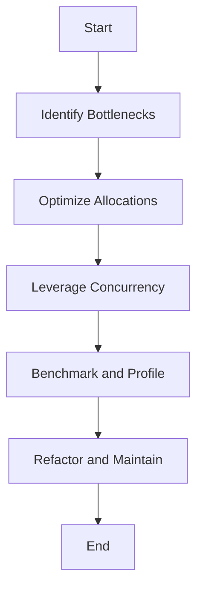

## 17.9. Best Practices and Performance Considerations

In the realm of data engineering, Rust stands out for its performance, safety, and concurrency capabilities. This section delves into best practices for writing efficient and maintainable data engineering code in Rust, focusing on performance optimization and code quality. We will explore key practices, discuss code organization, error handling, and modularity, and provide tips for optimizing performance. Additionally, we'll highlight profiling tools and techniques for identifying bottlenecks and discuss maintainability considerations, including documentation and testing.

### Key Best Practices for Data Engineering with Rust

#### Code Organization and Modularity

1. **Use Modules and Crates**: Organize your code into modules and crates to enhance readability and maintainability. This modular approach allows you to encapsulate functionality and reuse code across projects.

2. **Adopt a Consistent Naming Convention**: Use clear and consistent naming conventions for variables, functions, and modules. This practice improves code readability and helps maintain a clean codebase.

3. **Leverage Traits for Abstraction**: Use traits to define shared behavior across different types. This abstraction allows for more flexible and reusable code.

4. **Implement the DRY Principle**: Avoid code duplication by adhering to the "Don't Repeat Yourself" principle. Extract common functionality into functions or modules to reduce redundancy.

5. **Use Pattern Matching**: Rust's pattern matching is a powerful tool for handling complex data structures. Use it to simplify code and improve readability.

#### Error Handling

1. **Use `Result` and `Option`**: Embrace Rust's `Result` and `Option` types for error handling. These types enforce safe handling of potential errors and null values, reducing runtime errors.

2. **Implement Custom Error Types**: Define custom error types to provide more context and clarity in error messages. This practice aids in debugging and improves code maintainability.

3. **Leverage the `?` Operator**: Use the `?` operator to propagate errors in a concise and readable manner. This operator simplifies error handling by automatically converting errors to the appropriate type.

4. **Log Errors Appropriately**: Implement logging to capture and analyze errors. Use libraries like `log` and `env_logger` to manage logging efficiently.

#### Documentation and Testing

1. **Document Your Code**: Use `rustdoc` to generate documentation from comments in your code. Well-documented code is easier to understand and maintain.

2. **Write Unit Tests**: Implement unit tests to verify the functionality of individual components. Use `cargo test` to run tests and ensure code reliability.

3. **Adopt Test-Driven Development (TDD)**: Consider using TDD to guide your development process. Writing tests before code helps clarify requirements and improves code quality.

4. **Use Property-Based Testing**: Explore property-based testing with libraries like `proptest` to test a wide range of input scenarios and edge cases.

### Performance Optimization Tips

#### Minimize Allocations

1. **Use Stack Allocation**: Prefer stack allocation over heap allocation for small, fixed-size data structures. Stack allocation is faster and reduces memory fragmentation.

2. **Leverage `Vec` and `HashMap` Efficiently**: Use `Vec` and `HashMap` for dynamic collections, but preallocate capacity when possible to minimize reallocations.

3. **Avoid Unnecessary Cloning**: Be mindful of cloning data structures. Use references and borrowing to avoid unnecessary data duplication.

#### Leverage Concurrency

1. **Use Rust's Concurrency Primitives**: Utilize Rust's concurrency primitives, such as `Mutex`, `RwLock`, and channels, to safely share data between threads.

2. **Implement Asynchronous Programming**: Use `async`/`await` for non-blocking I/O operations. This approach improves performance by allowing other tasks to proceed while waiting for I/O.

3. **Employ Parallel Iterators**: Use the `rayon` crate to parallelize data processing tasks. Parallel iterators can significantly speed up operations on large datasets.

#### Profiling and Identifying Bottlenecks

1. **Use Criterion.rs for Benchmarking**: Employ the `criterion` crate to benchmark your code and identify performance bottlenecks. This library provides detailed reports on execution time and memory usage.

2. **Generate Flamegraphs**: Use the `flamegraph` tool to visualize CPU usage and identify hotspots in your code. Flamegraphs provide a clear view of where time is being spent during execution.

3. **Analyze with `perf`**: Utilize the `perf` tool to gather performance data and analyze system-level metrics. This tool helps identify low-level performance issues.

#### Maintainability Considerations

1. **Keep Code Simple and Readable**: Write code that is easy to understand and maintain. Avoid overly complex solutions and prioritize readability.

2. **Refactor Regularly**: Continuously refactor your code to improve structure and readability. Refactoring helps eliminate technical debt and keeps the codebase clean.

3. **Use Version Control**: Employ version control systems like Git to track changes and collaborate with team members. Version control is essential for managing code history and resolving conflicts.

4. **Adopt Continuous Integration**: Implement continuous integration (CI) to automate testing and ensure code quality. CI helps catch issues early and facilitates smooth development workflows.

### External Frameworks and Tools

- **[Criterion.rs](https://crates.io/crates/criterion)**: A powerful benchmarking library for Rust, providing detailed performance analysis and comparison.
- **[Flamegraph](https://github.com/flamegraph-rs/flamegraph)**: A tool for generating flamegraphs to visualize CPU usage and identify performance bottlenecks.

### Try It Yourself

To solidify your understanding, try modifying the following code example to experiment with different optimization techniques:

```rust
use std::collections::HashMap;
use std::time::Instant;

fn main() {
    let mut data = HashMap::new();
    for i in 0..10000 {
        data.insert(i, i * 2);
    }

    let start = Instant::now();
    let sum: i32 = data.values().sum();
    let duration = start.elapsed();

    println!("Sum: {}, Time taken: {:?}", sum, duration);
}
```

**Suggestions for Experimentation:**

- Preallocate the `HashMap` with a capacity to minimize reallocations.
- Use parallel iterators with the `rayon` crate to speed up the summation process.
- Implement error handling for potential issues with data insertion.

### Visualizing Rust's Performance Optimization



**Diagram Description**: This flowchart illustrates the process of optimizing performance in Rust. Start by identifying bottlenecks, optimize allocations, leverage concurrency, benchmark and profile, refactor and maintain, and finally reach the end of the optimization process.

### Knowledge Check

- What are the benefits of using `Result` and `Option` for error handling in Rust?
- How can you minimize memory allocations in Rust?
- What tools can you use to profile and benchmark Rust code?
- Why is modularity important in Rust code organization?
- How does the `rayon` crate help with performance optimization?

### Embrace the Journey

Remember, mastering Rust's best practices and performance optimization is a journey. As you progress, you'll discover new techniques and strategies to enhance your data engineering projects. Keep experimenting, stay curious, and enjoy the process!

## Quiz Time!



### What is a key benefit of using Rust's `Result` and `Option` types for error handling?

- [x] They enforce safe handling of potential errors and null values.
- [ ] They automatically fix errors at compile time.
- [ ] They eliminate the need for error handling altogether.
- [ ] They provide a graphical interface for debugging.

> **Explanation:** `Result` and `Option` types enforce safe handling of potential errors and null values, reducing runtime errors.

### How can you minimize memory allocations in Rust?

- [x] Use stack allocation for small, fixed-size data structures.
- [ ] Always use heap allocation for all data structures.
- [ ] Avoid using any data structures.
- [ ] Use global variables instead of local ones.

> **Explanation:** Stack allocation is faster and reduces memory fragmentation, making it ideal for small, fixed-size data structures.

### Which tool is used for generating flamegraphs in Rust?

- [x] Flamegraph
- [ ] Criterion.rs
- [ ] Cargo
- [ ] Clippy

> **Explanation:** The `flamegraph` tool is used to visualize CPU usage and identify hotspots in Rust code.

### Why is modularity important in Rust code organization?

- [x] It enhances readability and maintainability.
- [ ] It makes the code run faster.
- [ ] It eliminates the need for error handling.
- [ ] It automatically generates documentation.

> **Explanation:** Modularity enhances readability and maintainability by organizing code into reusable components.

### What does the `rayon` crate help with in Rust?

- [x] Parallelizing data processing tasks.
- [ ] Serializing data to JSON.
- [ ] Handling network requests.
- [ ] Managing database connections.

> **Explanation:** The `rayon` crate helps with parallelizing data processing tasks, significantly speeding up operations on large datasets.

### What is the purpose of using `rustdoc`?

- [x] To generate documentation from comments in your code.
- [ ] To compile Rust code into machine code.
- [ ] To manage dependencies in Rust projects.
- [ ] To run tests on Rust code.

> **Explanation:** `rustdoc` is used to generate documentation from comments in your code, making it easier to understand and maintain.

### Which Rust feature allows for non-blocking I/O operations?

- [x] `async`/`await`
- [ ] `Mutex`
- [ ] `RwLock`
- [ ] `Option`

> **Explanation:** `async`/`await` allows for non-blocking I/O operations, improving performance by allowing other tasks to proceed while waiting for I/O.

### What is the benefit of using the `?` operator in Rust?

- [x] It propagates errors in a concise and readable manner.
- [ ] It eliminates the need for error handling.
- [ ] It automatically fixes errors at compile time.
- [ ] It provides a graphical interface for debugging.

> **Explanation:** The `?` operator propagates errors in a concise and readable manner, simplifying error handling.

### What is a key consideration for maintainability in Rust code?

- [x] Keeping code simple and readable.
- [ ] Using as many features as possible.
- [ ] Avoiding version control systems.
- [ ] Writing code without comments.

> **Explanation:** Keeping code simple and readable is crucial for maintainability, making it easier to understand and modify.

### True or False: Continuous integration helps catch issues early and facilitates smooth development workflows.

- [x] True
- [ ] False

> **Explanation:** Continuous integration automates testing and ensures code quality, helping catch issues early and facilitating smooth development workflows.


